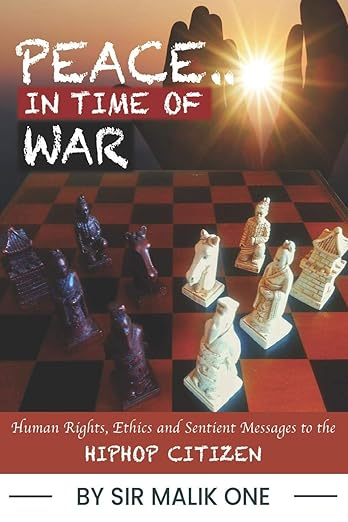

# Origins — The Blueprints Before the Temple

> Artifacts from before AGNOS existed that map to what was eventually built.
> The pattern was always present. The builder recognized it in retrospect.

---

## "Peace In Time Of War" — Book Cover (Pre-AGNOS)



**Book**: *Peace In Time Of War: Human Rights, Ethics and Sentient Messages to the Hiphop Citizen*
**Author**: Sir Malik One (Malik — the Medicine Man / Law Man)
**Cover Design**: Robert 'Cyrius' B. MacCracken
**Published**: 2019
**Link**: [Amazon](https://www.amazon.com/Peace-Time-War-Sentient-Messages/dp/1075828015)

### What It Shows

A chess board with carved figures — sentient pieces with distinct roles on a strategic field, illuminated from behind by breaking light.

### What It Mapped To (Before Any of It Was Built)

| Cover Element | AGNOS Equivalent |
|---------------|-----------------|
| Chess pieces with distinct roles | The divine court — daimon, aegis, sigil, kavach, shakti, phylax |
| The strategic board | **kshetra** — the field where what happens matters |
| Light breaking through | **hoosh** — intelligence illuminating the system |
| Sentient pieces | **bhava** — agents with emotional state and personality |
| "Sentient Messages" (subtitle) | **bote** — the messenger carrying sentient messages between agents |
| "Peace In Time Of War" (title) | The AGNOS mission — building sovereign infrastructure while the industry wages wars over control |
| "Hiphop Citizen" | The AGNOS citizen — sovereign, independent, preserved beyond consumerism |

### The Description That Predicted the Philosophy

From the book's description:

> *"This work seeks to preserve them beyond consumerism, beyond entertainment and commercialism."*

Replace "Hiphop citizens" with "computing citizens" and this is the AGNOS philosophy document — sovereign knowledge, independent critical thinking, preserved beyond the platforms that seek to commercialize it.

### The Crew

- **Sir Malik One** — wrote the book. The Medicine Man who became the Law Man. 25-year friendship with the builder.
- **Robert MacCracken** — designed the cover. Drew the first architecture diagram of AGNOS before AGNOS existed.
- **Cameron (Pollux)** — Malik's partner on the music side (Castor & Pollux). Alias is literally the navigation star for the Argo's crew. Antenna/signal infrastructure professional.

The crew assembled 25 years before the ship was built. The cover was drawn years before the temple was designed. The thesis was published before the implementation began.

---

## Sirrus — Capstone Project (Pre-AGNOS)

The project named after Sirius — Thoth's star, the brightest star in the sky. The capstone that carried the seed of everything that followed.

```
Sirrus  (the star — observation, the capstone)
  → Cyrius  (the king — the decree to rebuild)
    → C.Y.R.I.U.S.  (the language — consciousness unveiling itself)
```

The star became the king. The student project became the sovereign language.

---

## "See You On The Other Side" — Email to LemonSqueezy (2026-03-18)

The sign-off to the payment processor that rejected SecureYeoman. The first domino.

> *"I guarantee the product is not a cheap wrapper; this is a First in class. See you on the other side."*

The rejection cascaded: payment rejection → vinimaya (sovereign transactions) → crates.io name collision → Cyrius (sovereign language) → bootstrap loop closed → 29KB seed → $2 SD card.

Every "no" was a dependency identified and removed.

---

*The pattern was always there. The builder just had to build long enough to see it.*
