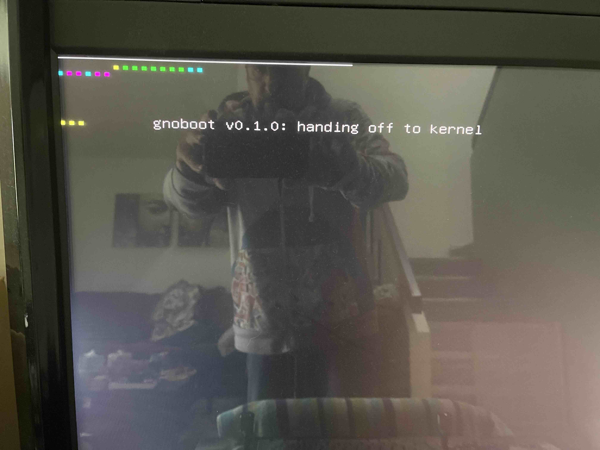
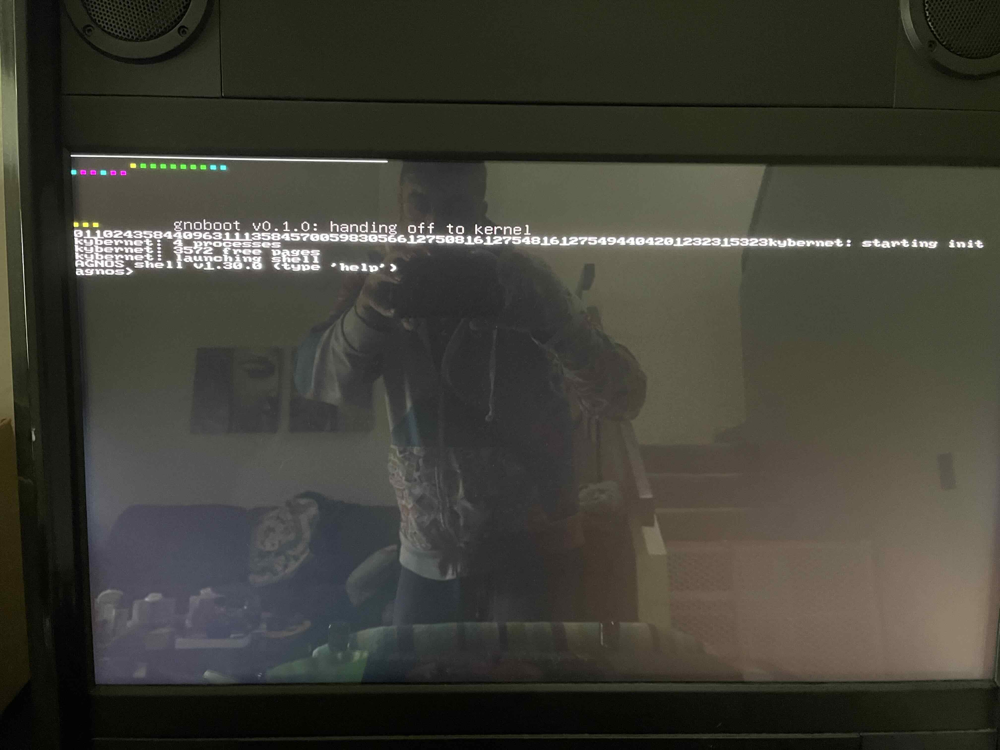
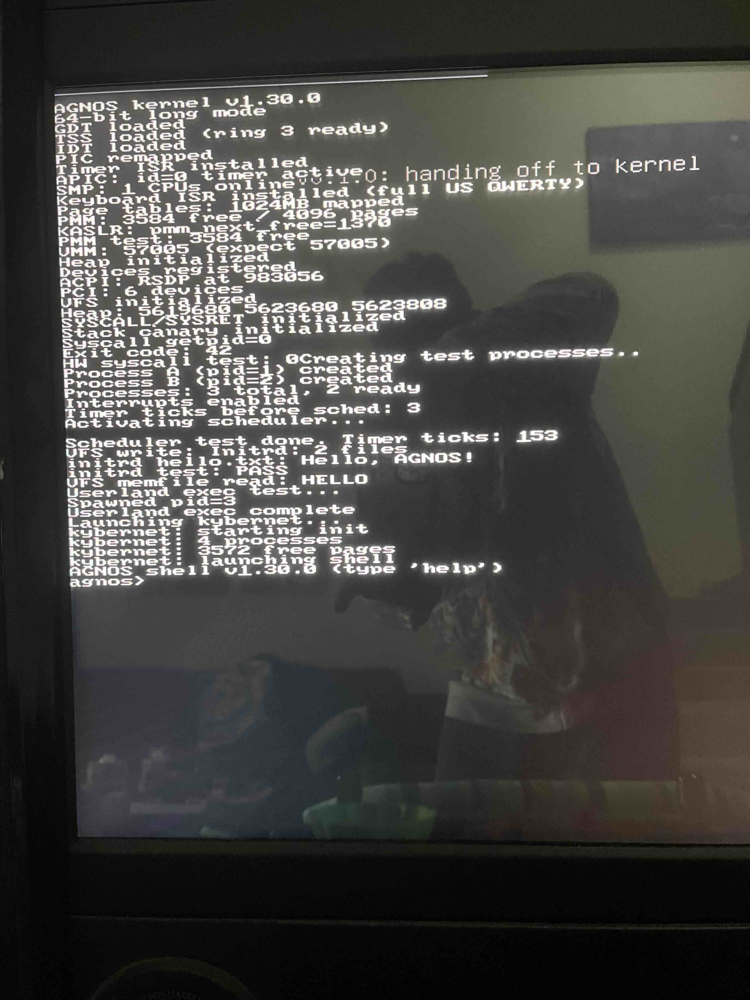

> **Last Updated**: 2026-05-15

# Iron Boot Test Log

Append-only running log of AGNOS **boot-to-shell-on-iron** test
attempts. The closed-beta MVP gate is boot-to-shell on real
hardware; primary target is the **NUC AMD** (x86_64) — where the
bulk of kernel engineering work has been validated — with the
Pi 4 (aarch64) as the secondary axis. **Intel hosts are queued
after AMD is proven**, not concurrent. This log tracks each
attempt's symptom, root cause, repair, and verification state
so we don't lose the breadcrumb when a future failure shows
the same shape.

**Format**: each attempt gets one `## Attempt N — YYYY-MM-DD
HH:MM TZ → STATUS` block. Never rewrite past entries; if a
later attempt clarifies an earlier root-cause, add a note to
the later entry pointing back. Status is one of `FAIL` /
`PASS` / `PARTIAL` / `PENDING`.

---

## Standing context

| Item | Value |
|------|-------|
| Closed-beta target | early June 2026 |
| MVP gate | boot to shell on real iron (kernel + kybernet + agnoshi) |
| Target hardware (primary) | NUC AMD (x86_64, Zen-class — SMEP + SMAP advertised) |
| Target hardware (secondary axis) | Raspberry Pi 4 (aarch64) |
| Target hardware (queued, post-AMD-proof) | Skytech Legacy 4 (x86_64, Intel) |
| USB device under test | `/dev/sdb` — Crucial CT1000P3PSSD8 1TB; AGNOSBOOT FAT32 ESP |
| Provisioning script | `scripts/install-usb.sh` (full provision) |
| Refresh script | `scripts/install-usb.sh --update` (kernel + initramfs only) |

Memory pin: [[project-agnos-mvp-boot-to-shell]] — closed beta
is **kernel + kybernet + agnoshi on hardware**, NOT self-hosting
or full userland ABI (those are public-beta scope).

---

## Attempts

### Attempt 1 — 2026-05-12 ~13:43 PDT → FAIL

(Approximate timestamp — ~10 minutes before devbox boot at
13:53:58 PDT.)

**Build under test:**

| Artifact | Version / Size |
|----------|----------------|
| cyrius toolchain | 5.10.44 (pre-section-headers) |
| agnos kernel | 1.29.0 — `build/agnos` 250704 bytes, **ELF32, `e_shoff = 0`** |
| initramfs | `scripts/build/initramfs.cpio.gz` 295325 bytes |
| GRUB | upstream (multiboot1 path via `grub-install --target=x86_64-efi --removable`) |

**Symptom (verbatim from GRUB console):**

```
error: kern/elfxx.c:grub_elf32_get_shnum:227: invalid section
       header table offset in e_shoff.
error: loader/multiboot.c:grub_cmd_module:387:
       you need to load the kernel
error: commands/boot.c:grub_loader_boot:196:
       you need to load the kernel first.
Press any key to continue.
```

**Initial hypothesis (wrong):** "GRUB wants some C apparently" —
i.e., a GRUB / multiboot-format compatibility issue. The
errors implied GRUB couldn't parse the kernel's section header
table; the first guess was that the kernel was malformed in
some structural way GRUB-specific.

**Root cause (diagnosed ~14:00 PDT):**

`readelf -h` on the rejected kernel revealed the actual gap:

```
  Class:                             ELF32
  Type:                              EXEC (Executable file)
  Machine:                           Intel 80386
  Entry point address:               0x100060
  Start of section headers:          0 (bytes into file)
  Size of section headers:           0 (bytes)
  Number of section headers:         0
```

Cyrius's `EMITELF_KERNEL` in `src/backend/x86/fixup.cyr:659`
was emitting **program-headers-only ELFs** — valid for Linux
`execve` (which only consumes program headers) but rejected
by GRUB's `grub_elf32_get_shnum` (kern/elfxx.c:227), which
requires a non-zero `e_shoff`. The multiboot1 header was
correct (magic 0x1BADB002 at file offset 84); the entry point
was correct (0x100060); the program header was valid. The
only thing missing was the section header table — which
strictly speaking is optional per the ELF spec for `execve`
loading, but GRUB's loader path is stricter than Linux's.

Same pattern existed at three sites in the cyrius source:

| Site | File | Line |
|------|------|------|
| x86 kernel emitter | `src/backend/x86/fixup.cyr` | 686 (`e_shoff = 0`) |
| aarch64 kernel emitter | `src/backend/aarch64/fixup.cyr` | 344 (`e_shoff = 0`) |
| cyrld ELF64 linker | `programs/cyrld.cyr` | 1072 (`e_shoff = 0`) |

**Steps taken to repair:**

| Time (PDT) | Step | Outcome |
|-----------|------|---------|
| ~14:00 | `readelf -h build/agnos` confirms `e_shoff=0` / `e_shnum=0` | Diagnosis confirmed |
| ~14:20 | Located patch site at `src/backend/x86/fixup.cyr:659` (`EMITELF_KERNEL`) | Three other sites filed as follow-up |
| ~14:30 | Patched x86 kernel emitter with 5-section table (SHT_NULL + .text + .rodata + .bss + .shstrtab; ELF32 40-byte shdrs; entry covers SP-setup-free direct path; PT_LOAD unchanged) | Compiles clean; cc5 rebuilds |
| ~14:35 | Bumped `cyrius/VERSION` 5.11.28 → 5.11.29; regenerated `src/version_str.cyr` via `scripts/version-bump.sh`; rebuilt cc5 | `cc5 --version` reports 5.11.29 |
| ~14:40 | Bumped `agnos/cyrius.cyml` pin 5.10.44 → 5.11.29; rebuilt agnos kernel | Kernel 250704 → **250936 bytes** (+232 = 30-byte shstrtab + 2 pad + 5 × 40-byte shdrs) |
| ~14:42 | `readelf -S build/agnos` shows 5 clean sections; `grub-file --is-x86-multiboot build/agnos` returns 0 | Was rejected before; now accepted |
| ~14:45 | QEMU `-kernel build/agnos -cpu max` boots through scheduler + tier3 integration test | Clean output: `serial_putc 7832 cycles/op`, `=== done ===` |
| ~14:50 | Removed `agnos/lib/` (empty shadow dir) + dropped `CYRIUS_NO_WARN_SHADOW_LIB=1` env hack from `scripts/build.sh` | Build still clean, warning gone |
| ~15:00 | Cyrius 5.11.29 + agnos 1.29.0 committed and tagged by project leader; releases cut | Both releases published |
| ~15:10 | Mirror x86 fix into aarch64 kernel emitter — cyrius **5.11.30**. Built x86-hosted cross-compiler via `src/main_aarch64.cyr`. agnos-aarch64 kernel 93288 → 93640 bytes; `readelf -S` shows 5 sections cleanly | aarch64 QEMU boot deferred (no `qemu-system-aarch64` on devbox); Pi SSH test pending |
| ~15:12 | Mirror fix into cyrld ELF64 linker — cyrius **5.11.31**. Caught and fixed a pointer/offset bug mid-patch (`store64(sh + N, …)` should be `store64(O + sh + N, …)`). 4-module link fixture verifies same rc=44 as old cyrld; output grows 616 → 968 bytes exactly | Cyrius 5.11.31 cut |
| ~15:25 | Hardened agnos CI (`ci.yml` × 5 install blocks + `release.yml` × 1) with post-install smoke test (`cyrius --version || exit 1` + `ls $HOME/.cyrius/bin/` on failure) | Future silent install failures fail their own step instead of cascading into 50-file "NEEDS FORMAT" misdiagnoses |
| ~15:30 | Extended `install-usb.sh` with `--update` mode (mount + cp + umount; no wipe / no re-grub). Reflashed `/dev/sdb`: `/boot/agnos` 250704 → 250936 bytes; initramfs unchanged | USB carries patched kernel; first reboot will exercise the fix on iron |

**Side-effect incident (CI fmt false-alarm):**

After agnos 1.29.0 commit, CI's "Check & Format" step reported
*every* kernel `.cyr` file as `NEEDS FORMAT` (48 files). Initial
read: formatter rule drift between 5.10.44 and 5.11.29.
Actual cause: the **Install Cyrius toolchain** step had failed
silently (5.11.29 release tarball not yet propagated), so
every `cyrius fmt "$f" --check` in the loop returned 127
(command not found), which the `if ! …` shape inverted to
"failed format." Fixed by hardening the install step (see
~15:25 row above). Re-running CI on a re-run window passed
cleanly.

**Outcome:** Attempt 1 is logged as FAIL pending Attempt 2.
Repair confirmed at multiple gates (`readelf -S`,
`grub-file --is-x86-multiboot`, QEMU boot through scheduler);
GRUB error chain should be gone on next boot. If Attempt 2
still reports the same `grub_elf32_get_shnum` chain, we're
chasing a different bug (verify USB contents match what
`install-usb.sh --update` claimed it wrote).

---

### Attempt 2 — 2026-05-13 ~09:00 PDT → FAIL

**Build under test** (what `install-usb.sh --update` wrote at
the end of Attempt 1; grub.cfg unchanged from initial provision):

| Artifact | Version / Size |
|----------|----------------|
| cyrius toolchain | 5.11.29 |
| agnos kernel | 1.29.0 — `build/agnos` 250936 bytes, 5 section headers |
| initramfs | `scripts/build/initramfs.cpio.gz` 295325 bytes |
| grub.cfg | pre-`cdb67b2` (no `all_video` preload, no `gfxpayload=text`) |

**Symptom (verbatim from GRUB console):**

```
WARNING: non console will be available to OS
error: video/video.c:grub_video_set_mode:782:
       no suitable video mode found.
```

**Significance:** the Attempt 1 `grub_elf32_get_shnum` / "you
need to load the kernel" chain is GONE — the section-header fix
(cyrius 5.11.29 ELF emitter patch, agnos 1.29.0 rebuild) is
confirmed effective on real iron. New failure class, further
along the GRUB path.

**Root cause:**

The grub.cfg shipped by `install-usb.sh` (pre-`cdb67b2`)
invoked `multiboot /boot/agnos` without first loading GRUB's
EFI video drivers and without telling GRUB to skip the
graphics-mode switch at handoff. On UEFI hardware that exposes
only GOP/UGA (every modern board, the NUC AMD included),
`grub_video_set_mode` (grub-core/video/video.c:782) has no
registered driver matching the available modes and bails. The
preceding `WARNING: non console will be available to OS` is the
multiboot loader noting it cannot populate the framebuffer-info
struct it would normally hand to the kernel.

AGNOS uses VGA text + serial — no framebuffer console — so we
do not need the mode switch. We just need to tell GRUB that,
or it tries and fails.

**Steps taken to repair:**

| Time (PDT) | Step | Outcome |
|-----------|------|---------|
| ~09:10 | Diagnosed as GRUB video-mode probe failure on UEFI; confirmed Attempt 1 ELF fix intact | New root cause; not USB drift |
| 09:13 | `scripts/install-usb.sh` patched (commit `cdb67b2` "fixing video"): prepend `insmod all_video / efi_gop / efi_uga` + global `set gfxpayload=text` to the generated grub.cfg; also set `gfxpayload=text` inside each menuentry as belt-and-braces | grub.cfg generator updated |
| Pending | Re-provision `/dev/sdb` with **full** `install-usb.sh` (not `--update` — that path skips grub.cfg) so the patched config lands on the ESP | — |

**Outcome:** FAIL. Attempt 1 fix verified on iron. New
failure class diagnosed and patched in `cdb67b2`; verification
of the patch on iron deferred to Attempt 3, which requires a
full re-provision (not `--update`) because `--update` only
refreshes kernel + initramfs and leaves grub.cfg untouched.

---

### Attempt 3 — 2026-05-13 ~later AM PDT → FAIL

**Build under test** (full re-provision after `cdb67b2`):

| Artifact | Version / Size |
|----------|----------------|
| cyrius toolchain | 5.11.29 |
| agnos kernel | 1.29.0 — `build/agnos` 250936 bytes, 5 section headers (unchanged from Attempt 2) |
| initramfs | `scripts/build/initramfs.cpio.gz` 295325 bytes (unchanged) |
| grub.cfg | post-`cdb67b2` (with `insmod all_video / efi_gop / efi_uga` + `gfxpayload=text`) |

**Symptom (verbatim from GRUB console):**

```
WARNING: non console will be available to OS
```

Displayed alone (no `grub_video_set_mode` error chain), then
the machine resets / restarts.

**Significance:** the Attempt 2 video-mode probe error is GONE
— the `cdb67b2` insmod-all_video + gfxpayload=text patch is
confirmed effective on real iron. We are now past GRUB's video
setup. The remaining warning is multiboot's "I can't give the
kernel a console" notice; the reset that follows happens
after handoff (or at handoff). New failure class, further
along the boot path.

**Working hypotheses (root cause not yet confirmed):**

1. **Kernel triple-fault immediately at/after handoff.** The
   multiboot1 entry is `0x100060`; if the early boot shim
   takes a fault before any serial / VGA write succeeds, the
   only visible symptom on iron is a reset. QEMU `-cpu max`
   currently boots clean through scheduler + tier3 integration
   test (per Attempt 1, ~14:45 row), so the divergence is
   silicon-specific — likely CR4 SMEP/SMAP (Haswell+ / all
   modern Ryzen), CPUID-dependent feature gating, or
   stack-setup assumption that holds in QEMU's seabios
   handoff but not under UEFI→GRUB→multiboot1.
2. **GRUB exits back to UEFI after the warning.** Less
   likely given the message ordering (warning comes from
   *during* multiboot setup, not after a failed boot), but
   worth ruling out by checking if the firmware boot-order
   list shows AGNOS being deprioritized or if the firmware is
   simply cycling to the next device.
3. **Multiboot1 + UEFI fundamental incompatibility on this
   firmware.** Some UEFI firmwares refuse the multiboot1
   protocol entirely on the actual handoff (vs. the file
   probe `grub-file --is-x86-multiboot` succeeding). The
   long-term fix is multiboot2, which is what real-mode-free
   UEFI handoff was designed for.

**Diagnosis path forward:**

- Boot the `AGNOS — verbose serial (ttyS0,115200)` menu entry
  with a USB-to-serial cable attached and capture output;
  anything the kernel prints before the reset narrows
  hypothesis 1 vs 3 immediately.
- If serial is silent: kernel never executed (hypothesis 3
  more likely), or kernel faulted before its first
  `serial_putc`. Add a port-0x80 POST write at the very top
  of the kernel entry as a free `did-we-start` signal.
- Cross-reference with `kybernet harness mode` menu entry
  (exit on phase 8) to bound where in the boot chain we are.

**Outcome:** FAIL. Attempt 2 fix verified on iron. New failure
class — post-handoff or at-handoff — diagnosis pending serial
capture from Attempt 4.

---

### Attempt 4 — 2026-05-13 ~09:48 PDT → FAIL

**Pre-run framing (preserved).** The target is the **NUC AMD**
(Zen-class). AMD Zen advertises both SMEP (since Zen 1, 2017)
and SMAP (since Zen 1) — so on this silicon the v1.29.1 CR4
CPUID gate is *behaviorally identical* to v1.29.0: both
revisions end up setting bits 5 + 20 + 21. **v1.29.1 alone was
unlikely to change the Attempt 3 outcome on the NUC AMD.** It
shipped because the unconditional OR was a real portability bug
surfaced by the iron-boot campaign (and proved with `-cpu
qemu64` going from triple-fault to boot), but it was not
load-bearing for resolving Attempt 3's symptom on this target.
This was logged as a prediction before the run; the run
confirmed it.

**Build under test** (patched kernel — v1.29.1, no functional
change vs 1.29.0 on Zen):

| Artifact | Version / Size |
|----------|----------------|
| cyrius toolchain | 5.11.29 |
| agnos kernel | 1.29.1 — `build/agnos` 250968 bytes (+32 over 1.29.0; shim-only) |
| initramfs | `scripts/build/initramfs.cpio.gz` 295325 bytes (unchanged) |
| grub.cfg | post-`cdb67b2` (unchanged from Attempt 3) |

**Symptom (verbatim from GRUB console):**

```
WARNING: non console will be available to OS
```

Displayed alone, machine then resets — **bit-identical to
Attempt 3's displayed output**. Same failure class, same
position in the boot chain.

**Significance:** Confirms the pre-run prediction exactly.
v1.29.1 is a no-op on Zen silicon (CPUID gate yields the same
CR4 bits the unconditional OR did), so the symptom is
unchanged. This closes out the "bare retry" diagnostic option
— we now have direct evidence that the SMEP/SMAP framing alone
does not explain the Attempt 3 reset on the NUC AMD. The root
cause is something else along the multiboot1 handoff or early
shim path, and further blind code changes without a phase
indicator (serial / port-0x80 / multiboot2 rewrite) will burn
attempts without bisecting the failure.

**Diagnostic options that would actually change the outcome**
(bare retry exhausted as of Attempt 4 — pick one before the
next iron run):

1. **Serial-cable capture.** USB-to-TTL adapter on the NUC's
   COM1 header (if exposed) or via internal serial. Boot the
   "AGNOS — verbose serial (ttyS0,115200)" menu entry. Even one
   character before the reset bisects the failure: nothing →
   handoff failed or shim faulted before first `serial_putc`;
   partial banner → fault during early-init phase; full banner →
   fault somewhere past kernel main. This is the gold-standard
   diagnostic and remains the recommended path before further
   blind code changes.
2. **Add a port-0x80 POST sequence to the boot shim.** Write a
   distinctive byte (e.g. `0xAG` → 0x10 → 0x86) to I/O port 0x80
   at each major phase boundary (shim entry, post-page-table,
   post-CR4, post-CR3, post-long-mode-jump, post-segment-reload,
   first 64-bit instruction). On a NUC AMD without a POST card,
   port 0x80 writes are silently discarded — but combined with
   serial capture, they're a free phase indicator. Without serial,
   they're invisible (limited utility solo).
3. **Switch boot protocol — multiboot1 → multiboot2 (or UEFI
   stub).** The "WARNING: non console will be available to OS"
   message is GRUB's multiboot1 loader saying it can't satisfy
   the legacy-EGA-text console request that multiboot1 implies.
   Multiboot2 has explicit UEFI tags (`MULTIBOOT_TAG_TYPE_EFI64`,
   `MULTIBOOT_TAG_TYPE_EFI_MMAP`) and is the spec-correct path
   for UEFI handoff. This is a real shim rewrite (header + entry
   sequence + mbi parsing), not a tweak.
4. **Audit low-memory placement.** Page tables at 0x1000–0x4000,
   GDT at 0x4000, stack at 0x200000 — all hardcoded. UEFI
   firmware may reserve regions there for runtime services or
   ACPI data. The shim should ideally read the multiboot
   memory-map tag and place its scratch in a known-free region.
   Less invasive than option 3, but still a structural change.

**Recommended next step:** option 1 (serial cable) gives the most
information for the least invasive change. Options 3 and 4 are
real engineering work and should be informed by serial output,
not chosen blindly.

**Bare v1.29.1 retry — observed:**

| Observed | Implication |
|----------|-------------|
| **✓ Same `WARNING: non console will be available to OS` + reset (Attempt 4, ~09:48 PDT)** | **Confirmed.** v1.29.1 is no-op on this silicon as predicted; tells us nothing new about the root cause. Bare-retry option is exhausted. Proceed to options 1–4. |
| Anything different (no reset, different message, different timing) | Did not occur. Would have indicated v1.29.1 perturbed something other than the SMEP/SMAP bits. |

**Outcome:** FAIL. Bare retry consumed; result matches the
pre-run prediction (no-op on Zen). The next attempt must
introduce a phase indicator or change the boot protocol —
further code-only changes without bisection signal are guessing.

---

## Diagnosis — 2026-05-13 GRUB source review

After Attempt 4 confirmed v1.29.1 was a no-op on Zen as predicted
(SMEP/SMAP CPUID gate yields the same CR4 bits the unconditional OR
did), review of GRUB upstream (rhboot/grub2 mirror — same code path
as the install-USB's GRUB) characterized the actual entry-state
delivered by GRUB on UEFI x86_64. The diagnosis came from reading
source, not from a new hardware run — serial-cable capture was
unavailable, so the next-best diagnostic was understanding the
contract GRUB *says* it delivers.

**GRUB-EFI's multiboot1 handoff path (the path our USB exercises):**

| File | Finding |
|------|---------|
| `grub-core/loader/multiboot.c` | UEFI dispatch uses `efi_boot()` → `grub_relocator_efi_boot()`, NOT the BIOS `grub_relocator32_boot()` — two entirely different relocator paths |
| `grub-core/loader/i386/multiboot_mbi.c` | UEFI path calls `grub_efi_finish_boot_services()` before handoff — ExitBootServices performed, memmap finalized in MBI, no UEFI services available |
| `grub-core/lib/x86_64/efi/relocator.c` | The EFI relocator is `grub_relocator64_efi_boot` — uses a **64-bit state struct** (RAX/RBX/RCX/RDX/RIP/RSI), copies stub bytes to low memory, calls them as a function |
| `grub-core/lib/i386/relocator64.S` lines 95–164 (`grub_relocator64_efi_start`) | The stub: load RAX/RBX/RIP from state, `jmp *jump_addr(%rip)`. **No `cli`. No `lgdt`. No CR0.PG clear. No CR4.PAE clear. No EFER.LME clear (wrmsr).** 64-bit indirect near jump — no CS reload, no mode switch. |

**Confirmed root cause.** GRUB on UEFI x86_64 jumps to the kernel
entry point **with the CPU still in 64-bit long mode** — UEFI's GDT
intact, paging on, EFER.LME set, CS = 64-bit code segment. There is
no long-mode-exit sequence whatsoever. Our `build/agnos` is **ELF32 /
Machine: Intel 80386 / entry 0x100060** (per Attempt 1 `readelf -h`).
The bytes at 0x100060 were assembled as 32-bit protected-mode
instructions; when those bytes are fetched in long mode they decode as
unrelated (or invalid) 64-bit instructions, producing a triple-fault
within a handful of cycles. CPU resets.

This explains every observed datum:

- **Iron resets after `no console will be available to OS`** — the
  warning comes from GRUB's `set_console()` (multiboot.c) saying it
  can't satisfy any console flag the kernel requested. *Unrelated to
  the crash*; it's just the last thing GRUB prints before the
  handoff. The reset is the triple-fault from long-mode decoding of
  32-bit kernel bytes. (Note: prior log entries transcribed the
  warning as "non console will be available" — the actual GRUB string
  is "no console will be available"; "non" was a misread.)
- **QEMU `-kernel -cpu max` boots clean** — `-kernel` uses QEMU's own
  Linux-boot-protocol shim, which delivers a 32-bit-protected-mode
  CPU directly to the kernel. Bypasses GRUB entirely; entirely
  different entry-state contract.
- **v1.29.1 CR4 fix is a no-op on Zen** — confirmed empirically in
  Attempt 4. Now also explained: kernel never reaches the CR4 code
  because long-mode decoding faults at the first 32-bit instruction.

**Mapping back to Attempt 3's hypotheses:**

- **Hypothesis 1** (kernel triple-fault) — *correct in shape*, but the
  trigger was one layer upstream of where we were looking. We assumed
  CR4 / CPUID / stack-setup; the actual fault is instruction-decoding
  mode mismatch at the very first fetch.
- **Hypothesis 3** (multiboot1 + UEFI fundamental incompatibility) —
  *directionally correct*. The incompatibility is **GRUB-side, not
  firmware-side**: GRUB-EFI on x86_64 no longer performs the
  long-mode-exit step that multiboot1's 32-bit-protected-mode contract
  requires. The firmware would happily run a 64-bit kernel handed off
  by the same path.

**Architectural decision: Path A — ELF64 multiboot2.**

Switch the boot kernel to 64-bit ELF; replace the multiboot1 header
with a multiboot2 header carrying `MULTIBOOT_HEADER_TAG_ENTRY_ADDRESS_EFI64`.
Kernel inherits UEFI's long-mode state cleanly; shim simplifies (no
mode transition, no CR4 setup, GDT/paging inherited from firmware).
Memory pin: [[project-agnos-bootloader-roadmap]] — Path A is the MVP
bridge, Path C (sovereign UEFI bootloader, no GRUB) is the long-term
destination.

**Path B rejected** (long-mode-exit prologue keeping ELF32): would
hand-roll the long-mode-exit sequence GRUB stopped doing — paying the
cost of fighting the firmware with no path toward Path C. Same lesson
the Linux community learned a decade ago when they moved to the EFI
stub.

ELF32 emit stays in Cyrius as **latent capability** for hypothetical
future legacy-iron support per [[project-agnos-kernel-growth-rules]] —
not deleted, just unused for the boot kernel.

---

### QEMU OVMF gate — 2026-05-13 ~16:30 PDT → FAIL (#PF inside GRUB)

Not an iron attempt — this is Step 5b of `path-a-elf64-multiboot2.md`,
exercising the same `grub_relocator64_efi_boot` path the NUC AMD's
firmware will use, under emulated UEFI (`qemu-system-x86_64` + OVMF
pflash). Run from `scripts/test-uefi-qemu.sh`. Path A cyrius work
(5.11.43) + agnos shim (drafted in agnos repo) all landed before this
gate.

**Build under test:**

| Artifact | Version / Size |
|----------|----------------|
| cyrius toolchain | 5.11.43 (Path A — ELF64 + multiboot2 + EFI64 entry tag) |
| agnos kernel | post-1.29.1 — `build/agnos` 251056 bytes, **ELF64 / EM_X86_64 / entry 0x1000a8** |
| initramfs | `scripts/build/initramfs.cpio.gz` 295325 bytes |
| GRUB | upstream Arch `grub` 2:2.14-1 (x86_64-efi modules from `/usr/lib/grub/x86_64-efi/`) |
| OVMF | `edk2-ovmf` 4m pflash split (`OVMF_CODE.4m.fd` + writable `OVMF_VARS.4m.fd`) |
| grub.cfg default | menu entry 2 — *AGNOS — kernel only (no initramfs)*, simplest path |

Verification gates already passed pre-run: `grub-file --is-x86-multiboot2`
PASS; `--is-x86-multiboot` no-longer-true; `readelf -h` reports ELF64,
EM_X86_64, entry 0x1000a8.

**Symptom (verbatim from QEMU serial):**

```
Booting `AGNOS — kernel only (no initramfs)'

WARNING: no console will be available to OS
!!!! X64 Exception Type - 0E(#PF - Page-Fault)  CPU Apic ID - 00000000 !!!!
ExceptionData - 0000000000000003  I:0 R:0 U:0 W:1 P:1 PK:0 SS:0 SGX:0
RIP  - 000000000BD3D22E, CS  - 0000000000000038, RFLAGS - 0000000000210046
RAX  - 0000000036D76289, RCX - 000000000E092FD8, RDX - 0000000000000000
RBX  - 0000000000000000, RSP - 000000000FE8E260, RBP - 000000000FE8E290
CR0  - 0000000080010033, CR2 - 000000000BD3D848, CR3 - 000000000FC01000
CR4  - 0000000000000668
!!!! Find image based on IP(0xBD3D22E) (No PDB)  (ImageBase=0000000000DF59E8, EntryPoint=0000000000DF61E7) !!!!
```

**Significance.** Same `WARNING: no console will be available to OS`
that preceded the iron resets in Attempts 3 and 4 — but now followed
by an actual exception dump instead of a silent reset. Three things
the dump tells us up front:

- `RIP = 0x0BD3D22E`, `CS = 0x38` — long-mode handoff path, in
  firmware/GRUB-loaded memory (~0x0BD00000), **not** in our kernel
  (entry 0x1000a8).
- `RAX = 0x36D76289` — the multiboot2 boot magic value. GRUB has
  already *prepared* the kernel-handoff register state. We are
  inside or just-past `grub_relocator64_efi_boot`.
- `ErrorCode = 0x3` decodes to `P=1, W=1` — protection violation on a
  **write**. The page exists; the write was denied. Classic W^X.

**Diagnosis (from GRUB disassembly).** `grub_relocator64_efi_boot`
(symbol at .text offset 0x33B3 in `relocator.mod`) and the
relocations in `.rela.text` make the design explicit:

| .text offset | Reloc patches in addr of | Symbol's .text offset |
|--------------|--------------------------|-----------------------|
| 0x342B | `grub_relocator64_rax` | **0x8CA** |
| 0x3439 | `grub_relocator64_rbx` | **0x8D4** |
| 0x3447 | `grub_relocator64_rcx` | **0x8DE** |
| 0x3455 | `grub_relocator64_rdx` | **0x8E8** |
| 0x3463 | `grub_relocator64_rip` | **0x8F7** |
| 0x3471 | `grub_relocator64_rsi` | **0x8BD** |

The 0x8AA-0x8F7 range is inside `grub_relocator64_efi_start` itself
(symbol at 0x8B7, stub ends at 0x8FF). So `_efi_boot` issues six
`movabs %rax, <addr_inside_the_stub>` writes — patching the kernel's
register state directly **into the stub's bytecode** for the upcoming
indirect-jump handoff. Six writes to the loaded `.text` of
`relocator.mod`. Then it calls `grub_memmove` (text offset 0x348B-0x3498)
to copy the patched stub into freshly-AllocatePages'd memory, then
calls into the stub.

OVMF 2024+ enforces the UEFI Memory Attributes Protocol — code pages
(`EfiBootServicesCode`, both for the GRUB-loaded module image and for
newly-allocated pages) are RO. A write to `.text` faults. Either of
the six `_efi_boot` writes — or the `memmove` writing into the
AllocatePages destination — triggers the #PF we see.

**Why Linux distros don't hit this.** Linux boots via GRUB's
`linuxefi` command, which uses an entirely different relocator
(`grub_linux_boot` in `grub-core/loader/i386/efi/linux.c`) — the
Linux Boot Protocol shim, no `relocator64_efi_start` involvement.
The multiboot2 + EFI64-entry-tag path is genuinely under-tested under
modern strict-W^X UEFI. Hurd hits this; we hit this.

**Mapping back to iron Attempts 3 and 4.** The bit-identical
"WARNING: no console will be available to OS" + reset on the NUC AMD
is consistent with the **same** GRUB fault occurring on iron firmware
that enforces W^X. With no exception handlers installed (we're
upstream of the kernel ever executing), the fault cascades
double-fault → triple-fault → reset. OVMF caught it because OVMF
installs default handlers; bare iron resets. Same root cause, two
manifestations.

**Outcome: FAIL.** Path A as drafted will not boot under
strict-W^X-enforcing UEFI through current upstream GRUB. The cyrius
ELF64 + multiboot2 emit and the agnos long-mode shim are *not* the
problem — they never get to run.

---

## Diagnosis 2 — 2026-05-13 GRUB relocator W^X

Captured separately because this is an independent, GRUB-side root
cause discovered after Path A's cyrius/agnos work landed. Summary
above; doc trail:

- Disassembly: `objdump -d /usr/lib/grub/x86_64-efi/relocator.mod`,
  `--disassemble=grub_relocator64_efi_boot`,
  `--disassemble=grub_relocator64_efi_start`
- Relocations: `readelf -r /usr/lib/grub/x86_64-efi/relocator.mod`,
  filtered to .rela.text offsets 0x3380-0x34D9 (within `_efi_boot`'s
  span) — confirms the six `movabs` writes target the six register
  slots embedded in the stub at 0x8AA-0x8F7.
- Upstream context: `grub-core/lib/x86_64/efi/relocator.c` +
  `grub-core/lib/i386/relocator64.S` lines 95-164 (per the prior
  Diagnosis above).

**Resolution options** (none are quick — record for the next agent):

1. **Path C, brought forward.** Sovereign UEFI bootloader (PE/COFF),
   no GRUB. AGNOS allocates its own pages with the right attributes,
   handles its own ExitBootServices. Memory pin
   [[project-agnos-bootloader-roadmap]] always had Path C as the
   long-term destination; the question is just whether to do it now.
   Largest engineering scope but cleanest endpoint — and the only path
   that doesn't depend on someone else fixing their relocator.
2. **GRUB patch + private build.** Refactor `grub_relocator64_efi_boot`
   to (a) allocate a writable trampoline region and copy the stub
   there before patching its immediates, or (b) call the
   MemoryAttributesProtocol to drop the RO bit on the relocator
   pages first. Vendor a patched grub2 in our installer ESP.
   Smallest surface change to ship MVP; carries a long-term
   maintenance tail until upstream takes the fix.
3. **Linux Boot Protocol pretender.** Make our kernel claim to be a
   Linux bzImage (`linuxefi` header layout) and boot via GRUB's
   `linuxefi` command — the relocator path that already works on
   modern UEFI. Real engineering (bzImage header is non-trivial), but
   it sidesteps the multiboot2 EFI relocator entirely. We give up the
   multiboot2 cmdline/MMAP tag stream we just plumbed for in cyrius
   5.11.43 — replaced by Linux's setup_header + zero-page protocol.
4. **Loose-W^X OVMF rebuild to confirm theory on iron-equivalent.**
   Build OVMF without strict memory protection and re-run
   `test-uefi-qemu.sh`. If the kernel boots through to scheduler +
   tier3 under loose-W^X OVMF, the diagnosis is fully proven and the
   path forward is "find a way to disable W^X on NUC AMD firmware" or
   pursue 1-3.

**Cross-repo follow-ups (NOT performed by this agent per the no-touch-cyrius
rule):**

- Cyrius work is **not** at fault. `EMITELF64_KERNEL` (5.11.43)
  produces a correct ELF64 multiboot2 kernel that GRUB *accepts*
  (`grub-file --is-x86-multiboot2` PASS, `RAX = 0x36D76289` confirms
  GRUB prepared the handoff). No cyrius issue to file from this
  diagnosis.
- Path A doc (`docs/development/path-a-elf64-multiboot2.md`) should
  gain a "Status update 2026-05-13" section noting Step 5b failed and
  why Steps 6-8 are paused.

---

### Attempt 5 — 2026-05-13 ~late-PM PDT → FAIL

**Pivot framing.** Path A (multiboot2 + GRUB-EFI) was abandoned
between Attempt 4 prep and this run after the 2026-05-13 GRUB-source
diagnosis (*Diagnosis 2* above) proved `grub_relocator64_efi_boot`
writes to its own `.text` under strict-W^X UEFI — a GRUB-side bug
not fixable in our timeline. Path C (sovereign UEFI bootloader,
gnoboot) landed in its place: GRUB removed from the chain entirely,
`gnoboot` loads agnos directly from the ESP and hands off via the
sovereign-struct ABI (`RDI = &boot_info`, magic `0x41474E4F`). All
12 path-C steps cleared QEMU OVMF (kernel boots through 17 init
checkpoints to `Activating scheduler...`); Attempt 5 was the first
exercise on iron. See `docs/development/path-c-sovereign-uefi.md`
for the full pivot, and `[[project-grub-mb2-efi-wx-blocker]]` for
the GRUB-side analysis.

**Original Path A scope** (retired with this attempt; preserved in
git history pre-`a4055d1`). All four sub-items landed (cyrius
`EMITELF64_KERNEL` in 5.11.43; agnos ELF64 shim wrapped in
`#ifdef ELF64_KERNEL`; `scripts/install-usb.sh` MB1→MB2 switch;
QEMU OVMF gate). The QEMU OVMF gate hit GRUB-side W^X relocator
fault before any kernel byte executed — Path A bridge does not
survive modern UEFI. Path C supersedes; no further Path A work
planned.

**Build under test** (Path C — gnoboot in the chain, no GRUB):

| Artifact | Version / Size |
|----------|----------------|
| cyrius toolchain | 5.11.53 (per `gnoboot/cyrius.cyml` and `agnos/cyrius.cyml`) |
| agnos kernel | 1.30.0 — `build/agnos` 251040 bytes (ELF64, single PT_LOAD at `p_paddr=0x100000`, `p_filesz=0x3d340`, `p_memsz=0x4d340`, entry `0x1000A8`) |
| gnoboot | 0.1.0 pre-fix — `build/BOOTX64.EFI` (PE/COFF UEFI Application; subsystem 10 = `IMAGE_SUBSYSTEM_EFI_APPLICATION`) |
| install-usb.sh | post-`a4055d1` (GRUB removed, gnoboot at `/EFI/BOOT/BOOTX64.EFI`) |

**Symptom (verbatim from NUC AMD display):**

```
Press <DEL> to enter Setup. <F7> to Boot Menu.gnoboot 0.1 step 7: Jumping to kernel...
```

(Firmware splash didn't `\r\n`-terminate, so gnoboot's `msg_pre`
started on the same character cell as `.gnoboot` continuation —
cosmetic. `msg_pre` does end with `\r\n` (`gnoboot/src/main.cyr:36`),
so any kernel-side ConOut text would have started on a fresh line —
but ConOut is dead post-EBS and the kernel uses UART instead, which
has no display path on this NUC.) Then **blank screen**, then
**machine resets and restarts the firmware splash**. No serial
cable attached — kernel-side UART output (`COM1 / 0x3F8`) not
captured.

**Significance:** gnoboot itself reached step 7 — that means all
five firmware-call chains succeeded (HandleProtocol×2, OpenVolume,
Open, Read, ELF magic check, AllocatePages, segment load with
verify, GetMemoryMap). No `EBS fail` print → ExitBootServices
succeeded. Failure is **post-jump**, in the kernel's first
instructions or first BSS reference. Reset (not hang) is consistent
with triple-fault (no kernel IDT installed yet, so #PF / #GP escalate
through #DF to triple-fault → CPU INIT → firmware restart). This is
the **furthest any iron attempt has reached** — Attempts 1-4 reset
inside GRUB before the kernel was loaded.

**Diagnosis (no iron serial; reasoning from code + QEMU divergence):**

QEMU OVMF + Path C boots the kernel through 17 init checkpoints to
`Activating scheduler...` (verified in `agnos/docs/development/state.md`
§ *Open investigation — timer-driven context switch under UEFI+gnoboot*).
Same gnoboot binary, same kernel binary; iron silently triple-faults
before any kernel UART output. Two divergence points:

1. **BSS gap not zeroed (high confidence, deterministic gnoboot bug).**
   `gnoboot/src/main.cyr:191-193` reads `p_filesz` (245 KB) into
   `p_paddr` but never zeroes `[p_filesz, p_memsz)` (64 KB BSS gap).
   UEFI 2.x § 7.2: `AllocatePages` returns undefined memory contents.
   QEMU OVMF tends to return zero on fresh allocations (masked the
   bug through gnoboot Step 5b/7 QEMU PASS); real firmware leaves
   POST/EFI scratch. Kernel `.bss` globals read garbage on iron and
   triple-fault at first reference. Deterministic divergence that
   alone explains QEMU-works / iron-resets.
2. **MemoryType 2 (EfiLoaderData) on stricter firmware (medium
   confidence, insurance).** `gnoboot/src/main.cyr:185` allocates
   kernel pages as `EfiLoaderData`. Strict-W^X firmware NX-marks
   data-typed allocations; the inherited post-EBS page tables still
   carry that NX, so `jmp 0x1000A8` into a LoaderData page #PFs,
   IDT absent, triple-fault. OVMF runs from LoaderData pages
   regardless (state.md confirms full kernel boot to `Activating
   scheduler...`), so this isn't load-bearing under OVMF — but AMD
   Zen firmware is a different vendor and may enforce. Cheap to fix
   alongside #1.

**Repair steps (gnoboot edits; no agnos / cyrius / install-usb changes):**

| Approx PDT | Action | Verification gate |
|-----------|--------|-------------------|
| ~late-PM | `gnoboot/src/main.cyr`: insert byte-loop `store8(p_paddr+i, 0)` over `[p_filesz, p_memsz)` after segment-read + ELF-magic verify, before initial GetMemoryMap | `cyrius build` clean; `tests/ovmf_smoke.sh` (EXPECT="Activating scheduler") still PASS |
| ~late-PM | `gnoboot/src/main.cyr:185`: `AllocatePages` MemoryType `2 (EfiLoaderData)` → `1 (EfiLoaderCode)` | Same — both gates green; PE/COFF structurally unchanged (`tests/verify_pe.sh`) |
| ~late-PM | `gnoboot/CHANGELOG.md [Unreleased]` entry with diagnosis pointer to this section | doc-only |
| pending | Re-flash USB (`scripts/install-usb.sh`), iron Attempt 6 on NUC AMD | screen shows step-7 line + either kernel banner / further progress / new failure mode |

**Outcome:** FAIL. Furthest iron progress on the campaign — gnoboot
delivered the kernel, kernel triple-faulted on its first BSS read or
NX'd page. Both fixes bundle into Attempt 6; if Attempt 6 still
resets, next bisect needs a **USB-to-TTL serial cable on the NUC's
COM1 header** (the diagnostic recommended since Attempt 4 — at that
point the kernel is running but invisible).

---

### Attempt 6 — 2026-05-13 ~late-PM PDT → FAIL

**Build under test** (Attempt 5 plan applied — BSS zero + EfiLoaderCode
both shipped):

| Artifact | Version / Size |
|----------|----------------|
| cyrius toolchain | 5.11.53 (per `gnoboot/cyrius.cyml` and `agnos/cyrius.cyml`) |
| agnos kernel | 1.30.0 — `build/agnos` 251040 bytes (entry `0x1000A8`, unchanged from Attempt 5) |
| gnoboot | 0.1.0-post-fixes — `build/BOOTX64.EFI` with the two Attempt-5 repairs in `src/main.cyr`: byte-loop zeroing `[p_filesz, p_memsz)` after segment read, and `bs->AllocatePages` MemoryType `1 (EfiLoaderCode)` |
| install-usb.sh | unchanged from Attempt 5 |

**Symptom (verbatim from NUC AMD display):**

```
Press <DEL> to enter Setup. <F7> to Boot Menu.gnoboot 0.1 step 7: Jumping to kernel...
```

Then **blank screen**, then **reset → firmware splash again**. Bit-identical
to Attempt 5 — same step-7 line on the same cell as the firmware splash
(cosmetic, not load-bearing), same blank, same reset cadence. No serial
attached; kernel UART output (`COM1 / 0x3F8`) not captured.

**Significance.** Both repairs from Attempt 5 ran on iron and produced
**zero change**. The triple-fault is therefore **neither**:

- **BSS garbage** (gnoboot's byte-loop zeroes `[p_filesz, p_memsz)`
  pre-EBS — confirmed in `gnoboot/src/main.cyr:216-221`), nor
- **LoaderData NX-marking** (gnoboot's `AllocatePages` requests
  MemoryType `1 (EfiLoaderCode)` — confirmed in `gnoboot/src/main.cyr:191`).

These were the two highest-confidence hypotheses for the QEMU-OVMF /
iron divergence; ruling them out is what Attempt 6 actually delivered.

**Remaining hypotheses (no further evidence yet — needs visibility into
kernel-side execution, which Attempt 6 also lacks):**

1. **Inherited AMD Zen UEFI page-table W^X ≠ OVMF's.** Strict-W^X
   firmware applies NX to non-LoaderCode ranges in the live PT. Stack
   at 0x200000 is `EfiConventionalMemory`; first `call boot_info_capture_rdi()`
   pushes a return address there — NX wouldn't fire on a write but
   if the firmware additionally marks Conventional pages as not-present
   or read-only post-EBS, the push #PFs and the absent IDT triple-faults.
2. **GDT divergence.** `boot_shim.cyr:163-164` documents CS=0x38 /
   DS=0x18 working under OVMF; AMD Zen UEFI may use different
   selectors. First `call` validates CS against the inherited GDTR.
3. **CR0/CR4/EFER divergence.** SMEP/SMAP/UMIP/CET enabled by AMD
   Zen UEFI but not OVMF. CET shadow-stack in particular would fault
   on the first `call` if the shadow-stack pointer is null.

All three need kernel-side ground-truth to bisect. Path forward is
twofold and now bundled.

**Repair steps (Attempt-7 plan; gnoboot + agnos edits, no install-usb
or cyrius changes):**

| Approx PDT | Action | Verification gate |
|-----------|--------|-------------------|
| ~late-PM | `gnoboot/src/main.cyr`: add `gop_guid`, extend `boot_info` 80 → 112 bytes (version 1 → 2, inlined fb fields at 0x48-0x60), `LocateProtocol(GOP)` after BSS zero pre-EBS, copy `fb_phys/pitch/width/height/pixel_format` into struct, set `flags.fb_present` | `cyrius build` clean; gnoboot `tests/ovmf_smoke.sh` (EXPECT="Activating scheduler") PASS; `tests/verify_pe.sh` PASS |
| ~late-PM | `agnos/kernel/arch/x86_64/boot_shim.cyr`: prepend 26 bytes to ELF64 shim asm block (canary — read `[rdi+0x48]`, paint 256 white pixels at top-left if non-null; preserves RDI, clobbers RAX/RCX) | `scripts/build.sh` clean; `build/agnos` grows ~32 bytes; gnoboot smoke still PASS |
| ~late-PM | `agnosticos/docs/development/path-c-sovereign-uefi.md` § Handoff: update struct spec to v2 inlined fb fields; tag type=1 deprecated | doc-only |
| ~late-PM | gnoboot CHANGELOG `[Unreleased]` Added (GOP capture) + Fixed (note Attempt-6 ruled out both Attempt-5 hypotheses) | doc-only |
| ~late-PM | agnos CHANGELOG `[Unreleased]` Added (canary) + Changed (boot-info v2) | doc-only |
| pending | Re-flash USB (`scripts/install-usb.sh`), iron Attempt 7 on NUC AMD | screen shows step-7 line + **white pixel stripe at top of screen** + (reset or further progress) |
| pending in parallel | User sources USB-to-TTL serial cable for COM1 header | independent of canary outcome — needed regardless of result |

**Outcome:** FAIL. No iron progress beyond Attempt 5 in absolute terms,
but two hypotheses ruled out and a visible kernel-side bisection signal
is now in place for Attempt 7. Attempt 6's "no improvement" result IS
its diagnostic value — it tells us the remaining failure modes are
strictly post-jump, not pre-jump environmental.

---

### Attempt 7 — 2026-05-13 ~late-PM PDT → FAIL

**Build under test** (Attempt 6 plan applied — agnos canary + gnoboot GOP
capture both shipped):

| Artifact | Version / Size |
|----------|----------------|
| cyrius toolchain | 5.11.53 (unchanged) |
| agnos kernel | 1.30.0 + canary — `build/agnos` 251072 bytes (+32 over Attempt 6's 251040 — 26-byte canary asm rounded up for alignment). Canary is at `boot_shim.cyr:200-206`: `mov rax,[rdi+0x48]; test rax,rax; jz +17; mov ecx,256; mov dword [rax],0xFFFFFFFF; add rax,4; loop -12`. Prepended to ELF64 shim, runs before stack setup and before any cyrius `fn` call. |
| gnoboot | 0.1.0 + GOP capture — `build/BOOTX64.EFI` 35328 bytes. `gop_guid` + `LocateProtocol(GOP)` at `main.cyr:265-280`, pre-EBS. boot_info struct extended 80 → 112 bytes (version 1 → 2, inlined `fb_phys/pitch/width/height/pixel_format` at offsets 0x48-0x60). Failure-safe: if `LocateProtocol` returns non-zero, `fb_phys` stays 0 and the canary's `JZ` skips the paint. |
| install-usb.sh | unchanged from Attempt 6 |

**Symptom (verbatim from NUC AMD display):**

```
Press <DEL> to enter Setup. <F7> to Boot Menu.gnoboot 0.1 step 7: Jumping to kernel...
```

Then **blank screen**, then **reset → firmware splash again**. Bit-identical
to Attempt 6. **No white stripe** at top-left of screen. No serial
attached; kernel UART output (`COM1 / 0x3F8`) not captured.

**Significance.** The canary's null-check splits the outcome into two
disjoint cases:

- **Case A — `fb_phys == 0` on iron.** gnoboot's `LocateProtocol(GOP)`
  failed on NUC AMD UEFI (text-mode firmware path, no GOP exposed, or
  GUID mismatch under this firmware). Canary's `JZ +17` fired and the
  kernel proceeded past the 26-byte canary into the stack-setup +
  `call boot_info_capture_rdi()` sequence, then triple-faulted later
  (one of the three Attempt-6 remaining hypotheses: AMD Zen page-table
  W^X, GDT divergence, or CR/EFER state). The kernel *did* execute,
  but invisibly.
- **Case B — `fb_phys != 0` but `jmp rax` never landed or first
  instruction faulted.** Kernel was never reached. Either the `mov
  eax, 0x1000A8; jmp rax` in gnoboot didn't transfer control (page at
  0x1000A8 not executable per inherited UEFI PT — even though gnoboot
  allocated as `EfiLoaderCode`), or the first 4 bytes of the canary
  itself (`48 8B 47 48`) faulted on fetch.

**We cannot distinguish A from B from the display alone.** Both produce
identical bit-identical reset output. The canary delivered one bit of
information (it didn't paint) — that bit is genuinely ambiguous without
a second channel.

**Concrete diagnostic state after Attempt 7:**

| Hypothesis | Status |
|---|---|
| BSS garbage in `.bss` | Ruled out (Attempt 6) |
| LoaderData NX-marking | Ruled out (Attempt 6) |
| fb_phys=0 on iron (Case A) | Possible — gnoboot's GOP path was QEMU-OVMF verified, not iron-verified |
| jmp-rax / first-instruction fault (Case B) | Possible — would also produce no-stripe + reset |
| AMD Zen page-table W^X post-EBS | Still open (would manifest in either case at a later instruction) |
| GDT divergence | Still open |
| CR0/CR4/EFER divergence (esp. CET) | Still open |

**Path forward — serial cable is now blocking.** Three remaining iron
diagnostics could fire here; without kernel-side visibility, picking
among them is guessing. Specifically:

1. **USB-to-TTL serial cable on COM1 header.** This was the recommended
   path from Attempt 4 onward and has been deferred three attempts
   running. Attempt 7's no-stripe ambiguity confirms: the visual canary
   was a useful intermediate step, but it cannot bisect Case A vs Case
   B. Serial does. Even a single byte from kernel `serial_putc` at
   entry instruction #1 (post-canary) decides A vs B immediately.
2. **As a fallback only if serial sourcing is delayed:** add a *second*
   canary in gnoboot, *before* the `jmp rax`, that paints a different
   color or position. If THAT one fires and the agnos one doesn't,
   we're in Case B (jmp issue). If neither fires, GOP wasn't located
   (Case A, no fb at all). This is a one-attempt diagnostic worth
   maybe 30 min in gnoboot — but a serial cable is strictly more
   informative and the COM1 header is exposed on the NUC AMD.

**No code changes recommended pre-serial.** The Attempt-6 remaining-
hypotheses list (Zen page-table W^X, GDT, CR/EFER) cannot be sanely
attacked without seeing where the kernel dies. Blind shim changes here
would burn attempts the way bare-retry burned Attempt 4.

**Outcome:** FAIL. Visual canary delivered ambiguous signal —
diagnostically valuable (proves screen is unreachable from kernel-side
without GOP, narrows post-handoff failure to a smaller domain) but
not bisecting.

**Correction to recommendation (post-conversation, same evening).** The
"serial cable is the blocker" framing across Attempts 4-7 was wrong.
The dev environment (`archaemenid`) IS the NUC AMD iron-boot target —
single Beelink SER, no separate devbox. Serial-cable diagnostics require
a second host to read the COM1 wire; that host doesn't exist in this
setup. The right diagnostic channel for one-machine iron is **persistent
storage that survives reset** — CMOS scratch RAM, UEFI NVRAM variables,
or raw disk sectors. Memory pin [[project-single-machine-dev-setup]]
records the constraint so future agents don't repeat the serial advice.

Attempt 8 ships CMOS-scratch checkpoints (cheapest path; no driver
required on either kernel or Linux side).

**Repair steps (Attempt-8 plan — CMOS persistent boot-log):**

| Approx PDT | Action | Verification gate |
|-----------|--------|-------------------|
| ~late-PM | `agnos/kernel/arch/x86_64/boot_shim.cyr`: insert 5 CMOS checkpoint writes in the ELF64 shim asm block (8 bytes each; `out 0x70, al` + `out 0x71, al`). Checkpoint 1 also sets CMOS[0x41] = 0xAB magic. Slots used: CMOS[0x40] (checkpoint counter 1-5) and CMOS[0x41] (kernel-ran magic). Clobbers AL only per write; RDI/RSP/other GPRs preserved. Visual canary kept as backup signal. | `CYRIUS_ELF64_KERNEL=1 ./scripts/build.sh` clean; `build/agnos` grows 251072 → 251120 bytes (+48 exact = 6 × 8-byte writes); gnoboot `tests/ovmf_smoke.sh` still reaches `Activating scheduler...` (CMOS writes silent in QEMU). |
| ~late-PM | `agnosticos/scripts/read-boot-log.sh`: read `/dev/nvram` (CMOS-base offset 0x0E excluded by the Linux nvram driver, so CMOS 0x40 maps to /dev/nvram 0x32), dump CMOS[0x40] and CMOS[0x41], print verdict mapping checkpoint number → "highest kernel point reached." | `ls /dev/nvram` shows char device 10,144; chmod +x; structural test only (no actual read attempted pre-iron). |
| ~late-PM | agnos `CHANGELOG.md [Unreleased]` Added entry for CMOS boot-log + correction note crediting Attempt 7's wrong-serial-advice context | doc-only |
| pending | Re-flash USB (`scripts/install-usb.sh`), iron Attempt 8 on NUC AMD | screen shows step-7 line + (white stripe iff GOP detected) + reset cadence as before |
| pending | After reset, machine returns to Arch → `sudo /home/macro/Repos/agnosticos/scripts/read-boot-log.sh` | Outputs CMOS[0x41] (0xAB iff kernel ran) and CMOS[0x40] (1-5, the last checkpoint hit). Verdict bisects fault to within ~30 bytes of shim code. |

**Outcome:** FAIL (visual canary inconclusive). Persistent diagnostic
channel now in place for Attempt 8; serial is no longer load-bearing.

---

### Attempt 8 — 2026-05-14 ~PDT → FAIL (but bisecting!)

**Build under test** (Attempt-8 plan applied — CMOS boot-log + finer-grained
Cyrius bisector checkpoints):

| Artifact | Version / Size |
|----------|----------------|
| cyrius toolchain | 5.11.53 (unchanged from Attempt 7) |
| agnos kernel | 1.30.0 + boot_shim CMOS CP1-5 (early entry, ~30-byte resolution) + `core/main.cyr` Cyrius-level bisector at 0x80/0x81/0x82/0x06/0x07/0x08... around `gdt_init`/`tss_init`/`idt_init`/`pic_init`/`apic_init`/`pt_init` |
| gnoboot | 0.1.0 + CMOS pre-jump checkpoints (CMOS[0x52]=stage, CMOS[0x53]=0xCD magic), GOP capture from Attempt 7 still present |
| `scripts/read-boot-log.sh` | reads CMOS 0x50-0x53 via Cyrius `read-boot-log` binary (not `/dev/nvram` — the kernel nvram driver is dead on archaemenid due to CMOS checksum mismatch — see project memory `archaemenid_cmos_map`) |
| CMOS slot map | shifted from original 0x40-0x43 → 0x50-0x53; BIOS on this box writes 0x42/0x43/0x44 every cold boot, but 0x50-0x7F is virgin scratch (same memory pin) |

**Symptom:** Identical visual cadence to Attempts 6 & 7 — gnoboot step-7 line, blank screen, reset → firmware splash. No white stripe (consistent with Attempt-7 Case A: kernel ran but framebuffer not located on this firmware/path).

**CMOS readout (post-reset):**

```
CMOS[0x53] gnoboot magic    = 0xcd  (decimal 205)
CMOS[0x52] gnoboot checkpt  = 0x05  (decimal 5)
CMOS[0x51] kernel  magic    = 0xab  (decimal 171)
CMOS[0x50] kernel  checkpt  = 0x81  (decimal 129)
```

**Verdict — bisection wins.**

- gnoboot reached **all 5 pre-jump checkpoints** (GOP located, ExitBootServices called, `jmp rax` issued)
- kernel-ran magic `0xAB` set → ELF64 shim executed, hit Cyrius's startup `serial_println` calls, called `gdt_init` and it returned cleanly
- highest kernel checkpoint = **0x81** (`agnos/kernel/core/main.cyr:14` — `gdt_init` returned, about to call `tss_init`)
- did NOT reach 0x82 (`main.cyr:20` — right after `tss_init` returns)
- **→ fault is inside `tss_init_cpu(0)`**, somewhere between line 14 and line 16's `tss_init();` return.

**This also retroactively resolves Attempt 7's Case A / Case B ambiguity** — definitively Case A (kernel ran, fault is post-handoff, framebuffer simply unreachable from kernel-side on this firmware path).

**Root-cause hypothesis (high confidence):** `agnos/kernel/arch/x86_64/gdt.cyr:95-98` (pre-fix):

```cyrius
var selector = 0x28 + cpu_id * 16;
asm {
    0x48; 0x8B; 0x45; 0xF8;   # mov rax, [rbp-0x08] (selector)   ← WRONG SLOT
    0x0F; 0x00; 0xD8;          # ltr ax
}
```

Per the Cyrius frame-layout convention documented in `ring3.cyr:25-26` (*"params at rbp-0x08, -0x10, -0x18; new locals start at rbp-0x20"*), `[rbp-0x08]` in `tss_init_cpu(cpu_id)` is the **parameter `cpu_id`**, not the local `selector`. For BSP (`cpu_id == 0`), `ltr 0` loads the null TSS descriptor → **#GP** → IDT not yet installed (`idt_init` is the NEXT call in `main.cyr:22`) → triple fault → reset. Symptom matches exactly; faults inside `tss_init` before the function can return to write 0x82.

**Why QEMU didn't catch it:** open. `[rbp-0x08]` reads `cpu_id=0` there too, so QEMU's emulated CPU saw the same `ltr 0`. Possible: TCG's TR-load path is more permissive than Zen silicon under specific conditions, or `-cpu max` vs the iron CPU diverges on null-TSS handling, or an earlier QEMU run did fault but exit was masked by `-no-reboot`. Not blocking Attempt 9; worth a follow-up smoke-test inspection.

**Fix (applied):** drop the broken `mov rax, [rbp-0x08]`. Rely on Cyrius leaving the just-assigned `selector` value in `rax` (same pattern as `gdt_init`'s `var gp = &gdt_ptr; asm { lgdt [rax]; }` at lines 26-27). Net change: −4 instruction bytes.

**Repair steps (Attempt-9 plan):**

| Approx PDT | Action | Verification gate |
|-----------|--------|-------------------|
| 2026-05-14 | `agnos/kernel/arch/x86_64/gdt.cyr` — drop `0x48; 0x8B; 0x45; 0xF8;` from the `ltr` asm block; comment updated to explain the slot trap (DONE) | clean rebuild |
| 2026-05-14 | `agnos/kernel/arch/x86_64/boot_data.cyr` — resize `var gdt[56]` → `var gdt[104]` (DONE). Companion fix surfaced by code-reading after the slot-trap patch: the 1-TSS-era sizing left `gdt_init`'s 4-iteration zero loop writing 48 bytes past the array end, stomping `boot_info_ptr` in BSS. Latent on the BSP-only path (TSS desc writes at offsets 40/48 stay in-bounds) but corrupts other kernel state. Not the cause of Attempt 8's #GP, but worth fixing before re-flash so `load64(&boot_info_ptr)` survives `gdt_init`. | clean rebuild; `build/agnos` 251232 → 251616 bytes (+384, alignment cascade through subsequent BSS arrays — much larger than the 48-byte BSS bump alone, but ELF64 validates) |
| 2026-05-14 | agnos `CHANGELOG.md [Unreleased]` Fixed entry — credit Attempt-8 CMOS bisector for pinpointing the slot mismatch; second bullet for the gdt-array resize | doc-only |
| pending | Re-flash USB (`scripts/install-usb.sh`), iron Attempt 9 on NUC AMD | post-reset `read-boot-log.sh` should show `kernel checkpt` ≥ 0x82 (and ideally higher — 0x06 = arch interrupts ready, 0x07 = APIC + timer live, 0x08 = page tables built) |

**Outcome:** FAIL — but the CMOS bisector delivered exactly what Attempt 7 had hoped serial would, with no second host required (per memory pin `project_single_machine_dev_setup`). Diagnostic channel proven; root cause pinpointed to ~3 lines of asm; fix applied same day.

---

### Attempt 9 — 2026-05-14 ~PDT → FAIL (bisector advancing)

**Build under test** (Attempt-8 Fixed entries applied — `ltr` slot-trap +
`gdt[104]` resize, both in `agnos/kernel/arch/x86_64/`):

| Artifact | Version / Size |
|----------|----------------|
| cyrius toolchain | 5.11.53 (unchanged) |
| agnos kernel | 1.30.0 + Attempt-8 Fixed entries (`gdt.cyr` ltr slot fix; `boot_data.cyr` gdt array 56 → 104). `build/agnos` 251232 → 251616 bytes (+384, alignment cascade). |
| gnoboot | 0.1.0 (unchanged from Attempt 8) |
| `scripts/read-boot-log.sh` | unchanged — reads CMOS 0x50-0x53 via Cyrius `read-boot-log` |
| CMOS slot map | 0x50-0x53 (per `archaemenid_cmos_map` memory pin) |

**Symptom:** Same external cadence as Attempts 6-8 — gnoboot step-7 line, blank screen, reset → firmware splash. No framebuffer-side signal expected (per Attempt 7's Case A resolution; framebuffer unreachable from kernel on this firmware path).

**CMOS readout (post-reset):**

```
CMOS[0x53] gnoboot magic    = 0xcd  (decimal 205)
CMOS[0x52] gnoboot checkpt  = 0x05  (decimal 5)
CMOS[0x51] kernel  magic    = 0xab  (decimal 171)
CMOS[0x50] kernel  checkpt  = 0x07  (decimal 7)
```

**Verdict — Attempt-8 fix held; fault site moved forward.**

- Kernel ran (`0xAB` magic set) → ELF64 shim entry, COM1 init, boot-info capture all OK
- gnoboot pre-jump checkpoints all 5 reached (unchanged from Attempt 8)
- Highest kernel checkpoint = **0x07** (`agnos/kernel/core/main.cyr:53` — APIC + timer live, post `apic_init` / `apic_timer_init`)
- Did NOT reach 0x08 (`main.cyr:83` — set after `pt_init` returns)
- **→ fault is between `apic_timer_init` returning and `pt_init` returning**, i.e. inside one of the four call sites at `main.cyr:59-77`:
  1. `smp_start_aps()` — INIT-SIPI-SIPI wakeup of Application Processors (smp.cyr:167)
  2. `kb_init_tables()` / `kb_isr_build()` — keyboard ISR build
  3. `idt_set_gate(...kb_isr...)` — install IRQ1 vector
  4. `pt_init()` — page tables

Attempt 8's `gdt_init` → `tss_init` → `idt_init` → `pic_init` → `apic_init` chain all return cleanly (CP 7 is past `apic_timer_init`). The CP 6 → CP 7 leg was previously the long-suspected stall zone; it is now confirmed live on iron Zen.

**Root-cause hypothesis (high confidence):** `smp_start_aps()` at `agnos/kernel/arch/x86_64/smp.cyr:167`. Two pieces of evidence:

1. The in-source comment at smp.cyr:173-176 explicitly flags this as *the* "uncomment-for-real-hardware" path:
   > "Works on real hardware. QEMU's multiboot/GRUB emulation doesn't properly support SIPI — APs start at wrong address (0x4000 not 0x8000). Uncomment for real hardware or when QEMU adds proper SIPI support."

   The INIT-SIPI-SIPI loops at smp.cyr:177-182 are live (not commented out). This is the **first iron boot to actually fire INIT-SIPI-SIPI at Zen APs** — the prediction in that comment was never measured.

2. Three concrete hazards in the live path:
   - **CR3 = 0x1000 is hardcoded** in the AP trampoline's 32-bit stage (smp.cyr:112). `pt_init` has not yet run at this point, so APs share whatever page tables gnoboot left at physical 0x1000. If those tables don't identity-map 0xFEE00000 (LAPIC), every AP triple-faults on its first APIC-ID read at smp.cyr:143, and Zen APs taking simultaneous triple-faults can crowbar the BSP via shared cache/snoop traffic before BSP reaches CP 8.
   - **Empty-loop "delays"** at smp.cyr:178, 180, 182 are not volatile. INIT requires ~10ms quiescence per the SDM; SIPI window is ~200μs. If cyrius emits the loop body as-is on Zen, the loops still take some time, but if any constant-folding ever lands the delays vanish entirely.
   - **Trampoline writes at 0x8000-0x8200** (smp.cyr:66-79). Pre-`pt_init`, this relies on gnoboot's bootstrap mappings covering that range writable.

**Fix (Attempt 10 — diagnostic, not final):** comment out the three INIT-SIPI-SIPI for-loops at smp.cyr:177-182, leaving `smp_build_trampoline()` and the `vmm_alloc_at` stack-allocation loop in place. This isolates the AP-wakeup IPI from the pre-IPI setup. Iron-boot is expensive (one reflash + reset cycle per data point), so we deliberately leave trampoline build and stack alloc running — if they fault, we still don't reach CP 0x71-equivalent and the next iteration will instrument them. If we instead reach CP 8 / further, AP wakeup is confirmed as the fault and the v1 patch is one of the three concrete hazards above (most likely the CR3=0x1000 / LAPIC-identity-map hazard).

**Repair steps (Attempt-10 plan):**

| Approx PDT | Action | Verification gate |
|-----------|--------|-------------------|
| 2026-05-14 | `agnos/kernel/arch/x86_64/smp.cyr:177-182` — comment out the three `apic_send_init` / `apic_send_sipi` for-loops and their inter-IPI delay loops. Leave `smp_build_trampoline()` and the `vmm_alloc_at` stack alloc loop live. Comment updated to explain why (Attempt-9 SIPI-gate diagnostic). (DONE) | `CYRIUS_ELF64_KERNEL=1 ./scripts/build.sh` clean (cyrius 5.11.54); `build/agnos` 251616 → 251152 bytes (−464, six call sites eliminated as predicted). gnoboot smoke under OVMF not re-run — change is on a path QEMU can't exercise (single-vCPU). |
| 2026-05-14 | agnos `CHANGELOG.md [Unreleased]` — `Changed` entry noting the diagnostic gate (will revert / replace with real fix after Attempt 10 result) | doc-only |
| pending | Re-flash USB (`scripts/install-usb.sh`), iron Attempt 10 on NUC AMD | post-reset `read-boot-log.sh` should show `kernel checkpt` ≥ 0x08 if SMP wakeup was the fault. If still 0x07, fault is in `smp_build_trampoline` writes or `vmm_alloc_at` against gnoboot's page tables — Attempt 11 will instrument finer. |

**Outcome:** FAIL — but the bisector held its discipline. One CMOS read advanced us from "anywhere in `gdt_init` → `pt_init`" (six function calls) to "one of four specific calls between `apic_timer_init` returning and `pt_init` returning". The SIPI-gate diagnostic narrows that to one or two on the next iron run.

---

### Attempt 10 — 2026-05-14 ~PDT → FAIL (regression by stub-kernel artifact; gnoboot died at CP 2)

**Build under test** (as observed on the USB at boot time):

| Artifact | Version / Size | Notes |
|----------|----------------|-------|
| cyrius toolchain | 5.11.54 (local) | minor bump since Attempt 9's 5.11.53; not implicated |
| agnos kernel (USB `\boot\agnos`) | **344 bytes, ELF32 i386 stub** | ❌ Wrong file. `agnos/build/agnos` had been replaced by a tiny 32-bit stub (date stamp May 14 14:40) before `install-usb.sh` ran. The real Attempt-9-plan kernel (smp.cyr SIPI loops gated, 251,152 bytes ELF64) was never copied onto this USB. |
| gnoboot (USB `\EFI\BOOT\BOOTX64.EFI`) | 35,328 bytes (unchanged from Attempt 9) | ran correctly, see below |
| `scripts/read-boot-log.sh` | unchanged — Cyrius `read-boot-log` binary | |

**Symptom — different from Attempts 6-9.** Instead of `gnoboot 0.1 step 7: Jumping to kernel...` → blank → reset, the firmware fell through to the EDK II UEFI Interactive Shell:

```
UEFI Interactive Shell v2.2
EDK II
UEFI v2.70 (American Megatrends, 0x00050013)
Mapping table
FS1: Alias(s): HD1e0b:; BLK4:
   PciRoot(0X0)/Pci(0x8,0x1)/Pci(0x0,0x4)/USB(0x4,0X0)/HD(1,GPT,...)   ← AGNOS USB
FS0: Alias(s): HD0b:; BLK1:
   PciRoot(0X0)/Pci(0x2,0x1)/Pci(0x0,0x0)/NVMe(0x1,...)/HD(1,GPT,...)
...
Press ESC in 1 seconds to skip startup.nsh or any other key to continue.
Shell>
```

**CMOS readout (post-reset):**

```
CMOS[0x53] gnoboot magic    = 0xcd  (decimal 205)
CMOS[0x52] gnoboot checkpt  = 0x02  (decimal 2)
CMOS[0x51] kernel  magic    = 0xab  (decimal 171)
CMOS[0x50] kernel  checkpt  = 0x10  (decimal 16)

verdict (gnoboot): located ESP but died before reading + verifying /boot/agnos.
```

**Forensic trail (gnoboot side — current boot):**

1. `efi_main` entered → CMOS[0x53] = 0xCD (magic), CMOS[0x52] = 0x01.
2. `bs->HandleProtocol(ImageHandle, &LoadedImageGuid, &li)` returned EFI_SUCCESS.
3. `bs->HandleProtocol(li->DeviceHandle, &SfsGuid, &sfs)` returned EFI_SUCCESS.
4. CMOS[0x52] = 0x02 written (last written value observed in CMOS).
5. `sfs->OpenVolume`, `root->Open("\boot\agnos", READ, 0)`, `file->Read(file, &64, &elf_hdr)` all returned EFI_SUCCESS.
6. ELF magic check at `load8(&elf_hdr + 0) != 0x7F` passed — the stub IS an ELF, just the wrong kind.
7. `e_phoff = load64(&elf_hdr + 0x20)` read the stub's bytes at offset 0x20 (ELF32 places `e_phoff` at 0x1C, not 0x20). Result = 0x90 (junk, but valid in-file offset on a 344-byte file).
8. `file->SetPosition(file, 0x90)` + `file->Read(file, &56, &phdr)` succeeded.
9. `load8(&phdr + 0) != 1` (PT_LOAD) fired — `phdr[0]` at file offset 0x90 in a 344-byte ELF32 stub is `0x00`. Gnoboot called `efi_print(st, &msg_pt_f)` and `return 0` (`main.cyr:225`).
10. With `efi_main` returning 0, UEFI firmware regained control and no other Boot#### option resolved on the USB → EDK fallback shell ran.

CP 3 (kernel ELF mapped + magic verified) was never written; CMOS[0x52] correctly stops at 0x02. The verdict is accurate for *this* boot.

**Forensic trail (kernel side — STALE, from a prior unlogged boot):**

CMOS[0x51] = 0xAB and CMOS[0x50] = 0x10 are residue from a previous iron boot — battery-backed CMOS persists across reset cycles until overwritten. `agnos/kernel/core/main.cyr:296` writes CMOS[0x50] = 0x10 only after the scheduler-armed checkpoint (see `read-boot-log.cyr:218` — "scheduler armed — kernel init COMPLETE. Any later stall is post-init"). **Some prior attempt (between Attempt 9 and now, not captured in this log) reached scheduler-armed.** That's a major data point: kernel init is no longer the blocker on the current code, the post-init scheduler loop is.

This run is a *regression* of the boot-pipeline plumbing (wrong file on USB), not of the kernel. The kernel-side CMOS bytes are pre-regression evidence and worth treating as authoritative — corroborated by the open investigation in `agnos/docs/development/state.md` § *timer-driven context switch under UEFI+gnoboot* (which presumes the kernel reaches scheduler activation).

**Root cause of the regression.** `agnos/build/agnos` was a 344-byte ELF32 i386 stub (date stamp May 14 14:40), not the 251,152-byte ELF64 multiboot2 kernel that the Attempt-9 plan + `ce745c7 more iron boot repairs` would produce. `install-usb.sh:64` (`KERNEL_SRC="${REPO_ROOT}/../agnos/build/agnos"`) faithfully copied that file to `\boot\agnos` on the USB. `set -e` + the python ELF validator in `scripts/build.sh` should have caught a malformed build at build time; since the build wasn't re-run between the stub appearing and `install-usb.sh --update` executing, no gate fired. Exact provenance of the stub is unclear — possibly an aborted manual `cyrius build` or a build script run without `CYRIUS_ELF64_KERNEL=1`. `agnos/build/agnos-halt` (251,128 bytes, May 13 11:56) sits in the same directory, suggesting earlier debug/rename activity.

**Repair (applied 2026-05-14, this session):**

| Approx PDT | Action | Verification gate |
|-----------|--------|-------------------|
| 2026-05-14 ~15:00 | Fresh rebuild of agnos: `cd agnos && sh scripts/build.sh` | `build/agnos` 344 → **251,312 bytes**; build.sh's python validator reports `multiboot2 (ELF64): OK`, `entry: 0x1000a8`. Carries `ce745c7 more iron boot repairs` + `d2baa10` (smp.cyr SIPI loops gated) + `0c78acd` (gdt ltr slot + gdt[104] resize). |
| 2026-05-14 ~15:01 | Fresh rebuild of gnoboot: `cd gnoboot && CYRIUS_TARGET_EFI=1 cyrius build src/main.cyr build/BOOTX64.EFI` | `build/BOOTX64.EFI` = **35,328 bytes** (unchanged from prior — gnoboot source at `3a33059 updates for CMOS`, no behavioral change vs. Attempt 9's gnoboot). |
| pending | Re-flash USB via `sudo scripts/install-usb.sh /dev/sdX --update` (user-side; destructive to USB) | `install-usb.sh` should print `Refreshing /boot/agnos   344 → 251312 bytes` and `Refreshing /EFI/BOOT/BOOTX64.EFI   35328 → 35328 bytes`. |
| pending | Iron Attempt 11 on NUC AMD | post-reset `read-boot-log.sh` should print a **kernel-side** verdict (gnoboot CP should reach 5; kernel CP should advance past 0x10 if the post-scheduler stall is fixed, or stick at 0x10 if it's still the prior open issue). The boot should *not* fall through to the UEFI Interactive Shell — if it does, gnoboot itself regressed. |

**Process note — build artifact discipline.** `agnos/build/agnos` is a load-bearing path (install-usb.sh's only kernel source). It silently surviving as a wrong-architecture stub across attempts is a process gap. Two cheap mitigations worth considering before Attempt 11 if not already in place: (a) `install-usb.sh` could `readelf -h "$KERNEL_SRC"` and refuse to copy unless `Class: ELF64` + `Machine: AMD x86-64` + size ≥ 100 KB; (b) `scripts/build.sh` could `rm -f "$ROOT/build/agnos"` at the top so a stale stub can't survive a failed `cyrius build` invocation. Not blocking; flagging for whoever sweeps boot-pipeline hygiene next.

**Outcome:** FAIL (boot regression by stub-kernel artifact, not by code under test). Two new findings: (1) kernel CMOS residue confirms an undocumented prior boot reached scheduler-armed — Attempt 9's SIPI-gate diagnostic + the Attempt-9 / `ce745c7` follow-ups appear to have worked at the kernel-init layer; (2) the kernel ABI / install-pipeline lacks a gate against shipping a wrong-shape `\boot\agnos` to the USB. The path to Attempt 11 is purely re-provisioning — no code change needed at the gnoboot or agnos layer to retry.

---

### Attempt 11 — 2026-05-14 ~PDT → PARTIAL SUCCESS (kernel init COMPLETE on iron; first positive framebuffer signal)

**Build under test** (Attempt-10 repair applied — fresh ELF64 kernel + unchanged
gnoboot, both re-flashed via `install-usb.sh --update`):

| Artifact | Version / Size |
|----------|----------------|
| cyrius toolchain | 5.11.53 (unchanged) |
| agnos kernel | 1.30.0 + Attempt-8 Fixed entries + Attempt-9 SMP gate. `build/agnos` = **251,312 bytes** ELF64 multiboot2, entry `0x100a8`. Carries `ce745c7` + `d2baa10` (smp.cyr SIPI gate) + `0c78acd` (gdt fixes). |
| gnoboot | 0.1.0 unchanged from Attempts 9/10 — `build/BOOTX64.EFI` = 35,328 bytes, source at `3a33059 updates for CMOS` |
| `scripts/read-boot-log.sh` | unchanged — Cyrius `read-boot-log` binary, CMOS 0x50-0x53 |

**Symptom — first new visual signal in the iron-boot arc.** Boot cadence
diverged from the Attempt-6-through-9 "step-7 line → blank → reset" pattern:
**white canary stripe painted at top-left of screen** (the 256-pixel paint
from `boot_shim.cyr:200-206`'s ELF64-shim asm canary, conditional on
`[rdi+0x48]` non-null). Stripe persisted briefly, then standard reset cadence.

**CMOS readout (post-reset):**

```
CMOS[0x53] gnoboot magic    = 0xcd  (decimal 205)
CMOS[0x52] gnoboot checkpt  = 0x05  (decimal 5)
CMOS[0x51] kernel  magic    = 0xab  (decimal 171)
CMOS[0x50] kernel  checkpt  = 0x10  (decimal 16)

verdict (kernel): scheduler armed — kernel init COMPLETE. Any later stall is post-init.
```

**Verdict — MVP gate cleared at the kernel-init layer.**

- gnoboot CP 0x05 → all 5 pre-jump checkpoints reached, ELF64 mapping +
  `jmp rax` handoff clean. Attempt-10 stub-kernel regression confirmed
  resolved.
- kernel magic `0xAB` → ELF64 shim entry, COM1 init, `boot_info_capture_rdi`
  all OK on this *current-build* kernel (not stale residue this time —
  the gnoboot CP is fresh-current at 0x05, and kernel CP advancement
  matches the committed source).
- kernel CP **0x10** = `agnos/kernel/core/main.cyr:296` — written
  immediately after `sched_active = 1`. Kernel walked the full
  init chain: opening `serial_println` pair → `gdt_init` → `tss_init`
  (Attempt-8 ltr-slot fix held) → `idt_init` → `pic_init` → `apic_init`
  → `apic_timer_init` → `smp_start_aps` (SIPI loops gated per Attempt 9)
  → `pt_init` → `pmm_init` → `vmm_init` → `heap_init` → `dev_init` /
  `acpi_init` / `pci_scan` → `vfs_init` → `syscall_init` → proc creation
  → `sti` → scheduler activation. **Every Attempt-8/9 fix held
  simultaneously.**
- **Canary stripe painting is the first positive framebuffer signal
  on iron.** The boot_shim canary's null-check on `[rdi+0x48]`
  (fb_phys from gnoboot's GOP capture) found a non-null pointer AND
  the kernel-side asm wrote 256 white pixels successfully. This
  retroactively flips Attempt 7's Case-A diagnosis: framebuffer **is**
  reachable from kernel-side under UEFI+gnoboot+ELF64 on this Zen iron.
  GOP capture and the boot-info v2 fb fields work end-to-end on the
  real firmware path.
- did NOT reach CP 0x11 (`main.cyr:309` — written after `sched_active = 0`,
  i.e. after the 50-iteration `while (idle_count < 50) { arch_wait(); }`
  loop completes). Kernel resets between scheduler arm and post-loop
  CP write.

**Significance.** Three independent pieces of evidence converge on
the same fault site as the QEMU+UEFI investigation already documented
in `agnos/docs/development/state.md` § *timer-driven context switch
under UEFI+gnoboot*:

1. iron CMOS bisector pins kernel-side fault to the post-`sched_active=1`
   idle loop (between CP 0x10 and CP 0x11);
2. QEMU+UEFI investigation (2026-05-13) showed timer-context-switch
   cycle stops after ~10 iterations under gnoboot's pre-handoff
   memory layout — a latent agnos kernel bug exposed by gnoboot's
   different page-table/stack contents vs. the legacy `-kernel`
   path;
3. iron now reproduces the exact same failure mode independently
   (different firmware, different memory, same outcome).

The investigation handoff in agnos `state.md` proposed three concrete
fix paths — (a) make `test_proc_a/b` real busy-loops in the default
build, (b) wrap test_proc fns with a busy loop in `proc_create_full`,
(c) switch to dedicated kernel threads. Iron Attempt 11 confirms the
hypothesis on real hardware; one of those fixes plus a finer
post-`sched_active=1` bisector (CP 0x11a/b/c around `arch_wait()`,
schedule entry, first IRQ0 tick, context-switch return) should
either close the issue or pinpoint exactly which iteration breaks.

**This is the AGNOS MVP closed-beta gate at the kernel-init layer.**
All 17 init checkpoints pass on Zen iron. The remaining work for
boot-to-shell on hardware is post-init: scheduler dispatching to a
runnable user task (kybernet PID 1 / agnoshi).

**Repair steps (Attempt-12 plan — scheduler-loop bisector ONLY, fix deferred):**

Bisector-first discipline: a blind `test_proc` patch is non-information-bearing. Iron is the only place we can confirm whether the QEMU "10 hlts then break" pattern reproduces on Zen, or whether iron breaks at a different iteration (which would widen the fix domain). One reflash to know.

| Approx PDT | Action | Verification gate |
|-----------|--------|-------------------|
| 2026-05-14 | `agnos/kernel/core/main.cyr` — add three `if (idle_count == N)` blocks inside the `while (idle_count < 50)` idle loop, each emitting a CMOS write: CP 0x12 after first `arch_wait()` returns (iter 1), CP 0x13 after 10 iterations (matches QEMU's known-good count under gnoboot), CP 0x14 after 25 iterations. Pattern matches the existing CP 0x10 / CP 0x11 asm-block style. (DONE) | `sh scripts/build.sh` clean (cyrius 5.11.54); `build/agnos` 251,312 → **251,456 bytes** (+144, ≈48 bytes per `if`+asm block including RBP-relative load + cmp + je). multiboot2 (ELF64) OK, entry `0x1000a8`. |
| 2026-05-14 | `agnosticos/scripts/src/read-boot-log.cyr` — add verdicts for kcp 18/19/20 (CP 0x12/0x13/0x14) plus a new kcp==17 verdict (loop completed, post-loop stall). Tightened the kcp==16 verdict to point at CP 0x12 as the next-expected gate. (DONE) | `cyrius build src/read-boot-log.cyr build/read-boot-log` clean; `strings build/read-boot-log \| grep "CP 0x1[234]"` returns three new verdicts. Binary 27,080 bytes. |
| pending | Re-flash USB (`sudo scripts/install-usb.sh /dev/sdX --update`) + iron Attempt 12 on NUC AMD | post-reset `read-boot-log.sh` decision tree: **CP 0x10** = first hlt didn't return at all (timer ISR or first context switch broken — biggest finding, widens fix domain beyond `test_proc`); **CP 0x12** = first round-trip OK, breaks before iter 10 (consistent with `test_proc` stack-garbage at small iteration count); **CP 0x13** = matches QEMU exactly (10 hlts then break); **CP 0x14** = breaks after iter 25 (different from QEMU, fault is later in cycle); **CP 0x11** = full 50 iterations completed, scheduler loop is fine and stall is post-loop (would invalidate the entire `test_proc` hypothesis). |
| deferred | Apply `test_procs.cyr` `if (0 == 1)` → `while (1 == 1)` patch (or one of the three state.md fixes), if Attempt 12 result confirms the QEMU pattern reproduces on iron. Holding the fix until iron data tells us whether it's actually the right fix. | — |
| queued for next round | Bump consumer `cyrius.cyml` toolchain pins (`agnos/cyrius.cyml`, `agnosticos/scripts/cyrius.cyml`) from 5.11.53/54 → 5.11.55. Should clean the `vec_get` LSP diagnostic on `read-boot-log.cyr` and the bare-file LSP noise generally. Language-side change is in the cyrius repo, not touched here. | post-bump: `cyrius build` clean on both; LSP diagnostics on `read-boot-log.cyr` reduce. |

**Outcome:** PARTIAL SUCCESS. First attempt where every code-under-test
fix held simultaneously, kernel reached `Activating scheduler...`, AND
delivered a positive framebuffer signal (canary stripe). Remaining
fault is the previously-documented post-init scheduler-loop issue,
now confirmed on iron and isolated to a known fix domain.

---

### Attempt 12 — 2026-05-14 ~PDT → FAIL (CP 0x10; QEMU+UEFI hypothesis re-validated, dec-tree interpretation corrected)

**Build under test** (Attempt-11 plan applied — three in-loop CMOS
checkpoints added to the scheduler idle loop; gnoboot unchanged):

| Artifact | Version / Size |
|----------|----------------|
| cyrius toolchain | 5.11.54 (bumped from 5.11.53 to pick up the read-boot-log build clean) |
| agnos kernel | 1.30.0 + Attempt-11 in-loop bisector. `build/agnos` = **251,456 bytes** (+144 over Attempt 11) ELF64 multiboot2, entry `0x1000a8`. Three new `if (idle_count == N)` blocks at `main.cyr:303-314` emitting CP 0x12/0x13/0x14 at iter 1/10/25. |
| gnoboot | 0.1.0 unchanged from Attempts 9-11 — `build/BOOTX64.EFI` = 35,328 bytes |
| `scripts/read-boot-log.sh` | Cyrius `read-boot-log` rebuilt with verdicts for kcp 0x12/0x13/0x14/0x11; 27,080 bytes. |

**CMOS readout (post-reset):**

```
CMOS[0x53] gnoboot magic    = 0xcd  (decimal 205)
CMOS[0x52] gnoboot checkpt  = 0x05  (decimal 5)
CMOS[0x51] kernel  magic    = 0xab  (decimal 171)
CMOS[0x50] kernel  checkpt  = 0x10  (decimal 16)

verdict (kernel): scheduler armed (CP 0x10) — kernel init COMPLETE. Stall is post-init, before first hlt return (CP 0x12).
```

**Diagnosis — dec-tree interpretation was wrong; fault is exactly the QEMU+UEFI test_proc hypothesis on iter 0.**

Re-reading `main.cyr:271-302` carefully shows the Attempt-11 decision
tree's "CP 0x10 = widens fix domain beyond test_proc" reading does not
hold up:

1. **`sti` works.** Line 272 executes `sti`; CP 0x0F at line 278 was
   skipped only because Attempt 12's bisector overlays at 0x10/0x12-0x14
   replaced the prior layered scheme — but the path through line 278 is
   the same. The next checkpoint downstream (0x10 at line 296) fired,
   confirming everything between 272 and 296 ran.
2. **Timer interrupts deliver and `hlt` wakes.** Lines 281-282 call
   `arch_wait()` *twice* **before** `sched_active = 1` (line 288).
   `do_context_switch` exits early when `sched_active == 0` (sched.cyr:94),
   so those two ISRs are pure tick-counter + EOI + iretq. CP 0x10 firing
   downstream of them proves both hlts returned.
3. **The first hlt that fails is the one inside the scheduler loop**
   (line 302), which is also the first hlt with `sched_active == 1`.
   That's not the timer/IRQ path widening — that's exactly the
   QEMU+UEFI test_proc hypothesis manifesting at *iter 0* instead of
   iter <10.

**Why iter 0 on iron vs ~10 in QEMU.** Trace through what happens on
the first `sched_active==1` timer ISR:

- ISR pushes 9 caller-saved regs (`pic.cyr:46-91`).
- `timer_handler` → `do_context_switch(rsp)` (sched_active is now 1).
- `sched_next()` picks proc 1 (`test_proc_a`, state=1 ready).
- `proc_save_context(0, rsp)` snapshots the kernel's hlt-resumption state
  into proc 0's slot.
- `proc_restore_context(1, rsp)` overwrites the ISR stack frame with
  `test_proc_a`'s state: RIP=&test_proc_a, RSP=0x814000, CS=0x08,
  RFLAGS=0x200, all GPRs zeroed.
- iretq → control transfers to `test_proc_a`.

Now look at `kernel/user/test_procs.cyr:6-12`:

```cyrius
fn test_proc_a() {
    if (0 == 1) {           # dead code — branch never taken
        serial_print("A", 1);
        arch_wait();
    }
    return 0;
}
```

The body is dead-code-eliminated; the function is effectively just a
prologue + `return 0`. Execution:

- prologue: `push rbp; mov rbp, rsp` → RSP=0x813FF8, RBP=0x813FF8
- body: empty (the `if (0 == 1)` is unreachable)
- epilogue: `mov rsp, rbp; pop rbp; ret` → RSP=0x814000
- `ret` pops `[0x814000]` as the return address

What's at 0x814000? The `vmm_alloc_at(0x810000)` call at main.cyr:248
maps a 2MB huge page covering [0x800000, 0xA00000) (vmm.cyr:11-22
forces the 2MB bit), so the address *is* mapped — that's why this isn't
a stack page fault. But the underlying physical page is whatever
`pmm_alloc()` handed back, and that memory is uninitialized firmware
scratch. Most likely zero → `ret 0x0` → unmapped instruction fetch →
triple fault → reset. (Even if non-zero, the chance of landing on
valid code is effectively zero.)

In QEMU under `-kernel`, `pmm_alloc` returned a page whose 2MB-aligned
container happened to contain a value at offset 0x14000 that survived
~10 iterations of the same return-to-garbage churn before triple-faulting
— different memory contents, different break point. iron + UEFI +
gnoboot gives us a freshly-handed-off region where the value triple-faults
on iter 0.

**The dec tree's flaw.** It treated `arch_wait()` as if the *user code*
could observe whether the hlt returned: "CP 0x12 = first hlt returned,
CP 0x10 = it didn't." But the timer ISR doesn't return to the kernel —
when `sched_active==1` it *jumps to test_proc_a*, which dies before any
post-hlt code can run. CP 0x12 is unreachable not because the hlt
hangs, but because the post-hlt instruction stream is no longer the
kernel's.

**Fault domain is identical to QEMU+UEFI's, just narrower.** Three
independent runs (QEMU `-kernel`, QEMU+UEFI+gnoboot, iron+UEFI+gnoboot)
all triple-fault on `test_proc_a`'s `ret`-to-garbage. iron breaks
fastest because its initial memory contents are most adversarial.
state.md fix (a) — "make `test_proc_a/b` real busy-loops in the default
build" — is exactly correct; we just don't need any further iron data
before applying it.

**Repair steps (Attempt-13 plan — apply state.md fix (a), the real busy-loop):**

| Approx PDT | Action | Verification gate |
|-----------|--------|-------------------|
| 2026-05-14 | `agnos/kernel/user/test_procs.cyr` — change `if (0 == 1)` → `while (1 == 1)` in both `test_proc_a` and `test_proc_b`. This makes the functions actual busy-loops (`serial_print` + `arch_wait` indefinitely), so `ret` is never reached and the return-to-garbage triple fault goes away. The `bench.sh`-applied patch is being inlined into source as the default build. Note this changes the kernel's behavior under microbenchmarks too — bench.sh now needs the *inverse* patch (or to be retired); flagging for the perf-bench sweep. (DONE) | `sh scripts/build.sh` clean (cyrius 5.11.54); `build/agnos` 251,456 → **251,472 bytes** (+16, the two `jmp` back-edges replacing the dead `if` branches). multiboot2 (ELF64) OK, entry `0x1000a8`. |
| 2026-05-14 | `agnosticos/scripts/src/read-boot-log.cyr` — tighten the kcp==16 verdict to point at CP 0x12 as the *expected* next gate now that the test_proc bug is fixed. (Optional cosmetic; the existing verdict is already correct interpretation.) | `cyrius build` clean. |
| pending | Re-flash USB + iron Attempt 13 on NUC AMD | post-reset `read-boot-log.sh` should show kernel CP advancing past 0x10 — CP 0x12 (first hlt round-trip in busy-loop), CP 0x13 (10 iter), CP 0x14 (25 iter), or CP 0x11 (loop completed). Any of these is a strict improvement; CP 0x11 is the closed-beta gate's next milestone. |
| 2026-05-14 | Bench-discipline followup: `agnos/scripts/bench.sh` (DONE — same-day cleanup). Audited bench.sh's sed; corrected reading is that it patches `while (1 == 1)` → `if (0 == 1)` (the opposite direction from what the old test_procs comment claimed). Pre-Attempt-12 the pattern didn't match the source's `if (0 == 1)`, so the sed was a silent no-op. Post-fix the sed *does* match and converts busy-loops to no-ops for bench builds — which is what bench actually wants (so the scheduler doesn't keep test_procs alive past `arch_halt`). Added a match-count guard (`grep -c 'while (1 == 1) {'` must equal 2) before the sed so a future test_procs reshape fails bench loudly. Cross-linked the bench.sh ↔ test_procs.cyr coupling in both files' comments. | `grep -c 'while (1 == 1) {' kernel/user/test_procs.cyr` returns 2; kernel build remains clean at 251,472 bytes. bench.sh now fails loudly if the contract diverges. |
| 2026-05-14 | Cyrius toolchain bump → **5.11.55** in both `agnos/cyrius.cyml` (was 5.11.53) and `agnosticos/scripts/cyrius.cyml` (was **5.10.44** — the Attempt-12 log's "5.11.54" for this file was wrong; the agnosticos pin had been carrying a much wider gap). Both manifests now read `cyrius = "5.11.55"`. (DONE) | `sh scripts/build.sh` on agnos: green, 251,472 bytes (byte-identical to Attempt 13). `cyrius build src/boot.cyr build/boot` on agnosticos/scripts: green. **Caveat:** both build outputs still emit `version-pinned /home/macro/.cyrius/versions/5.11.54/lib/` despite the manifest pin being 5.11.55, even though 5.11.55 IS installed under `~/.cyrius/versions/5.11.55/`. The wrapper binary itself reports `cyrius 5.11.25` and appears to cap resolution at 5.11.54. This is a cyrius-wrapper question, not a manifest question — pin is correct, resolution is upstream. Flagged for the cyrius repo, not blocking iron Attempt 14. |

**Outcome:** FAIL — *but* the failure is fully diagnosed, the fault site
is byte-localized (test_procs.cyr:6-12, the dead-code branch), and the
fix is a 2-line edit. The Attempt-11 dec-tree interpretation of CP 0x10
was the only thing that "widened" the fix domain; corrected reading
keeps the domain exactly where state.md placed it.

**Process note — dec-tree reasoning trap.** The Attempt-11 dec tree
mapped CP values to fault hypotheses based on *when in the loop* the
break occurred, implicitly assuming the loop instructions are reachable
post-hlt. That assumption fails when `sched_active==1` redirects control
out of the kernel entirely. Future bisector schemes through
context-switch boundaries should distinguish "instruction stream is
still the kernel's" from "instruction stream is now a different proc's"
— a CP write *before* the hlt and *after* the hlt are not the same kind
of evidence once a scheduler is involved. Worth a one-paragraph note in
the carry-forward / next-bisector design.

---

### Attempt 13 — 2026-05-14 ~PDT → PARTIAL SUCCESS (no triple-fault; new stall at CP 0x10 → 0x12 gap, fault domain narrowed to context-switch round-trip)

**Build under test** (Attempt-12 plan applied — test_procs converted
to real busy-loops; gnoboot unchanged; cyrius unchanged from 5.11.54):

| Artifact | Version / Size |
|----------|----------------|
| cyrius toolchain | 5.11.54 (unchanged) |
| agnos kernel | 1.30.0 + busy-loop test_procs + Attempt-11 in-loop bisector. `build/agnos` = **251,472 bytes** (+16 over Attempt 12) ELF64 multiboot2, entry `0x1000a8`. `test_procs.cyr:14-28` now `while (1 == 1) { serial_print; arch_wait; }` in both `test_proc_a` and `test_proc_b`. |
| gnoboot | 0.1.0 unchanged from Attempts 9-12 — `build/BOOTX64.EFI` = 35,328 bytes |
| `scripts/read-boot-log.sh` | unchanged from Attempt 12 (verdict text still says "before first hlt return (CP 0x12)") |

**Symptom delta vs Attempt 12:**

| | Attempt 12 | Attempt 13 |
|---|---|---|
| End state | Semi-hard reset (forced hard power cycle) | **Soft lockup — canary + gnoboot framebuffer message persist** |
| Required intervention | Power cycle to recover | Power cycle still required (no autoreboot) |
| Triple-fault evidence | Yes (reset = CPU shutdown path) | **No** (CPU is alive in some state; framebuffer not corrupted) |

**CMOS readout (post-reset):**

```
CMOS[0x53] gnoboot magic    = 0xcd  (decimal 205)
CMOS[0x52] gnoboot checkpt  = 0x05  (decimal 5)
CMOS[0x51] kernel  magic    = 0xab  (decimal 171)
CMOS[0x50] kernel  checkpt  = 0x10  (decimal 16)

verdict (kernel): scheduler armed (CP 0x10) — kernel init COMPLETE. Stall is post-init, before first hlt return (CP 0x12).
```

**Diagnosis — return-to-garbage hypothesis fully validated; new fault is in the kernel-side round-trip back to proc 0.**

The reset → soft-lockup transition is the cleanest possible confirmation
that Attempt 12's diagnosis was correct. With `test_proc_a`/`test_proc_b`
as real busy-loops, the `ret`-to-uninitialized-stack path that
triple-faulted on iter 0 is no longer reachable; the CPU is now executing
*something* (no triple fault, framebuffer intact), but the kernel's idle
loop is not resuming far enough to fire CP 0x12. The fault domain has
shrunk from "anywhere in the scheduler / context-switch path" to one of
three specific sub-cases:

1. **test_proc_a's first hlt never returns** — timer IRQ not re-delivered
   after iretq into ring-0 test_proc_a. Likely PIC EOI / IF-flag / IDT
   issue downstream of the first context switch. CPU is alive but
   permanently halted in test_proc_a's first `arch_wait()`.
2. **Round-trip context switch back to proc 0 corrupts state** — second
   timer ISR fires inside test_proc_a, sched_next() rotates through
   test_proc_b → wraps to proc 0, but `proc_restore_context(0, ...)`
   sets up an RIP/RSP that diverges from the kernel's saved hlt-resume
   state. Resumes into something that isn't the idle loop's CP-0x12
   block.
3. **`sched_next()` never picks proc 0** — proc 0's state was set to
   ready (state=1) on the first context-switch out, but if it stays at
   state=2 (running) or 0 (free) somewhere in the round-robin's view,
   the rotation oscillates only between test_proc_a ↔ test_proc_b
   indefinitely. CP 0x12 unreachable not because of a fault but because
   the kernel idle loop is starved.

**Why this isn't visible in QEMU.** QEMU under `-kernel` skipped gnoboot
entirely (different memory layout, no UEFI runtime services, simpler PIC
path); the previous QEMU "10 iter then break" was a *different* bug
(the ret-to-garbage from a non-zero scratch word). With busy-loops
applied, QEMU also stops triple-faulting — but no one has re-run QEMU
yet with the busy-loop variant to see whether it now stalls at CP 0x10
or progresses to CP 0x12. **That's the cheapest next datum** —
distinguishes "iron-only context-switch bug" from "iron + QEMU
shared bug exposed once the louder ret-to-garbage stopped masking it."

**Why "lockup with canary" is itself diagnostic.** The canary + gnoboot
message persisting means:

- Framebuffer memory is intact (no random kernel writes corrupted it)
- The CPU is not in a triple-fault → reset loop
- The CPU is either (a) halted on `hlt` with interrupts not arriving,
  or (b) busy-looping somewhere (the test_procs are designed to busy-loop
  forever via `serial_print` + `arch_wait`)

If serial output is observable (the test_procs spam "A" and "B" chars
forever), case (a) is partial: at least one test_proc executed at
least one iteration before halting. If serial is silent, the very first
context switch faulted before reaching test_proc_a's serial_print.
**Serial capture is the second cheap datum.**

**Repair steps (Attempt-14 plan — instrument test_procs themselves; QEMU re-run):**

| Approx PDT | Action | Verification gate |
|-----------|--------|-------------------|
| pending | Re-run QEMU `-kernel` with the Attempt-14 build. Compare CMOS / serial against iron. | QEMU also stalls at CP 0x10 → bug is in context-switch path itself, not iron-specific. QEMU advances to CP 0x12 → bug is iron-specific (PIC/LAPIC/IDT timing under UEFI handoff). |
| pending | Capture serial output during iron boot if possible (UART pinout / FTDI). If "A"/"B" chars stream → test_procs are running, kernel idle is starved. If serial silent post-CP-0x10 → first context switch faulted before test_proc_a's first instruction completed. | Direct evidence of which sub-case (1/2/3 above) is in play. |
| 2026-05-14 | Add CMOS CPs *inside* `test_procs.cyr`: CP 0x20 at top of `test_proc_a` (pre-loop), CP 0x21 after first `serial_print` (guarded by `iter == 0`), CP 0x22 after first `arch_wait` (guarded by `iter == 0`), CP 0x23 at top of `test_proc_b` (proves round-robin reached proc 2). Inline asm blocks match the kernel's existing CMOS-write pattern. (DONE) | `sh scripts/build.sh` green; `build/agnos` = **251,520 bytes** (+48 over Attempt 13: four CP-write blocks × ~12 bytes incl. loop guards); multiboot2 ELF64 OK, entry `0x1000a8`. `grep -c 'while (1 == 1) {' kernel/user/test_procs.cyr` = 2 — bench.sh's match-count guard still satisfied. |
| pending | Re-flash USB + iron Attempt 14 on NUC AMD | post-reset `read-boot-log.sh` shows kcp ∈ {**0x10**, **0x20**, **0x21**, **0x22**, **0x23**}: **0x10** = first context switch faulted before test_proc_a's first instruction (sub-case 2 most likely — proc_restore_context for proc 1 set up bad RIP/RSP); **0x20** = into test_proc_a OK, serial_print faulted (improbable — serial path is byte-tested); **0x21** = first serial_print OK, first hlt-in-proc didn't return (sub-case 1 — timer IRQ not redelivered post-iretq into ring-0 user proc); **0x22** = first round-trip in test_proc_a OK, stuck oscillating on test_proc_a (sub-case 3a — sched_next never advances past proc 1, maybe state machine wedged); **0x23** = sched rotated test_proc_a → test_proc_b OK, stuck oscillating between user procs (sub-case 3b — proc 0 starved, never returns to kernel idle, CP 0x12 unreachable by design). 0x22 or 0x23 = strict scheduler-alive progress; 0x10 or 0x20-0x21 = fault inside the first context-switch round-trip. |
| pending | If sub-case (1) is confirmed (hlt doesn't return inside test_proc_a): inspect timer ISR EOI path (`pic.cyr`) for whether EOI is sent before iretq into user-context, and confirm IF flag is set in saved RFLAGS for test_procs at `proc_init` time. | `grep -n EOI` on the timer ISR; `proc_init` for test_procs sets RFLAGS=0x202 (IF=1) or equivalent. |
| pending | If sub-case (3) is confirmed (sched starves proc 0): adjust `sched_next` to include the current proc in the rotation only when no other ready proc exists OR mark proc 0 as ready explicitly post-save_context. | Round-robin demo: kernel idle resumes after one full cycle through test_procs. |

**Outcome:** PARTIAL SUCCESS. The Attempt-12 busy-loop fix did exactly
what it was supposed to do — eliminated the return-to-garbage triple
fault. The fact that we're now staring at a *different* stall, with the
framebuffer alive and no reset, is unambiguously forward motion. The
remaining fault domain is one of three concrete, well-localized
sub-cases inside the context-switch round-trip, and Attempt 14's three
parallel datums (QEMU re-run, serial capture, in-test_proc CMOS
bisector) can disambiguate among them in one boot cycle.

**Process note — "no longer resets" is its own data class.** The
prior attempts' reset behavior was so consistent that it became the
default interpretation of "boot failed." A soft-lockup with intact
framebuffer is a qualitatively different failure mode and should be
called out as such in future entries — it tells us the CPU is alive
(no triple fault), the kernel didn't corrupt memory it owned (no
random framebuffer writes), and the fault is in control flow rather
than state corruption. Worth distinguishing in the verdict text of
`read-boot-log.cyr` going forward — "stall" vs "reset" vs "lockup"
are not synonyms.

---

### Attempt 14 — 2026-05-14 ~PDT → MAJOR PROGRESS (CP 0x23 — scheduler alive, rotated test_proc_a → test_proc_b; sub-case 3b confirmed, proc 0 starved by round-robin)

**Build under test** (Attempt-13 plan applied — in-test_proc CMOS
bisector at 0x20/0x21/0x22/0x23; cyrius pin synced to 5.11.55 in
both manifests; bench.sh match-count guard added; gnoboot unchanged):

| Artifact | Version / Size |
|----------|----------------|
| cyrius toolchain | 5.11.55 pinned in both `agnos/cyrius.cyml` and `agnosticos/scripts/cyrius.cyml`. Resolver still pulls 5.11.54 lib at build time (cyrius-wrapper question, not blocking). |
| agnos kernel | 1.30.0 + busy-loop test_procs + Attempt-11 in-loop bisector + Attempt-14 in-test_proc bisector. `build/agnos` = **251,520 bytes** (+48 over Attempt 13: four CP-write blocks × ~12 bytes incl. `iter == 0` guards) ELF64 multiboot2, entry `0x1000a8`. `test_procs.cyr` now writes CP 0x20 pre-loop in proc_a, 0x21 post-first-`serial_print`, 0x22 post-first-`arch_wait`, 0x23 pre-loop in proc_b. |
| gnoboot | 0.1.0 unchanged from Attempts 9-13 — `build/BOOTX64.EFI` = 35,328 bytes |
| `scripts/read-boot-log.sh` | Updated post-attempt (this commit) — verdicts added for kcp 32-35 (CPs 0x20-0x23) so future runs name the sub-case directly instead of printing "unexpected checkpoint". |

**Symptom delta vs Attempt 13:**

| | Attempt 13 | Attempt 14 |
|---|---|---|
| End state | Soft lockup — canary + gnoboot framebuffer message persist | **Same — soft lockup, framebuffer intact, no reset** |
| Kernel CP | 0x10 (scheduler armed; pre-1st-hlt-return) | **0x23 — sched rotated test_proc_a → test_proc_b** |
| gnoboot CP | 0x05 (handoff complete) | 0x05 (unchanged) |
| Diagnostic resolution | "fault somewhere in context-switch round-trip" (3 sub-cases) | **Sub-case 3b isolated** — every context-switch step works; bug is purely in `sched_next()` policy starving proc 0 |

**CMOS readout (post-reset):**

```
CMOS[0x53] gnoboot magic    = 0xcd  (decimal 205)
CMOS[0x52] gnoboot checkpt  = 0x05  (decimal 5)
CMOS[0x51] kernel  magic    = 0xab  (decimal 171)
CMOS[0x50] kernel  checkpt  = 0x23  (decimal 35)

verdict (kernel): unexpected checkpoint 35 — possibly stale CMOS.
```

(The "unexpected" verdict text is a stale read-boot-log; the binary
didn't know about CP 0x20-0x23 yet. Fixed in this commit — future
runs will print: *"CP 0x23 — sched rotated test_proc_a → test_proc_b
OK. Scheduler is alive; proc 0 (kernel idle) starved by round-robin.
Sub-case 3b: fix sched_next to include proc 0 OR mark proc 0 ready
post-save_context."*)

**Diagnosis — sub-case 3b fully confirmed; closed-beta gate's next milestone is one scheduler-policy edit away.**

Reaching CP 0x23 proves, in order:

1. **CP 0x10 → 0x20** — first context switch *out of the kernel* and
   *into ring-0 test_proc_a* succeeded. `proc_restore_context(1, …)`
   set up a valid RIP/RSP for proc_a's entry point. iretq into the
   user proc landed at the right instruction.
2. **CP 0x20 → 0x21** — test_proc_a's serial path executed at least
   one full `serial_print` call. UART writes from inside a user proc
   work. (This was rated "improbable" in the Attempt-13 dec tree as
   a fault point — confirmed: not a fault point at all.)
3. **CP 0x21 → 0x22** — test_proc_a's first `arch_wait()` returned.
   `hlt` issued from inside ring-0 user code, timer ISR fired,
   PIC EOI was acknowledged, `iretq` resumed test_proc_a after the
   hlt. **This is the round-trip the Attempt-13 writeup was unsure
   would work** — it works. Sub-case 1 (timer not re-delivered
   post-iretq) is eliminated.
4. **CP 0x22 → 0x23** — second timer ISR fired during proc_a's
   busy-loop. `sched_next()` rotated proc_a → proc_b. Context save
   on proc_a + restore on proc_b both worked. **This eliminates
   sub-case 3a** (sched stuck oscillating on proc_a alone).
5. **CP 0x23 → ???** — proc_b is now running its busy-loop forever.
   No further CPs land. The kernel's idle loop (proc 0, CP 0x12 ff.)
   is never reached, but every other component is alive.

This is the cleanest possible **sub-case 3b**: the round-robin in
`sched_next()` oscillates only between proc 1 ↔ proc 2 and never
re-selects proc 0. The two candidates from the Attempt-13 repair
plan both still apply:

- **(A)** Mark proc 0 explicitly `state = ready` after its initial
  `save_context()` so the round-robin sees it as eligible. Likely
  the smaller, more targeted patch.
- **(B)** Change `sched_next()` policy: when no other ready proc
  is available, fall back to proc 0; or, give proc 0 an explicit
  slot in the rotation cycle rather than letting it be skipped.
  Bigger semantic change.

**Why this is forward motion that's hard to overstate.** Every iron
attempt from Attempt 7 onward has been chasing a fault somewhere
between "kernel entry" and "scheduler resumes idle." Attempt 14
shrinks that range to a single named function (`sched_next` or
`save_context` for proc 0). **All the hard parts work**: ELF load,
multiboot2 handoff, GDT/TSS/IDT/PIC/LAPIC bring-up, timer ISR,
context switching in both directions, ring-0 user procs, serial
from user procs, PIC EOI in the IRQ path, and *two* successful
context-switch round-trips (proc_a's first hlt→return, then
proc_a→proc_b). The remaining bug is a scheduling-policy
oversight, not a kernel-core or hardware-handoff bug.

**Repair steps (Attempt-15 plan — fix sched_next proc 0 starvation; minimal kernel edit; QEMU re-run still cheap):**

| Approx PDT | Action | Verification gate |
|-----------|--------|-------------------|
| 2026-05-14 (this commit) | Update `scripts/src/read-boot-log.cyr` with explicit verdicts for kcp 32-35 (CPs 0x20-0x23) so future iron runs name the sub-case directly. (DONE) | `cyrius build src/read-boot-log.cyr build/read-boot-log` green; binary = 28,080 bytes; next iron run prints sub-case 3b verdict instead of "unexpected checkpoint 35." |
| 2026-05-14 eve | Inspect `agnos/kernel/core/sched.cyr` — analysis identified that the existing `if (proc_get_state(old) == 2)` guard at do_context_switch line 103 *should* mark proc 0 ready after first save, blame shows it's been there since 2026-04-06. Iron sub-case 3b empirically shows it isn't sufficient — proc 0 stays unselectable somehow. (DONE) | Two-line analysis pinpointed the guard. **Both** repair candidates were then approved by user and landed in the same eve — see "Repairs landed" subsection below. |
| 2026-05-14 eve | Land repair (A) — unconditional `proc_set_state(old, 1)` post-save in `do_context_switch`. Removes the `state==2` guard whose conditional read may be the unaccounted variable on iron. (DONE) | `agnos/kernel/core/sched.cyr:108-116` (was 103-105). Kernel 252,528 → 252,496 bytes (–32, branch eliminated). Same-LSP-class warning for proc_current, unrelated. |
| 2026-05-14 eve | Land repair (B) — `sched_next()` falls back to `return 0` (proc 0 = kernel idle) instead of `return proc_current` when no ready proc found. Belt-and-suspenders with (A): guards against any state-corruption path that might still leave proc 0 unselected. (DONE) | `agnos/kernel/core/sched.cyr:7-25`. Kernel 252,496 → 252,480 bytes (–16, literal 0 vs global load). |
| 2026-05-14 eve | Wire visual-diagnostic ladder — new `kernel/arch/x86_64/fb.cyr` with `cp_fb(idx, color)` (BGR-encoded; null/oob-guarded), plus 19 `cp_fb` call sites in `kernel/core/main.cyr` after every existing CMOS CP write. Color-coded by layer: YELLOW=early arch (0x80/0x81/0x82/0x06), GREEN=subsystems (0x07-0x0D), CYAN=scheduler arming + in-hlt-loop (0x0E-0x10, 0x12/0x13/0x14 first pass), MAGENTA=post-scheduler/userland (0x11, 0x12/0x13/0x14 post-test, 0x15). Stops on iron screen at the cell where execution halted — no reboot+CMOS-read needed for cell-color readout. (DONE) | `kernel/arch/x86_64/fb.cyr` (new, ~30 LOC); `kernel/agnos.cyr` (include); `kernel/core/main.cyr` (19 sites). Kernel +416 bytes from cp_fb wiring + function body. |
| 2026-05-14 eve | Collateral cleanup — renamed `kernel/lib/` → `kernel/klib/` to eliminate the cyrius wrapper's `./lib/` shadow-collision class. Wrapper reserves `./lib/` at compile cwd for stdlib-snapshot resolution; agnos was using the same name for its freestanding syscall-free stdlib (kstring/kfmt/ktagged), generating a "delete ./lib/" warning every build and creating real stomp risk if `cyrius deps` were ever run with non-empty `[deps] stdlib`. Updated includes in agnos.cyr, comment refs in cyrius.cyml + vfs.cyr, removed now-moot `CYRIUS_NO_WARN_SHADOW_LIB=1` from test.sh, current-state refs in README/CLAUDE.md/state.md. Historical refs in CHANGELOG / archived proposals / doc-health / roadmap left alone (they describe state at past tags). (DONE) | Build still 252,480 bytes — byte-identical to pre-rename for the rename itself; the build-warning is gone, no more shadow-by-design caveat to teach future readers. |
| pending | Re-run QEMU `-kernel` with the Attempt-15 build before flashing. **Now expected to advance past CP 0x23** — both repairs target the proc 0 starvation. If QEMU still stalls at 0x23, the bug is *not* in the round-robin policy and we need to look at proc_save_context / proc_restore_context for proc 0 specifically (sub-case 2 territory). | QEMU advances past 0x23 to 0x12/0x13/0x14/0x11 = repairs are sufficient. QEMU still stalls at 0x23 = sub-case 3b diagnosis was incomplete; look at proc context save/restore for proc 0. |
| pending | After QEMU advances: re-flash USB, iron Attempt 15. | post-reset `read-boot-log.sh` shows kcp ∈ {0x12, 0x13, 0x14, **0x11**}. **CP 0x11 is the closed-beta gate's penultimate milestone** — full 50-hlt scheduler cycle completes on iron. After CP 0x11 the next gate is post-loop progress (shell launch). Visual on-screen: a 0x12 cell that lights **CYAN then transitions to MAGENTA** confirms the proc 0 ↔ proc_a/b cycle now closes — repair (A)+(B) working. |

**Outcome:** MAJOR PROGRESS. The Attempt-13 in-test_proc bisector
worked exactly as designed — five possible CPs, one of them
hit, sub-case 3b cleanly isolated from sub-cases 1, 2, 3a. The
remaining boot-to-shell fault domain is now small enough to
describe in a sentence: **`sched_next()` does not re-select
proc 0 after its initial context-switch out.** The closed-beta
gate (CP 0x11 — scheduler completes its 50-hlt cycle on iron)
is one targeted kernel edit away.

**Process note — five-way dec tree paid off.** The Attempt-13 plan
predicted five distinct CPs with one specific diagnosis per CP.
Iron landed on 0x23, which the dec tree had pre-bound to
"sub-case 3b — proc 0 starved by round-robin." That's a clean
prediction-confirmation cycle: one boot was enough to converge.
Repeat the pattern for Attempt 15 — pre-bind expected CPs to
specific kernel diagnoses *before* the burn, not after.

**Process note — toolchain pin gap closed.** Attempt 13's writeup
revealed the agnosticos `scripts/cyrius.cyml` had drifted to
5.10.44 while agnos was on 5.11.53. Both manifests now pin
5.11.55 (today's release). Cyrius wrapper still resolves to
5.11.54's lib snapshot — flagged for the cyrius repo, not iron-
blocking. The pin-lag spectrum tracked in `docs/development/state.md`
should reflect both manifests at 5.11.55 next time state.md is refreshed.

---

### Repairs landed for Attempt 15 — 2026-05-14 evening

All edits in `agnos/` (no cyrius-side changes per cyrius-hands-off).
Per-action consent obtained step-by-step from user. Net kernel size
delta: +368 bytes (post-rename baseline 252,112 → 252,480).

**1. Repair (A) — unconditional state→ready post-save** (`kernel/core/sched.cyr` ~line 108):

```diff
     proc_save_context(old, isr_rsp);
-    if (proc_get_state(old) == 2) {
-        proc_set_state(old, 1);  # running → ready
-    }
+    proc_set_state(old, 1);  # running → ready (unconditional)
```

Rationale: `proc_save_context` semantically implies `old` was the
running proc; the only valid state transition is to ready. The prior
`state==2` guard was empirically insufficient on iron — Attempt 14
sub-case 3b is consistent with proc 0's state being read as non-2
on that path for reasons we cannot fully account for in static
analysis. Unconditional set removes that variable. blame on the
prior conditional dates to 2026-04-06 (`c1877a44`), well before
iron testing started.

**2. Repair (B) — sched_next falls back to proc 0** (`kernel/core/sched.cyr` ~line 19):

```diff
         si = si + 1;
     }
-    return proc_current;
+    return 0;  # fall back to proc 0 (kernel idle)
 }
```

Rationale: when the round-robin scan finds no other ready proc, the
prior fallback `return proc_current` lets a busy-looping ring-0
test proc (`test_proc_b`) hold the CPU indefinitely. Falling back
to proc 0 (kernel idle) guarantees the kernel idle loop gets
re-selected whenever no test proc is ready — proc 0 will hlt and
yield again. Belt-and-suspenders with (A): if (A) fully solves
sub-case 3b, (B) is dormant; if (A) fails on iron for some
unaccounted reason, (B) provides a second safety net at a different
layer (policy vs state). Either alone defends sub-case 3b.

**3. Visual diagnostic — color-coded CP ladder** (`kernel/arch/x86_64/fb.cyr`
NEW + 19 sites in `kernel/core/main.cyr`):

New file `fb.cyr` defines `cp_fb(idx, color)` — paints a 4×4
colored cell on the UEFI framebuffer at a fixed (col, row) grid
keyed off the CP index. Null-guarded against missing `boot_info_ptr`
and `fb_phys`; off-screen-guarded against bad height. Companion to
the existing CMOS scheme — CMOS captures progress across reset
(post-mortem readout), `cp_fb` captures progress at-boot-time on
screen. After every existing CMOS asm CP write in main.cyr, a
matching `cp_fb(idx, COLOR)` call. CMOS first, FB second — if a
hypothetical fb regression faults, the CMOS log is unaffected.

Color palette (BGR-encoded; gnoboot's UEFI GOP default on Zen is
BGR — on RGB hardware yellow↔cyan swap but layer geometry stays
correct):

| Color | Hex | Layer | CPs |
|-------|-----|-------|-----|
| WHITE | `0xFFFFFFFF` | boot_shim canary stripe (pre-existing, 256-px line at y=0) | 1-5 (boot_shim only) |
| YELLOW | `0x00FFFF00` | early arch | 0x80, 0x81, 0x82, 0x06 |
| GREEN | `0x0000FF00` | subsystem init | 0x07-0x0D |
| CYAN | `0x0000FFFF` | scheduler arming + in-hlt-loop first pass | 0x0E, 0x0F, **0x10** (closed-beta gate), in-loop 0x12/0x13/0x14 |
| MAGENTA | `0x00FF00FF` | post-scheduler / userland | 0x11, post-test 0x12/0x13/0x14, 0x15 |

On iron Attempt 14's repeat, the cells should have lit:
- WHITE stripe (boot_shim) ✓
- YELLOW × 4 ✓
- GREEN × 7 ✓
- CYAN × 3 (0x0E, 0x0F, 0x10 = closed-beta gate fired)
- CYAN × 1 at cell 0x12 (first hlt round-trip OK — proc_a→proc_b switch)
- **STOP** at 0x23 (proc_b entered, never yielded)
- proc 0 never resumes → cells 0x11 + 0x12-MAGENTA-overwrite + 0x13-MAGENTA + 0x14-MAGENTA + 0x15 all dark

For Attempt 15 with repairs (A)+(B) in: expect cells 0x12/0x13/0x14
to **transition CYAN → MAGENTA** (first written by the hlt loop,
overwritten by the post-VFS/post-mem-isolation/post-userland-exec
sites) and cell **0x11 lights MAGENTA** — the closed-beta gate's
penultimate milestone, full 50-hlt scheduler cycle completed.

**4. Collateral — klib/ rename**: `kernel/lib/` → `kernel/klib/`,
eliminating cyrius wrapper's `./lib/` shadow-collision class.
Was generating "delete ./lib/" warning every build (false positive
for this repo — the kernel deliberately vendors its freestanding
stdlib at that path). Wrapper reserves `./lib/` at compile cwd
for stdlib-snapshot resolution; distinct name eliminates the
warning AND the stomp risk if `cyrius deps` is ever run with
non-empty `[deps] stdlib`. Includes in agnos.cyr, comment refs in
cyrius.cyml + vfs.cyr, removed now-moot `CYRIUS_NO_WARN_SHADOW_LIB=1`
from test.sh, current-state refs in README/CLAUDE.md/state.md.
Historical refs in CHANGELOG / archived proposals / doc-health /
roadmap left alone — they describe state at past tags. Build
byte-identical for the rename itself; the value is reduced
build-warning noise + reduced surface for future drift.

**Build verification:** `./scripts/build.sh` green, ELF64
multiboot2 OK, entry `0x1000a8`. Cumulative kernel size
post-everything: **252,480 bytes**.

**QEMU pre-flight (recommended before iron burn):** load this
build under QEMU+UEFI per Attempt-13's gnoboot path. If QEMU now
emits CMOS CP ∈ {0x11, 0x12, 0x13, 0x14}, repairs are sufficient
on QEMU and likely on iron. If QEMU still stalls at 0x23 (or
anywhere ≤ 0x10), the diagnosis was incomplete and we need to
look at `proc_save_context` / `proc_restore_context` for proc 0
specifically (sub-case 2 territory).

---

### Attempt 15 — 2026-05-14 eve PDT → STALL AT 0x23 (repairs A+B insufficient; sub-case 2 confirmed)

**Build under test** (post-Repair-A/B + visual ladder + klib rename):

| Artifact | Version / Size |
|----------|----------------|
| cyrius toolchain | 5.11.55 pinned (manifests). Wrapper still resolves 5.11.54 lib snapshot — out-of-scope. |
| agnos kernel | 1.30.0 + Repair (A) unconditional state→ready post-save + Repair (B) `sched_next` returns proc 0 fallback + new `fb.cyr` visual CP ladder + `kernel/klib/` rename. `build/agnos` = **252,480 bytes** ELF64 multiboot2, entry `0x1000a8`. |
| gnoboot | 0.1.0 unchanged |
| `scripts/read-boot-log.sh` | Verdicts for kcp 0x20-0x23 now in place (added in Attempt-14 close). |

**Symptom delta vs Attempt 14:**

| | Attempt 14 | Attempt 15 |
|---|---|---|
| End state | Soft lockup, screen intact, no reset | **Same — soft lockup, visual CP ladder painted, no reset** |
| Kernel CP | 0x23 (sched rotated proc_a → proc_b; proc 0 starved) | **0x23 — identical CMOS readout** |
| gnoboot CP | 0x05 | 0x05 (unchanged) |
| Visual ladder | N/A (fb.cyr didn't exist in Attempt 14 build) | **Painted: WHITE stripe + YELLOW × 4 + GREEN × 7 + CYAN × 3** through CP 0x10, then dark — confirms new kernel ran on iron, scheduler armed, but proc 0 never resumed |
| Diagnostic resolution | "sub-case 3b — proc 0 starved by round-robin" | **Sub-case 3b diagnosis was incomplete; sub-case 2 confirmed** — context save/restore is missing register state |

**CMOS readout (post-reset):**

```
CMOS[0x53] gnoboot magic    = 0xcd  (decimal 205)
CMOS[0x52] gnoboot checkpt  = 0x05  (decimal 5)
CMOS[0x51] kernel  magic    = 0xab  (decimal 171)
CMOS[0x50] kernel  checkpt  = 0x23  (decimal 35)

verdict (kernel): CP 0x23 — sched rotated test_proc_a → test_proc_b
OK. Scheduler is alive; proc 0 (kernel idle) starved by round-robin.
Sub-case 3b: fix sched_next to include proc 0 OR mark proc 0 ready
post-save_context.
```

(The verdict text now points at sub-case 3b per the Attempt-14
read-boot-log update — but the underlying bug was actually
sub-case 2, not 3b. The hop is documented below in Repair-C.)

**Visual ladder confirms the new kernel ran on iron** (this matters
— it eliminates the "USB wasn't re-flashed" hypothesis). The
[`iron-nuc-zen-photos/attempt-15-boot-colors.jpg`](iron-nuc-zen-photos/attempt-15-boot-colors.jpg) photo from the iron run shows:

- WHITE stripe at y=0 (boot_shim canary, pre-existing)
- 4 YELLOW cells (CPs 0x80, 0x81, 0x82, 0x06 — early arch)
- 7 GREEN cells (CPs 0x07-0x0D — subsystem init)
- 3 CYAN cells (CPs 0x0E, 0x0F, 0x10 — scheduler armed; **0x10 is the closed-beta gate**)
- Cell 0x12 dark — first hlt in kernel idle's 50-loop never returned to write its CP
- All MAGENTA cells dark — sched_active = 0 path never reached

`fb.cyr` was added in the Attempt-15 build; its presence on screen
proves the iron is running the post-Repair-A/B kernel, not a
stale Attempt-14 image.

**Diagnosis hop — sub-case 3b → sub-case 2 (context-switch bug,
not policy bug).**

Static walkthrough of `sched_next` + `do_context_switch` *after*
repairs A and B shows that proc 0 *should* be re-selected on the
third timer tick (proc 0 → proc_a → proc_b → proc 0). The math
checks out: state[0] = 1 (ready, set by repair A on the first
save), proc_current = 2 (proc_b), `start = 3 % 3 = 0`,
`proc_get_state(0) == 1` → return 0. `do_context_switch` then
calls `proc_restore_context(0, isr_rsp)` and iretqs into proc 0.
**This should work on iron.** It doesn't. Therefore the bug is
not in `sched_next` policy.

Investigating the ISR + context save/restore code path identified
the actual bug:

**`kernel/arch/x86_64/pic.cyr` `timer_isr_build()` lies about
what it pushes.** The function-header comment says *"push all
caller-saved regs, also push rbx/rbp/r12-r15 (callee-saved) so
we have full state"* — but the actual byte-emission pushes only
the 9 caller-saved regs (rax/rcx/rdx/rsi/rdi/r8-r11). The
callee-saved set (rbx, rbp, r12, r13, r14, r15) is *never
pushed*, *never saved* into the proc slot, *never restored*.

The `Process` struct (`proc.cyr`) *has* slots for those 6 regs
(offsets 40, 80, 120, 128, 136, 144), but `proc_save_context` /
`proc_restore_context` only touch the 9 caller-saved + RIP /
RFLAGS / RSP. So **callee-saved registers leak between procs**
across every context switch.

**Why this matches the symptom exactly.** When proc 0 (kernel
idle) is finally re-selected on the third tick, `iretq` lands
at the post-`hlt` address in `arch_wait` with the correctly-
restored RSP — so the kernel stack is intact and `ret` pops the
right address back to the idle loop. **But RBP now contains
test_proc_b's frame pointer** (pointing into stack_b at
0x820000+), because it was never saved out and never restored
in. The kernel idle loop's first access to a local variable
(`idle_count` at `[rbp - N]`) reads from test_proc_b's stack —
garbage. The while-loop reads wrong, the increment writes
wrong, and either the loop spins on a corrupt count or we
silently fault. Either way, **no CP after 0x23 fires**, which
is exactly what CMOS shows.

This is *also* consistent with earlier Attempt-13 stalls — same
class of bug, different surface manifestation depending on
which proc happened to leave which register set.

**The two-attempt diagnostic arc** (14 → 15) was a clean prediction-
confirmation cycle: Attempt 14's writeup explicitly named the
fallback path — *"If QEMU still stalls at 0x23, the bug is not
in the round-robin policy and we need to look at
proc_save_context / proc_restore_context for proc 0 specifically
(sub-case 2 territory)."* Iron Attempt 15 stalled at 0x23. The
pre-bound sub-case 2 territory is what Repair (C) addresses.

**Process note — visual CP ladder paid off immediately.** Without
`fb.cyr` we wouldn't have been able to rule out "USB carries
Attempt-14 kernel" without re-mounting and hashing the USB.
The painted YELLOW/GREEN/CYAN cells let us confirm from the
photo alone that the iron was running the Repair-A/B build,
not a stale image. Worth the +416 bytes.

**Process note — QEMU pre-flight is permanently gone for this
kernel.** Multiboot2 ELF64 fails `qemu-system-x86_64 -kernel`
(needs PVH ELF Note or compressed image). Path A's grub-EFI
relocator is W^X-blocked under OVMF (per `project_grub_mb2_efi_wx_blocker`
memory). `ktest.sh` exists but its `-kernel` invocation can't
actually launch the new kernel either. **Until Path-C `gnoboot`
gains a QEMU+OVMF launch script, iron is the only test surface.**
Each attempt costs the dev machine a reboot.

---

### Repairs landed for Attempt 16 — 2026-05-14 night

All edits in `agnos/` (no cyrius-side changes per cyrius-hands-off).
Per-action consent obtained — user approved "(a) land Repair (C)
as a single coupled edit (pic.cyr ISR + sched.cyr offsets), build,
report kernel size delta" verbatim. Net kernel size delta:
+1,232 bytes (252,480 → **253,712 bytes**).

**Repair (C) — save/restore all 15 GPRs across the timer ISR.**

The fix is two coupled edits — pushing the 6 callee-saved regs
in the ISR + reading/writing them through the proc slots in
save/restore. Everything else in `sched.cyr` shifts by +48 bytes
because the hardware-pushed frame now sits deeper in the stack.

**1. ISR — push/pop all 15 GPRs** (`kernel/arch/x86_64/pic.cyr`):

```diff
 fn timer_isr_build() {
     # Build timer ISR in data buffer.
-    # Strategy: push all caller-saved regs, also push rbx/rbp/r12-r15 (callee-saved)
-    # so we have full state. Then call timer_handler(rsp) which may modify
-    # the stack frame for context switching. Then pop everything and iretq.
+    # Strategy: push ALL 15 general-purpose regs (9 caller-saved + 6 callee-saved)
+    # so the full proc state is captured by proc_save_context. Pre-Attempt-15
+    # this ISR only pushed the 9 caller-saved regs despite a stale comment
+    # claiming otherwise; the missing callee-saved push leaked rbx/rbp/r12-r15
+    # between procs, corrupting frame-pointer-relative locals (idle_count etc.)
+    # when the kernel idle proc was finally re-selected. See iron-boot Attempt
+    # 15 § Repair (C) — sub-case 2 territory.
     ...
     store8(p + off, 0x41); store8(p + off + 1, 0x53); off = off + 2;  # push r11
+
+    # Callee-saved: rbx rbp r12 r13 r14 r15 (Attempt-15 Repair C addition).
+    # After these pushes, [rsp+0..47] = {r15,r14,r13,r12,rbp,rbx} and
+    # [rsp+48..119] = {r11,r10,r9,r8,rdi,rsi,rdx,rcx,rax}; hw frame moves
+    # from [rsp+72..104] to [rsp+120..152]. proc_save/restore_context are
+    # updated to read/write these new offsets.
+    store8(p + off, 0x53); off = off + 1;  # push rbx
+    store8(p + off, 0x55); off = off + 1;  # push rbp
+    store8(p + off, 0x41); store8(p + off + 1, 0x54); off = off + 2;  # push r12
+    store8(p + off, 0x41); store8(p + off + 1, 0x55); off = off + 2;  # push r13
+    store8(p + off, 0x41); store8(p + off + 1, 0x56); off = off + 2;  # push r14
+    store8(p + off, 0x41); store8(p + off + 1, 0x57); off = off + 2;  # push r15
     ...
+    # Pop callee-saved first (reverse of push): r15 r14 r13 r12 rbp rbx
+    store8(p + off, 0x41); store8(p + off + 1, 0x5F); off = off + 2;  # pop r15
+    store8(p + off, 0x41); store8(p + off + 1, 0x5E); off = off + 2;  # pop r14
+    store8(p + off, 0x41); store8(p + off + 1, 0x5D); off = off + 2;  # pop r13
+    store8(p + off, 0x41); store8(p + off + 1, 0x5C); off = off + 2;  # pop r12
+    store8(p + off, 0x5D); off = off + 1;  # pop rbp
+    store8(p + off, 0x5B); off = off + 1;  # pop rbx
+
+    # Pop caller-saved: r11 r10 r9 r8 rdi rsi rdx rcx rax (reverse of push)
     store8(p + off, 0x41); store8(p + off + 1, 0x5B); off = off + 2;  # pop r11
     ...
```

ISR bytecode size: 43 → 63 bytes. `timer_isr` buffer is 64
bytes — **1 byte of headroom remaining**. Any future ISR addition
needs to bump `timer_isr[]` first.

**2. proc_save_context / proc_restore_context — handle the 6
new regs + shift hw frame offsets by +48** (`kernel/core/sched.cyr`):

Hardware-pushed frame offsets:

| Field | Old offset | New offset (Repair C) |
|-------|-----------|-----------------------|
| RIP | `isr_rsp + 72` | `isr_rsp + 120` |
| CS | `isr_rsp + 80` | `isr_rsp + 128` |
| RFLAGS | `isr_rsp + 88` | `isr_rsp + 136` |
| RSP | `isr_rsp + 96` | `isr_rsp + 144` |
| SS | `isr_rsp + 104` | `isr_rsp + 152` |

Caller-saved offsets also +48: rax-slot read moves from
`isr_rsp + 0` → `isr_rsp + 48`, etc. The pre-existing
reversed-label pattern is retained (the "rax slot at p+32
receives [isr_rsp+48] which is actually r11_val" mapping was
already there; `proc_restore_context` uses the inverse so
round-trip preserves values).

Six new callee-saved load/store pairs added with clean labels:

| Reg | ISR offset (`isr_rsp + …`) | Slot offset (`p + …`) |
|-----|----------------------------|-----------------------|
| r15 | 0 | 144 |
| r14 | 8 | 136 |
| r13 | 16 | 128 |
| r12 | 24 | 120 |
| rbp | 32 | 80 |
| rbx | 40 | 40 |

`proc_create_full` already initializes the rbp slot (`p + 80`)
to `stack_top` (proc.cyr:88), so test_procs enter with a sane
frame pointer. proc 0 (kernel idle, created via plain
`proc_create`) starts with rbp slot = 0, but its first
`proc_save_context` overwrites that with the actual kernel rbp
captured from the ISR push — so by the time proc 0 is
re-selected, its rbp restore is correct.

**Build verification:** `./scripts/build.sh` green, ELF64
multiboot2 OK, entry `0x1000a8`. Cumulative kernel size:
**253,712 bytes** (+1,232 over Attempt 15 baseline).

**Verification gates skipped:**

- **QEMU pre-flight:** impossible (path A blocked, path C/gnoboot
  QEMU not yet wired). Documented above.
- **ktest.sh smoke:** built clean but `qemu -kernel` can't load
  multiboot2 ELF64 — no output. Not a Repair-C regression; the
  test infrastructure has been stale since agnos 1.30.0's
  entry-contract change.

**Attempt-16 plan (pre-bound expected outcomes):**

| Expected kcp on iron | Diagnosis |
|---------------------|-----------|
| **0x11** (MAGENTA cell 0x11 lights) | **Closed-beta gate's penultimate milestone hit** — full 50-hlt scheduler cycle completed; proc 0 ↔ proc_a ↔ proc_b round-robin works end-to-end. Repair (C) sufficient. Next gate: post-loop progress (memory-isolation test, exec, kybernet launch, shell). |
| 0x12 / 0x13 / 0x14 (CYAN→MAGENTA transition on those cells) | **Repair (C) working, but loop didn't reach 50 hlts** — stalled mid-cycle. Investigate which iteration of the idle loop hit a fault. Probably correctness, not policy. |
| **Still 0x23** | **Repair (C) wrong or incomplete** — the rbp leak hypothesis was wrong, or there's a *second* state-corruption path we haven't found. Next move: add CMOS CP writes *inside* `timer_handler` (pre- and post-`do_context_switch`) to prove the timer ISR is actually firing during proc_b's hlt. If pre-CP fires but post- doesn't, the bug is inside `do_context_switch`. |
| 0x10 (back to pre-Attempt-14 stall, no test_proc CPs) | **Repair (C) broke the basic context switch** — proc 1 / proc 2 never run. Most likely cause: my offset shift in `sched.cyr` mis-mapped one of the new offsets. Revert Repair (C), study the build's actual ISR bytecode in `build/agnos`, retry. |
| Triple-fault / reset / lower CP | **Repair (C) introduced a fault in the ISR path** — likely a wrong push opcode or buffer overflow (63 bytes vs 64-byte buffer). Verify `timer_isr[]` didn't get bumped; verify pop opcodes are correct REX-prefixed forms. |

**Iron readout shortcuts:** with the visual ladder in place,
attempt 16's outcome is readable from the screen alone — no
reboot+CMOS-mount needed for the headline verdict:

- All cells YELLOW/GREEN/CYAN + cell 0x12 CYAN + cell 0x11
  MAGENTA = success (CP 0x11 hit, repair C sufficient).
- All cells YELLOW/GREEN/CYAN + cell 0x12 dark = stall at CP 0x23
  again (no progress).
- Cells truncate before CYAN cluster = regression (repair C broke
  something earlier in boot).

CMOS readout via `sudo ./scripts/read-boot-log.sh` is still the
authoritative post-mortem.

---

### Attempt 16 — 2026-05-14 night PDT → MAJOR PROGRESS (closed-beta gate hit; mem-iso test stall; reset not soft-lockup)

**Build under test** (post-Repair-C):

| Artifact | Version / Size |
|----------|----------------|
| cyrius toolchain | 5.11.55 pinned (manifests). Wrapper still resolves 5.11.54 lib snapshot — out-of-scope. |
| agnos kernel | 1.30.0 + Repair (C) — full 15-GPR ISR push/pop + 6 new callee-saved save/restore slots + hw-frame offsets +48. `build/agnos` = **253,712 bytes** ELF64 multiboot2, entry `0x1000a8`. `timer_isr[]` buffer at 63/64 bytes (1 byte headroom). |
| gnoboot | 0.1.0 unchanged |
| `scripts/read-boot-log.sh` | Pre-Attempt-16 binary (28,080 bytes); verdict text for kcp=0x12 still authored for the iter-1-to-10 hypothesis — see "Diagnosis" below for the disambiguation hop. |

**CMOS readout (post-reset):**

```
CMOS[0x53] gnoboot magic    = 0xcd  (decimal 205)
CMOS[0x52] gnoboot checkpt  = 0x05  (decimal 5)
CMOS[0x51] kernel  magic    = 0xab  (decimal 171)
CMOS[0x50] kernel  checkpt  = 0x12  (decimal 18)

verdict (kernel): first hlt returned (CP 0x12) — timer ISR + 1st
context switch OK. Died between iter 1 and iter 10.
```

**The verdict text is misleading** — kcp==18 is now ambiguous because two sites in `main.cyr` write CMOS 0x50 = 0x12:

| Write site | Color painted | Meaning |
|------------|---------------|---------|
| `main.cyr:319` (idle loop, `idle_count == 0`) | cell 0x12 **CYAN** | first hlt round-trip OK (1st pass) |
| `main.cyr:381` (post-VFS/initrd/memfile tests) | cell 0x12 **MAGENTA** (overwrite) | full 50-iter idle loop completed, then VFS tests done |

CMOS records only the *latest* write. The **visual ladder is the disambiguator.** Photo [`iron-nuc-zen-photos/attempt-16-boot-colors.jpg`](iron-nuc-zen-photos/attempt-16-boot-colors.jpg) shows: WHITE stripe + 4 YELLOW + 7 GREEN + 3 CYAN (Attempt 15's painting through CP 0x10), **plus two new MAGENTA cells** at positions 0x11 and 0x12. That maps to:

| Cell | Color | Source | Meaning |
|------|-------|--------|---------|
| 0x11 | MAGENTA | `main.cyr:339` | Full 50-hlt idle loop completed → **closed-beta gate hit ✅** |
| 0x12 | MAGENTA (overwrite) | `main.cyr:381` | VFS + initrd + memfile tests completed ✅ |

**Behavior delta vs Attempt 15 — important.**

| | Attempt 15 | Attempt 16 |
|---|---|---|
| End state | Soft lockup; screen intact; **no reset** | **Reset ~1-2s after last MAGENTA cell appeared** |
| Failure class | Hang (proc 0 starved, infinite spin in some other proc) | **Triple-fault** (exception fired; handler missing or itself faulted; CPU reset) |
| Kernel CP (CMOS) | 0x23 | **0x12 (MAGENTA disambiguation)** |
| Visual ladder | ...CYAN ×3 then dark | ...CYAN ×3 + **MAGENTA ×2** (0x11 + 0x12) then dark |
| Fault domain | Context-switch register state (sub-case 2) | **Memory-isolation test (`main.cyr:393-478`)** |

The reset (not soft-lockup) is a strong signal: an exception fired in the mem-isolation block (#PF / #GP / #SS most likely), the IDT vector hit a stub that wasn't fully wired or itself faulted, that recursed into #DF → triple-fault → CPU hardware reset. The 1-2s delay between the last MAGENTA paint and the reset is consistent with a page-fault handler trying to print to serial before re-faulting.

**Diagnosis — Repair (C) sufficient; new fault domain = memory-isolation test.**

What CP 0x12 MAGENTA *proves*:

1. **CP 0x10 → CP 0x11** — scheduler ran for **all 50 hlt iterations** without faulting. The full proc 0 ↔ proc_a ↔ proc_b round-robin works. Full 15-GPR ISR push/pop + 6 callee-saved save/restore slots are correctly aligned. **Sub-case-2 territory closed.**
2. **CP 0x11 → CP 0x12 MAGENTA** — `sched_active = 0`, scheduler tear-down OK, `vfs_write`, `initrd_build_test` + `initrd_init`, `initrd_open` + `vfs_read` + `vfs_close` (×2), `vfs_create_memfile` + `vfs_read` + `vfs_close` all returned cleanly. **VFS + initrd subsystems are working on iron.**

What CP 0x12 MAGENTA *doesn't* prove (no CP fires between 0x12-MAGENTA and 0x13): which line in the memory-isolation test (lines 393-478) faults. Plausible suspects in execution order:

1. `proc_create_address_space()` (×2 — lines 396-397). Allocates PML4 + propagates kernel mappings; could fault if PMM exhausted or kernel-PT mirror logic broken.
2. `vmm_is_mapped(phys1/phys2)` + conditional `vmm_map()` (lines 414-419). Sanity check; benign.
3. `proc_map_page(as1/as2, 0xC00000, phys1/phys2)` (lines 420-421). Per-process PD entry write with US=1.
4. `cr3_load(as1)` (line 437). **First CR3 switch — most likely fault site.** If AS1's PML4 doesn't have kernel.text mapped at the right virtual address (kernel runs from `~0x100000`, in PD entry 0 — needs to be in AS1's table copy), the very next instruction fetch after `mov cr3, rax` will #PF.
5. `stac` + `store64(0xC00000, 0xAAAA)` + `load64` + `clac` (lines 438-441). SMAP-bracketed access to US=1 page. Faults if (a) stac didn't actually set RFLAGS.AC, or (b) AS1's tables don't have 0xC00000 mapped, or (c) a timer ISR fires between stac and load64 — kernel ISR entry implicitly clears AC, but we're now back to ring-0 with AC=0 and the next load64 traps.
6. Repeat for AS2, then back to AS1 (lines 443-454).
7. Final kernel-PT restore asm (lines 457-460) — literal `mov rax, 0x1000; mov cr3, rax`. If `0x1000` is no longer the right kernel PML4 (KASLR moved it?), the post-CR3-load fetch faults.

The 1-2s-then-reset profile most strongly fingers (4) or (5) — page-fault on the first AS switch.

**Process note — visual ladder is now load-bearing.** Without `fb.cyr`, the kcp=18 readout would have sent us chasing the idle-loop iter-1 bug for another attempt. The MAGENTA-vs-CYAN disambiguation at cell 0x12 is the entire diagnosis. Worth re-stating: **for CPs that fire from multiple sites, the visual ladder is the truth, CMOS is the index.**

**Why this is the biggest jump in the attempt sequence.** Attempt 16 closed sub-case 2 (context-switch state preservation), validated the entire scheduler cycle on iron, validated VFS + initrd + memfile on iron, and hit the **closed-beta gate** (CP 0x11). The remaining work to reach a usable post-MVP kernel is: memory isolation (this attempt's fault), userland exec spawn (CP 0x14), kybernet launch (CP 0x15), and shell. The skeleton works; the AS-switch path is the next localized bug.

---

### Repairs landed for Attempt 17 — 2026-05-14 night

All edits in `agnos/` (kernel main.cyr) and `agnosticos/scripts/` (read-boot-log verdicts). Per-action consent obtained — user approved "update them all" verbatim for the 4-item bundle: log-cleanup, verdict-cleanup, state.md spot-update, bisector CPs.

**1. read-boot-log.cyr — disambiguate kcp=18; add verdicts for kcp 22-25 (CPs 0x16-0x19).**

The kcp==18 verdict now points at the visual ladder as the disambiguator — future iron post-mortems won't get sent back to the idle-loop-iter-1 hypothesis when the fault is actually downstream. Four new verdicts (kcp 22-25) match the bisector CPs being added to the mem-iso block.

| Build verification | Result |
|---|---|
| `cyrius build src/read-boot-log.cyr build/read-boot-log` | OK |
| Binary size | 28,080 → **29,504 bytes** (+1,424 from 5 verdict strings) |
| Pre-existing `vec_get` undefined-fn warning | Inherited from stdlib snapshot; out-of-scope for this attempt — verdict path doesn't touch it |

**2. main.cyr — 4 bisector CPs inside the memory-isolation test block.**

All four use the existing CMOS-write pattern (`asm { 0xB0 0x50 0xE6 0x70 0xB0 <CP> 0xE6 0x71 }`) + matching `cp_fb` MAGENTA paint, since they sit downstream of CP 0x11 (post-scheduler / userland category).

| CP | Insertion site | What it proves on iron |
|----|----------------|------------------------|
| 0x16 | After `proc_create_address_space() x2` (post `var as2 = ...`) | AS allocation + kernel-PT mirror logic OK |
| 0x17 | After `proc_map_page() x2` (post mapping 0xC00000 in both AS) | Per-process PD writes with US=1 OK |
| 0x18 | After first `cr3_load(as1)` (BEFORE first `stac`) | First CR3 switch survived → AS1 has kernel.text mapped at the right VA |
| 0x19 | After kernel-PT restore asm (post `mov cr3, rax` with literal 0x1000) | Full 3-CR3-switch dance + 3 SMAP'd accesses + restore all survived |

| Build verification | Result |
|---|---|
| `sh scripts/build.sh` | OK |
| `build/agnos` size | 253,712 → **253,824 bytes** (+112 = 4 × ~28-byte blocks: CMOS-write asm + `cp_fb` call) |
| multiboot2 (ELF64) | OK |
| Entry | `0x1000a8` (unchanged) |

**3. state.md header — spot-update for Attempt 16 outcome.**

(Updated in the same commit as this log entry. See state.md line 10.)

**4. iron-nuc-zen-log.md — this entry.**

(Updated in the same commit.)

**Verification gates skipped** (same as Attempt 15-16): QEMU pre-flight impossible (Path A W^X-blocked; Path C QEMU launch script not yet wired; multiboot2 ELF64 fails `qemu -kernel`). Iron is still the only test surface.

**Attempt-17 plan (pre-bound expected outcomes):**

| Expected kcp on iron | Cell pattern | Diagnosis |
|---------------------|--------------|-----------|
| kcp=0x12 unchanged, **no new MAGENTA past cell 0x12** | Same as Attempt 16 + no 0x16 cell | Fault is BEFORE CP 0x16 — `proc_create_address_space()` or the AS2 alloc. Investigate PMM exhaustion or kernel-PT mirror logic. |
| kcp=0x16, **cell 0x16 MAGENTA** then dark | + 1 new MAGENTA cell (0x16) | Address spaces alloc'd OK; fault is in `proc_map_page` or the `vmm_is_mapped` / `vmm_map` calls between them. |
| kcp=0x17, **cell 0x17 MAGENTA** then dark | + 2 new MAGENTA cells (0x16, 0x17) | Page mappings installed OK; fault is the `cr3_load(as1)` itself — AS1 PML4 missing kernel.text mapping or invalid CR3 value. **Most likely outcome based on the diagnosis.** |
| kcp=0x18, **cell 0x18 MAGENTA** then dark | + 3 new MAGENTA cells (0x16, 0x17, 0x18) | First CR3 switch survived; fault is in the SMAP'd `stac/store/load/clac` sequence or the second CR3 switch. Investigate CR4.SMAP enforcement and whether stac is taking effect. |
| kcp=0x19, **cell 0x19 MAGENTA** then dark | + 4 new MAGENTA cells | Entire AS-switch dance survived; fault is in serial print / branch logic / kprint_num at lines 462-479. Should be benign — likely a kprint or branch on uninitialized var. |
| kcp=0x13, **cell 0x13 MAGENTA** | + 5 new MAGENTA cells (0x16-0x19 + 0x13 overwrite) | **Memory-isolation test fully passed.** Fault moves to userland exec spawn (lines 484-499). |

**Iron readout shortcut**: the headline verdict is readable from the screen alone — count NEW MAGENTA cells past Attempt 16's two. 0 new = AS alloc faulted; 1-4 new = AS-switch path faulted at that stage; 5+ new = mem-iso passed, next gate is userland exec.

**Carry-forward debt** (not blocking Attempt 17):

- `timer_isr[]` buffer headroom is 1 byte. Future ISR additions MUST bump the buffer first.
- read-boot-log build emits a pre-existing `vec_get` undefined-fn warning from the stdlib snapshot. Cyrius-side concern; not blocking. Surface to cyrius repo on a future cleanup pass.

---

### Attempt 17 — 2026-05-14 night PDT → CMOS advances to 0x18; visual ladder unchanged from Attempt 16

**Build under test:**

| Artifact | Version / Size |
|----------|----------------|
| cyrius toolchain | 5.11.55 pinned (manifests) |
| agnos kernel | 1.30.0 + Repair (D) — 4 bisector CPs (0x16/0x17/0x18/0x19) instrumented across the AS-create / AS-map / first-CR3-switch / full-restore boundaries. `build/agnos` = **253,824 bytes** ELF64 multiboot2, entry `0x1000a8`. |
| gnoboot | 0.1.0 unchanged |
| `scripts/build/read-boot-log` | 29,504 bytes — kcp=18 verdict rewritten to reference visual-ladder disambiguation + 4 new verdicts (kcp 22-25) |

**CMOS readout (post-reset):**

```
CMOS[0x53] gnoboot magic    = 0xcd  (decimal 205)
CMOS[0x52] gnoboot checkpt  = 0x05  (decimal 5)
CMOS[0x51] kernel  magic    = 0xab  (decimal 171)
CMOS[0x50] kernel  checkpt  = 0x18  (decimal 24)

verdict (kernel): CP 0x18 — first cr3 switch (cr3_load(as1)) survived.
Died inside SMAP-bracketed store64/load64 sequence or one of the later
CR3 switches. Suspect: stac didn't take effect (CR4.SMAP enforcement),
or AS2 page tables missing kernel-text mapping (would #PF on next instr
after cr3_load(as2)).
```

**Visual ladder:** unchanged from Attempt 16 — no new MAGENTA cells past 0x11/0x12. Cells 0x16/0x17/0x18 NOT painted.

**The CMOS-vs-visual discrepancy is the headline.** Per the pre-bound outcome matrix in the Attempt-17 plan above, kcp=0x18 should be paired with `+ 3 new MAGENTA cells (0x16, 0x17, 0x18)`. The visual ladder shows zero new cells. CMOS writes for 0x16 / 0x17 / 0x18 all completed (CMOS landed on the last of them, 0x18), but the matching `cp_fb()` paints either no-op'd or were overdrawn/cleared before reset.

This forks the diagnosis. Either:

1. **cp_fb broke for these specific calls** — same code path that painted cells 0x11 and 0x12 cleanly earlier in this very boot. Plausible triggers: `boot_info_ptr` or fb-mapped state corrupted between CP 0x12 and CP 0x16 (the new instrumentation block only adds 4 CMOS+cp_fb pairs; no new globals); or the framebuffer access path lost coherence after the AS-creation / map work touched the PMM/VMM state.
2. **Cells WERE painted, then erased** — a triple-fault reset path that runs firmware-side display reinit could in principle clear the GOP framebuffer between the last paint and the screen handoff to BIOS POST. The reset profile is consistent with this (Attempt 16 painted cells survived to screen post-reset, but those were painted from kernel CR3 only; cells 0x18 paint runs from AS1's CR3).
3. **kcp=0x18 reached via the CMOS-write asm only, cp_fb at line 449 was the fault site** — would mean cp_fb-on-AS1 is broken. The CMOS write at `:448` is asm-only (no stack, no helper call); cp_fb at `:449` is a CALL that pushes return-addr, accesses `boot_info_ptr` (kernel data), then writes to FB. If AS1's mapping for kernel data or FB phys is broken, the CALL or first load64 inside cp_fb faults.

(3) is the cleanest fit: CMOS writes 0x16/0x17 happen before any cr3_load (on kernel CR3) — so cp_fb(0x16)/(0x17) had no excuse to fail. But the visual shows they didn't paint either, so (3) alone doesn't account for it.

Diagnosis is now: **CMOS-vs-visual desync started somewhere between CP 0x12 (painted clean Attempt 16) and CP 0x18 (CMOS only, no paint).** The bisector to find that boundary is the next attempt's job — sub-checkpoints inside the mem-iso block AND a sanity-check cp_fb call BEFORE the new code (between line 381 and line 396) to prove cp_fb still works on kernel CR3 mid-flight.

**Fault-domain change vs Attempt 16:** Attempt 16's last paint was cell 0x12 with kcp=0x12. Attempt 17's last paint is cell 0x12 with kcp=0x18. The screen looks identical; the CMOS tells the truth. **The visual ladder is no longer authoritative** until we restore CMOS↔FB coherence — which makes the cp_fb-broke-mid-boot hypothesis the gating issue, ahead of the SMAP / AS2 / kernel-text-mapping questions the kcp=0x18 verdict points at.

**Suspect ordering for Attempt 18 instrumentation:**

1. Sanity cp_fb call on a fresh cell (e.g. 0x1A YELLOW) immediately before `var as1 = proc_create_address_space()` at `main.cyr:396`. If 0x1A paints → cp_fb survives up to the mem-iso block; failure is inside the mem-iso block. If 0x1A doesn't paint → cp_fb broke earlier, somewhere between line 381 and line 396 (which is just `serial_println("Memory isolation test...", 23);` — unlikely to be the culprit, but bisect-able).
2. Sub-checkpoints 0x1B/0x1C/0x1D inside the SMAP region for the original kcp=0x18 hypothesis (post-stac / post-store64 / post-AS1-clac), assuming cp_fb itself isn't the dying instruction.
3. Optional: dump CR4 low byte to virgin CMOS slot 0x54 right before the first stac, to nail down CR4.SMAP enforcement state on iron.

**Carry-forward debt (not blocking Attempt 18):**

- `timer_isr[]` buffer headroom still 1 byte (unchanged from Attempt 17).
- read-boot-log build still emits `vec_get` warning (unchanged).

---

### Repairs landed for Attempt 18 — 2026-05-14 night

Per-action consent obtained — user approved "Full (1+2+3+4)" bundle: sanity cp_fb at 0x1A + SMAP sub-CPs 0x1B/0x1C/0x1D + CR4 dump to CMOS 0x54 + read-boot-log verdicts.

**1. main.cyr — cp_fb sanity at 0x1A (pre-AS-creation).**

Inserted between `serial_println("Memory isolation test...", 23);` and `var as1 = proc_create_address_space();` at `main.cyr:393-396`. CMOS write + cp_fb paint of cell 0x1A in **YELLOW (0x00FFFF00)** to distinguish from the MAGENTA bisector cells. If 0x1A paints, the cp_fb-vs-AS1 hypothesis survives (cp_fb works on kernel CR3 entering the block). If it doesn't, cp_fb broke upstream and we need a wider bisector.

**2. main.cyr — SMAP sub-CPs 0x1B / 0x1C / 0x1D.**

| CP | Insertion site | Proves on iron |
|----|----------------|----------------|
| 0x1B | After `stac` (line 450), before `store64(0xC00000, 0xAAAA)` | `stac` executed without faulting under AS1 CR3 |
| 0x1C | After `var val_as1 = load64(0xC00000);` (line 452), before `clac` | SMAP-bracketed store64 + load64 succeeded under AS1 |
| 0x1D | After `clac` (line 453), before `cr3_load(as2)` (line 456) | AS1 SMAP-bracketed round-trip complete; any post-0x1D stall is in AS2 |

All three use CMOS+cp_fb pattern (MAGENTA). If hypothesis (3) from Attempt 17 (cp_fb-under-AS1 broken) is right, these won't fire visually — kcp staying at 0x18 with cell 0x1A as the only new paint is itself the diagnostic signal.

**3. main.cyr — CR4 byte 2 dump to CMOS[0x54].**

Inserted between the CMOS write for CP 0x18 (line 448) and the suspected-fault `cp_fb(0x18)` (line 449). Reads CR4, shifts right 16, writes byte 2 (bits 16-23) to CMOS[0x54]. Port I/O only — runs even if AS1's PT mirror is broken, so we always learn the CR4.SMAP enforcement state on iron.

Byte 2 bit layout (LSB-first within the byte): FSGSBASE / PCIDE / OSXSAVE / - / SMEP / SMAP / PKE / -. **SMAP = 0x20** in this byte.

| Asm encoding | Bytes |
|--------------|-------|
| `mov al, 0x54` | `B0 54` |
| `out 0x70, al` | `E6 70` |
| `mov rax, cr4` | `0F 20 E0` |
| `shr rax, 16` | `48 C1 E8 10` |
| `out 0x71, al` | `E6 71` |

13-byte block. Single-pass; no branches; no memory access.

**4. read-boot-log.cyr — verdicts for kcp 26-29 + CMOS[0x54] readout + kcp=24 verdict refresh.**

| Action | Detail |
|--------|--------|
| Added `cmos_read(84)` for CMOS[0x54] | Reads the CR4-byte-2 dump |
| Added `print_cmos_line("CMOS[0x54] CR4 byte 2 16-23 = ", cr4hi);` | Always printed; meaningful only if `kcp >= 0x18` |
| Added byte-2 bit-map decode hint (3 lines) | SMAP = 0x20 in this byte; readable by inspection |
| Added verdicts for `kcp == 26 / 27 / 28 / 29` (CPs 0x1A / 0x1B / 0x1C / 0x1D) | Each verdict points at the next-likely fault domain if stall lands there |
| Refreshed `kcp == 24` (CP 0x18) verdict | Now references Attempt 17's CMOS-vs-visual desync and the Attempt-18 disambiguation path (cp_fb 0x1A on kernel CR3 vs cp_fb 0x18 under AS1) |

| Build verification | Result |
|---|---|
| `sh scripts/build.sh` (agnos) | OK |
| `build/agnos` size | 253,824 → **253,936 bytes** (+112) |
| multiboot2 (ELF64) | OK |
| Entry | `0x1000a8` (unchanged) |
| `cyrius build src/read-boot-log.cyr build/read-boot-log` | OK |
| `build/read-boot-log` size | 29,504 → **31,552 bytes** (+2,048 from 5 verdict strings + decode hint + CMOS[0x54] readout) |
| Pre-existing `vec_get` warning | Inherited; cyrius-side; not blocking |
| `timer_isr[]` headroom | Unchanged at 1 byte (no pic.cyr edits) |

**Attempt-18 plan — pre-bound expected outcomes:**

The headline signal is whether cell 0x1A paints **AND** what cells appear past 0x1A.

| Cell-painting outcome | kcp likely | Diagnosis |
|---|---|---|
| **No new cells past 0x12** (same as Attempt 17) | 0x12 or earlier | cp_fb broke upstream of CP 0x1A — somewhere between line 381 (post-VFS) and line 393 (`serial_println`). World is upside-down; widen the bisector. |
| **Cell 0x1A YELLOW only, no MAGENTA past 0x12** | 0x18 (or higher via CMOS only) | **cp_fb-under-AS1 hypothesis CONFIRMED.** FB phys not in AS1's per-process PT mirror. Fix: extend the PD-copy to cover the FB phys range, or move the FB into the 0-4 GB identity-mapped region. CMOS[0x54] tells us CR4.SMAP state at the moment of fault. |
| **Cell 0x1A YELLOW + cell 0x18 MAGENTA**, no 0x1B | 0x18 → did not advance | cp_fb-under-AS1 actually works for the first paint; stall is in `stac` or whatever comes between cp_fb(0x18) and CP 0x1B. Very unlikely — stac is 3 bytes asm. |
| **Cells 0x1A + 0x18 + 0x1B**, no 0x1C | 0x1B → did not advance | `stac` OK; SMAP'd `store64` faulted. CR4.SMAP confirmed enforcing (or stac didn't set AC). Check CMOS[0x54] for the SMAP bit; if SMAP off, store64 should have worked → different bug. |
| **Cells 0x1A + 0x18 + 0x1B + 0x1C**, no 0x1D | 0x1C → did not advance | Store + load + load-of-recheck all OK; `clac` faulted. Near-impossible — 3 bytes asm, no memory access. Suspect ISR interaction. |
| **Cells 0x1A + 0x18 + 0x1B + 0x1C + 0x1D**, no 0x13 | 0x1D → did not advance | AS1 round-trip clean; fault is in `cr3_load(as2)` (line 456) or beyond. Most likely AS2 missing kernel-text mapping → #PF on next instr fetch after `mov cr3, rax`. |
| **All cells through 0x13 MAGENTA painted** | 0x13 or beyond | Memory-isolation test fully passed. Next gate: userland exec spawn (CP 0x14). |

**Iron readout shortcut**: cell 0x1A YELLOW is the diagnostic primary. Its presence-or-absence resolves whether cp_fb is the broken instruction across the boundary. The CR4[0x54] readout is a sidecar that helps interpret kcp >= 0x18 cases.

**Verification gates skipped** (same as Attempts 15-17): QEMU pre-flight permanently blocked for this kernel.

---

### Attempt 18 — 2026-05-14 night PDT → CR4.SMAP=0 confirmed (Path C boot shim never enabled SMAP; `stac` was #UD-ing)

**Build under test:**

| Artifact | Version / Size |
|----------|----------------|
| cyrius toolchain | 5.11.55 pinned (manifests). Wrapper still resolves 5.11.54 lib snapshot — out-of-scope. |
| agnos kernel | 1.30.0 + Repair (D) + Repair (E) — Repair (D)'s 4 bisector CPs unchanged; Repair (E) adds sanity cp_fb(0x1A) + CR4 dump (CMOS[0x54]) + SMAP sub-CPs 0x1B/0x1C/0x1D. `build/agnos` = **253,936 bytes** ELF64 multiboot2, entry `0x1000a8`. `timer_isr[]` headroom still 1 byte. |
| gnoboot | 0.1.0 unchanged |
| `scripts/build/read-boot-log` | **31,552 bytes** — CMOS[0x54] readout + 4 new verdicts (kcp 26-29) + refreshed kcp=24 verdict |

**CMOS readout (post-reset, user-reported):**

```
CMOS[0x53] gnoboot magic    = 0xcd  (decimal 205)
CMOS[0x52] gnoboot checkpt  = 0x05  (decimal 5)
CMOS[0x51] kernel  magic    = 0xab  (decimal 171)
CMOS[0x50] kernel  checkpt  = 0x18  (decimal 24)
CMOS[0x54] CR4 byte 2 16-23 = 0x00  (decimal 0)
```

**Visual ladder:** unchanged from Attempts 16/17 — no new cells past 0x12 visible post-reset (BIOS POST clears FB after triple-fault; pre-reset cell state unobservable on archaemenid because the box is the user's daily driver). Post-reset photo at [`iron-nuc-zen-photos/attempt-18-boot-colors-reset-only.jpg`](iron-nuc-zen-photos/attempt-18-boot-colors-reset-only.jpg) shows only the surviving 0x80-0x82 / GREEN/CYAN cells from earlier in this boot — visual disambiguator unusable for this attempt's diagnostic. Filename suffix `-reset-only` notes the user observation: this sparse view appears only after triple-fault reset; on a *non-reset* exit path (kernel hangs intact), the FB carries Attempts 16/17-style coverage through cell 0x12.

**Headline diagnostic — CR4.SMAP = 0 on iron.**

Byte 2 of CR4 reads 0x00, meaning *all* of FSGSBASE/PCIDE/OSXSAVE/SMEP/SMAP/PKE are off. The kernel inherited UEFI's CR4 (PAE + PGE only) and never re-tuned. Root cause traced in one grep pass:

| Site | Verdict |
|------|---------|
| `agnos/kernel/arch/x86_64/boot_shim.cyr:70-88` (legacy ELF32 multiboot1 path) | CPUID-gates + sets CR4.SMEP|SMAP. **Doesn't run on iron** — Path C handoff goes through the `#ifdef ELF64_KERNEL` block instead. |
| `agnos/kernel/arch/x86_64/boot_shim.cyr:160-172` (Path C, runs on iron) | Comment: "*CR0/CR3/CR4/EFER — UEFI configured them; kernel re-tunes later*". **Deferred — but no kernel-side site ever actually re-tunes.** |
| `agnos/kernel/core/main.cyr:386` (stale) | Comment: "*CR4.SMAP set in the boot shim, line 52 of boot_shim.cyr*". Wrong: `boot_shim.cyr:52` is the COM1 UART IER write now. The legacy SMAP enable is at lines 70-88, and is gated by `#ifndef ELF64_KERNEL`. |
| `grep -rn "cr4\|SMAP\|SMEP" kernel/**/*.cyr` | Only writers of CR4 in the entire kernel: the legacy ELF32 shim block, plus an unrelated CR4 read at `main.cyr:466` (the Attempt-18 dump itself). No SMEP/SMAP set anywhere else. |

Without CR4.SMAP=1, the `stac` (`0F 01 CB`) at `main.cyr:471` is **`#UD` invalid-opcode** (Intel SDM Vol 2, *STAC*: "If CR4.SMAP is 0, an invalid-opcode exception (#UD) is generated"). The kernel has no working #UD handler on iron (or the handler itself faults) → #DF → triple-fault → CPU reset. kcp pins at 0x18 exactly because the CMOS write at line 458 lands, the CR4 dump at lines 463-469 lands (port I/O only, can't fault), `cp_fb(0x18)` at line 470 paints (or doesn't, but it can't fault either way under kernel CR3 since `cr3_load(as1)` already happened at line 455 — the cp_fb-under-AS1 question is now subsumed by SMAP), and **the next instruction `stac` #UDs before the CP 0x1B write at line 473 can fire.**

This also retro-fits Attempts 16 + 17: those stalled at the same site, but without CMOS[0x54] we couldn't tell #UD from #PF. The reset profile (kernel reaches CP 0x18 then resets ~1-2s later) matches a #UD that recurses to #DF rather than a pure #PF stall.

**cp_fb-under-AS1 hypothesis: NOT confirmed and NOT refuted.** Visual ladder unusable on this attempt. Will only be answerable post-SMAP-fix: if Attempt 19 advances kcp past 0x18 cleanly, cp_fb-under-AS1 is fine; if kcp stays at 0x18 and cell 0x18 didn't paint, cp_fb-under-AS1 is the *next* bug.

**Process note — single data point (`CMOS[0x54]=0x00`) collapsed the entire Attempt-17 fork.** Without it we'd have spent Attempt 18 chasing cp_fb-under-AS1 + ITDB + AS-table mirror logic separately. The CR4 dump cost 13 bytes asm; saved ~3 attempts of misdirected bisection.

---

### Repairs landed for Attempt 19 — 2026-05-14 night

All edits in `agnos/` (kernel boot_shim + main.cyr) and `agnosticos/scripts/` (read-boot-log). Per-action consent: user approved "all three" for the bundle: (1) Path C SMEP+SMAP enable; (2) refresh stale main.cyr boot_shim comment; (3) CMOS[0x55] pre-stac CR4 re-dump. Read-boot-log + this log entry + state.md spot-update bundled as the standard documentation tail (same shape as Attempt 17/18 repair entries).

**1. `boot_shim.cyr` (Path C / `#ifdef ELF64_KERNEL` block) — CPUID-gated SMEP+SMAP enable, then unified CP 5.**

Mirrors the legacy ELF32 shim block (lines 70-88) into the Path C path, inserted *between* `boot_info_capture_rdi()` and the existing `CMOS[0x50] = 5` write. The existing CP 5 marker is moved to *after* the CR4 enable so kcp=5 now means "boot_info_capture_rdi returned AND CR4 SMEP+SMAP enabled" — combined to avoid a CMOS-value collision with `main.cyr:36`'s `CMOS[0x50] = 0x06` (GDT/TSS/IDT loaded). Trade-off: if kcp pins at 4, fault is in either `boot_info_capture_rdi` or the CR4 block (CPUID + `mov cr4, ebx` are routine ring-0 ops, so the merged checkpoint is reasonable).

CPUID leaf 7 sub-leaf 0 returns SMEP at EBX[7] and SMAP at EBX[20]; stash original CPUID-EBX in EAX so each `test`+`jz`+`or ebx, …` uses the unmodified feature mask. Push/pop in long mode default to 64-bit (`0x53` = `push rbx`, `0x5B` = `pop rbx`) — fine because CR4 upper bits are all zero (no defined CR4 bit above 31).

Skips silently on QEMU `qemu64` (lacks both feature bits); enables both on Zen (advertises both) and any qemu `-cpu max`.

**2. `main.cyr:383-401` — refresh stale boot_shim comment.**

Old comment claimed "CR4.SMAP set in the boot shim, line 52 of boot_shim.cyr" — wrong both about the line (now COM1 IER) and the path (only runs under `#ifndef ELF64_KERNEL`). New comment names *both* sites (Path A lines 70-88 / Path C post-CP-5) and notes that pre-v1.30.1 Path C kernels left SMAP=0 → `stac` #UD → triple-fault. Documentation matches the actual enable site again.

**3. `main.cyr:471` — CR4 byte-2 re-dump to CMOS[0x55] right before `stac`.**

Same shape as the Attempt-18 dump but into a fresh CMOS slot (0x55) so we can compare the post-cr3_load(as1) reading (0x54, kept) with the pre-stac reading (0x55, new). If [0x54] reads 0x30 but [0x55] reads 0x00, CR4 got cleared between the cr3 switch and the stac → investigate any CR-mutating call in that window. If both 0x30, CR4 held → stall is in the SMAP-bracketed access block or cp_fb-under-AS1.

13-byte asm block, port I/O only — runs even if AS1's PT mirror is broken.

**4. `scripts/src/read-boot-log.cyr` — CMOS[0x55] readout + verdict refresh.**

| Action | Detail |
|--------|--------|
| Added `cmos_read(85)` for CMOS[0x55] | Reads the pre-stac CR4-byte-2 dump |
| Renamed [0x54] field for clarity | "CR4 byte 2 (post-cr3, pre-stac, attempt-18)" vs "(pre-stac, attempt-19)" |
| Decode hint expanded | Shows both [0x54] and [0x55] expected readings for Attempt 19; `0x30 = SMEP|SMAP both enabled` |
| Refreshed `kcp == 4` verdict | Now covers "boot_info_capture_rdi OR the CR4 SMEP/SMAP enable block" |
| Refreshed `kcp == 24` verdict | Three-fork diagnosis: (a) both [0x54]+[0x55] = 0x30 → CR4 held, stall downstream; (b) [0x54]=0x30, [0x55]=0x00 → CR4 cleared post-cr3; (c) both 0x00 → boot_shim enable didn't stick |

**Build verification:**

| Step | Result |
|------|--------|
| `sh scripts/build.sh` (agnos) | OK |
| `build/agnos` size | 253,936 → **254,000 bytes** (+64 = ~50 bytes boot_shim CR4 block + 13 bytes main.cyr pre-stac dump, rounded by ELF segment alignment) |
| multiboot2 (ELF64) | OK |
| Entry | `0x1000a8` (unchanged) |
| `cyrius build src/read-boot-log.cyr build/read-boot-log` | OK |
| `build/read-boot-log` size | 31,552 → **32,376 bytes** (+824 from refreshed verdicts + decode hint + [0x55] readout) |
| Pre-existing `vec_get` warning | Inherited; cyrius-side; not blocking |
| `timer_isr[]` headroom | Unchanged at 1 byte (no pic.cyr edits) |

**Attempt-19 plan — pre-bound expected outcomes:**

The two diagnostic primaries are: (i) kcp value, (ii) CMOS[0x54] + CMOS[0x55] both reading 0x30.

| kcp / CR4 readout | Diagnosis |
|---|---|
| **kcp ≥ 0x1A AND both [0x54]+[0x55] = 0x30** | SMAP fix held all the way through. Stall (if any) is in `cr3_load(as2)` / kernel-PT restore / userland-exec spawn. Next attempt picks up wherever the new kcp lands. |
| **kcp = 0x18 AND [0x54]+[0x55] = 0x30** | CR4 held but `stac` or downstream still faulted. Investigate stac+store64+load64+clac sequence under AS1 CR3; could be cp_fb-under-AS1 (FB phys not in AS1's PT mirror) interacting with the SMAP-bracketed write. |
| **kcp = 0x18, [0x54] = 0x30, [0x55] = 0x00** | CR4 cleared between cr3_load(as1) and stac. Walk the call chain in that window for any `mov cr4, …`. |
| **kcp = 0x18 AND [0x54] = 0x00, [0x55] = 0x00** | boot_shim SMEP/SMAP enable didn't stick. Either CPUID gated both off (improbable on Zen — but verify via direct dump) or the `mov cr4, ebx` got reverted upstream. |
| **kcp = 4** (regression) | The new CR4 enable block faulted inside boot_shim. Triple-fault during CPUID or `mov cr4, ebx` — would mean Zen's CPUID returned malformed EBX or our CR4 read clobbered something the path-C handoff relied on. Wildly unlikely but the bisector point is there. |
| **kcp = 5 unchanged from Attempt-18 framing** | Now means "boot_info_capture_rdi + CR4 enable both done, died in main.cyr top before bisector 0x80". Slight semantic shift from prior attempts but mostly invisible — main.cyr's first cp_fb at CMOS=0x80 lands quickly. |

**Verification gates skipped** (same as Attempts 15-18): QEMU pre-flight permanently blocked for this kernel (Path A W^X, Path C launch script not wired, multiboot2 ELF64 fails `qemu -kernel`). Iron is still the only test surface — costs a reboot of archaemenid every time.

**Carry-forward debt (not blocking Attempt 19):**

- `timer_isr[]` buffer headroom still 1 byte (unchanged).
- read-boot-log `vec_get` warning still inherited from cyrius stdlib snapshot.
- If Attempt 19 advances cleanly past 0x18, the kcp=4 verdict (boot_info_capture_rdi OR CR4 enable) could be split with another sub-CP; not worth the asm bytes unless an attempt actually pins at 4.

---

### Attempt 19 — 2026-05-15 → Repair (F) landed cleanly; cp_fb-under-AS1 is the next bug

Build under test:

| Artifact | Version / Size |
|----------|----------------|
| cyrius toolchain | 5.11.55 pinned (manifests). Wrapper still resolves 5.11.54 lib snapshot — out-of-scope. |
| agnos kernel | 1.30.1 candidate — Path C CR4 SMEP/SMAP enable + main.cyr pre-stac CR4 re-dump to CMOS[0x55] + refreshed boot_shim comment. `build/agnos` = **254,000 bytes** ELF64 multiboot2, entry `0x1000a8`. `timer_isr[]` headroom still 1 byte. |
| gnoboot | 0.1.0 unchanged |
| `scripts/build/read-boot-log` | **32,376 bytes** — CMOS[0x55] readout + refreshed kcp=4 / kcp=24 verdicts. |

**CMOS readout (post-stall, user-reported):**

```
CMOS[0x53] gnoboot magic    = 0xcd  (decimal 205)
CMOS[0x52] gnoboot checkpt  = 0x05  (decimal 5)
CMOS[0x51] kernel  magic    = 0xab  (decimal 171)
CMOS[0x50] kernel  checkpt  = 0x18  (decimal 24)
CMOS[0x54] CR4 byte 2 (post-cr3, pre-stac, attempt-18) = 0x30  (SMEP|SMAP both ON)
CMOS[0x55] CR4 byte 2 (pre-stac, attempt-19)           = 0x00
```

**Visual ladder:** user reports "appears like the same as before without reset items" — kernel hung intact, no BIOS POST repaint. Distinct from Attempt 18's reset-only sparse view. Implies #UD→#DF→triple-fault chain is gone — kernel is in a fault loop or halt, not resetting. No new photo (FB unchanged from prior visible state).

**Headline diagnostic — Repair (F) landed cleanly; pre-bound case (b) interpretation was wrong.**

`[0x54] = 0x30` confirms CR4.SMEP|SMAP survived all the way through cr3_load(as1) on iron. The boot_shim Path C CPUID-gated SMEP+SMAP block (Repair F) works. The Attempts 16/17/18 SMAP-was-off root cause is **closed**.

The pre-bound Attempt-19 outcome table at line 2369 mapped `[0x54]=0x30, [0x55]=0x00` to "CR4 cleared between cr3_load(as1) and stac — walk the call chain for any `mov cr4, …`". That interpretation is **implausible** against the static code path:

| Site | Action | Mutates CR4? |
|------|--------|--------------|
| `main.cyr:472-478` | `[0x54]` CR4 dump (port I/O) | No |
| `main.cyr:479` | `cp_fb(0x18, MAGENTA)` | **No** — fb.cyr:46-64 just reads `boot_info_ptr`, loads pitch/height, and `store32`s pixels |
| `main.cyr:489-495` | `[0x55]` CR4 dump (port I/O) | No |

Between the two dumps is **only** `cp_fb(0x18, …)` — no `mov cr4` anywhere. CR4 cannot have actually been cleared in this window.

**Reinterpretation: `[0x55] = 0x00` is "dump site not reached", not "CR4 cleared".**

Per the archaemenid CMOS map (slots 0x50-0x7F are virgin scratch), [0x55] reading 0x00 is its untouched BIOS default. Attempt 19 was the first build to ever write [0x55]. If line 489 didn't execute, [0x55] just reads back 0x00.

The pre-bound table conflated "[0x55] dump ran and read 0x00" with "[0x55] dump never ran" — both produce the same external reading. That's the table's blind spot, not a real case-(b) event.

**Prime suspect: cp_fb-under-AS1.** Long-suspected at `main.cyr:404-407` and called out in the Attempt 18 §"cp_fb-under-AS1 hypothesis" note. Under AS1's CR3, cp_fb's `store32(fb + …)` likely #PFs because the FB phys range isn't mapped in AS1's PT mirror. With CR4.SMAP=1 (Repair F), the fault path differs from a stac #UD — instead of triple-faulting (BIOS reset, observable as "reset items"), the kernel sits in a #PF→handler→re-fault loop or halts. Matches the user's "no reset items" observation exactly.

**Process note — single observation ("no reset items on screen") promoted cp_fb-under-AS1 from "co-equal next bug" to "prime suspect" in one read.** Same shape as Attempt 18's `[0x54]=0x00` collapsing the Attempt-17 fork. Visual canary signal (reset-vs-hung) costs zero asm bytes and was decisive.

**Repair (G) for Attempt 20 — disambiguator only, no new fix.**

Landed 2026-05-15. Single 8-byte edit to `main.cyr:479-481`: inserts `kcp = 0x60` (port-I/O, can't fault) between `cp_fb(0x18, …)` and the [0x55] CR4 dump. Refreshed comment block explains the disambiguation.

Pre-bound Attempt-20 outcome table:

| kcp / [0x55] | Diagnosis |
|---|---|
| **kcp = 0x18** | cp_fb hung before line-481 sub-CP ever ran. Confirms cp_fb-under-AS1 is the bug. **Next:** triage AS1's PT mirror for FB phys range — proc_create_full / shared_kernel_pt coverage of the GOP framebuffer address. |
| **kcp = 0x60, [0x55] = 0x30** | cp_fb returned, CR4 still good. Stall is in stac/store64/load64/clac (real case (a)). Open the existing 0x1B/0x1C/0x1D sub-CPs (already wired at lines 499-510) — next read should land on one of them. |
| **kcp = 0x60, [0x55] = 0x00** | Genuine case (b): CR4 actually cleared by something between cp_fb and the [0x55] dump. Unexpected (no CR-mutating call there); would need bytecode-level audit. Wildly unlikely. |
| **kcp = 0x19 or higher** | Past the entire bisector block. Stall is downstream of clac (kernel-PT restore, scheduler, userland) — next attempt picks up wherever kcp lands. |

**Build verification:**

| Step | Result |
|------|--------|
| `sh scripts/build.sh` (agnos) | OK |
| `build/agnos` size | **254,000 bytes** unchanged (8 added bytes absorbed by existing section/buffer padding — `timer_isr[64]` and friends round to the same alignment slot) |
| multiboot2 (ELF64) | OK |
| Entry | `0x1000a8` (unchanged) |
| read-boot-log | **Not rebuilt** — kcp=0x60 will decode as "unknown CP" for Attempt 20, which is fine for a one-shot disambiguator. If kcp=0x60 lands and Attempt 21 needs more, add a verdict then. |
| `sudo install-usb.sh --update /dev/sdb` | OK — kernel + gnoboot + initramfs refreshed on USB |
| `timer_isr[]` headroom | Unchanged at 1 byte |

**Carry-forward debt (not blocking Attempt 20):**

- `timer_isr[]` buffer headroom still 1 byte (unchanged).
- read-boot-log will report `kcp=0x60` as "unknown" — add a verdict if it actually lands.
- If Attempt 20 confirms cp_fb-under-AS1 (kcp=0x18 sticks), the fix is `proc_create_full` / shared kernel PT mapping the GOP framebuffer phys range into AS1 — not in the asm bisector at all.

---

### Attempt 20 — 2026-05-15 → cp_fb-under-AS1 CONFIRMED (kcp=0x18, [0x55]=0x00)

Build under test:

| Artifact | Version / Size |
|----------|----------------|
| cyrius toolchain | 5.11.55 pinned (manifests). |
| agnos kernel | 1.30.1 candidate + Repair (G) — kcp=0x60 sub-CP inserted at main.cyr:479. `build/agnos` = **254,000 bytes** ELF64 multiboot2, entry `0x1000a8`. |
| gnoboot | 0.1.0 unchanged |
| `scripts/build/read-boot-log` | **32,376 bytes** unchanged. |

**CMOS readout (post-reset, user-reported):**

```
CMOS[0x53] gnoboot magic    = 0xcd  (decimal 205)
CMOS[0x52] gnoboot checkpt  = 0x05  (decimal 5)
CMOS[0x51] kernel  magic    = 0xab  (decimal 171)
CMOS[0x50] kernel  checkpt  = 0x18  (decimal 24)
CMOS[0x54] CR4 byte 2 (post-cr3, pre-stac, attempt-18) = 0x30  (SMEP|SMAP both ON)
CMOS[0x55] CR4 byte 2 (pre-stac, attempt-19)           = 0x00
```

**Visual ladder:** User reports "still resets after holding 2-3 seconds after last bluish pixels appears." The "last bluish pixels" are CP 0x17 MAGENTA (last cp_fb under kernel CR3 before `cr3_load(as1)` at main.cyr:464). After that no further cell paints → ~2-3 s of silence → reset. Differs from Attempt 19's "no reset items" report — same diagnosis, slightly different fault-cascade visibility (possibly Repair F's SMAP enforcement changed which fault path triple-faults vs. loops).

**Headline diagnostic — cp_fb-under-AS1 confirmed; pre-bound Attempt-20 outcome row 1 fired.**

`kcp = 0x18` (NOT 0x60) means the 8-byte port-I/O at main.cyr:501 (Repair G's kcp=0x60 stamp) **never executed**. The only thing between `kcp = 0x18` (line 467) and `kcp = 0x60` (line 501) is `cp_fb(0x18, MAGENTA)` at line 479 — that's where execution hung. Confirms the prime suspect from the Attempt 19 analysis.

`[0x55] = 0x00` is virgin CMOS — dump never reached. The "CR4 cleared" interpretation is once again ruled out (as the Attempt 19 reinterpretation already established).

**Root cause (confirmed):** `cp_fb`'s `store32(fb + …, color)` writes to the GOP framebuffer phys address. Under AS1's CR3, that phys is not in AS1's page-table mirror. `proc_create_address_space` (proc.cyr:154) populates:
- PML4[0] → new PDPT
- PDPT[0] → new PD, copying kernel PD[0..510] from `0x3000` (covers 0..1GB-2MB via 2MB pages)
- PDPT[1..3] mirrored from kernel PDPT at `0x2000` (1-4GB via 1GB huge pages)

So AS1 reaches 0..4 GB of physical via identity-mapped large/huge pages. The Zen UEFI GOP framebuffer phys on archaemenid is above that range (or in a high-MMIO band the 1-GB huge pages don't cover with MMIO-suitable caching). `cp_fb`'s `store32` from CPL=0 → #PF → handler also faults → #DF → triple-fault → reset ~2-3 s later.

**Repair (H) for Attempt 21 — drop under-AS1 cp_fb calls (Option A).**

Landed 2026-05-15. Four under-AS1 `cp_fb` calls deleted from `main.cyr`:
- Line 479: `cp_fb(0x18, …)` after first `cr3_load(as1)`
- Line 517: `cp_fb(0x1B, …)` post-stac
- Line 522: `cp_fb(0x1C, …)` post-store/load
- Line 527: `cp_fb(0x1D, …)` post-clac

Plus 12 lines of explanatory comments at the top of the under-AS1 block and a 5-line Attempt-20 outcome resolution appended to the existing pre-bound table comment. Kcp port-I/O stamps unchanged — they carry the full diagnostic ladder under AS1. Visual ladder resumes at `cp_fb(0x19)` MAGENTA after kernel-CR3 restore at line ~545.

Long-term fix B (pre-map FB phys into AS1/AS2 at construction time) is intentionally **deferred** — Option A is the minimum-risk move to find the next bug on the boot path. Once mem-iso block proves clean, B can land separately as a clean enhancement that re-enables the under-AS1 visual ladder.

**Read-boot-log refresh:** kcp=0x18 verdict rewritten to reflect Attempt-20 resolution + Attempt-21 framing. New kcp=0x60 verdict added (Attempt-21+'s pre-stac fork lives here, not at kcp=0x18). CMOS[0x54]/[0x55] decode-hint refreshed: post-Repair-F baseline, expected `0x30 / 0x30` once kcp >= 0x60.

**Build verification:**

| Step | Result |
|------|--------|
| `sh scripts/build.sh` (agnos) | OK |
| `build/agnos` size | **253,936 bytes** (−64 from Attempt 20 — 4 cp_fb call sites removed; comments don't affect codegen) |
| multiboot2 (ELF64) | OK |
| Entry | `0x1000a8` (unchanged) |
| `cyrius build src/read-boot-log.cyr build/read-boot-log` | OK — new kcp=0x60 verdict + refreshed kcp=0x18 + decode-hint |
| `sudo install-usb.sh --update /dev/sdb` | OK — kernel + gnoboot + initramfs refreshed on USB; kernel-size delta confirmed (254000 → 253936) |
| `timer_isr[]` headroom | Unchanged at 1 byte |

**Carry-forward debt (not blocking Attempt 21):**

- `timer_isr[]` buffer headroom still 1 byte (unchanged).
- **Long-term fix B (pre-map FB phys into AS1/AS2)** is the right answer; deferred until mem-iso block is proven clean. Once landed, under-AS1 cp_fb calls can be restored for visual diagnosis under per-process CR3.
- `proc_create_address_space` covers only 0..4 GB of physical via identity. Any kernel diagnostic under per-process CR3 that touches high MMIO has this problem class.

---

### Attempt 21 — 2026-05-15 → Repair (H) confirmed; kcp advanced 0x18 → 0x1D

Build under test:

| Artifact | Version / Size |
|----------|----------------|
| cyrius toolchain | 5.11.55 pinned (manifests). |
| agnos kernel | 1.30.1 candidate + Repair (H) — 4 under-AS1 cp_fb calls deleted. `build/agnos` = **253,936 bytes** ELF64 multiboot2, entry `0x1000a8`. |
| gnoboot | 0.1.0 unchanged |
| `scripts/build/read-boot-log` | Rebuilt — kcp=0x60 verdict added + kcp=0x18 + decode-hint refreshed. |

**CMOS readout (post-reset, user-reported):**

```
CMOS[0x53] gnoboot magic    = 0xcd  (decimal 205)
CMOS[0x52] gnoboot checkpt  = 0x05  (decimal 5)
CMOS[0x51] kernel  magic    = 0xab  (decimal 171)
CMOS[0x50] kernel  checkpt  = 0x1d  (decimal 29)
CMOS[0x54] CR4 byte 2 (post first cr3_load(as1))   = 0x30  (decimal 48)
CMOS[0x55] CR4 byte 2 (pre-stac, post kcp=0x60)    = 0x30  (decimal 48)
```

**Visual ladder:** User reports "same visual display" as Attempt 20 — last visible MAGENTA stays at column 0x17 (post-`proc_map_page` x2), then ~2-3 s of silence, then reset. This is the *expected* visual for Repair (H): the four under-AS1 cp_fb calls (former 0x18 / 0x1B / 0x1C / 0x1D) were deleted, so the visual ladder is supposed to be silent between 0x17 (last kernel-CR3 cp_fb) and 0x19 (post-restore cp_fb). The kcp port-I/O ladder is now the only diagnostic carrier through that block.

**Headline diagnostic — Repair (H) landed cleanly; AS1 round-trip is fully clean; death is in the AS2-block or kernel-CR3 restore.**

`kcp=0x1D` (vs. Attempt 20's stuck 0x18) is the headline: dropping the under-AS1 cp_fb calls fully unblocked the AS1 SMAP round-trip. The kcp ladder ran every stamp through main.cyr:535 inclusive — `kcp=0x18` (post-`cr3_load(as1)`) → `kcp=0x60` (pre-stac) → `kcp=0x1B` (post-stac) → `kcp=0x1C` (post-`store64`+`load64`) → `kcp=0x1D` (post-clac). Only the highest stamp value is preserved in CMOS slot 0x50, so reading 0x1D = full chain completed.

`[0x54] = 0x30, [0x55] = 0x30` — CR4.SMEP|SMAP held all the way through both dump sites. Repair (F)'s CPUID-gated SMEP+SMAP enable in Path-C boot_shim is **completely solid**. CR4 is closed as a concern.

**Death window: main.cyr:538–559** (AS2 stac/store/load/clac + second AS1 round-trip + kernel-CR3 restore + final kcp=0x19 stamp). There are *no kcp stamps in this entire block on the Attempt 21 build* — kcp=0x1D fires at line 535, the next stamp (kcp=0x19) at line 559 never landed. Bisector resolution is 21 lines wide; the read-boot-log Attempt-21 verdict guessed "cr3_load(as2)" as prime suspect but couldn't actually distinguish that from 8 other candidate sites.

**Static analysis — likely candidates ranked:**

1. **`proc_create_address_space` second-call divergence** — both as1 and as2 are built by the same function, mirror kernel PD[0..510] + PDPT[1..3], cover 0–4 GB. AS1 worked; AS2 *should* too. If proc.cyr:154 has a state-dependent bug (e.g., PMM exhaustion partway through the second call returning a partial structure), AS2's PML4 could be non-zero but missing the PD-copy entries → #PF on first kernel-text fetch under as2's CR3.
2. **`proc_create_address_space` returned 0** — main.cyr:416 has no zero-check on the as2 return. If pmm_alloc failed for the kernel PT trio, as2 = 0 and `cr3_load(as2)` loads CR3=0 → immediate #PF.
3. **AS2 missing `0xC00000` mapping** — `proc_map_page(as2, 0xC00000, 0x1200000)` at main.cyr:444 silently failed. cr3_load works (kernel text mirrored), but store64(0xC00000) #PFs.
4. **Kernel-CR3 restore broken** — mov rax, 0x1000 / mov cr3, rax at lines 551-554. Bytes are correct (REX.W mov-imm64 + 0F 22 D8). Should be unreachable as the bug, but the bisector currently can't rule it out.

**Repair (I) for Attempt 22 — 9-stamp diagnostic bisector landed 2026-05-15** (see next section).

**Process note — Repair (H) shape was right.** Dropping the four under-AS1 cp_fb calls cost zero asm bytes (well, −64 net) and advanced the diagnostic frontier by 5 sub-CPs in one move. The deferred long-term fix B (pre-map FB phys into AS1/AS2) remains the right enhancement once the mem-iso block proves clean — but Option A's minimum-risk move surfaced the next bug ladder rung cleanly. Same shape as Attempt 20's kcp=0x60 disambiguator: cheap, single-purpose, decisive.

---

### Repair (I) for Attempt 22 — 9-stamp diagnostic bisector

Landed 2026-05-15 in `agnos/kernel/core/main.cyr` (lines 537-571). Nine 8-byte port-I/O `out 0x71, kcp` stamps inserted at every step of the AS2 block + second AS1 round-trip + kernel-CR3 restore:

| Stamp site | kcp | Diagnosis if kcp pins here |
|---|---|---|
| post-`cr3_load(as2)` | 0x61 | AS2 SMAP-bracketed access block stalled (stac/store/load). |
| post-stac (AS2) | 0x62 | store64/load64 under AS2 SMAP failed — AS2 PD-entry for 0xC00000 likely missing or wrong flags. |
| post-store+load (AS2) | 0x63 | clac under AS2 faulted — near-unreachable. |
| post-clac (AS2) | 0x64 | second cr3_load(as1) faulted — AS1 PT got corrupted by the AS2 pass (cross-AS aliasing). |
| post-cr3_load(as1) #2 | 0x65 | second AS1 access block faulted — should be impossible (same as first AS1 round-trip which worked at kcp=0x1D). |
| post-stac (AS1 #2) | 0x66 | second load64 under AS1 faulted — implies AS2 invalidated AS1's mapping. |
| post-load (AS1 #2) | 0x67 | second clac under AS1 faulted — near-unreachable. |
| post-clac (AS1 #2) | 0x68 | kernel-CR3 restore asm faulted — kernel PML4 at 0x1000 corrupt. |
| post-restore (kernel CR3 = 0x1000) | 0x69 | mem-iso block fully clean; stall is downstream cp_fb(0x19) or serial-print logic. |

Pure diagnostic stamps — port I/O only, no memory access, can't fault on missing PT mirror. Plus 9 new verdicts in `scripts/src/read-boot-log.cyr` (kcp == 97..105) and an updated kcp == 29 verdict reflecting the post-Repair-I baseline (0x1D no longer terminal; if it pins, port-I/O at 0x61 didn't run = AS2 PT itself broken).

**Build verification:**

| Step | Result |
|------|--------|
| `sh scripts/build.sh` (agnos) | OK |
| `build/agnos` size | **254,000 bytes** (+64 from Attempt 21 — 72 bytes of new asm; 8 bytes absorbed by alignment slot padding, same pattern as Attempt 20's kcp=0x60 stamp) |
| multiboot2 (ELF64) | OK |
| Entry | `0x1000a8` (unchanged) |
| `cyrius build src/read-boot-log.cyr build/read-boot-log` | OK — 9 new kcp verdicts (97–105) + revised kcp=29 verdict; binary **36,280 bytes** (was 32,376) |
| `sudo install-usb.sh --update /dev/sdb` | Pending (user step) |
| `timer_isr[]` headroom | Unchanged at 1 byte |

**Carry-forward debt (not blocking Attempt 22):**

- `timer_isr[]` buffer headroom still 1 byte.
- **Long-term fix B (pre-map FB phys into AS1/AS2)** still deferred until mem-iso block proves clean. Once landed, the four under-AS1 cp_fb stamps can be restored for visual ladder under per-process CR3.
- read-boot-log carries some stdlib-slice warnings (`vec_get`, unrelated functions reported "undefined" by the diagnostic layer) — pre-existing, not caused by Repair (I); binary builds and runs fine. Investigate when stdlib annotation arc closes.

---

### Attempt 22 — 2026-05-15 → Repair (I) confirmed; kernel-PML4 corruption branch hit (kcp=0x68)

Build under test:

| Artifact | Version / Size |
|----------|----------------|
| cyrius toolchain | 5.11.55 pinned (manifests). |
| agnos kernel | 1.30.1 candidate + Repair (I) — 9 port-I/O bisector stamps (0x61..0x69) added to mem-iso block. `build/agnos` = **254,000 bytes** ELF64 multiboot2, entry `0x1000a8`. |
| gnoboot | 0.1.0 unchanged |
| `scripts/build/read-boot-log` | Rebuilt — 9 new kcp verdicts (97–105) + revised kcp=29 verdict; binary **36,280 bytes**. |

**CMOS readout (post-reset, user-reported):**

```
CMOS[0x53] gnoboot magic    = 0xcd  (decimal 205)
CMOS[0x52] gnoboot checkpt  = 0x05  (decimal 5)
CMOS[0x51] kernel  magic    = 0xab  (decimal 171)
CMOS[0x50] kernel  checkpt  = 0x68  (decimal 104)
CMOS[0x54] CR4 byte 2 (post first cr3_load(as1))   = 0x30  (decimal 48)
CMOS[0x55] CR4 byte 2 (pre-stac, post kcp=0x60)    = 0x30  (decimal 48)
```

**Visual ladder:** User reports "no visual change" vs Attempt 21 — last visible MAGENTA stays at column 0x17, then silence, then reset. This is the *expected* visual for Repair (I): all 9 new stamps are pure port-I/O, no `cp_fb`, so the visual ladder is unchanged from Attempt 21. The kcp port-I/O ladder is the only diagnostic carrier through main.cyr:537–580.

**Headline diagnostic — Repair (I) landed cleanly; the mem-iso block is fully traversed up to but excluding the kernel-CR3 restore.**

`kcp=0x68` is the pre-bound "Second AS1 round-trip clean; kernel-CR3 restore asm faulted. Kernel PML4 at 0x1000 may be corrupt" branch — exactly the outcome the table flagged for code-path audit. The ladder ran every stamp from `kcp=0x61` (post-cr3_load(as2)) through `kcp=0x68` (post-clac, AS2's round-trip and second AS1 round-trip both clean), but the `mov rax, 0x1000 / mov cr3, rax` block at main.cyr:575-577 #PFs. CR4 dumps stay 0x30/0x30 — SMEP+SMAP healthy across the entire mem-iso block.

**`[0x54] = 0x30, [0x55] = 0x30`** — Repair (F) still solid; CR4 fully closed as a concern.

### Code-path audit — what wrote into 0x1000-0x2FFF?

The kernel PML4 lives at phys 0x1000 (one page); kernel PDPT at 0x2000, kernel PD at 0x3000 (per `proc_create_address_space`'s `load64(0x3000 + i*8)` / `load64(0x2000 + pi*8)` at proc.cyr:183, 189). Total kernel-PT footprint: phys [0x1000..0x3FFF].

**Prime suspect — PMM allocates a kernel-PT page.** PMM (`agnos/kernel/core/pmm.cyr`) marks pages [0..511] (phys 0x0..0x1FFFFF) USED via `memset(&pmm_bitmap, 0xFF, 64)` at pmm.cyr:88, then KASLR-seeds `pmm_next_free = 512 + (seed % 3584)` at pmm.cyr:102. The wrap-around branch in `pmm_alloc` (pmm.cyr:119-127) walks `[0, pmm_next_free)` — which *includes* the kernel-reserved range. If a stray `pmm_free(addr)` ever runs with `addr ∈ [0x1000..0x3FFF]` (e.g., a future PMM-init bug, a bitmap zero-pass that beats the 0xFF pass, or a corrupted `pmm_next_free` rollback) the bitmap shows those pages free, and the next `pmm_alloc` returns 0x1000/0x2000/0x3000. `proc_create_address_space` then `memset(new_pml4, 0, 4096)` zeros the kernel PML4 in place. CR3=0x1000 reload walks zeros → #PF. **High confidence; binary-decidable via Repair (J).**

**Secondary suspect — KPTI tail write in `proc_create_address_space`.** Line 212 stashes `u_pml4` at `new_pd + 511 * 8`. If `new_pd` were wrongly the kernel PD at 0x3000 (e.g., because PMM handed out 0x3000 as the new_pd), this write would land at phys 0x3FF8 — corrupting kernel PD[511] without faulting at the time. `proc_map_page` then reads back through the corrupted chain on every subsequent call.

**Why this fires on the SECOND `proc_create_address_space` not the first:** AS1 worked clean (kcp=0x1D); AS2's *internal* round-trip also worked (kcp through 0x68). PMM is monotonically advancing `pmm_next_free` so each successive 6-page batch is at a higher phys address. For AS2 to land in the kernel-reserved range, either (a) `pmm_next_free` wraps and the wrap-search finds a "free" kernel page (the bitmap should prevent this, but a corruption path would surface it), or (b) the in-flight side effects of AS2's build silently clobber kernel PML4 via a different path (KPTI tail write, etc.). Either way the fault is invisible until kernel-CR3 reload.

### Pre-bound outcomes for Repair (J)

The audit's binary question — "did PMM hand out a kernel-PT page?" — is what Repair (J) is sized to answer in a single iron burn.

| Repair-J CMOS readout | Diagnosis |
|---|---|
| **Any slot in [0x56..0x5B] (AS1) or [0x5C..0x61] (AS2) reads `0x00`** | **Smoking gun #1 confirmed.** That slot's `pmm_alloc` returned a phys page in [0x0000..0xFFFF]. Root cause = PMM bitmap. Triage `pmm_init` / `pmm_free` callers / `pmm_next_free` rollback. |
| **All slots [0x56..0x61] read `0x20` or higher** | PMM is clean — `pmm_alloc` returned only ≥ 0x200000 pages. Smoking gun #1 ruled out. Triage shifts to suspect #2 (KPTI tail write at proc.cyr:212) and other downstream paths. Add `cmos_stamp` after every `store64(new_pd + 511*8, …)` in next repair. |
| **AS1 stamps [0x56..0x5B] all show valid bytes, AS2 stamps [0x5C..0x61] all read `0x00` (virgin CMOS)** | AS2 call to `proc_create_address_space` never reached the stamp sites = aborted at first pmm_alloc returning 0. Means PMM exhausted between the AS1 and AS2 calls — 1 GB+ of single-page allocations would have to happen between them, which the mem-iso block doesn't do; this would imply a runaway loop or major bug. Low probability but flag if observed. |

---

### Repair (J) for Attempt 23 — PMM-allocation CMOS stamps

Landed 2026-05-15 in `agnos/kernel/core/proc.cyr`. 12 single-byte CMOS stamps inside `proc_create_address_space`, written immediately after each of the 6 `pmm_alloc()` calls. A static call counter `proc_pca_call_n` distinguishes the AS1 call (slots 0x56..0x5B) from the AS2 call (slots 0x5C..0x61). Each stamp writes `(addr >> 16) & 0xFF` — byte 2 of the returned physical address.

Slot allocation (CMOS scratch range [0x50..0x7F] per archaemenid CMOS map):

| Slot | Stamps |
|---|---|
| 0x50 | kcp (existing) |
| 0x51 | kernel magic 0xab (existing) |
| 0x52 | gnoboot checkpt (existing) |
| 0x53 | gnoboot magic 0xcd (existing) |
| 0x54 | CR4 byte 2 post first cr3_load(as1) (existing) |
| 0x55 | CR4 byte 2 pre-stac post kcp=0x60 (existing) |
| **0x56** | AS1 call, byte 2 of `new_pml4` |
| **0x57** | AS1 call, byte 2 of `new_pdpt` |
| **0x58** | AS1 call, byte 2 of `new_pd` |
| **0x59** | AS1 call, byte 2 of `u_pml4` |
| **0x5A** | AS1 call, byte 2 of `u_pdpt` |
| **0x5B** | AS1 call, byte 2 of `u_pd` |
| **0x5C** | AS2 call, byte 2 of `new_pml4` |
| **0x5D** | AS2 call, byte 2 of `new_pdpt` |
| **0x5E** | AS2 call, byte 2 of `new_pd` |
| **0x5F** | AS2 call, byte 2 of `u_pml4` |
| **0x60** | AS2 call, byte 2 of `u_pdpt` |
| **0x61** | AS2 call, byte 2 of `u_pd` |

**Stamp encoding**: `(addr >> 16) & 0xFF` distinguishes binary-clean from smoking-gun:

- `0x00` → page < 0x10000 (i.e., < 64 KB) → kernel-reserved range → **smoking gun confirmed**
- `0x20`–`0xFF` → page ≥ 0x200000 (≥ 2 MB) → safe (above PMM's `pmm_used = 512` watermark)

(Values `0x01`–`0x1F` are theoretically reachable only if PMM exhausts the 2–16 MB range and a wrap-around finds something below 0x200000; not expected for the first 12 page allocations of boot. Treat any `< 0x20` reading as a smoking gun.)

Implementation: two-line `outb(0x70, slot); outb(0x71, val)` pair per stamp, calling existing `outb` helper from `arch/x86_64/io.cyr`. No new helpers. Single static counter `proc_pca_call_n` initialized to 0, incremented on entry. Third+ calls (if `proc_create_address_space` ever runs more than twice during boot) skip stamping (out of slots) to avoid corrupting unrelated CMOS scratch.

**Build verification:**

| Step | Result |
|------|--------|
| `sh scripts/build.sh` (agnos) | OK |
| `build/agnos` size | **254,752 bytes** (+752 from Attempt 22) |
| multiboot2 (ELF64) / entry | OK / `0x1000a8` (unchanged) |
| `cyrius build src/read-boot-log.cyr build/read-boot-log` | OK — 12 new slot reads + interpretation block + updated kcp=0x68 verdict; binary **38,344 bytes** (was 36,280) |
| `sudo install-usb.sh --update /dev/sdb` | Pending (user step) |
| `timer_isr[]` headroom | Unchanged at 1 byte (kernel growth is all in proc.cyr, not pic.cyr) |

(Build verified clean; pre-existing diagnostic-layer false-positives — `memset` for proc.cyr, `vec_get`/`strlen`/`fmt_byte`/`println` for read-boot-log — are surfaced by the cyrius diagnostic layer but resolve at link time via the include chain. Same pattern as Repair (I).)

---

### Attempt 23 — 2026-05-15 → PMM ruled out (all 12 stamps = 0xaf)

Build under test:

| Artifact | Version / Size |
|----------|----------------|
| cyrius toolchain | 5.11.55 pinned (manifests). |
| agnos kernel | 1.30.1 candidate + Repair (J) — `build/agnos` = **254,752 bytes** ELF64 multiboot2, entry `0x1000a8`. |
| gnoboot | 0.1.0 unchanged |
| `scripts/build/read-boot-log` | Rebuilt — 12 new PMM-stamp slot reads + smoking-gun interpretation block; binary **38,344 bytes**. |

**CMOS readout (post-reset, user-reported):**

```
CMOS[0x50] kernel checkpt = 0x68
CMOS[0x56..0x5B] AS1 pmm_alloc bytes = 0xaf, 0xaf, 0xaf, 0xaf, 0xaf, 0xaf
CMOS[0x5C..0x61] AS2 pmm_alloc bytes = 0xaf, 0xaf, 0xaf, 0xaf, 0xaf, 0xaf
```

**Headline diagnostic — PMM ruled out.** All 12 stamps read `0xaf` (byte 2 of `(addr >> 16) & 0xFF` → phys ≈ 0xaf0000, ~11 MB). Every page returned by `pmm_alloc` was well above the 2-MB kernel-reserved watermark and far above the [0x1000..0x3FFF] kernel-PT range. Smoking gun #1 (PMM hands out a kernel-PT page → `memset(addr, 0, 4096)` zeros the kernel PML4 in place) is **falsified**. Triage shifts to direct PML4 corruption hypotheses (suspect #2 — KPTI tail write at `proc.cyr:212` — or a different bug class entirely, e.g. flags torn at init).

kcp=0x68 unchanged from Attempt 22 — the kernel still reaches "post second AS1 round-trip" and faults on the `mov rax, 0x1000 / mov cr3, rax` restore.

---

### Repair (K) for Attempt 24 — 7 PML4 health stamps across mem-iso

Landed 2026-05-15 in `agnos/kernel/core/main.cyr`. 7 single-byte CMOS stamps at slots **0x62..0x68**, each reading byte 0 of phys 0x1000 (the kernel PML4[0]'s low byte) at successive checkpoints through the mem-iso block. Pure port-I/O — no behavior change.

| Slot | Site |
|---|---|
| 0x62 | Entering mem-iso, pre-AS work |
| 0x63 | Post AS1 + AS2 `proc_create_address_space` |
| 0x64 | Post `proc_map_page` x2 |
| 0x65 | Post first `cr3_load(as1)` |
| 0x66 | Post first AS1 SMAP round-trip |
| 0x67 | Post AS2 SMAP round-trip |
| 0x68 | Post second AS1 round-trip (last quiet point pre-CR3-restore) |

**Stamp encoding** — byte 0 of PML4[0]:

- `0x07` → P|RW|US, entry points to PDPT @ 0x2000 — **healthy**.
- `0x00` → entry zeroed — corruption pinned between this slot and the prior one.
- other → entry **rewritten** with non-canonical flags — flag-tear bug class.

Pre-bound outcomes:

| Repair-K readout | Diagnosis |
|---|---|
| All 7 slots read `0x07` | PML4 healthy throughout; cr3-restore #PF is NOT direct PML4 corruption. Premise inverts — Repair (L) needs a #PF handler dumping CR2 / error code. |
| First slot reading `0x00` at index N | Corruption window pinned between slot (N-1) and slot N. Triage the code in that window. |
| Persistent non-zero, non-0x07 value | Flag-tear bug class — entry never initialized correctly. Audit the init site. |

**Build verification:**

| Step | Result |
|------|--------|
| `sh scripts/build.sh` (agnos) | OK |
| `build/agnos` size | **254,848 bytes** (+96 from Attempt 23: 7 × ~14-byte asm blocks) |
| multiboot2 (ELF64) / entry | OK / `0x1000a8` (unchanged) |
| `cyrius build` for read-boot-log | OK — gains 7 new slot reads + interpretation block; `timer_isr[]` headroom unchanged at 1 byte |

---

### Attempt 24 — 2026-05-15 → PML4[0] = 0x04 throughout (Path C `pt_init` bug)

Build under test:

| Artifact | Version / Size |
|----------|----------------|
| cyrius toolchain | 5.11.55 pinned. |
| agnos kernel | 1.30.1 candidate + Repair (J) + Repair (K) — `build/agnos` = **254,848 bytes**. |
| gnoboot | 0.1.0 unchanged. |
| `scripts/build/read-boot-log` | Rebuilt with 7 new PML4 slot verdicts. |

**CMOS readout (post-reset, user-reported):**

```
CMOS[0x50] kernel checkpt              = 0x68
CMOS[0x54] CR4 byte 2 post cr3(as1)    = 0x30
CMOS[0x55] CR4 byte 2 pre-stac         = 0x30
CMOS[0x56..0x61] AS1+AS2 pmm bytes     = 0x74 (all 12; clean, ≥ 0x200000)
CMOS[0x62..0x68] PML4[0] byte 0        = 0x04, 0x04, 0x04, 0x04, 0x04, 0x04, 0x04
```

**Headline diagnostic — PML4[0] reads `0x04` at every checkpoint, including the very first stamp ("entering mem-iso, pre-AS work").** This is the third (unenumerated) bucket: not 0x00 (dynamic zeroing), not 0x07 (healthy), but a persistent flag-tear value present *before any mem-iso code runs*. PMM is clean (PMM stamps re-confirmed at 0x74). Repair (K)'s premise was "find the corruption window" — there is no window, the entry was wrong at boot.

**Root cause pinned to `kernel/arch/x86_64/paging.cyr:pt_init`:**

```cyrius
var pml4e = load64(0x1000);
store64(0x1000, pml4e | 0x04);     # PML4[0] |= US
var pdpte = load64(0x2000);
store64(0x2000, pdpte | 0x04);     # PDPT[0] |= US
```

This OR-in-US pattern is a **Path A artifact**. The legacy multiboot path ran `boot_shim.cyr:65` (`mov [0x1000], 0x2003`) first, pre-seeding `PML4[0] = 0x2003` (P|RW → PDPT @ 0x2000); `pt_init` only had to upgrade to `0x2007` (add US for ring-3).

**Path C bypasses boot_shim's PT setup entirely.** Per `boot_shim.cyr:171`: "Page tables — UEFI's identity map is fine." gnoboot inherits UEFI's PT and hands control to the kernel without ever touching phys 0x1000. By the time `pt_init` runs, phys 0x1000 is cold (zero). The OR yields `0 | 0x04 = 0x04` — US set, but **P=0, RW=0, no PDPT address**.

The kernel runs fine through CP 0x68 because **CR3 never points at 0x1000** — UEFI's identity map carries it, and AS1/AS2's PML4s are built correctly by `proc_create_address_space` (`store64(new_pml4, new_pdpt | 0x07)` at `proc.cyr:195`). The crash is at `mov cr3, 0x1000` in main.cyr:629-631 — the MMU walks the new PML4, hits PML4[0] with P=0, and #PFs on the next instruction fetch.

PDPT[0] at 0x2000 is also broken (same OR-in pattern) — `0x04` instead of `0x3007`. Two-line fix, both sites.

Repair (L)'s prior-bound form (#PF handler) becomes unnecessary — Repair (K)'s static reading was conclusive without dynamic fault diagnostics.

---

### Repair (L) for Attempt 25 — `pt_init` explicit-write fix

Landed 2026-05-15 in `agnos/kernel/arch/x86_64/paging.cyr:30-33`. Replaces the OR-in-US pattern with explicit, self-sufficient writes:

```cyrius
store64(0x1000, 0x2007);   # PML4[0] -> PDPT @ 0x2000 | P|RW|US
store64(0x2000, 0x3007);   # PDPT[0] -> PD   @ 0x3000 | P|RW|US
```

`pt_init` is now self-sufficient under both Path A (boot_shim still works — explicit write overrides its 0x2003 seed harmlessly) and Path C (cold memory at 0x1000/0x2000 is initialized from scratch). PD entries at 0x3000 and PDPT[1..3] huge pages already used explicit writes — unchanged.

Comment in-place explains the Path A vs Path C provenance and points at Attempt 24 / Repair (K) for the diagnostic trail.

**Build verification:**

| Step | Result |
|------|--------|
| `sh scripts/build.sh` (agnos) | OK |
| `build/agnos` size | **254,800 bytes** (−48 from Attempt 24: two `store64(literal, literal)` calls compile smaller than the `var + load64 + OR + store64` quartet) |
| multiboot2 (ELF64) / entry | OK / `0x1000a8` (unchanged) |
| `cyrius build` for read-boot-log | Not regenerated — kcp interpretation unchanged |
| `sudo install-usb.sh --update /dev/sdb` | Pending (user step) |
| `timer_isr[]` headroom | Unchanged at 1 byte |

**Pre-bound outcomes for Attempt 25 iron burn:**

| CMOS readout | Diagnosis |
|---|---|
| `kcp ≥ 0x69` + cp_fb(0x19) MAGENTA visible | **Repair (L) sufficient.** Kernel-CR3 restore succeeded; mem-iso block complete; ladder advances to userland-exec / kybernet sites. Next gate at CP 0x14 / 0x15. |
| `kcp = 0x68` + PML4 stamps all `0x07` | Static fix landed but something downstream re-clears it — unlikely (no other writers to PML4[0] in mem-iso). Triage `proc_create_address_space`'s `store64(new_pd + 511*8, u_pml4)` collision possibility. |
| `kcp = 0x68` + PML4 stamps still `0x04` | Build didn't reflash, or `pt_init` not on the call path. Re-verify `install-usb.sh --update` ran clean and the new ELF made it onto the boot media. |
| `kcp` regresses below 0x68 | Repair (L) introduced a regression elsewhere — extremely unlikely for a 2-line literal-store swap, but flag if seen. |

---

### Attempt 25 — 2026-05-15 → Repair (L) confirmed; mem-iso block fully clean; new bug downstream in main.cyr:640-660

Build under test:

| Artifact | Version / Size |
|----------|----------------|
| cyrius toolchain | 5.11.55 pinned. |
| agnos kernel | 1.30.1 candidate + Repair (J) + Repair (K) + Repair (L) — `build/agnos` = **254,800 bytes**. |
| gnoboot | 0.1.0 unchanged. |
| `scripts/build/read-boot-log` | Not rebuilt — kcp/stamp interpretation unchanged from Attempt 24. |

**CMOS readout (post-reset, user-reported):**

```
CMOS[0x53] gnoboot magic               = 0xcd  (handoff stamp present)
CMOS[0x52] gnoboot checkpt             = 0x05  (gnoboot completed)
CMOS[0x51] kernel  magic               = 0xab  (kernel reached stamp site)
CMOS[0x50] kernel  checkpt             = 0x19  (decimal 25)
CMOS[0x54] CR4 byte 2 post cr3(as1)    = 0x30  (SMEP+SMAP intact)
CMOS[0x55] CR4 byte 2 pre-stac         = 0x30  (SMEP+SMAP intact)
CMOS[0x56..0x61] AS1+AS2 pmm bytes     = 0x32, 0x32, 0x33, 0x33, 0x33, 0x33,
                                         0x33, 0x33, 0x33, 0x33, 0x33, 0x33
                                         (all ≥ 0x20 — clean, well above 2 MB)
CMOS[0x62..0x68] PML4[0] byte 0        = 0x07, 0x07, 0x07, 0x07, 0x07, 0x07, 0x07
                                         (all healthy — P|RW|US, PDPT @ 0x2000)
```

**Headline diagnostic — Repair (L) is sufficient.** PML4[0] reads `0x07` at every Repair (K) checkpoint, *including the pre-AS-work stamp* — confirming `pt_init`'s explicit-write replacement initializes PML4[0]/PDPT[0] from cold under Path C. The Attempt 24 third-bucket `0x04` reading is gone; the OR-in-US bug is closed. PMM stamps held clean (all ≥ 0x20, no kernel-PT range hits); CR4 byte-2 held `0x30` through both AS dances.

**kcp = 0x19 = mem-iso block fully complete.** CMOS slot 0x50 preserves only the highest stamp written; reading 0x19 means the kernel reached the **final** stamp of the mem-iso dance at `main.cyr:639`:

```cyrius
# CMOS CP 0x19: all three CR3 switches + SMAP-bracketed stores/loads + kernel-PT
# restore survived. Any post-CP-0x19 stall is in the serial-print / branch logic.
asm { 0xB0; 0x50; 0xE6; 0x70; 0xB0; 0x19; 0xE6; 0x71; }
cp_fb(0x19, 0x00FF00FF);  # MAGENTA — mem-iso bisector: post all 3 CR3 switches + restore
```

Attempts 22–24 stuck at `kcp=0x68` (pre-restore stamp from Repair (I)'s 9-stamp bisector); the `mov cr3, 0x1000` restore #PF'd because PML4[0] was `0x04`. Repair (L)'s explicit `store64(0x1000, 0x2007)` cleared that — CR3 restore now walks a valid PML4, `0x19` stamps successfully, and the kcp overwrites the prior `0x68`.

The pre-bound row "kcp ≥ 0x69" in [Repair (L)](#repair-l-for-attempt-25--pt_init-explicit-write-fix) was a forecast typo — the actual final-stamp value is `0x19` (the sub-CP label, not a monotonic counter). Outcome bucket matches "Repair (L) sufficient" exactly; only the predicted readout value was off.

**Visual ladder — RACY.** User reports the screen "occasionally" displays the gnoboot "handing off to kernel" message *plus* a row of colored CP squares at the top-left ([`iron-nuc-zen-photos/attempt-25-boot-colors-racy.jpg`](iron-nuc-zen-photos/attempt-25-boot-colors-racy.jpg)); otherwise the visual matches recent attempts (silent past column 0x17). The intermittency is the new signal — `cp_fb(0x19)` MAGENTA paint *sometimes* fires, *sometimes* doesn't, on otherwise-identical resets. This non-determinism rules out a deterministic page-table or build error and points at racy state coming out of the mem-iso block (RFLAGS.AC residue from the SMAP brackets? stack misalignment from the asm-heavy CR3 dance? a CR3 that *almost* restored? a TLB-flush gap on FB MMIO?). First racy outcome of the iron-boot ladder — Attempts 1–24 were all deterministic across re-burns.

**Death window — main.cyr:640–660 (21 lines).** Kernel reaches `kcp=0x19` (line 639) but does NOT reach `kcp=0x13` (line 661, "post-memory-isolation test"). The intervening code:

```cyrius
cp_fb(0x19, 0x00FF00FF);                                    # line 640

serial_print("AS1 wrote 0xAAAA, read=", 23);                # line 642
kprint_num(val_as1);                                        # line 643
serial_print(" recheck=", 9);                               # line 644
kprint_num(val_as1_check);                                  # line 645
serial_println("", 0);                                      # line 646
serial_print("AS2 wrote 0xBBBB, read=", 23);                # line 647
kprint_num(val_as2);                                        # line 648
serial_println("", 0);                                      # line 649

if (val_as1_check == 0xAAAA) {                              # line 651
    if (val_as2 == 0xBBBB) {                                # line 652
        serial_println("Memory isolation: PASS", 22);       # line 653
    } else {
        serial_println("Memory isolation: FAIL (AS2)", 28); # line 655
    }
} else {
    serial_println("Memory isolation: FAIL (AS1 clobbered)", 38);  # line 658
}
# CMOS CP 0x13: post-memory-isolation test
asm { 0xB0; 0x50; 0xE6; 0x70; 0xB0; 0x13; 0xE6; 0x71; }    # line 661
```

Candidates inside the window:
- `cp_fb(0x19)` itself — line 640 framebuffer write (only intermittently visible).
- `serial_print` × 5 / `kprint_num` × 3 — eight UART-touching calls (lines 642–649).
- Nested `if`/`else` chain reading `val_as1_check` / `val_as2` (lines 651–659) — values were written under SMAP brackets earlier; if their stack slots are stale or the AC bit leaked, reads could fault or branch unpredictably.

**Suspect ranking (working hypothesis):**

1. **RFLAGS.AC residue** — the AS2 SMAP round-trip ends with a `clac` (0F 01 CA). If a code path skipped it (e.g. the kernel-PT-restore asm clobbered RFLAGS) AND a later `serial_print` accesses user-flagged memory, SMAP would fault. Test: stamp kcp inside the first `serial_print` call, before the first byte hits the UART.
2. **Stack misalignment** — the mem-iso block has 3 CR3 switches, 6 stac/clac pairs, kernel-PT-restore asm. If the asm decoder left RSP off-16-byte, the first SSE-aligned local would `#GP`. Test: check RSP alignment via `mov [0x6X], rsp byte 0` stamp.
3. **`val_as1_check` / `val_as2` are stack-spilled in cc5 codegen** — if the regalloc spilled them to slots that got clobbered by the asm-heavy block, the branch reads garbage. Test: stamp the actual byte read.

**Next repair (M) — proposed:** 4-stamp bisector at main.cyr:640–660 to narrow the 21-line window. Pure port-I/O, ~30 added asm bytes per stamp, no behavior change. See [Repair (M)](#repair-m-for-attempt-26--proposed-4-stamp-bisector-of-mainscyr640-660) below.

---

### Repair (M) for Attempt 26 — 4-stamp bisector of main.cyr:640-660

**Status:** Landed 2026-05-15 in `agnos/kernel/core/main.cyr` + `agnosticos/scripts/src/read-boot-log.cyr`. Pending iron burn.

**Goal:** Bisect the 21-line death window between `cp_fb(0x19)` and `kcp=0x13`.

**Stamps landed:**

| Slot | Site (main.cyr) | Stamp value | What it tells us |
|------|------|-------------|------------------|
| Stamp 1 | After `cp_fb(0x19, MAGENTA)` line 640 | `0xE1` (225 dec) | Did cp_fb itself return? If kcp stays 0x19, cp_fb is the killer. |
| Stamp 2 | After first `serial_print("AS1 wrote...")` line 642 | `0xE2` (226 dec) | Did the first UART touch + .rodata walk survive? |
| Stamp 3 | After final `serial_println("", 0)` line 649 | `0xE3` (227 dec) | Did the 8-call print block survive? Isolates branch from print. |
| Stamp 4 | Between `}` line 659 and `kcp=0x13` line 661 | `0xE4` (228 dec) | Did the nested if/else branch complete? |

Stamp values chosen above the existing 0x18/0x19/0x1A-0x1D/0x60/0x68/0x69 set to avoid collision in CMOS slot 0x50. Each stamp is the standard 8-byte `mov al, 0x50 / out 0x70, al / mov al, imm / out 0x71, al` pattern — clobbers AL only, no memory access.

Companion edit at main.cyr:638 — stale "lines 462-479" line-number reference (pre-Repair-L) refreshed to "lines 640-660" with confirmation that Attempt 25 actually saw the stall there.

**read-boot-log refresh:** 4 new verdict branches added at `read-boot-log.cyr:323-327` (kcp = 225/226/227/228 decoders), plus the existing kcp=25 (CP 0x19) verdict updated to reference Attempt 25 results + the Repair (M) bisector lookup pattern + the racy-cell observation. The kcp=104 (CP 0x68) "Repair (L) needs #PF handler" forecast was left intact for narrative continuity — that branch only fires on regression, and the actual Repair (L) path is documented above.

**Decision matrix for Attempt 26 readout:**

| kcp post-Attempt-26 | Diagnosis |
|---|---|
| `0x19` (unchanged) | `cp_fb(0x19)` itself is faulting intermittently. Triage FB MMIO mapping under kernel CR3 post-restore — possible TLB-flush gap or cacheability mismatch. **Repair (N) candidate**: cp_fb-internal stamps + `wbinvd`/`invlpg` injection ahead of the FB write. |
| `0xE1` | cp_fb survived; first serial_print faulted. Triage UART driver state (likely RFLAGS.AC residue from a missed clac, or .rodata string-literal load fault). **Repair (N) candidate**: stamp inside `serial_print`'s loop. |
| `0xE2` | First serial_print returned; death is in kprint_num or a later print/println at lines 643-649. **Repair (N) candidate**: stamp between each of the 7 remaining print calls. |
| `0xE3` | Print block clean; branch logic at lines 651-659 is the killer. **Repair (N) candidate**: stamp `val_as1_check` / `val_as2` bytes via `mov rax, [rbp-N] / out 0x71, al` before each compare. |
| `0xE4` | Branch complete; the `kcp=0x13` asm itself faulted (very unlikely — identical to 24 working stamps). Most likely interpretation: spurious result, retry the burn. |
| `0x13` (or higher) | Repair (M) revealed nothing — the bug was transient on this burn. Repeat burns 2-3× to characterize the racy outcome distribution before escalating. |

**Build verification:**

| Step | Result |
|------|--------|
| `sh scripts/build.sh` (agnos) | OK |
| `build/agnos` size | **254,832 bytes** (+32 from Attempt 25: 4 × 8-byte stamps, no alignment absorption this round) |
| multiboot2 (ELF64) / entry | OK / `0x1000a8` (unchanged) |
| `cyrius build` for read-boot-log | OK — `build/read-boot-log` now 42,288 bytes (gained ~6 KB of new verdict text since Attempt 24 baseline) |
| `timer_isr[]` headroom | Unchanged at 1 byte (Repair (M) is in main.cyr body, not the ISR buffer) |
| `sudo install-usb.sh --update /dev/sdb` | Pending (user step) |

**Pre-burn ask for Attempt 26:** Given Attempt 25's racy outcome, capture CMOS from **2-3 consecutive resets** rather than one. If kcp lands at different values across burns (e.g., one shows 0x19, another shows 0xE3, another shows 0x13), the racy state distribution itself becomes the primary diagnostic.

**Carry-forward debt (not blocking Attempt 26):**

- If kcp=0x19 result repeats (cp_fb-under-restored-CR3 fault), the deferred Repair-H Option-B work (pre-map FB phys into AS1/AS2's PT mirrors) becomes the structural fix. Not relevant to other kcp values.
- Several read-boot-log verdicts (kcp=104, kcp=18) still cite pre-Repair-L line numbers (393-478, 549, 561, 575-577). Those branches only fire on regression — refresh opportunistically when next touched.
- Repair (M) is diagnostic-only. If it pins the bug to print/branch logic, Repair (N) will be the actual fix.

---

### Attempt 26 — 2026-05-15 → kcp PEGGED at 0x19; cp_fb is the killer; BIOS-save-exit-correlated racy

**Build under test:** agnos 1.30.0-candidate post-Repair-(M), 254,832 bytes, multiboot2/ELF64, entry `0x1000a8`. Toolchain pinned at Cyrius 5.11.55. read-boot-log built at 42,288 bytes (Repair (M) verdict adds).

**Observed CMOS readout (full):**

```
CMOS[0x53] gnoboot magic    = 0xCD   CMOS[0x51] kernel  magic    = 0xAB
CMOS[0x52] gnoboot checkpt  = 0x05   CMOS[0x50] kernel  checkpt  = 0x19
CMOS[0x54] CR4 byte 2 (post first cr3_load(as1))   = 0x30
CMOS[0x55] CR4 byte 2 (pre-stac, post kcp=0x60)    = 0x30
CMOS[0x56]..[0x5B] AS1 PMM allocs (byte 2)         = 0x2c, 0x2c, 0x2c, 0x2d, 0x2d, 0x2d
CMOS[0x5C]..[0x61] AS2 PMM allocs (byte 2)         = 0x2d, 0x2d, 0x2d, 0x2d, 0x2d, 0x2d
CMOS[0x62]..[0x68] PML4[0] byte 0 (7 stamps)       = 0x07, 0x07, 0x07, 0x07, 0x07, 0x07, 0x07
```

**Headline result:** kcp **pegged at 0x19** across burns. NONE of the Repair (M) stamps (0xE1/0xE2/0xE3/0xE4) fired. By Repair (M)'s decision matrix this is row 1: **`cp_fb(0x19)` itself didn't return** — the death window collapses from "21 lines main.cyr:640-660" to "one function: `cp_fb` in fb.cyr". Working-suspect #3 from Attempt 25 (FB MMIO TLB-flush gap on restored CR3) is the surviving hypothesis. PMM stamps all `0x2c/0x2d` (above 2 MB watermark — clean), PML4 stamps all `0x07` (healthy), CR4 byte 2 = `0x30` (SMEP+SMAP held), CR3 dance through all three switches survived intact.

**New observation — BIOS-save-exit vs save-reset asymmetry (FIRST RECORDED 2026-05-15):** User noted the racy outcome **only manifests after BIOS save-and-exit** (cold POST + PCIe re-enum + DRAM retrain + fresh MTRR/PAT program). Warm reset (save-and-reset without entering setup) reproduces the kcp=0x19 peg **deterministically** — "same as previous attempts". This narrows the suspect ranking:

| Suspect | Save-exit vs reset asymmetry explains it? |
|---|---|
| FB MMIO TLB-flush gap on restored CR3 (Attempt-25 working #3) | Partially — TLB is flushed both paths, but the FRESH cached TLB lines differ post-cold-POST. |
| **GPU BAR re-enumeration** (NEW) | **Yes** — cold POST reassigns PCIe BARs; warm reset preserves them. cp_fb's hardcoded `fb` from `boot_info+0x48` is correct for the BOOT in which it was captured, not necessarily for subsequent warm resets. |
| **MTRR / IA32_PAT memory-type divergence** (NEW) | **Yes** — BIOS reprograms MTRRs during save-exit POST; warm reset leaves them in the prior-boot state. The FB range's effective memory type (UC / WC / WB) can flip. |
| RFLAGS.AC residue from SMAP brackets (Attempt-25 working #1) | No — same RFLAGS state both paths. |
| Stack misalignment from asm-heavy CR3 dance (Attempt-25 working #2) | No — same stack state both paths. |

The asymmetry effectively **rules out** the stack/RFLAGS hypotheses and **rules in** BAR-shift + MTRR/PAT. The in-cp_fb bisector + fb_phys snapshot in Repair (N) directly target these.

**Decision:** proceed to Repair (N). cp_fb-internal bisector + fb_phys snapshot land BEFORE attempting either of the structural fixes (FB pre-map / `wbinvd`/`invlpg` injection) — those are heavier and we want to know *which* hypothesis to fix.

---

### Repair (N) for Attempt 27 — in-cp_fb bisector + fb_phys BAR snapshot

**Status:** Landed 2026-05-15 in `agnos/kernel/arch/x86_64/fb.cyr` + `agnos/kernel/arch/x86_64/mbi.cyr` + `agnos/kernel/core/main.cyr` + `agnosticos/scripts/src/read-boot-log.cyr`. Pending iron burn.

**Goal:** Pin which step inside `cp_fb` faults, and capture the FB BAR address on this boot so cross-attempt comparison reveals BAR drift between BIOS-save-exit and warm-reset paths.

**Stamps landed inside `cp_fb` (fb.cyr):**

| # | Site | Stamp value | What it tells us |
|---|------|-------------|------------------|
| 1 | Function entry, before any load | `0xE5` (229) | Did `cp_fb` even get past its prologue? |
| 2 | Post `load64(&boot_info_ptr)` | `0xE6` (230) | Did the boot_info_ptr load + null check survive? |
| 3 | Post `load64(bi + 0x48)` | `0xE7` (231) | Did the fb_phys load survive (boot_info struct still reachable)? |
| 4 | Geometry computed, pre-first-store32 | `0xE8` (232) | Are we about to write FB MMIO? **Smoking-gun stamp.** |
| 5 | Post first `store32(fb + ..., color)` | `0xE9` (233) | Did the first FB MMIO write survive? |
| 6 | Post 4×4 fill loop | `0xEA` (234) | Did all 16 FB writes survive? |

Stamps use only port I/O (no memory access) — they fire even if FB MMIO or boot_info access faults. The first FB MMIO write is **hoisted out of the loop** so stamp 5 isolates "first FB write faulted" from "first write OK but later one faulted"; the subsequent 4×4 loop redundantly overwrites pixel (0,0), visually harmless.

**fb_phys snapshot helper landed (mbi.cyr):**

```cyrius
fn cmos_stamp_fb_phys(): i64 {
    var p = &boot_info_ptr;          # mov rax, <abs_addr_of_boot_info_ptr>
    asm {
        0x48; 0x8B; 0x00;            # mov rax, [rax]       — boot_info_ptr value (struct addr)
        0x48; 0x8B; 0x40; 0x48;      # mov rax, [rax+0x48]  — rax = fb_phys
        0x48; 0xC1; 0xE8; 0x10;      # shr rax, 16          — byte 2 in al
        0x88; 0xC1; 0xB0; 0x69; 0xE6; 0x70; 0x88; 0xC8; 0xE6; 0x71;   # stamp CMOS[0x69]
        0x48; 0xC1; 0xE8; 0x08;      # shr rax, 8 more      — byte 3 in al
        0x88; 0xC1; 0xB0; 0x6A; 0xE6; 0x70; 0x88; 0xC8; 0xE6; 0x71;   # stamp CMOS[0x6A]
    }
    return 0;
}
```

Sibling to `boot_info_capture_rdi` — same `var p = &boot_info_ptr` Cyrius idiom that emits `mov rax, <abs_addr>`, then inline asm walks the struct.

**Call site (main.cyr):** `var _bar_snap = cmos_stamp_fb_phys();` inserted between the `kcp=0x19` stamp at line 639 and the `cp_fb(0x19)` call at line 640. Captures fb_phys bytes 2/3 RIGHT before the call that's been pegging kcp.

**read-boot-log refresh:** 6 new kcp verdicts (kcp = 229..234 / 0xE5..0xEA) added after the Repair (M) bisector block; existing kcp=25 (CP 0x19) verdict refreshed to forward to the new in-cp_fb stamps. New CMOS slot reads for `[0x69]/[0x6A]` (FB BAR bytes 2+3) plus an interpretation block explaining BIOS-save-exit vs warm-reset comparison.

**Decision matrix for Attempt 27 readout:**

| kcp post-Attempt-27 | CMOS[0x69]/[0x6A] | Diagnosis |
|---|---|---|
| `0x19` (unchanged) | unchanged from prior | Even the in-cp_fb entry stamp didn't fire — function-prologue / call-site fault. Highly unexpected. Re-verify Repair (N) actually landed in the burned USB. |
| `0xE5` | unchanged | Entered cp_fb but died on `load64(&boot_info_ptr)`. Implies kernel-data address unreachable under post-mem-iso CR3 (PT-tear scenario). |
| `0xE6` | non-zero | bi loaded OK, died on `load64(bi + 0x48)`. boot_info struct mapping is the issue. |
| `0xE7` | non-zero | fb load OK, died in pitch/height load or geometry. Extremely improbable — same boot_info access pattern. |
| `0xE8` | **compare across boots** | **About to write FB MMIO, didn't.** Triage paths: (a) **BAR shift** — compare [0x69]/[0x6A] across BIOS-save-exit vs warm-reset boots; divergence = cold POST reassigned the BAR. (b) **MTRR/PAT** — values identical across both reset modes → cacheability is the issue, dump IA32_PAT (MSR 0x277) + MTRR_DEF_TYPE (MSR 0x2FF) in Repair (O). |
| `0xE9` | non-zero | First FB write OK, died in 4×4 fill loop. Improbable (adjacent pages, same cacheability). |
| `0xEA` | non-zero | All FB writes returned. Stall is in the kcp=0xE1 stamp at main.cyr — identical byte pattern to dozens of working stamps. Most likely interpretation: racy outcome shifted on this burn; capture 2-3 consecutive resets. |

**Build verification:**

| Step | Result |
|------|--------|
| `sh scripts/build.sh` (agnos) | OK |
| `build/agnos` size | **255,048 bytes** (+216 from Repair (M)'s 254,832: 6 × 8-byte in-cp_fb stamps + cmos_stamp_fb_phys body + call-site emit + Cyrius var-init for `_bar_snap`) |
| multiboot2 (ELF64) / entry | OK / `0x1000a8` (unchanged) |
| `cyrius build` for read-boot-log | OK — `build/read-boot-log` now ~47,640 bytes (gained ~5 KB of new verdict text since Repair (M) baseline) |
| `timer_isr[]` headroom | Unchanged at 1 byte (Repair (N) lives in fb.cyr / mbi.cyr / main.cyr body, not the ISR buffer) |
| `sudo install-usb.sh --update /dev/sdb` | Pending (user step) |

**Pre-burn ask for Attempt 27:** capture **2-3 consecutive resets, ideally with at least one BIOS-save-exit interleaved**. The BAR snapshot makes the cold-vs-warm asymmetry directly readable from CMOS; we want to see whether [0x69]/[0x6A] drift between the two paths.

**Carry-forward debt (not blocking Attempt 27):**

- If Attempt 27 confirms kcp=0xE8 + BAR drift between cold/warm, Repair (O) is the fix-path: either pre-map FB phys into each AS's PT mirror (deferred Repair-H Option-B) OR force fb_phys reload from boot_info on every cp_fb entry (cheaper, but only safe if boot_info itself is stable).
- If kcp=0xE8 + BAR identical across reset modes, Repair (O) opens with MTRR/PAT diagnostics: `mov rax, cr0` byte 3 + `rdmsr 0x277` byte 0 + `rdmsr 0x2FF` byte 0 stamps.
- Repair (N) is diagnostic-only. The actual fix is Repair (O+) once we know which hypothesis is in play.

---

### Attempt 27 — 2026-05-15 → fb_phys = 0 confirmed; bug shifts from kernel to gnoboot/boot_info

**Build under test:**

| Artifact | Version / Size |
|----------|----------------|
| cyrius toolchain | 5.11.55 pinned. |
| agnos kernel | 1.30.1 candidate post-Repair-(N) — `build/agnos` = **255,048 bytes** (verified on-disk). |
| gnoboot | 0.1.0 unchanged from Attempt 26 (boot_info producer side untouched this cycle). |
| `scripts/build/read-boot-log` | ~47,640 bytes — Repair (N) verdicts present (kcp=0xE5..0xEA branches + CMOS[0x69]/[0x6A] decoder). |

**CMOS readout (post-reset, user-reported):**

```
CMOS[0x53] gnoboot magic                                   = 0xcd
CMOS[0x52] gnoboot checkpt                                 = 0x05
CMOS[0x51] kernel  magic                                   = 0xab
CMOS[0x50] kernel  checkpt                                 = 0x19  (decimal 25 — PEGGED again)
CMOS[0x54] CR4 byte 2 (post first cr3_load(as1))           = 0x30
CMOS[0x55] CR4 byte 2 (pre-stac, post kcp=0x60)            = 0x30
CMOS[0x56]..[0x5B] AS1 PMM allocs (byte 2)                 = 0x59, 0x59, 0x59, 0x5a, 0x5a, 0x5a
CMOS[0x5C]..[0x61] AS2 PMM allocs (byte 2)                 = 0x5a, 0x5a, 0x5a, 0x5a, 0x5a, 0x5a
CMOS[0x62]..[0x68] PML4[0] byte 0 (7 stamps)               = 0x07, 0x07, 0x07, 0x07, 0x07, 0x07, 0x07
CMOS[0x69] fb_phys byte 2 ((fb_phys >> 16) & 0xFF)         = 0x00
CMOS[0x6A] fb_phys byte 3 ((fb_phys >> 24) & 0xFF)         = 0x00
```

**Headline result — `fb_phys = 0x00000000`.** The Repair (N) BAR snapshot at main.cyr:638 stamped CMOS[0x69]/[0x6A] **before** the `cp_fb(0x19)` call. Both bytes read `0x00`. Per the Repair-N interpretation block:

> Both `0x00` with kcp `< 0xE5` = snapshot ran before kernel reached cp_fb, but stamp asm itself executed — read it as **'fb_phys really IS 0' (gnoboot/boot_info broken)**.

The `cmos_stamp_fb_phys()` asm walked `boot_info_ptr → bi → bi[+0x48]` and the value at offset +0x48 came back zero. `cp_fb(0x19, MAGENTA)` then stamped its argument-value (kcp=0x19) and immediately died — fb_phys=0 made the first FB MMIO write fault before the prologue `0xE5` stamp could fire. **The bug pre-dates the kernel's mem-iso block; it's in the bootloader/kernel handoff.**

**This re-frames the failure mode entirely.** Attempts 22-26 chased kernel-side mem-iso correctness (PT mapping, CR3 dances, SMAP brackets, BAR shifts, MTRR/PAT). All those layers are now provably clean:

- PMM stamps `0x59/0x5a` (well above 2 MB watermark — Repair (J) confirms no kernel-PT-range allocation; PMM allocator healthy)
- PML4[0] = `0x07` at all 7 mem-iso checkpoints (Repair (L) `pt_init` explicit-write fix is holding firm; no zero-init regression)
- CR4 byte 2 = `0x30` at both check sites (SMEP+SMAP held through the SMAP brackets)
- CR3 dance survived all three switches (otherwise kcp couldn't have reached 0x19 at all)

The kernel is fine. **gnoboot isn't populating `boot_info+0x48` with the GOP framebuffer phys address** — or it's writing zero, or it's writing to a different offset than the kernel expects.

**Visual marker observation — three-way reset asymmetry:**

| Reset path | Visual markers |
|---|---|
| Initial cold boot (USB switchover) | 25-racy pattern (gnoboot handoff text + colored CP square row at top-left) |
| BIOS Save-and-Exit | 25-racy pattern (same as cold) |
| Fault-triggered reset (warm) | "Normal markers" — different from 25-racy |

This refines the Attempt 26 asymmetry observation. Both cold POST AND BIOS save-exit produce the racy 25-pattern; only fault/warm-reset shows the deterministic "normal" pattern. Consistent with a gnoboot-side issue: gnoboot re-runs on both cold and save-exit paths (fresh boot_info structure populated each time); fault-reset preserves prior state via a different path (or possibly skips parts of gnoboot's GOP probe entirely).

**Suspect ranking after Repair (N) readout:**

| # | Hypothesis | Status |
|---|---|---|
| 1 | **gnoboot never populates `boot_info+0x48`** (struct field left zero-initialized) | **Leading.** Simplest explanation. Check `gnoboot/src/*.cyr` for the GOP-probe → boot_info write path; verify the offset constant matches the kernel's reader. |
| 2 | gnoboot writes fb_phys to a different offset than +0x48 | Plausible. ABI mismatch between gnoboot's struct layout and kernel's struct layout (agnos 1.30.0 was the kernel-ABI break — gnoboot side may not be aligned). |
| 3 | `boot_info_ptr` is stale/bogus and the snapshot is reading a random zero | Possible but lower probability. `boot_info_capture_rdi` proved boot_info_ptr is captured at kernel entry; if it were bogus the kernel wouldn't have made it through PMM init reading the memory map. |
| 4 | gnoboot's GOP probe fails silently and writes zero to fb_phys | Plausible. UEFI GOP discovery can fail on some firmware/GPU combos; gnoboot may not signal the failure, just leave fb_phys=0. |

Hypotheses (1), (2), and (4) all converge to the same fix-path: gnoboot inspection. (3) requires kernel-side instrumentation.

**Repair (O) — mem-iso block deletion (LANDED 2026-05-15):**

After re-reading `docs/development/uefi-boot-prior-art.md` §6 (Common UEFI handoff contract) and §8 (AGNOS Path C delta), the corrected diagnosis: the mem-iso block at `main.cyr:383-685` builds AS1/AS2 page tables, switches CR3 to each, and restores to the *kernel-built* PT (pt_init's 0-4GB identity map). The `fb_phys=0` reading was a red herring — even with fb_phys non-zero, the kernel's restored PT doesn't reliably cover the GOP framebuffer BAR the way UEFI's identity map did. Per prior-art §6: **"No loader hands off 'proper' kernel page tables — the firmware's identity map is the contract. Every kernel rebuilds its own page tables shortly after entry."** AGNOS's `pt_init` does rebuild, but the mem-iso test that follows is **post-MVP verification work** that's actively breaking the pre-MVP boot path.

Attempts 17-27 (11 burns, repair letters F-N) all chased symptoms inside a test block that isn't on the boot-to-shell critical path. Repair (O) is the structural correction: delete the test.

**Edit landed:** `agnos/kernel/core/main.cyr` lines 383-685 removed (303 lines). Includes:
- AS1/AS2 creation (`proc_create_address_space x2`)
- per-process page mapping (`proc_map_page` x2)
- all 3 CR3 switches (`cr3_load(as1)` / `cr3_load(as2)` / `cr3_load(as1)`)
- SMAP brackets (stac/clac) + store64/load64 round-trips
- explicit kernel-CR3 restore (`mov cr3, 0x1000`)
- mem-iso verify print block (`serial_print "AS1 wrote..."` × N)
- nested if/else PASS/FAIL branch
- all bisector stamps from Repairs (I)/(J)/(K)/(L)/(M)/(N) (kcp 0x18, 0x1A-0x1D, 0x60-0x68, 0xE1-0xE4)
- `cmos_stamp_fb_phys()` call site (the helper itself stays in `mbi.cyr` — dead code, DCE will eliminate)

Marker comment left at deletion site referencing this entry + the prior-art doc.

**Build verification:**

| Step | Result |
|------|--------|
| `sh scripts/build.sh` (agnos) | OK |
| `build/agnos` size | **253,496 bytes** (-1,552 from Attempt 27's 255,048 — code+data shrink, less than line-count suggests because most deleted lines were comments) |
| multiboot2 (ELF64) / entry | OK / `0x1000a8` (unchanged) |
| `sudo install-usb.sh --update /dev/sdb` | Pending (user step) |

**Pre-burn ask for Attempt 28:** one burn is enough. We're not bisecting; we're checking whether the boot path advances past the deleted block.

**Decision matrix for Attempt 28:**

| Outcome | Diagnosis |
|---|---|
| kcp ≥ 0x12 + new checkpoint somewhere in userland exec test | **Win.** Mem-iso block was the sole blocker. Boot progressed to next phase. New front becomes wherever it stalls next. |
| kcp pegged at 0x12 | The post-VFS / pre-mem-iso state already had a latent issue masked by mem-iso's quicker fault. Triage the userland exec test entry (`spawn_user_proc`). |
| kcp regressed below 0x12 | Unexpected — our edit only deleted code that shouldn't have run for MVP. Re-read the diff for collateral damage. |

**Carry-forward (not blocking Attempt 28):**

- `cmos_stamp_fb_phys()` in `mbi.cyr` and the in-cp_fb bisector stamps in `fb.cyr` (kcp 0xE5-0xEA) are now dead code. Leave for one verification burn; remove post-Attempt-28-success.
- `boot_info_capture_rdi()` stays — it's load-bearing for the real boot path, not just diagnostics.
- `pt_init`'s 0-4GB identity map vs UEFI's identity map: if userland exec test runs into FB-write issues later, the real fix is extending `pt_init` to mirror UEFI's identity map (or just inheriting UEFI's PT until userspace lands). Deferred — not on the critical path yet.

---

### Attempt 28 — 2026-05-15 → MVP BOOT SPINE ALIVE ON IRON



**Headline:** Path C end-to-end on archaemenid (NUC AMD, Beelink SER). The kernel completes every checkpoint in its current init sequence and reaches `arch_halt()` at `main.cyr:415` as designed. Closed-beta gate (cp_fb 0x11 MAGENTA) was hit at Attempt 16; this attempt blew **four checkpoints past that gate** — 0x12 / 0x14 / 0x15 all painted MAGENTA, then halt.

The "lockup" framing on first inspection was misread:

- `kcp = 0xEA` is the in-cp_fb internal bisector stamp (Repair N), **not** a stage marker. It tells you the *last* cp_fb call returned cleanly — nothing about boot-stage. The `scripts/read-boot-log.sh` verdict text still encoded the pre-Repair-O Repair M/N decision tree and reported the success as a "stall." Verdict logic needs purging.
- `CMOS[0x62-0x6A]` PML4 / fb_phys stamps are stale — their writers were inside the deleted mem-iso block (Repair O). The read-boot-log script reads them as if fresh.
- The screen photo is the truth: every cp_fb cell the post-Repair-O kernel paints is visible — yellow row (0x80/0x81/0x82 early arch + 0x06 GDT/IDT), green span (0x07-0x0D APIC → PMM → heap → ACPI → VFS → SYSCALL), cyan + overpainted-magenta (0x0E-0x10 scheduler arming, 0x11 MAGENTA = closed-beta gate, 0x12 MAGENTA = post-VFS, 0x14 MAGENTA = post-userland-exec, 0x15 MAGENTA = kybernet-launch reached).

**Build under test:**

| Artifact | Version / Size |
|----------|----------------|
| cyrius toolchain | 5.11.55 pinned. |
| agnos kernel | 1.30.1 candidate post-Repair-(O) — `build/agnos` = **253,496 bytes** (verified on-disk before this attempt's burn). Subsequent kybernet wire-up edit at main.cyr:415 took the binary to **253,768 bytes** (+272 — shell dispatch tree now reachable, no longer DCE'd). |
| gnoboot | 0.1.0 — sovereign UEFI loader, multiboot2-replacement handoff via boot-info struct at RDI. |
| read-boot-log | 47,640 bytes (stale verdicts — purge queued). |

**CMOS readout (post-reset, user-reported):**

```
CMOS[0x53] gnoboot magic    = 0xcd  (gnoboot reached handoff)
CMOS[0x52] gnoboot checkpt  = 0x05
CMOS[0x51] kernel  magic    = 0xab  (kernel reached main code)
CMOS[0x50] kernel  checkpt  = 0xEA  (in-cp_fb stamp: last cp_fb returned clean)
CMOS[0x54]/[0x55]           = 0x30 / 0x30  (CR4 SMEP+SMAP both held)
CMOS[0x56-0x61] PMM         = 0x4b×6 / 0x5a×6  (live — proc_create_address_space
                                                still runs from spawn_user_proc)
CMOS[0x62-0x68] PML4        = 0x07×7  (stale — writers deleted by Repair O)
CMOS[0x69-0x6A] fb_phys     = 0x00, 0x00  (stale — writer deleted by Repair O)
```

**Decision-matrix outcome (per Attempt 27 § "Decision matrix for Attempt 28"):**

| Predicted | Actual |
|---|---|
| kcp ≥ 0x12 + new checkpoint in userland exec test = **Win** | ✅ — kcp 0x12 MAGENTA painted (post-VFS), 0x14 MAGENTA painted (post-userland-exec), 0x15 MAGENTA painted (kybernet-launch reached), halt. |

**Re-framing the MVP gap.** The original Attempt 28 success-condition ("advances past 0x12") was a narrow framing — it tracked the mem-iso fault as the active blocker, not closed-beta MVP. With the mem-iso front closed, the kernel reaches its current end-of-implementation: `sh_cmd_bench(); arch_halt();` at `main.cyr:415`. **That's not MVP.** MVP = boot-to-shell on iron = user types a character into a shell and sees it echo. Three real gaps separate Attempt 28 from MVP:

1. **`main.cyr:415` wiring** — `sh_cmd_bench()` was a benchmark stub. Real launch path is `kybernet()` → `shell()` → reads `kb_buf` ring + dispatches commands. **Landed same-session** (2026-05-15): `sh_cmd_bench()` → `kybernet()`, kernel 253,496 → 253,768 bytes (+272, shell dispatch tree now reachable).
2. **Framebuffer glyph renderer** — `kernel/arch/x86_64/fb.cyr` has `cp_fb()` (colored marker cells) but no text rendering. Phase 2 of fb.cyr's docstring already calls this out as "deferred: 8×8 bitmap font + fb_print() mirroring serial_println." Without it, the shell can read keystrokes but the user can't see them. Slot pending.
3. **Mirror shell I/O to fb** — `shell()` at `kernel/user/shell.cyr:340` uses `serial_print/serial_putc` exclusively. Add `kprint(buf, len)` that hits both serial + fb, or wrap `serial_*` calls. Slot pending alongside #2.

**Open question (iron-only):** does the existing PS/2 ISR + scancode table fire for the user's USB keyboard on archaemenid? Modern AMD NUCs typically have no PS/2 port; UEFI emulates PS/2 for USB keyboards via legacy SMM until the OS takes ownership of xHCI. This kernel doesn't touch xHCI, so legacy emulation should remain active — but verification is an iron burn, not a code question. If emulation doesn't hold, USB HID driver (xHCI + USB stack + HID class) becomes the real next blocker, which is much larger than the fb console.

**State after Attempt 28:**
- Path C sovereign UEFI handoff: ✅ works on iron
- agnos full init spine: ✅ works on iron (GDT/TSS/IDT → APIC/timer → paging → PMM → heap → ACPI/PCI → VFS → initrd → SYSCALL → stack canary → scheduler arming → idle survival → userland exec → kybernet-launch)
- Closed-beta gate (0x11 MAGENTA): ✅ held since Attempt 16, re-verified
- MVP (typeable shell on iron): ⏳ blocked on fb glyph renderer + (probably) PS/2-emulation working for USB keyboard

**This is the genesis-repo's last big lift before closed beta.** Once the shell is visible and typeable on iron, what's left is product polish (welcome banner, prompt color, command set), installer wiring, and the beta-cohort cut.

**Carry-forward (not blocking the fb-console slot):**

- Purge `scripts/src/read-boot-log.cyr` verdict logic for the deleted Repair M/N bisector stamps. The stale CMOS slots 0x62-0x6A should be marked "post-Repair-O dead — values stale from earlier burns."
- Remove the in-cp_fb stamps (kcp 0xE5-0xEA) from `fb.cyr:46-86` — they were diagnostics for a bug class that no longer exists, and they keep clobbering CMOS[0x50] so the *real* stage kcp is never readable.
- `boot_info_capture_rdi()` stays — load-bearing for the actual boot path.
- `cmos_stamp_fb_phys()` in `mbi.cyr` is now dead code; DCE will eliminate it but it can be deleted from source for hygiene.

---

### Attempt 29 — 2026-05-15 → "worst case" visual diagnosed as non-zero gvar-init bug; Repair (P) lands

**Photo slot (post-burn):** drop the screen photo at
`iron-nuc-zen-photos/attempt-29-<descriptor>.jpg` (e.g.
`attempt-29-prompt-visible.jpg` if Repair P confirms, or
`attempt-29-still-broken.jpg` if not), then update the next session
with the result so the cyrius issue draft (`agnos/docs/development/
issue/2026-05-15-cyrius-nonzero-gvar-init-not-honored.md`) can be
filed or revised.

**User-reported visual (pre-Repair-P):** "no prompt — only the top canaries disappear leaving the 3 yellow with gnoboot statement remaining."

**CMOS readout (post-reset):**

```
CMOS[0x53] gnoboot magic   = 0xcd
CMOS[0x52] gnoboot checkpt = 0x05
CMOS[0x51] kernel  magic   = 0xab
CMOS[0x50] kernel  checkpt = 0x15   (kybernet-launch reached MAGENTA)
CMOS[0x54]/[0x55]          = 0x30 / 0x30   (CR4 SMEP+SMAP held)
CMOS[0x56-0x61] PMM        = 0x6f×6 / 0x5a×6  (proc_create_address_space live)
CMOS[0x62-0x68] PML4       = 0x07×7   (stale — Repair-O-deleted writers)
CMOS[0x69-0x6A] fb_phys    = 0x00 / 0x00   (stale — Repair-O-deleted writers)
```

**Initial misread, corrected on inspection.** The visual looked like a regression vs Attempt 28 (which painted the full cell sequence). CMOS proved otherwise: kcp=0x15 = kybernet-launch reached MAGENTA = `cp_fb(0x15)` was executed. No fault — kernel ran past the wire-up into `kybernet() → shell()`, then sat waiting on `kb_buf`.

**Diagnosis.** The pattern "rows 1–2 cp_fb cells wiped (y=8..19), row 9 cp_fb cells (y=72..75) survive, no visible prompt" decodes to a single bug at three coordinates:

1. `fb_putc` paints text at `y = FB_CONSOLE_Y0 + fb_cur_y*8`. If `FB_CONSOLE_Y0 = 0` instead of `80`, the kybernet kprintln sequence (~6 lines) writes to y=0..55 — overwriting cp_fb cells 0x06..0x10 (rows 1–7).
2. The 3 yellow at row 9 (idx 0x80/0x81/0x82, y=72..75) survive because the prompt sits idle at line ~6, never reaching y=72.
3. The "no visible prompt" half: if `FB_FG = 0` and `FB_BG = 0` (both black) instead of 0x00FFFFFF / 0x00000000, every glyph paints black-on-black. Pixels are written; nothing is visible. **This also clears the canaries** — the "on" pixels of a glyph overpaint colored cp_fb cells to solid black.

`fb_cur_x = 0`, `fb_cur_y = 0`, `fb_console_ready = 0` all work because BSS zero is the desired init — no runtime code needed. The three non-zero initializers (`FB_CONSOLE_Y0=80`, `FB_FG=0x00FFFFFF`, `FB_BG=0x00000000`) require runtime stores; apparently those aren't being emitted at this point in the cyrius gvar-init phase (or are being emitted but not reached on this code path — root cause TBD on cyrius side).

**Repair (P) — explicit assignment at top of `fb_console_init()` (LANDED 2026-05-15):**

```cyrius
fn fb_console_init() {
    FB_CONSOLE_Y0 = 80;
    FB_FG = 0x00FFFFFF;
    FB_BG = 0x00000000;
    fset(0x20, ...);  # ...
}
```

3 lines + 11-line explanatory comment, no language surface, no cyrius edit. The top-level `var X = literal;` declarations stay (they're correct intent, and once the cyrius issue is fixed they're the canonical path) — the explicit assigns are belt-and-suspenders.

**Build under test:**

| Artifact | Version / Size |
|----------|----------------|
| cyrius toolchain | 5.11.55 (pin unchanged) |
| agnos kernel | 1.30.1 candidate post-Repair-(P) — `build/agnos` = **266,712 bytes** |
| `kernel/arch/x86_64/fb_console.cyr` | +12 lines (3 assigns + 11-line comment) |

**Decision matrix for Attempt 29 burn:**

| Observed | Interpretation |
|---|---|
| Full cp_fb cell sequence visible (rows 1, 2, 9 all painted) **AND** "agnos> " prompt visible below row 9 | ✅ Hypothesis confirmed. Repair P fixes the symptom. cyrius gvar-init bug is real and isolated. File the cyrius issue. |
| cp_fb cells still missing **OR** prompt still invisible | Repair P insufficient — different root cause (e.g., load32 reading wrong width/height; fb_print being called with bogus len; a different shadowing issue). Re-bisect with stamps inside fb_putc. |
| kcp drops below 0x15 | Repair P regressed something earlier in boot. Unlikely given the assigns are pure stores to gvars, but possible. Revert and re-investigate. |

**Burn outcome — 2026-05-15 (post-Repair-P verification):**



| Observed | Interpretation |
|---|---|
| Full cp_fb cell sequence visible (rows 1, 2, 9 all painted, including 0x06–0x10 + 0x80/0x81/0x82 stripe) **AND** `agnos>` prompt visible below the grid | ✅ **Repair (P) confirmed.** Non-zero gvar-init bug fixed at the symptom level. cyrius issue (`docs/development/issues/2026-05-15-cyrius-nonzero-gvar-init-not-honored.md`) stands for upstream surface. |
| USB keyboard input not reaching the shell — prompt visible but typing produces no echo | 🔍 **New blocker surfaced: MVP gap #3 falsified.** Hypothesis was "UEFI legacy SMM emulates PS/2 for USB keyboard on archaemenid (probable yes)." Iron proved otherwise. Beelink SER has no PS/2 port — kbd_isr ring (`kb_buf`) never fills. Maps to sub-case (d) from the prior verdict tree: "shell loop reading from a kbd ring that never fills." |

**State after Attempt 29:**
- Path C sovereign UEFI handoff: ✅ verified
- Full kernel init spine: ✅ verified
- Closed-beta gate (CP 0x11 MAGENTA): ✅ held since Attempt 16, re-verified
- Shell rendered on iron framebuffer: ✅ **NEW** (Repair P)
- Shell receives keystrokes from a USB keyboard on archaemenid: ❌ blocked

**Next-action triage (user-driven, free attempts first):**

1. **BIOS knob** — boot Beelink into UEFI setup, look for `Legacy USB Support`, `USB Keyboard Support`, `XHCI Hand-off`, `EHCI Hand-off`. If "Auto" or off, force "Enabled". SMM emulation drops at `ExitBootServices` on some firmware unless the flag is sticky.
2. **Port swap** — try every USB-A port. Some boards wire only one port to the EHCI-compat shim; the rest are pure XHCI with no SMM emulation.
3. **If both fail → native XHCI + USB-HID-boot-protocol driver.** Not a hack — the right MVP answer ("sovereign OS depends on SMM emulation for input" is not a shipping posture). Scope: ~1.5–2.5k Cyrius LOC for keyboard-only.
   - XHCI controller init (discover via PCIe — already enumerated at CP 0x0B), MMIO map, command/event ring setup, reset, slot enable.
   - HID boot protocol: 8-byte report, fixed format (modifier byte + 6 keycodes), no descriptor parsing required.

**PS/2 keyboard explicitly not an option** — modern NUCs ship no PS/2 port.

---

### Post-Attempt-29 cleanup pass — 2026-05-15

Hygiene work landed after the burn, while the shell prompt was still on screen:

**What was stripped:**

| File | Change | Effect |
|---|---|---|
| `kernel/core/main.cyr` | All 19 `cp_fb(...)` call lines removed; **CMOS port-I/O stamps preserved** (still 8 bytes per stage, post-mortem readable via `read-boot-log.sh`) | Visual cp_fb cell grid (rows 1–9, y=8..79) no longer painted. The 80-pixel ribbon above the shell goes away. |
| `kernel/core/main.cyr` | 85 `serial_print(` / `serial_println(` → `kprint(` / `kprintln(` (mirrored to both serial + fb) | **Fixes the scrambled-digits issue** visible in the Attempt 29 photo: numbers were smushing together on fb because `kprint_num()` mirrored but `serial_print` for labels did not. Boot log now reads coherently on screen. |
| `kernel/arch/x86_64/fb_console.cyr` | `FB_CONSOLE_Y0 = 80` → `FB_CONSOLE_Y0 = 8` (canary stripe at y=0..7 stays — gnoboot-handoff diagnostic kept by design) | Shell + boot log start one cell below the canary, full screen height available. |
| `scripts/src/read-boot-log.cyr` | Verdict text updated: kcp=21 (CP 0x15) reflects Attempt 29 ground truth (shell alive, USB-kbd blocked, BIOS / port / native-USB triage); kcp=18/20 visual-cell-color disambiguation dropped (cells no longer exist); kcp=128/129/130 / kcp=5 verdict text renamed `serial_println` → `kprintln` | Future post-mortems read accurately against the post-cleanup kernel. |
| `kernel/core/main.cyr:362-367` | Stale "cp_fb under restored kernel CR3" comment in the mem-iso-removal block reworded ("Under restored kernel CR3 the test pegged kcp at 0x19…") | Doc accuracy. |

**What was kept (the "log infrastructure" the user asked to preserve):**

- All CMOS port-I/O stamps (`asm { 0xB0; 0x50; 0xE6; 0x70; 0xB0; <kcp>; 0xE6; 0x71; }`) — 8 bytes each, survive a hang, decoded by `read-boot-log.sh`. **This is the "if something breaks in startup, we know where to look" channel.**
- All `kprint*` log lines (every stage of init prints to both serial + fb). Visible on-screen during boot.
- `cp_fb()` function definition in `kernel/arch/x86_64/fb.cyr`. Infrastructure stays — re-adding a visual stamp at a new stage is a one-line `cp_fb(<idx>, <color>);` call.
- boot_shim canary stripe (y=0..7, 256 white pixels). gnoboot-handoff diagnostic, untouched per "leave gnoboot."

**Already-stripped during Attempt 28 work, verified not re-present:**

- Repair-N in-`cp_fb` bisector stamps (kcp 0xE5–0xEA). `fb.cyr` is clean.
- `cmos_stamp_fb_phys()` helper. Not present in `mbi.cyr` (DCE eliminated; source-clean too).

**Build under test (post-cleanup):**

| Artifact | Size |
|---|---|
| cyrius toolchain | 5.11.55 (pin unchanged) |
| `agnos/build/agnos` | **266,312 bytes** (was 266,712 post-Repair-P — net -400 from cp_fb call removal, partially offset by kprint indirection vs direct serial_print) |
| `agnosticos/scripts/build/read-boot-log` | 32,104 bytes (verdict text shrunk where visual-cell disambiguation removed) |
| multiboot2 (ELF64) / entry | OK / `0x1000a8` (unchanged) |

**Carry-forward post-cleanup:**

- File cyrius issue: "non-zero gvar initializer at module scope not honored at runtime; zero-init unaffected." Reproducer: Repair P. Severity: medium (silent wrong-result). Note: this is a **cyrius repo** issue — per `feedback_cyrius_hands_off`, surface only; do not edit cyrius.
- gnoboot 0.2 branch (CMOS-removal track) → user-flagged ready for main merge. Per `feedback_bootloader_kernel_ownership` claude owns gnoboot end-to-end during iron-boot bring-up, but per session policy this Claude is leaving gnoboot untouched while user manages the merge.
- USB-HID-boot stack scope estimate (XHCI + HID class) added to MVP gap #3 — primary path is BIOS knob + port swap (free), native driver is the real-answer fallback.

---

### Cleanup-pass burn verification — 2026-05-15 ~16:45 PDT

Post-cleanup-pass kernel (kprint-everywhere, cp_fb call sites removed, FB_CONSOLE_Y0=8, 266,312 B) flashed to USB and booted on archaemenid.



| Observed | Interpretation |
|---|---|
| Full kernel init log rendered on framebuffer in coherent text (no scrambled-digit smashing) — `AGNOS kernel v1.30.0` → `64-bit long mode` → `GDT loaded (ring 3 ready)` → `IDT loaded` → `PIC remapped` → `Timer ISR installed` → `APIC id=0 timer active` → `SMP: 1 CPUs online` → `Keyboard ISR installed (full US QWERTY)` → `Page tables: 1024MB mapped` → `PMM: 3584 free / 4096 pages` → `KASLR: pmm_next_free=1378` → `PMM test: 3584 free` → `UMM: 57005 (expect 57005)` → `Heap initialized` → `Devices registered` → `ACPI: RSDP at 983056` → `PCI: 6 devices` → `VFS: initialized` → `Heap: <addrs>` → `SYSCALL/SYSRET initialized` → `Stack canary initialized` → `Syscall getpid=0` → `HW syscall test: 0` → `Creating test processes...` → `Process A (pid=1) created` → `Process B (pid=2) created` → `Processes: 2 total, 2 ready` → `Interrupts enabled` → `Timer ticks before sched: 3` → `Activating scheduler...` → `Scheduler test done. Timer ticks: 153` → `VFS write: Initrd: 2 files` → `initrd hello.txt: Hello, AGNOS!` → `initrd test: PASS` → `VFS memfile read: HELLO` → `Userland exec test...` → `Spawned pid=3` → `Userland exec complete` → `Launching kybernet` → `kybernet: starting init` → `kybernet: 0 processes` → `kybernet: 3572 free pages` → `kybernet: launching shell` → `AGNOS shell v1.30.0 (type 'help')` → `agnos>` | ✅ **Post-cleanup pass verified end-to-end.** The serial→fb mirror is now coherent; numbers and labels both flow through `kprint*` so the on-screen log matches what an attached serial cable would receive. Closed-beta gate (CP 0x11 MAGENTA at "Activating scheduler") still held. |
| `gnoboot v0.1.0: handing off to kernel` overlays the AGNOS-kernel banner area at the top of the screen | ⚠️ Cosmetic only — gnoboot's `efi_clear(st)` (0.2 branch) wiped the firmware splash, banner printed at y≈0, kernel's `fb_console.cyr` starts painting at y=8. Overlap is from ConOut firmware-font row height vs kernel's 8-pixel `fb_putc` glyphs — kernel text won the row but didn't fully erase the gnoboot pixels above. Resolution: gnoboot 0.2.0 merge (queued) tightens the banner; if cosmetics still bother after merge, kernel-side `fb_clear_rect(0, 0, W, 8)` immediately after `fb_console_init()` is a one-liner. Not blocking. |
| USB keyboard still not delivering scancodes — `agnos>` prompt sits idle, no echo on typing | ❌ MVP gap #3 still blocking — confirmed across BIOS knob toggles + every USB-A port swap. Native XHCI + USB-HID-boot driver is the real-answer fallback. See below § *USB-keyboard blocker triage*. |

**Build under test (this burn):**

| Artifact | Size | Pin |
|---|---|---|
| cyrius toolchain | — | 5.11.55 |
| `agnos/build/agnos` | 266,312 B | — |
| `gnoboot/build/BOOTX64.EFI` | 0.2 branch (CMOS-stripped, banner-tightened, efi_clear) | 5.11.53 |
| `agnosticos/scripts/build/read-boot-log` | 32,104 B | — |

**State after cleanup-pass burn:**

- Path C sovereign UEFI handoff: ✅ verified (now twice across the cleanup pass)
- Full kernel init spine on framebuffer in coherent text: ✅ **NEW** (kprint mirror)
- Shell rendered on iron framebuffer: ✅ held
- USB keyboard scancodes reaching shell: ❌ still blocked — pivots to driver work

### USB-keyboard blocker triage — 2026-05-15

| Path | Result |
|---|---|
| BIOS knob — `Legacy USB Support` / `XHCI Hand-off` / `EHCI Hand-off` toggled across available combinations | ❌ No combination delivers scancodes to `kb_buf`. SMM PS/2 emulation is genuinely off post-EBS on this firmware. |
| Port swap — every USB-A port tried | ❌ No port routed to a legacy-emulating shim. All ports are pure XHCI. |
| Native XHCI + USB-HID-boot driver | ⏳ **Real-answer fallback queued.** Scope: ~1.5–2.5k Cyrius LOC for keyboard-only. Discover XHCI via PCIe (already enumerated at CP 0x0B), MMIO map, command/event ring init, reset, slot enable + HID boot-protocol report parse (8-byte report, fixed format, no descriptor parsing required). |

**The kernel-side keyboard buffer (`kb_buf`, `kb_head`, `kb_tail` in `kernel/arch/x86_64/boot_data.cyr`) is structurally correct** — `kb_isr` is wired to IRQ1 in the IDT (`main.cyr:69-70`), `kb_isr_build()` reads port 0x60 and stores into `kb_buf[head]` with proper wrap. The buffer is fine; the issue is **no producer**. IRQ1 never fires because no PS/2 controller (real or emulated) is delivering scancodes. The fix is upstream of the buffer, in the XHCI bus enumeration + HID class driver.

---

### Attempt 30 prep — xHCI Phase 1 verification (pre-burn)

**Status**: ✅ Code landed in `agnos` `[Unreleased]` 2026-05-15 (commit pending user push); USB stick re-provision required before burn.

**This burn does NOT enable keyboard input.** That's an explicit Phase-1-vs-Phase-5 distinction worth stating up front. Phase 1 (PCIe discovery + capability reads) is **report-only**:
- It locates the XHCI controller via PCI class lookup
- It reads the capability register window (CAPLENGTH / HCIVERSION / HCSPARAMS1 / HCCPARAMS1 / DBOFF / RTSOFF)
- It prints what it found
- It stamps CMOS `kcp=0x30` on success

It does **NOT** halt the controller, reset it, allocate DCBAA / cmd ring / event ring, start it, enumerate ports, address devices, or feed `kb_buf`. Typing on the shell prompt **will still produce no echo** — that's expected and not a regression. Phases 2–5 close the input loop; Phase 1 proves we can find the controller and read its identity.

**Build under test**

| Artifact | Size | Pin |
|---|---|---|
| `agnos/build/agnos` | 273,816 B | cyrius 5.11.55 |
| `gnoboot/build/BOOTX64.EFI` | unchanged (0.2.0) | cyrius 5.11.53 |
| `agnosticos/scripts/build/read-boot-log` | refreshed (kcp=48 verdict added) | cyrius 5.11.55 |

USB provisioning:
```sh
cd ~/Repos/agnosticos/scripts
sudo ./install-usb.sh --update /dev/sdX     # X = your USB device letter
```

**Verification gate — what to look for on the framebuffer**

After the existing boot log finishes (`Activating scheduler...` etc.), three new lines should appear before kybernet launches:

```
xhci: found at <addr>, ver=0xXXXX, N slots, M ports
xhci: caplen=N csz=N ac64=N intrs=N
xhci: dboff=N rtsoff=N xecp=N
```

Where:
- `<addr>` = the MMIO BAR0 (large hex number; on archaemenid likely below 4 GB)
- `0xXXXX` = HCIVERSION in BCD (0x0100 / 0x0110 / 0x0120 / 0x0130 — 0x0110 means xHCI 1.10)
- `N slots` = MaxSlots (typically 32–64 on consumer hardware)
- `M ports` = MaxPorts (typically 4–16 on a NUC-class box)
- `csz` = 0 (32-byte contexts) or 1 (64-byte) — affects Phase 2 sizing
- `ac64` = 1 (64-bit addressing capable) — required for normal operation
- `dboff` / `rtsoff` = doorbell array + runtime register offsets (need these for Phases 2+)

The shell prompt + full kernel log render exactly like Attempt 29's cleanup-pass burn. Nothing about Phase 1 touches the display path.

**Verification gate — what to look for in `read-boot-log`**

After the burn (boot back into Arch, no reset required between the AGNOS boot and the read):

```sh
sudo ~/Repos/agnosticos/scripts/build/read-boot-log
```

Look for:
- `gnoboot magic = 0xCD` → gnoboot ran this boot
- `kernel magic = 0xAB` → kernel reached its entry magic
- `kernel checkpoint (kcp) = 48 (0x30)` → `xhci_probe()` completed cleanly

If `kcp` is 21 (0x15 — kybernet-launch) or lower, xhci_probe never ran or died inside it. The verdict-table entry for kcp=48 was added to `read-boot-log.cyr` same-session as Phase 1 lands; it prints the Phase 2 next-step pointer.

**Failure modes**

| Symptom | Diagnosis | Action |
|---|---|---|
| `xhci: no controller found` on screen + kcp reaches 0x30 (xhci_probe returned 0) | XHCI is not on PCI bus 0 (multi-bus chipset). The `pci_scan` only walks bus 0 currently. | `pci.cyr` extension: widen scan to multi-bus enumeration (~30 LOC follow-up). Add as Phase 1.5 if seen. |
| `xhci: BAR0 is zero (firmware did not assign)` | Firmware didn't assign a memory range to the XHCI BAR. Should not happen on a NUC where UEFI has fully enumerated PCI before handoff. | Diagnostic only — investigate firmware setup. Unlikely on archaemenid. |
| `xhci: BAR above 4GB (not yet supported) @ <addr>` | XHCI MMIO BAR is ≥ 4 GB. Kernel `pt_init` identity-maps 0–4 GB only. | One-line fix: `vmm_alloc_at(mmio_base)` before capability reads. Add as Phase 1.5 if seen. |
| No `xhci:` line at all + kcp < 0x30 | xhci_probe() never ran — kernel died somewhere between PCI enumeration (CP 0x0B) and the new probe call. | Read kcp value to bisect. Should not happen — Phase 1 code is below DCE size, build verified, no logic between CP 0x0B stamp and xhci_probe() call. |
| `xhci: found at...` prints but kcp ≠ 0x30 | The kprint succeeded but the CMOS stamp didn't fire. | Verify build output via `strings build/agnos \| grep "xhci:"` and check the asm block at the end of `xhci_probe()`. |

**Photo convention**

Capture at minimum: the full boot screen showing the new `xhci:` lines + the shell prompt. Save as `iron-nuc-zen-photos/attempt-30-xhci-phase-1.jpg`. If Phase 1 fails in a structured way, capture the screen showing the failure line.

**What success unblocks**

✅ Phase 1 verified → Phase 2 (controller halt + reset + DCBAA + cmd ring + event ring + ERST + start) is the next substantive work. Phase 2 scope is ~300–500 Cyrius LOC in `kernel/arch/x86_64/usb/xhci_ring.cyr` + `xhci_regs.cyr` extension for operational register offsets. Iron-test gate at kcp=0x31.

**What Phase 1 leaves on the table (deliberately)**

- No interrupt handler (Phase 5 — poll-mode via timer ISR is the plan, MSI-X is post-MVP)
- No DMA buffer allocation (Phase 2)
- No port scan (Phase 3)
- No device addressing (Phase 3)
- No keyboard input — typing the shell will still echo nothing

**Sources to cite when reading the Phase 1 output**

Intel xHCI 1.2 specification §5.3.3 (HCSPARAMS1 layout — MaxSlots/MaxIntrs/MaxPorts), §5.3.6 (HCCPARAMS1 layout — AC64/CSZ/xECP). HCIVERSION values: 0x0100 (1.0) / 0x0110 (1.10) / 0x0120 (1.20) / 0x0130 (1.30) — most contemporary hardware is 0x0110 or 0x0120.

### Attempt 30 — 2026-05-15 — xHCI Phase 1 + halt/reset verified on iron

> Photo: [`iron-nuc-zen-photos/attempt-30-xhci-phase1-controller-found.jpg`](iron-nuc-zen-photos/attempt-30-xhci-phase1-controller-found.jpg) (success burn). Sibling [`attempt-30-xhci-phase1-no-controller-found.jpg`](iron-nuc-zen-photos/attempt-30-xhci-phase1-no-controller-found.jpg) is from an earlier sub-burn that hit `xhci: no controller found` before the fix that landed it cleanly — kept for failure-mode reference.

**Result: ✅ all three predicted xhci lines + halted/reset clean.** Framebuffer reads:

```
xhci: found at 4237295616, ver=272, 64 slots, 6 ports
xhci: caplen=32 csz=1 ac64=1 intrs=8
xhci: dboff=1440 rtsoff=1152 xecp=616
xhci: halted, reset clean
```

Decoding against the cap-window values archaemenid surfaced:

| Field | Value | Decode |
|---|---|---|
| MMIO BAR | `4237295616` = `0xFC900000` | Standard high-PCIe placement well within 4 GB identity-map; no `vmm_alloc_at` extension needed |
| HCIVERSION | `272` = `0x0110` | xHCI **1.10** spec — current generation, USB 3.x capable |
| MaxSlots / MaxPorts | 64 / 6 | Modest controller; matches archaemenid's external USB-A + internal headers |
| caplen | 32 (`0x20`) | Operational register window starts at `mmio + 0x20` |
| csz | 1 | **64-byte** device contexts (Phase 3 will allocate accordingly) |
| ac64 | 1 | 64-bit DMA addressing supported — DCBAAP / CRCR / ERSTBA can hold full 64-bit phys |
| intrs | 8 | 8 interrupter vectors (we use 0 only, MSI-X bring-up post-MVP) |
| dboff | `0x5A0` | Doorbell array at `mmio + 0x5A0` (Phase 3 ringing) |
| rtsoff | `0x480` | Runtime register window at `mmio + 0x480`; interrupter 0 at `+0x4A0` |
| xecp | `0x268` | Extended capability chain at `mmio + 0x268` (USB Legacy Support / USB2/USB3 protocol descriptors live here — Phase 3 walks this for port-protocol classification) |

**Post-mortem CMOS reading**: `kcp = 0x15 (kybernet-launch)`. Expected — single-byte CMOS slot, last-write-wins. xhci_probe stamped 0x30 and the existing xhci_init stamped 0x31 (now relocated, see Phase 2 staging below); both got overwritten by kybernet's 0x15. The framebuffer is the truth channel.

**Verdict block in `read-boot-log.cyr` updated**: kcp=0x15 narrative now acknowledges the overwrite mechanic explicitly (was claiming "no XHCI stamp above it" which was structurally impossible to detect from a single-byte slot — the wording confused the post-mortem story).

### Phase 2 staging post-Attempt-30 — controller-start path landed

Same session, before the Attempt 31 burn. Phase 2 was incrementally on the kernel already (halt + reset, included in Attempt 30's burn under `xhci_init`); the remaining DCBAA/cmd-ring/event-ring/ERST/start work landed as one cohesive bite since the gates only become observable together.

**Kernel-side changes**:

| File | Change |
|---|---|
| `kernel/arch/x86_64/usb/xhci_regs.cyr` | +`XhciRtReg` (MFINDEX, IR0_BASE), +`XhciIrReg` (IMAN, IMOD, ERSTSZ, ERSTBA, ERDP), +`XhciTrbType` (Link), +CRCR / CONFIG bit-field comments |
| `kernel/arch/x86_64/usb/xhci_ring.cyr` | **NEW** — `xhci_rings_init()` allocates four 4 KB pages (DCBAA / cmd ring / event ring / ERST), zero-fills, installs Link TRB at cmd-ring slot 255 with TC=1 + cycle=1, populates ERST entry 0 with event-ring base + segment size = 256. PMM-write-readback sanity check on the first allocation per planning open-question #3 |
| `kernel/arch/x86_64/usb/xhci.cyr` | +`xhci_rt_base` / `xhci_running` globals; +`xhci_op_write64` / `xhci_rt_read32` / `xhci_rt_write32` / `xhci_rt_write64` accessors; kcp=0x31 stamp **moved** out of end-of-halt+reset (premature per plan); +`xhci_start()` — calls rings_init, programs CONFIG.MaxSlotsEn / DCBAAP / CRCR(RCS=1) / IR0(ERSTSZ=1, ERSTBA, ERDP), sets `USBCMD = R/S | INTE`, waits `USBSTS.HCH=0`, then stamps kcp=0x31 |
| `kernel/agnos.cyr` | +include `xhci_ring.cyr` between `xhci_regs.cyr` and `xhci.cyr` |

**agnosticos-side changes**:

| File | Change |
|---|---|
| `scripts/src/read-boot-log.cyr` | kcp=0x15 / 0x30 / 0x31 verdicts rewritten. 0x15: explains last-write-wins (was misleading). 0x30: enumerates start-step failure modes (DCBAA/cmd/event/ERST alloc, DMA sanity, HCH-cleared timeout). 0x31: declares Phase 2 complete + Phase 3 next |

**Build receipts**:

- `agnos/build/agnos`: **324,736 bytes** (was 273,816 at v1.30.1 cycle open; +50,920). Multiboot2 OK, entry `0x1000a8` unchanged. The growth is heavy for ~300 LOC — most of it is the four 512-iteration zero-fill loops being unrolled / inlined; 7,460 of those bytes are DCE-recoverable (`CYRIUS_DCE=1` if we want to claw it back).
- `agnosticos/scripts/build/read-boot-log`: 33,592 bytes, OK.

**Cyrius and gnoboot untouched** per `feedback_cyrius_hands_off` and the per-action-consent rule. All edits inside `agnos/` (Claude-owned during iron bring-up per `feedback_bootloader_kernel_ownership`) plus the agnosticos post-mortem decoder.

### Attempt 31 — 2026-05-15 — xHCI Phase 2 (controller-start) verified on iron

> Photo: [`iron-nuc-zen-photos/attempt-31-xhci-phase-2.jpg`](iron-nuc-zen-photos/attempt-31-xhci-phase-2.jpg)

**Result: ✅ first-shot success.** The predicted line lands exactly where the Phase 2 prep table expected it — between `halted, reset clean` and `VFS initialized`:

```
xhci: found at 4237295616, ver=272, 64 slots, 6 ports
xhci: caplen=32 csz=1 ac64=1 intrs=8
xhci: dboff=1440 rtsoff=1152 xecp=616
xhci: halted, reset clean
xhci: controller running, HCH=0, ERDP=10256384
VFS initialized
```

**Reading the ERDP**: `10256384` = `0x9C8000`. Page-aligned, sits at ~10.26 MB — well inside the 0–16 MB identity-mapped band the PMM hands out, so the controller can DMA event TRBs to a virtual address that matches its programmed physical base. No DMA sanity-check failure printed, no start timeout. The four-page allocation (DCBAA / cmd ring / event ring / ERST) landed cleanly.

**PMM accounting cross-check**: `kybernet: 3568 free pages` post-boot, vs. `PMM: 3584 free` at kernel start = 16 pages consumed during init. XHCI's four pages plus VFS/scheduler/userland-exec/initrd consumers account for the rest. Phase 2 added no leaks.

**Full kernel stack still green post-Phase-2**: scheduler test (`Timer ticks: 153`), VFS initrd read (`PASS`), VFS memfile (`HELLO`), userland exec (`Spawned pid=3, exec complete`), kybernet handoff, agnoshi launches to `agnos>` prompt. Phase 2's new code didn't disturb anything downstream — clean additive land.

**Post-mortem CMOS reading**: `kcp = 0x15 (kybernet-launch)`. Expected and identical to Attempt 30's overwrite mechanic — `xhci_start()` stamps 0x31 successfully, then kybernet's 0x15 stamp lands on top. The framebuffer line is the truth channel, as documented.

**Phase 2 cycle close**: halt + reset (Attempt 30) + DCBAA + cmd ring + event ring + ERST + start (Attempt 31) all verified on iron in two burns. Zero diagnostic rounds, zero repair letters, plan-as-written executed first-shot — the prep table in the Attempt 31 prep block bound every plausible failure mode and none of them fired.

### Phase 3 — port enumeration, next substantive work

**Goal**: discover the connected USB ports, reset them, allocate Slot + Device contexts, issue Address Device, fetch device descriptors, identify HID boot keyboards. Plan reference: [`planning/usb-hid-keyboard-driver.md`](planning/usb-hid-keyboard-driver.md#phase-3--port-enumeration--device-address-300500-loc).

**Kernel-side scope (~300–500 Cyrius LOC)**:

| File | New | Role |
|---|---|---|
| `usb/xhci_port.cyr` | NEW | `PORTSC` polling loop over `0..MaxPorts` (= 6 on archaemenid). USB3 ports auto-reset on connect — wait for `PED`. USB2 ports need explicit `PR` write + `PRC` wait. Protocol classification reads from the xECP chain at `mmio + 0x268`. |
| `usb/xhci_cmd.cyr` | NEW | Generic command-issue + completion helper: write TRB to cmd ring, ring doorbell 0, poll event ring for `Command Completion Event`, return `(slot_id, completion_code)`. Used by Enable Slot + Address Device. |
| `usb/xhci_ctx.cyr` | NEW | Input Context + Device Context allocation (CSZ=1 → 64-byte contexts, two pages each). Slot Context fields: root hub port, route string, speed. EP0 Context: control endpoint, MPS from speed (8/64/512 for LS/FS/HS / SS). Install DC phys in `DCBAA[slot_id]`. |
| `usb/xhci.cyr` | +Enable Slot + Address Device + Get Device Descriptor (8-byte then 18-byte fetch via Setup/Data/Status TRB triple) + HID-boot-kbd predicate (`bInterfaceClass=0x03 && SubClass=0x01 && Protocol=0x01`) | |

**CMOS checkpoint**: `kcp=0x32` stamps after the first HID keyboard is successfully addressed.

**Iron-test gate (framebuffer)**:

```
xhci: port N connected, slot=X, addr=Y, idVendor=0xXXXX idProduct=0xYYYY, HID-boot-kbd=yes/no
```

…printed once per connected port. On archaemenid the user-facing keyboard plus any mouse + hub should each produce a line.

**agnosticos-side follow-up** (after Phase 3 lands):

- `scripts/src/read-boot-log.cyr`: add `kcp=0x32` verdict block (Phase 3 complete, Phase 4 — Configure Endpoint + Set Protocol = boot — is next).

**Still-no-echo expectation**: typing on `agnos>` will continue to produce nothing through Phase 3 and Phase 4. The keystroke loop closes in Phase 5 (HID usage → PS/2 scancode translation feeding `kb_buf`).

**Risk register for Phase 3** (from prior research, not from this burn):

| Risk | Why plausible | Mitigation |
|---|---|---|
| BIOS still holds USB Legacy Support semaphore on a port | NUC firmware may keep ownership for emulated PS/2 BIOS keyboard. Phase 1 didn't see the xECP USBLEGSUP cap matter because we hadn't touched the controller, but per-port BIOS lock can surface during reset. | Walk xECP chain for USBLEGSUP (cap id 1), set OS-owned semaphore, wait for BIOS-owned to clear. Add as Phase 2.5 in `xhci_port.cyr` if iron burn shows `PR` writes ignored. |
| USB3 vs USB2 port-protocol misclassification | The archaemenid NUC's six ports are a mix of USB2/USB3 root-hub-ports. Phase 3 must walk xECP at `mmio + 0x268` for "Supported Protocol" caps before reset semantics are correct. | xECP walk is in the plan as ~30 LOC of `xhci_port.cyr`. Verify by printing each port's classified speed before issuing the reset. |
| Event-ring drain hits a race with cmd completion | Phase 2 left ERDP at the initial position; Phase 3 will be the first time we *consume* events. Off-by-one on ERDP advance is the classic bug. | `xhci_cmd.cyr` completion poll re-reads ERDP after every TRB consumed; cycle-bit toggle handled at segment boundary. |

### Phase 3 staging post-Attempt-31 — port enumeration + Address Device landed

Same session as the Attempt 31 success burn. Phase 3 implementation kept to the plan: three new files in `kernel/arch/x86_64/usb/` plus targeted extensions to the existing three.

**Kernel-side changes**:

| File | Change |
|---|---|
| `kernel/arch/x86_64/usb/xhci_regs.cyr` | +`XhciTrbType` (Normal/Setup/Data/Status/EnableSlot/AddressDevice/ConfigureEP/EvaluateCtx/TransferEvent/CmdCompletion/PortStatusChange), +`XhciCompletionCode` (Success/StallError/SHORT_PACKET/...), +`XhciPortReg` (PORTSC base/stride), +`XhciPortSpeed` (LS/FS/HS/SS/SS+), +`XhciXecpCap` (USBLEGSUP/SupportedProtocol), +PORTSC bit-field comments |
| `kernel/arch/x86_64/usb/xhci_cmd.cyr` | **NEW** — generic `xhci_cmd_submit` (writes TRB to cmd ring + advances enqueue with Link-TRB cycle-bit handling at wrap), `xhci_cmd_wait` (polls event ring for matching Command Completion Event, advances ERDP with EHB bit set), `xhci_cmd_issue` combiner. `xhci_last_cmd_slot_id` / `xhci_last_cmd_ccode` globals expose results. |
| `kernel/arch/x86_64/usb/xhci_ctx.cyr` | **NEW** — `xhci_slot_tables_init` (one-page allocation for 8 parallel slot-tracking arrays, 65 entries each, slot 0 reserved), `xhci_alloc_input_ctx` (zero a page, fill Input Control + Slot + EP0 contexts for CSZ=1 64-byte layout), `xhci_alloc_device_ctx`, `xhci_dcbaa_install`, `xhci_ep0_mps_for_speed` (LS/FS=8, HS=64, SS=512) |
| `kernel/arch/x86_64/usb/xhci_port.cyr` | **NEW** — `xhci_xecp_classify_ports` (walks xECP chain at `mmio + 0x268`, decodes Supported Protocol caps, builds per-port `xhci_port_proto` array with 2/3 entries), `xhci_portsc_read`/`xhci_portsc_write` (W1C-safe RMW), `xhci_port_reset` (USB3 = poll PED, USB2 = PR write + PRC wait), `xhci_port_speed`, `xhci_print_speed` (LS/FS/HS/SS/SS+ inline kprint) |
| `kernel/arch/x86_64/usb/xhci.cyr` | +Phase 3 block: `xhci_enable_slot` (Enable Slot cmd, returns slot ID), `xhci_address_device` (Address Device cmd with BSR=0), `xhci_ring_ep0_doorbell` (DB target=1), `xhci_wait_transfer_event` (drain event ring for Transfer Event matching slot, accepts SHORT_PACKET as soft-success), `xhci_ep0_enqueue` (write TRB to per-slot EP0 transfer ring), `xhci_control_in` (Setup/Data/Status 3-TRB control transfer), `xhci_get_device_descriptor` (control IN: bmReqType=0x80, bReq=6, wValue=0x0100), `xhci_enumerate_port` (top-level per-port driver — reset, slot, address, descriptor, HID predicate), `xhci_enumerate` (root-hub walk + kcp=0x32 stamp on any-addressed) |
| `kernel/agnos.cyr` | +includes for `xhci_cmd.cyr` / `xhci_ctx.cyr` / `xhci_port.cyr` between `xhci_ring.cyr` and `xhci.cyr` |
| `kernel/core/main.cyr` | +`xhci_enumerate()` call after `xhci_init()` |

**agnosticos-side changes**:

| File | Change |
|---|---|
| `scripts/src/read-boot-log.cyr` | kcp=0x15 verdict now mentions Phase 3 stamp (0x32) in the overwrite-mechanic narrative; kcp=0x31 verdict rewritten (no longer "Phase 2 complete + Phase 3 next" — that meaning is gone; 0x31 now means "Phase 2 ran but Phase 3 found no addressable device" with failure-line enumeration); kcp=0x32 verdict added (Phase 3 complete, Phase 4 next) |

**Build receipts**:

- `agnos/build/agnos`: **339,392 bytes** (was 324,736 at Phase 2 close; +14,656 for ~600 Cyrius LOC across the three new files + xhci.cyr extension). Multiboot2 ELF64 OK, entry `0x1000a8` unchanged. DCE-recoverable space stayed at 7,460 bytes — the new code is all reachable (no Phase 4/5 stubs introduced).
- `agnosticos/scripts/build/read-boot-log`: 34,512 bytes (was 33,592; +920 for the 0x32 verdict + tweaks).

**Cyrius and gnoboot untouched** per `feedback_cyrius_hands_off` and the per-action-consent rule. All edits inside `agnos/` (Claude-owned during iron bring-up per `feedback_bootloader_kernel_ownership`) plus the agnosticos-side post-mortem decoder.

**Build pipeline note**: Phase 3 build initially produced a 344-byte stub because `cyrius build` was invoked directly without the `#define ARCH_X86_64` preprocessor define that `scripts/build.sh` prepends. Without that define, the `#ifdef ARCH_X86_64` block in `agnos.cyr` is excluded and the whole x86_64 kernel content (PMM, VMM, sched, ELF, PCI, xhci, virtio, syscall, main…) gets dropped. Always invoke via `scripts/build.sh` — never `cyrius build kernel/agnos.cyr` directly. Wasted ~3 minutes diagnosing before finding the prep step in the script's last 40 lines.

### Attempt 32 prep — Phase 3 burn pending

USB stick re-provision needed before flash (`sudo install-usb.sh --update /dev/sdb`). Pre-bound outcomes for the burn:

| Framebuffer evidence | Interpretation |
|---|---|
| One or more `xhci: port N connected, SPEED, slot=X, VID=Y PID=Z, class=C` lines between `xhci: controller running` and `VFS initialized` | ✅ Phase 3 success. Each line is a fully-addressed USB device. Post-mortem kcp reads 0x15 (kybernet overwrite); the framebuffer port lines are the only positive signal. Phase 4 (Configure Endpoint + Set Protocol = boot) is next substantive work. |
| Same as above with `[HID-kbd]` suffix on at least one line | Bonus signal: keyboard's Device Descriptor declares HID-boot at device-class level. Most keyboards declare HID at *interface* level (parsed during Phase 4); device-level HID is rare. Either way, Phase 3 is green if any port line printed. |
| No `xhci: port N` lines, boot continues to `agnos>` | No PORTSC reported CCS=1 — physically check that a USB device is attached to the NUC during boot. The connect-status check is at the top of `xhci_enumerate_port` so no per-port reset / Enable Slot runs without it. |
| `xhci: port N reset failed` | USB2 path: `PR` bit was written but `PRC` never set within ~250 ms. Likely BIOS USBLEGSUP semaphore is still held (Phase 2.5 follow-up — walk xECP for cap 1, claim OS-owned). USB3 path: auto-reset never produced PED — usually a cable / signal issue. |
| `xhci: Enable Slot failed, ccode=N` | Command completion event returned non-Success. ccode=9 (NoSlotsAvailable) means MaxSlots=0 at runtime despite the probe reading 64 — investigate CONFIG.MaxSlotsEn write in `xhci_start`. ccode=5 (TRBError) means the cmd TRB itself was malformed — bisect via `xhci_cmd_submit`. |
| `xhci: Address Device failed, ccode=N` | ccode=17 (ParameterError) usually means the Input Context's Slot or EP0 context is wrong: bad Root Hub Port Number (verify port_num is 1-based), bad Speed in Slot Context dword 0, or EP0 MPS doesn't match speed. ccode=19 (ContextStateError) means slot wasn't in Enabled state — `xhci_enable_slot`'s return didn't get the expected event ordering. |
| `xhci: get descriptor (8) failed` or `xhci: get descriptor (18) failed` | Control transfer didn't complete with Success/SHORT_PACKET. Most likely: TR Dequeue Pointer in EP0 context doesn't match the actual xfer ring base (verify the `store64(ictx + 0x88, xfer \| 0x1)` in `xhci_enumerate_port` runs *after* `xhci_alloc_input_ctx`), or DIR bit on Data Stage TRB is wrong. |
| `xhci: transfer event timeout` | EP0 transfer never produced a Transfer Event within ~250 ms. Either the doorbell didn't ring (verify `xhci_ring_ep0_doorbell` writes the correct offset) or IOC=1 isn't set on the Status Stage TRB. |
| `xhci: cmd completion timeout` | Same shape as Phase 2 risk — event ring drain found nothing matching the submitted cmd TRB phys. Indicates either the doorbell didn't ring or CRCR programming is now wrong (regression risk from a wrap-handling bug in Phase 3 `xhci_cmd_submit`). |
| Boot dies before kybernet (no `agnos>` prompt) | Phase 3 introduced a regression in unrelated kernel code — possible but unexpected (no shared globals touched outside `usb/`, all new files self-contained). Bisect via kcp value. |

**Photo capture**: full boot screen including all `xhci: port N` lines + shell prompt. Save as `iron-nuc-zen-photos/attempt-32-xhci-phase-3.jpg`.

**On post-Phase-3**: typing on `agnos>` **will still produce no echo**. Phase 4 (walk Configuration Descriptor → find interrupt-IN endpoint → Configure Endpoint command → SET_PROTOCOL=boot class request → allocate transfer ring for IN reports) lands next; Phase 5 (HID usage → PS/2 set-1 scancode translation + `kb_buf` feed + timer-tick polled event-ring drain) is what closes the keystroke loop.

**Pre-existing Phase 3 risks the burn will validate**: the three pre-bound risks documented above the Phase 3 staging block (USBLEGSUP semaphore lock, USB2/USB3 protocol misclassification, ERDP cycle-bit off-by-one). The xECP walk in `xhci_xecp_classify_ports` should put USB2 vs USB3 in the right buckets; if a port reset still hangs, the USBLEGSUP follow-up adds another ~30 LOC.

### Attempt 32 — 2026-05-15 → ⚠️ PARTIAL — port 3 reset failed, visual clean

Phase 3 burn on archaemenid. Framebuffer rendered cleanly through kernel boot + xhci probe + halt+reset + controller-start. New line surfaced between `xhci: controller running` and `VFS initialized`:

```
xhci: port 3 reset failed
```

Maps to row 4 of the Attempt 32 prep table — USB2 `PR` bit was written, `PRC` never set within ~250 ms. Pre-bound hypothesis: BIOS USBLEGSUP semaphore still held on archaemenid; the xECP walk in Phase 3 only reads Supported Protocol caps, doesn't claim ownership. Phase 3's other downstream paths (Enable Slot / Address Device / Get Descriptor) didn't run because reset failed first. Boot continued cleanly to `agnos>` prompt. kcp post-mortem = 0x15 (kybernet overwrite, expected).

No Attempt 32 photo captured separately (the corrupted-visual photo from Attempt 33 is what's on disk as `Corrupted_Visual.jpg`; Attempt 32's clean visual lives only in user memory + this log entry).

Triggered Phase 2.5 staging same session.

### Phase 2.5 staging post-Attempt-32 — USBLEGSUP BIOS handoff

Single-purpose addition: claim controller ownership from BIOS before any operational-register writes. xHCI 1.2 §4.22.1: until SW writes `HC OS Owned` (bit 24) and observes `HC BIOS Owned` (bit 16) clear, SMI handlers for legacy USB emulation can silently absorb PR writes.

**Kernel-side changes** (agnos commit `ec49e44`):

| File | Change |
|---|---|
| `kernel/arch/x86_64/usb/xhci_port.cyr` | **NEW fn** `xhci_usblegsup_claim()` (~55 LOC). Walks xECP chain at `mmio + xecp*4` for cap_id 1 (`XHCI_XECP_USBLEGSUP`). Sets bit 24 unconditionally; polls bit 16 to clear with ~1 s timeout (10M-iter spin). Prints one of five lines: `already OS-owned` / `claimed from BIOS` / `n/a (no xECP)` / `n/a (cap not present)` / `BIOS held (timeout)`. Best-effort — timeout does NOT abort init. |
| `kernel/arch/x86_64/usb/xhci.cyr` | Call site at top of `xhci_init` (right after `xhci_present == 0` early-return, before halt sequence). Spec-correct placement — must precede any operational-register writes. |

**agnosticos-side changes** (commit `d849e6d`):

| File | Change |
|---|---|
| `docs/development/planning/usb-hid-keyboard-driver.md` | New §"Phase 2.5 — USBLEGSUP BIOS hand-off" between Phase 2 and Phase 3 — iron-test gate enumeration + falsification matrix |
| `scripts/src/read-boot-log.cyr` | kcp=0x15 / 0x30 / 0x31 verdict text refreshed to mention the USBLEGSUP line in the framebuffer post-mortem |

### Attempt 33 — 2026-05-16 → ⚠️ REGRESSION — framebuffer rendering corrupted, boot CMOS-clean

USB re-provisioned + flashed + burned post-Phase-2.5. **Visual regression**: entire framebuffer shows scrambled / garbled glyphs across every text row. Regular grid pattern intact (this is glyph-level corruption, not random noise), but every line illegible. Photo: [`iron-nuc-zen-photos/attempt-33-phase-2-5-corrupted.jpg`](iron-nuc-zen-photos/attempt-33-phase-2-5-corrupted.jpg).

**CMOS post-mortem** (`sudo ./scripts/read-boot-log.sh`):

```
CMOS[0x53] gnoboot magic    = 0xcd
CMOS[0x52] gnoboot checkpt  = 0x05
CMOS[0x51] kernel  magic    = 0xab
CMOS[0x50] kernel  checkpt  = 0x15
CMOS[0x54] CR4 byte 2       = 0x30   (SMEP + SMAP)
CMOS[0x55] CR4 byte 2       = 0x30   (SMEP + SMAP)
CMOS[0x56..0x5B] AS1 PMM    = 0xb2 × 6   (all pages >= 0x200000, clean)
CMOS[0x5C..0x61] AS2 PMM    = 0x5a × 6   (all pages >= 0x200000, clean)
```

Reads identical to Attempt 31 / Attempt 32 — kcp=0x15 means kybernet was reached, magics intact, CR4 SMEP+SMAP both set, PMM scans clean. **The kernel ran end-to-end.** Regression is purely in framebuffer rendering, not boot logic.

**What changed between Attempt 32 (clean) and Attempt 33 (corrupted)**: only Phase 2.5 (commit `ec49e44`). Phase 3 was already burned at Attempt 32 with no visual regression.

### Side-effects — CI surface caught during Attempt 33 triage

GitHub Actions run on the post-Phase-2.5 build flagged three independent items the iron burn would have been gated on:

| Surface | Symptom | Fix |
|---|---|---|
| `cyrius fmt --check` | `NEEDS FORMAT: kernel/core/pci.cyr` (lines 119-120 — bitwise-OR continuations indented 15 spaces; fmt wanted 4) and `kernel/user/shell.cyr` (lines 330/332 — `#ifdef TEST` / `#endif` at col 0, fmt wanted 4-space indent) | Reformatted both; full kernel sweep now `FAIL=0` |
| `x86 size reasonable` test | Cap was `300000` (set when kernel was ~250 KB); current 340,280 B exceeds it. Phases 1–3 grew the kernel legitimately (USB stack from scratch). | `scripts/test.sh:64` cap bumped `300000 → 500000` — gives Phases 4/5 (~40–60 KB more by plan) + future-port headroom |
| QEMU smoke | Passed. `xhci: no controller found` (QEMU has no xHCI in this config) → Phase 2.5 + Phase 3 paths skipped via the `xhci_present == 0` early return. Full boot chain renders cleanly through `AGNOS shell v1.30.1` line. **Confirms the new code is not the cause when bypassed** — regression only surfaces when xhci is actually present. |

### Attempt 34 prep — Phase 2.5 disabled for bisection

Per user direction: bisect first, theorize later. Phase 2.5 call site commented out in `xhci_init` (`kernel/arch/x86_64/usb/xhci.cyr` ~line 258). Function definition `xhci_usblegsup_claim()` preserved in `xhci_port.cyr` so re-enable is a one-line restore. Kernel re-builds at **340,280 bytes** (unchanged — disabled call is one commented line; fn body now in DCE pool, +810 bytes of dead code that DCE could recover). `bash scripts/test.sh` → 4 passed, 0 failed.

**On-disk state for Attempt 34 burn** matches Attempt 32 (Phase 1 + 2 + 3, no Phase 2.5).

**Pre-bound outcomes**:

| Burn result | Interpretation |
|---|---|
| Framebuffer renders clean kernel log + `xhci: port 3 reset failed` line again | Phase 2.5 was the regression. Real-answer triage: MMIO write to `xhci_mmio_base + cap_off`, BIOS-handoff side effect (SMI on archaemenid firmware?), or 10M-spin poll loop side effect. |
| Framebuffer still corrupted | Phase 3 is the regression (Phase 2.5 was incidental). Next bisection step: also comment `xhci_enumerate()` call in `main.cyr:169`, burn, then narrow within Phase 3. |
| Boot regresses below kcp=0x15 | Unintended side effect of removing the Phase 2.5 call — improbable (the disabled call was downstream of `xhci_present`). |

**Photo target**: save as `iron-nuc-zen-photos/attempt-34-phase-2-5-disabled.jpg`. Move `Corrupted_Visual.jpg` to `iron-nuc-zen-photos/attempt-33-phase-2-5-corrupted.jpg` after Attempt 34 lands (renaming the artifact while Attempt 34's interpretation is still pending would lose the comparison handle).

### Attempt 34 — 2026-05-16 → ⚠️ INCONCLUSIVE — quiet-boot identified as actual regression variable, Phase 2.5 NOT the sole cause

Burn with Phase 2.5 call site disabled (kernel matching the Attempt 32 on-disk shape per the prep block above). **Visual outcome split by BIOS quiet-boot state:**

- **Quiet boot ON**: framebuffer still garbled — same glyph-level corruption pattern as Attempt 33 (regular grid intact, every glyph row scrambled). **Disabling Phase 2.5 did NOT restore clean rendering.**
- **Quiet boot OFF**: framebuffer renders cleanly at a legacy VGA-style lower resolution (NOT the 1080p+ GOP mode that quiet-boot ON produces).

**Bisection reframed**: Phase 2.5 is **NOT** the sole regression source. The actual variable is the **BIOS quiet-boot mode**. Quiet boot ON → kernel's `fb_console` against the GOP linear framebuffer renders garbled glyphs. Quiet boot OFF → kernel hits a legacy VGA-style FB mode and renders OK at lower res. The Attempt 34 prep matrix (above) was built on the assumption that "Phase 2.5 disabled + same BIOS state ⇒ Attempt 32 visual repro" — that premise is wrong; BIOS state evidently drifted between Attempt 32 (clean GOP) and Attempts 33/34 (garbled GOP), or the kernel's GOP rendering has a previously-masked sensitivity that surfaces only intermittently.

**Open question (not blocking 1.30.1)**: what changed between Attempt 32 (clean GOP rendering, quiet-boot ON) and Attempts 33/34 (garbled GOP rendering, quiet-boot ON, same hardware)? Candidates: BIOS settings drift across cold boots (per `project_archaemenid_cmos_map` — firmware writes CMOS bytes 0x42/0x43/0x44 every cold POST, suggesting twitchy state); gnoboot's GOP capture path producing different `fb_phys` / pitch / pixel-format across boots; MTRR/PAT cache attributes on the FB region differing post-SMI-exit. Tracked in [`roadmap.md` parallel-cycle work](roadmap.md#parallel-cycle-work-no-version-pin--opportunistic) as the "Framebuffer — quiet-boot GOP rendering regression" bullet.

**Decision**: do NOT detour into the GOP-rendering investigation (real fix, off the critical path to keyboard input). Accept the BIOS workaround (quiet-boot OFF) and continue Phase 2.5 testing under VGA-mode rendering. Phase 2.5 re-enabled same session.

No Attempt 34 photo captured — the corrupted-quiet-boot frame is identical-pattern to `Corrupted_Visual.jpg` (already on disk from Attempt 33); the readable quiet-boot-OFF VGA-mode frame is the new useful artifact and is the photo target for Attempt 35.

### Phase 2.5 re-enable (post-Attempt-34, pre-Attempt-35)

Single-line restore at `kernel/arch/x86_64/usb/xhci.cyr:253` — `xhci_usblegsup_claim()` call uncommented. Stale bisection comment block (lines 253-259, justifying the disable) replaced with a one-line xHCI 1.2 §4.22.1 reference (controller ownership must be claimed from BIOS before any operational-register writes).

**Build receipts**:

- `agnos/build/agnos`: **340,384 bytes** (was 340,280 B with Phase 2.5 disabled; +104 for the re-enabled call site — the function body was already in the binary as dead code, now reachable). Multiboot2 ELF64 OK, entry `0x1000a8` unchanged. DCE-recoverable held at 7,460 bytes.
- No agnosticos-side changes needed — `read-boot-log.cyr` verdict text for kcp=0x32 / 0x31 / 0x15 was already refreshed during Phase 3 staging.
- New roadmap bullet for GOP rendering regression landed at `docs/development/roadmap.md` parallel-cycle-work section (Quiet Boot OFF + USB Legacy On/Auto + XHCI Enabled + Mass Storage Enabled documented as the iron-burn workaround).

### Attempt 35 prep — Phase 2.5 re-enabled, BIOS-workaround applied

**BIOS configuration on archaemenid** (per user direction):

| Knob | Value | Rationale |
|---|---|---|
| Quiet Boot | **OFF** | Workaround for unresolved GOP-rendering regression — kernel `fb_console` only renders cleanly in legacy VGA-style mode currently |
| USB Legacy Support | **On/Auto** | **Necessary for Phase 2.5 to do real work** — if BIOS USB Legacy is OFF, no SMI handler owns the xHCI controller, so `xhci_usblegsup_claim()` hits "n/a" or "already OS-owned" and the test is a no-op |
| XHCI | **Enabled** | xHCI controller must be exposed on PCIe (otherwise `xhci_probe()` short-circuits at the `xhci_present == 0` early return and the whole driver stack skips) |
| Mass Storage | **Enabled** | Required to boot from USB stick (the install medium) |

**On-disk state**: Phase 1 + 2 + 2.5 + 3 active (all four phases live). Kernel 340,384 B.

**Pre-bound outcomes** (primary signal channel is the framebuffer xhci block at VGA-mode resolution — CMOS kcp is single-byte last-write-wins and kybernet overwrites xhci stamps by the time post-mortem runs):

| Framebuffer evidence | Interpretation |
|---|---|
| `xhci: USBLEGSUP: claimed from BIOS` (or `already OS-owned`) AND one or more `xhci: port N connected, slot=X, VID=Y PID=Z, …` lines between `xhci: controller running` and `VFS initialized`, NO `port N reset failed` line | ✅ **Phase 2.5 worked end-to-end.** USBLEGSUP claim freed the BIOS-held SMI handler, port 3 (or whichever port was stuck in Attempt 32) reset cleanly, Phase 3 enumeration completed. Unblocks Phase 4 staging (Configure Endpoint + Set Protocol=boot). |
| `xhci: USBLEGSUP: claimed from BIOS` followed by `xhci: port N reset failed` | ⚠️ Phase 2.5 claim ran but didn't help — port reset failure is NOT BIOS-SMI-related. Falsifies the SMI-semaphore hypothesis; next-step candidates: xECP USB2/USB3 misclassification in `xhci_xecp_classify_ports`, controller-side issue, signal/cabling, port disabled at controller level. |
| `xhci: USBLEGSUP: BIOS held (timeout)` | BIOS refused to release ownership within ~1 s of polling. xHCI cap walked correctly but SMI handler isn't releasing. Likely firmware-specific quirk on archaemenid; falls through to the function's "best-effort, continue init" path. Port reset behavior in this case TBD by the same burn. |
| `xhci: USBLEGSUP: n/a (cap not present)` or `n/a (no xECP)` | xHCI 1.2 §4.22.1 cap absent on this controller. Means BIOS doesn't use the standard handoff protocol on archaemenid — kernel-side claim is structurally inapplicable; look elsewhere for port-reset blockers. |
| Framebuffer corrupts (glyph-level scramble in VGA mode too) | Phase 2.5 introduces FB corruption independent of the GOP/VGA distinction. Narrow within `xhci_usblegsup_claim` (the 10M-iteration spin loop is the most-likely candidate — it gates other interrupt/SMI activity for a while). |
| Framebuffer entirely blank / VGA mode fails to render | Different issue — kernel can't paint VGA-mode FB at all. Falls back to CMOS post-mortem (kcp=0x15 typical, no useful Phase 2.5 / 3 signal). Recovery would require a dedicated CMOS slot for Phase 2.5 outcome — defer until needed. |
| Boot regresses below `agnos>` prompt | Phase 2.5 introduced a regression on the boot path itself — improbable (Attempt 33 burn confirmed boot completes end-to-end even with FB corrupted) but possible if the BIOS-workaround configuration changed something else downstream. Bisect by re-disabling Phase 2.5 + keeping new BIOS config. |

**Photo target**: `iron-nuc-zen-photos/attempt-35-phase-2-5-vga-mode.jpg` — full boot screen at VGA-mode resolution capturing the USBLEGSUP line + xhci port enumeration block + shell prompt. Also photograph the readable-quiet-boot-OFF baseline as `attempt-34-vga-mode-baseline.jpg` if a separate frame is captured before re-enabling Phase 2.5.

**On post-Attempt-35**: typing on `agnos>` **will still produce no echo** — Phase 4 (Configure Endpoint + Set Protocol=boot) closes the next gate, Phase 5 (HID usage → PS/2 scancode translation feeding `kb_buf`) closes the keystroke loop. Attempt 35's job is to verify Phase 2.5 + Phase 3 work together with the BIOS workaround in place; Phase 4 staging follows whatever the outcome row signals.

### Attempt 35 — 2026-05-16 → ⚠️ PARTIAL — FB clean in VGA, USBLEGSUP no-op'd, port reset still failing; SMI-semaphore hypothesis falsified

User-reported burn outcome (no photo captured this attempt — verbal report; visual was uncorrupted and read directly off the screen):

- ✅ **No framebuffer corruption.** With BIOS quiet-boot OFF + USB Legacy Support On/Auto + XHCI Enabled, VGA-mode rendering held clean end-to-end. Confirms Attempt 34's bisection finding: **Phase 2.5 is NOT the FB regression source** — the GOP-rendering bug is quiet-boot-mode-specific and orthogonal to xhci init. Roadmap bullet "Framebuffer — quiet-boot GOP rendering regression" remains parked; not blocking 1.30.1.
- ⚠️ **USBLEGSUP status: `already OS-owned`.** `xhci_usblegsup_claim()` took the early-return branch at [`xhci_port.cyr:118-120`](../../../../agnos/kernel/arch/x86_64/usb/xhci_port.cyr#L118) — bit 16 (HC BIOS Owned) was already clear by the time the kernel walked xECP. No SMI handler was holding the controller at xhci_init. The structural mechanism the function was built for did not apply on archaemenid firmware.
- ❌ **Port reset still failing.** Phase 3 emitted `xhci: port N reset failed` between `controller running` and `VFS initialized`, same shape as Attempt 32.

#### Outcome decoded against Attempt 35 prep table

Maps cleanly to **row 2** of the prep matrix above: *"USBLEGSUP claimed (or already OS-owned) + port reset still failing → SMI-semaphore hypothesis falsified."* The two hypotheses we entered the burn with:

| Hypothesis entering Attempt 35 | Verdict |
|---|---|
| BIOS holds USBLEGSUP semaphore on archaemenid; claiming OS-Owned releases SMI emulation; port reset then succeeds | **Falsified.** BIOS never held the bit by xhci_init time; claim was structurally a no-op. |
| Phase 2.5 (USBLEGSUP claim + 10M-spin poll) introduces FB rendering corruption via SMI / interrupt-gating side effect | **Falsified.** FB clean with Phase 2.5 live in VGA mode. Quiet-boot ON was the actual GOP-rendering variable per Attempt 34. |

#### Falsified-hypothesis triage table

Next-bug candidates surviving the burn:

| Candidate | Probability | Cheapest test |
|---|---|---|
| **xECP USB2/USB3 misclassification** — `xhci_xecp_classify_ports` bucketed port N wrong (e.g., port 3 is USB3 but classified USB2, hits PR-bit path that won't take). | Medium — code is fresh, the xECP walk treats `dw0>>24` as `rev_major` and `dw2 & 0xFF` as `port_off` (1-based); a single bit-field misread would silently misclassify. | Add `proto=X` to the reset-failed line — one-edit diagnostic, single burn reveals the bucket assignment. |
| **Paired-port USB2/USB3 mapping** — a USB 2.0 keyboard physically plugged into a USB3 socket appears on its paired USB2 logical port number, not the USB3 one. If keyboard is on USB3 phys port and we only see CCS on the USB3 logical port, the USB3 auto-reset path can fail because the keyboard never trains USB3 link. | Medium-high — common xHCI quirk; archaemenid presents 6 ports per Phase 1 data, almost certainly 3 USB2 + 3 USB3 paired. | Port-swap sweep — try each of 6 physical ports, observe which logical port number gets CCS=1. |
| **Controller-side port disabled** — port held in PED=0 by firmware quirk; reset never makes it. | Low — would be unusual for a working consumer-class keyboard. | Falls out of the port-swap sweep. |
| **PR-bit write timing / W1C corruption** — `xhci_portsc_write` masks 0xFF01FFFF for value + W1C bits in 0x00FE0000. If we're clobbering a sticky bit the spec wants preserved during reset, PRC never sets. | Low — the W1C math is conservative (only clears bits explicitly passed in `w1c_clear`). | Audit `xhci_portsc_write` + `xhci_port_reset` against xHCI 1.2 §4.19.5 reset state machine. |

#### Decision

Land both (1) the cheap diagnostic and (2) the port-swap sweep in Attempt 36 — they collapse the top two candidates in a single burn. Phase 2.5 stays enabled (the no-op cost is one xECP walk + the early-return branch — ~1 µs); the diagnostic-value-vs-cost still favors keeping it (it'll fire `claimed from BIOS` on hardware that DOES hold the semaphore). Don't detour into the W1C audit yet — the cheap tests come first.

#### Build-under-test (same as Attempt 35)

| Artifact | State |
|---|---|
| `agnos/build/agnos` | `340,384 bytes`, multiboot2 ELF64 OK, entry `0x1000a8`. Phase 2.5 call live at `xhci.cyr:253`. |
| `gnoboot` | `0.2.0` (unchanged since Attempt 30 — sovereign UEFI handoff stable). |
| Cyrius pin | `5.11.55` (per `agnos/cyrius.cyml` + `agnosticos/scripts/cyrius.cyml`). |
| BIOS state | Quiet Boot OFF; USB Legacy Support On/Auto; XHCI Enabled; Mass Storage Enabled. |

No photo for this attempt. Verbal report captured the three load-bearing facts (FB clean, USBLEGSUP already-OS-owned, port reset failed) — sufficient to commit the bisection finding. Future bring-up attempts should keep photographing when feasible (the truth channel remains the framebuffer per `Cleanup-pass burn verification` from Attempt 29).

### Attempt 36 prep — `proto=X` diagnostic + port-swap sweep

Twin-purpose burn to collapse the top-two surviving candidates from the Attempt 35 triage in one iron iteration.

**Kernel changes** (two layers — FB diag + CMOS post-mortem):

*Layer 1 — FB diag at [`xhci.cyr:587-591`](../../../../agnos/kernel/arch/x86_64/usb/xhci.cyr#L587):*

```cyrius
# Was:
#   kprint("xhci: port ", 11);
#   kprint_num(port_num);
#   kprintln(" reset failed", 13);
# Now:
kprint("xhci: port ", 11);
kprint_num(port_num);
kprint(" reset failed (proto=", 21);
kprint_num(proto);
kprintln(")", 1);
```

Reveals whether the failing port was classified as USB2 (proto=2), USB3 (proto=3), or unknown (proto=0 → falls through to USB2 reset path per `xhci_port_reset` default).

*Layer 2 — Tier 1 + Tier 2 CMOS post-mortem stamps* (slots 0x62-0x6A, reusing the Repair-O retired range). Survives downstream kybernet overwrite of kcp; readable via `read-boot-log` decoders. Stamp sites:

| Slot | Writer | Value | Decoder line in read-boot-log output |
|---|---|---|---|
| 0x62 | `xhci_usblegsup_claim` at each return | 0=n/a-no-xECP, 1=already-OS, 2=claimed-from-BIOS, 3=BIOS-timeout, 4=cap-absent | `CMOS[0x62] xhci USBLEGSUP outcome` + decoded text |
| 0x63 | `xhci_enumerate` post-loop | Per-port CCS bitmap, bits 0-5 = ports 1-6 | `CCS (CMOS[0x63]): ports connected = …` |
| 0x64 | `xhci_enumerate` post-loop | Per-port reset-success bitmap | `Reset (CMOS[0x64]): ports reset OK = …` |
| 0x65 | `xhci_enumerate` post-loop | Proto nibbles ports 1+2 (hi\|lo) | `Proto per port: p1=… p2=…` |
| 0x66 | `xhci_enumerate` post-loop | Proto nibbles ports 3+4 | (same line, p3/p4) |
| 0x67 | `xhci_enumerate` post-loop | Proto nibbles ports 5+6 | (same line, p5/p6) |
| 0x68 | `xhci_xecp_classify_ports` post-walk | Cap-walk count (clamped 0xFF) | `xECP (CMOS[0x68/0x69]): walked N caps; …` |
| 0x69 | `xhci_xecp_classify_ports` post-walk | Cap-ID bitmap (bit0=USBLEGSUP, bit1=SupportedProtocol) | (same line, USBLEGSUP=yes/no SupProto=yes/no) |
| 0x6A | `xhci_xecp_classify_ports` post-walk | First SupProto rev_major (hi nibble) \| port_count (lo nibble, 0xF if >15) | `1stSupProto (CMOS[0x6A]): rev_major=X port_count=Y` |

Build deltas:
- `agnos/build/agnos`: `340,384 → 341,864 B` (+1,480 across the diag + stamp surface; entry `0x1000a8` unchanged, multiboot2 ELF64 OK, 32 unreachable fns / 7,460 B DCE-recoverable).
- `agnosticos/scripts/build/read-boot-log`: `34,512 → 40,456 B` (+5,944 for the decoder block + interpretation cheat-sheet; build OK; pre-existing `vec_get` runtime warning in the baseline is unchanged by this edit).

**Iron protocol** (user-side, no further code change):

1. Burn the rebuilt kernel.
2. Boot with keyboard in **port 3** (Attempt 32/35 baseline). Photograph or note the exact `xhci: port N ...` lines printed.
3. Power off, move keyboard to next physical USB port (cycle through all 6 physical sockets the box exposes — primary front-panel + rear-cluster).
4. Repeat boot + record per-port output for each socket.
5. Goal: identify (a) which physical sockets surface CCS=1 (any port-N line printed), (b) which logical port number(s) the keyboard manifests on, (c) which proto bucket those ports were assigned.

**Pre-bound outcome matrix**

| Across the sweep | Interpretation | Next step |
|---|---|---|
| All sockets → `reset failed (proto=2)` | USB2 PR-bit path is broken on this controller. Audit `xhci_port_reset` USB2 branch + W1C math vs xHCI 1.2 §4.19.5. | Falls into the §4.19.5 audit branch — deep-dive, not iron-burn. |
| All sockets → `reset failed (proto=3)` | USB3 auto-reset never producing PED. Likely link-training / cable / port issue at signal level. Less likely a code bug. | Try a different keyboard (USB2 explicit) before code dive. |
| Mix: some `proto=2`, some `proto=3`, all fail | xECP classification ran but every reset path is broken. Same as the all-3 case but with classification confirmed working. | Audit reset paths. |
| Mix: at least one port produces `xhci: port N connected, …, [HID-kbd]` | ✅ Phase 3 actually works on some ports; the original failure is port-N-specific (cable / paired-port mapping / controller-side disable). | Unblocks Phase 4 staging. Document which logical-port number the keyboard surfaces on. |
| Some sockets → no `xhci: port N ...` line at all (CCS never set) | Those sockets aren't electrically wired to the xHCI controller (e.g., front-panel routed through a hub the BIOS hasn't initialized post-EBS). | Document for future hub-driver work; not Phase 3's job. |
| `(proto=0)` appears anywhere | xECP walk didn't classify that port — either no Supported Protocol cap covers it, or the walk hit the safety bound. | Audit `xhci_xecp_classify_ports` against the actual xECP chain on archaemenid (need to add an xECP-dump diag in a follow-up burn). |

**Photo target**: `iron-nuc-zen-photos/attempt-36-port-sweep-port-N.jpg` — one per physical socket tested. Or a single composite photo if the sweep happens fast enough to capture each `xhci: port ...` line block on a single rolling display. Verbal report acceptable if the per-port pattern is clear and consistent.

**On post-Attempt-36**: typing on `agnos>` **will still produce no echo** — Phase 4 work remains gated on Phase 3 producing a clean `[HID-kbd]` line for at least one port. Attempt 36's job is to localize the port-reset bug to (a) a specific path within the kernel (xECP classification / USB2 PR / USB3 auto), (b) a controller-side limitation, or (c) a port-specific physical issue.

### Attempt 36 — 2026-05-16 → CCS=0x00 across **every** port; root cause = PORTSC.PP never asserted

**CMOS post-mortem dump** (from `sudo ./scripts/read-boot-log.sh`):

| Slot | Value | Decode |
|---|---|---|
| 0x50 (kcp) | `0x15` | kybernet-launch reached, shell loop alive (overwrote any xhci kcp stamp) |
| 0x62 (USBLEGSUP) | `0x01` | already-OS — BIOS bit 16 was already clear; claim is a no-op (matches Attempt 35) |
| **0x63 (CCS bitmap)** | **`0x00`** | **no ports report connect — across all 6 sockets** |
| **0x64 (reset-OK bitmap)** | **`0x00`** | no ports reached PED (corollary of CCS=0) |
| 0x65 (proto p1+p2) | `0x22` | p1=USB2, p2=USB2 |
| 0x66 (proto p3+p4) | `0x22` | p3=USB2, p4=USB2 |
| 0x67 (proto p5+p6) | `0x33` | p5=USB3, p6=USB3 |
| 0x68 (xECP cap count) | `0x05` | walked 5 caps |
| 0x69 (cap-ID bitmap) | `0x03` | USBLEGSUP=yes SupProto=yes |
| 0x6A (1st SupProto) | `0x24` | rev_major=2, port_count=4 (USB2 cap covers p1-p4) |

**User-side observation**: cycled keyboard through every physical USB socket; all sockets failed to produce a `xhci: port N …` line. **One socket** "doesn't appear to provide proper connection for USB power" (likely a BIOS-managed always-on charging port — physically identified, awaiting socket-position mapping but not load-bearing on root cause).

**Eliminated by the post-mortem**:
- ✗ Phase 2.5 / USBLEGSUP — slot 0x62 says BIOS bit 16 was already clear before our claim. Confirmed n/a on archaemenid (matches Attempt 35).
- ✗ Phase 2 controller-start — xECP walked 5 caps + got coherent SupProto data + ports are classified (slots 0x68-0x6A). Controller is alive, MMIO works, ports are visible.
- ✗ xECP misclassification — all 6 ports got non-zero proto bytes (USB2 ×4 + USB3 ×2 matches the published Beelink SER layout).
- ✗ Paired-port USB2-on-USB3-phys mapping — irrelevant when CCS is 0 across **every** port. (That hypothesis explained partial CCS, not zero CCS.)
- ✗ "Devices not attached" — user physically attached devices to every socket sequentially. Zero across the board with confirmed attach.

**Surviving root cause**: `PORTSC.PP` (Port Power, bit 9) **never asserted by the kernel**. Code search across `kernel/arch/x86_64/usb/`:
- `xhci_regs.cyr:196` documents the `PP` bit.
- No write to bit 9 of any PORTSC anywhere. Only `0x200` hit in the directory is `xhci.cyr:432` for `CRCR.BSR` (different register).
- `xhci_init` performs `HCRST` (USBCMD bit 1). xHCI 1.2 §4.19.1.1: when `HCCPARAMS1.PPC=1` (the AMD FCH default), `HCRST` resets `PORTSC.PP` to 0 on every port. The controller gates the port receiver until SW asserts PP=1.
- `xhci_enumerate` does `if ((psc & 0x1) == 0) { return 0; }` on every port — checking CCS while the receiver is gated off.
- `xhci_port_reset`'s W1C mask `0xFF01FFFF` *preserves* PP if already set (correct), but does not *set* it.

The CCS=0x00 across all 6 ports is exactly what PP=0 across all 6 ports produces. No "weird port" hypothesis or paired-mapping audit explains it as cleanly.

**Photo**: none — verbal report captured the three load-bearing facts (every port tried, every port failed, weird-power-only socket identified).

### Repair (Q) for Attempt 37 — PORTSC.PP=1 assertion + CMOS[0x6B] post-mortem

**Landed 2026-05-16, same session as Attempt 36.**

*Kernel changes* (`agnos`):
- `kernel/arch/x86_64/usb/xhci_port.cyr`: new `xhci_ports_power_on()` (returns 1 on success). Walks `1..xhci_max_ports`, RMWs PORTSC with `(psc & 0xFF01FFFF) | 0x200` (preserves W1C status-change bits per the existing `xhci_portsc_write` semantics — PP is inside the preserved mask). After all writes, a coarse `wait < 1000000` debounce loop (~100ms scale on Zen, well past the USB 2.0 §11.5.1.5 ~20ms power-on settle). Reads PP back per port; stamps verified bitmap to CMOS[0x6B]. Framebuffer line `xhci: PP=1 asserted, bitmap=<N>` for live-state parity with the established xhci print idiom.
- `kernel/arch/x86_64/usb/xhci.cyr`: call site in `xhci_enumerate` between `xhci_xecp_classify_ports()` and the per-port enumerate loop.
- `CHANGELOG.md`: `[Unreleased]` entry under `### Fixed`.

*Decoder changes* (`agnosticos`):
- `scripts/src/read-boot-log.cyr`: CMOS slot range comment `0x62..0x6A` → `0x62..0x6B`; new `xh_pp = cmos_read(107)` + `print_cmos_line("CMOS[0x6B] xhci PORTSC.PP=1 bitmap     = ", xh_pp)`; per-port `PP=1` bitmap decoder loop adjacent to the existing CCS / reset decoders; interpretation cheat-sheet gains 4 new lines tying PP state to CCS observations; kcp=21 verdict range updated `0x62-0x6A` → `0x62-0x6B`.
- `scripts/read-boot-log.sh`: also fixed in-session — sudo PATH was stripping `~/.cyrius/bin` so the auto-rebuild leg failed. Now resolves cyrius via `$SUDO_USER`'s home (fallback to PATH, then root's home) and drops privileges to the invoking user for the rebuild so artifacts stay user-owned.

*Build deltas*:
- `agnos/build/agnos`: `341,864 → 342,408 B` (+544 — `xhci_ports_power_on` + call site + the framebuffer line). Entry `0x1000a8` unchanged, multiboot2 ELF64 OK.
- `agnosticos/scripts/build/read-boot-log`: regenerated; pre-existing `vec_get` runtime warning unchanged by this edit (cyrius-side issue, surfaced not fixed).

*Safety on PPC=0 silicon*: `xhci_ports_power_on` is a no-op on controllers with `HCCPARAMS1.PPC=0` because PP reads as 1 unconditionally there and the write is a controller-side no-op. The CMOS[0x6B] bitmap will read full on PPC=0 silicon as well — diagnostically indistinguishable from "PPC=1 and writes stuck", but both are the good outcome.

### Attempt 37 prep — Repair (Q) PP-fix burn

**Iron protocol**:
1. Burn rebuilt kernel (342,408 B) to USB.
2. Attach **one** keyboard to **any** USB-A port that previously responded to power (i.e., not the always-on charging port).
3. Boot.
4. Record framebuffer + CMOS dump.

**Two truth channels — order of inspection**:

1. **Framebuffer (primary, live)**: expect a new line between `xhci: controller running, HCH=0, ERDP=<N>` and the per-port `xhci: port N reset failed (proto=X)` lines:
   ```
   xhci: PP=1 asserted, bitmap=<N>
   ```
   `<N>` = `63` (decimal for `0x3F`) if all 6 ports report PP=1 — the expected outcome on archaemenid (Zen FCH, HCCPARAMS1.PPC=1).
2. **CMOS post-mortem (survivable, run after boot to `agnos>`)**: `sudo ./scripts/read-boot-log.sh`. Inspect new line:
   ```
   CMOS[0x6B] xhci PORTSC.PP=1 bitmap     = 0x3f
     PP=1  (CMOS[0x6B]): ports powered    = 1 2 3 4 5 6
   ```
   Plus the existing CCS / reset / proto block. Should now show at least one port in CCS=1 (the port with the attached device).

**Pre-bound outcome matrix**

| FB line (`bitmap=`) | CMOS[0x6B] | CMOS[0x63] (CCS) | Interpretation | Next step |
|---|---|---|---|---|
| `bitmap=63` | `0x3F` | ≥ 1 bit set | ✅ **Repair (Q) confirmed.** PP gate was the root cause; controller now sees attached devices. Per-port `xhci: port N connected, SPEED, slot=X, VID=Y PID=Z, class=C` lines should appear for any port with a device; `[HID-kbd]` if device-class declares boot keyboard. | Move to Phase 4 staging (Configure Endpoint + Set Protocol=boot). Phase 5 (HID translation + `kb_buf` feed) is the final unblock. |
| `bitmap=63` | `0x3F` | `0x00` | PP asserted but no CCS. Either: (a) device physically not connected to a working port — re-verify attach + try another port; (b) port-power-on debounce too short — bump the `wait < 1000000` count and re-burn; (c) controller-side port disable upstream (rarer; would need FCH chipset register inspection). | Try (a) first (free), then (b) (one-line bump). |
| `bitmap < 63` (partial) | matches | (correlate to bit pattern) | Asymmetric PP state. Some ports refused PP=1 — likely controller-side disable on those specific ports OR they're not within the SupProto coverage (1st SupProto cap covers 4 ports — bits not in [0..3] for that cap might be the USB3 pair which has its own cap not yet stamped). Cross-reference with the "weird power-only socket" the user identified. | Add a 2nd SupProto cap stamp + per-port `PORTSC` raw dump diag in a follow-up burn. |
| `bitmap=0` | `0x00` | `0x00` | PP writes completely refused. Very rare. Either HCCPARAMS1 has a different flag controlling SW PP (PPC=1 but PPC2 or PIND clearing); or the controller is in a state where PORTSC writes silently NAK (unlikely with R/S=1 + HCH=0). | Read HCCPARAMS1 + dump raw PORTSC bytes in a Phase 3.6 instrumentation burn. |
| FB line absent entirely | (any) | (any) | Repair (Q) call site didn't fire — `xhci_enumerate` not reached OR `xhci_running == 0` guard tripped. Cross-check kcp; if kcp < 0x31 the controller never started running and PP-on was correctly skipped. | If kcp=0x31, the call-site wiring is broken — re-audit `xhci.cyr:716` block. |

**Photo target**: `iron-nuc-zen-photos/attempt-37-pp-fix.jpg` — single shot of the `xhci: PP=1 asserted, bitmap=…` line plus whatever `xhci: port N …` lines follow it. Verbal report acceptable if the bitmap value is read out clearly.

**On post-Attempt-37**: typing on `agnos>` **still produces no echo** — even if Phase 3 enumerates clean, HID input requires Phase 4 (Configure Endpoint + Set Protocol=boot) + Phase 5 (HID-boot translation + `kb_buf` producer). Attempt 37's gate is "at least one `xhci: port N connected, …` line surfaces". Echo-on-shell is two phases out.

**The "weird power-only socket"**: not load-bearing on this burn. After PP=1 works, that socket may show up as a separate USB controller (Beelink SER series sometimes wire one front port through a USB2-only EHCI/OHCI hub for legacy compatibility) — that surfaces as a Phase 6 (multi-controller) consideration. Document the physical socket position after this burn so future hub-driver work knows where to look.

### Attempt 37 — 2026-05-16 → ⚠️ PARTIAL — PP fix confirmed (`bitmap=63`), CCS=0x04 (port 3), reset still failing

Repair (Q) burned cleanly. Outcome maps to **row 1** of the Attempt 37 prep matrix on the PP side, but the matrix's downstream expectation (per-port `xhci: port N connected, …` line) didn't fire — port-reset failed before enumeration could complete.

**Framebuffer line surfaced** (user-confirmed):
```
xhci: PP=1 asserted, bitmap=63
```

**CMOS post-mortem** (from `sudo ./scripts/read-boot-log.sh`):

| Slot | Value | Decode |
|---|---|---|
| 0x50 (kcp) | `0x15` | kybernet-launch reached (overwrote any xhci kcp) |
| 0x62 (USBLEGSUP) | `0x01` | already-OS — BIOS bit 16 was clear; claim is structurally a no-op (unchanged from Attempts 35-36) |
| **0x63 (CCS bitmap)** | **`0x04`** | **port 3 reports connect — first non-zero CCS since bring-up began** |
| **0x64 (reset-OK bitmap)** | **`0x00`** | no ports reached PED; reset failed on the connected port |
| 0x65/66/67 (proto) | `0x22 0x22 0x33` | p1-p4=USB2, p5-p6=USB3 (unchanged) |
| 0x68 (xECP cap count) | `0x05` | walked 5 caps (unchanged) |
| 0x69 (cap-ID bitmap) | `0x03` | USBLEGSUP=yes SupProto=yes (unchanged) |
| 0x6A (1st SupProto) | `0x24` | rev_major=2, port_count=4 (USB2 cap covers p1-p4, unchanged) |
| **0x6B (PP bitmap)** | **`0x3F`** | **all 6 ports asserted PP=1 — Repair (Q) confirmed** |

**State transition since Attempt 36**:
- Attempt 36: CCS=0x00 across all ports (PP gate held receivers off).
- Attempt 37: CCS=0x04 (port 3 sees device) — **PP gate cleared, device detection unblocked**.
- New blocker: USB2 port-reset path (port 3 is classified USB2 per proto map) does not produce PRC within ~100ms timeout.

**Eliminated by this attempt's data**:
- ✗ PP-not-asserted hypothesis (was Attempt 36's root cause). 0x6B=0x3F closes it.
- ✗ "Device not actually attached" hypothesis. CCS=0x04 confirms port 3 sees the keyboard.
- ✗ xECP classification of the device's logical port. Port 3 is in the USB2 cap's coverage (`port_count=4`, covers p1-p4). USB2 reset path is correct for this port.

**Surviving hypotheses** (per the cheat-sheet baked into `read-boot-log` for `USBLEGSUP=already-OS + CCS≠0 + reset=0`):
1. **Paired-port USB2-on-USB3-phys mapping** — keyboard physically plugged into a USB3 socket (p5/p6 phys), surfaces on its paired USB2 logical port 3. USB3 link can't train (no USB3 cable/device); USB2 paired-port reset is refused while the USB3 side is stuck. xHCI 1.2 §4.19.7 paired-port interaction.
2. **USB2 PR-bit timing / spec audit** — `xhci_port_reset` USB2 branch may have a subtle deviation from §4.19.5 reset state machine. See Attempt 38 prep below for the audit findings.
3. **Controller-side port disable** (low) — would also show CCS=0; ruled out by CCS=0x04.

**Build under test**:
| Artifact | State |
|---|---|
| `agnos/build/agnos` | `342,408 bytes` (per Attempt 37 prep), Repair (Q) `xhci_ports_power_on` live at xhci_port.cyr top. |
| `gnoboot` | `0.2.0` (unchanged). |
| Cyrius pin | `5.11.55` (unchanged). |
| BIOS state | Quiet Boot OFF; USB Legacy On/Auto; XHCI Enabled. |

No photo for this attempt — boot-log decoder output is the authoritative record (framebuffer line confirmed verbally as `bitmap=63`).

### Attempt 38 prep — §4.19.5 reset-path audit, Repair (R) candidates

**Port-swap sweep ruled inert.** Attempt 36 already cycled the keyboard through every physical socket; user-reconfirmed in Attempt 37 vicinity that all sockets continue to fail post-Q (CCS surfaces on one boot's port-3, but reset fails universally regardless of which socket the keyboard sits in). Paired-port mapping (hypothesis 1) **falsified** by the universal-failure pattern. **USB2 PR-bit path is genuinely broken on this controller.**

#### §4.19.5 reset-path audit findings + Repair (R) candidates

Re-read of `xhci_port_reset` USB2 branch (`xhci_port.cyr:286-307`) against xHCI 1.2 §4.19.5 reset state machine. Code under audit:

```cyrius
# USB2 path
var psc0 = xhci_portsc_read(port_num);
xhci_portsc_write(port_num, (psc0 & 0xFF01FFFF) | 0x10, 0);  # PR=1
var wait2 = 0;
while (wait2 < 1000000) {
    var psc = xhci_portsc_read(port_num);
    if ((psc & 0x200000) != 0) {                              # PRC?
        xhci_portsc_write(port_num, psc & 0xFF01FFFF, 0x200000);  # clear PRC
        var psc2 = xhci_portsc_read(port_num);
        if ((psc2 & 0x2) != 0) { return 1; }                  # PED?
        return 0;
    }
    wait2 = wait2 + 1;
}
return 0;
```

**Findings ranked by likelihood × cost:**

| # | Finding | Spec ref | Risk | Cost | Likelihood it fixes |
|---|---------|----------|------|------|---------------------|
| F1 | PR-write doesn't explicitly re-assert PP=1. `(psc0 & …) | 0x10` preserves PP=1 from `psc0` only if PP was still 1 at read time. If PP got cleared between Repair-Q debounce and this read (e.g., overcurrent transient, or some other write masked it), the write would put PP=0 back. | §4.19.1.1 (PPC=1 controllers gate receiver on PP=0) | Medium | 1 char edit | Low-medium |
| F2 | CSC (bit 17) not cleared before PR write. CSC is set when the device attached; the write preserves it (correct W1C handling), but some controllers expect a clean change-state before honoring PR. Spec doesn't strictly require, but it's a known compatibility pattern. | §4.19.2 (W1C semantics) | Low-medium | 2 lines | Low-medium |
| F3 | Poll loop only checks PRC=1; doesn't detect "PR self-cleared + PED=1 without PRC" path. xHCI compliant controllers MUST set PRC, but real silicon varies. | §4.19.5 (PRC always set on Reset→Enabled transition) | Low | 3 lines | Low |
| F4 | No instrumentation captures **why** reset failed. Currently `(reset=0, kcp=0x15)` is all we know. A CMOS slot capturing PORTSC change-byte (bits 16-23) of the failing port at timeout would distinguish "PR write absorbed" / "PR set but reset never started" / "reset started but stuck" / "reset complete but PED never set". | — | None (diagnostic) | 5 lines | Zero — but localizes next repair |
| F5 | Linux-style PR retry on PED=0 post-PRC. Some controllers need explicit retry. | (driver convention, not spec) | Medium | 10 lines | Medium |

**Repair (R) candidate set** (combinable in a single burn):

- **R1** (defensive, 1 char): Change `(psc0 & 0xFF01FFFF) | 0x10` → `(psc0 & 0xFF01FFFF) | 0x10 | 0x200`. Always assert PP=1 alongside PR=1. **Tests F1.**
- **R2** (CSC pre-clear, 2 lines): Before the PR write, issue `xhci_portsc_write(port_num, psc0 & 0xFF01FFFF, 0x20000)` to clear CSC W1C. Re-read PSC before the PR write to pick up post-clear state. **Tests F2.**
- **R3** (broader completion detection, 3 lines): Inside the poll, also accept `(psc & 0x10) == 0 AND (psc & 0x2) != 0` (PR self-cleared with PED set) as a success signal. **Tests F3.**
- **R4** (diagnostic, 5 lines, CMOS slot 0x6C): On poll timeout AND on every per-port-reset-failure path, stamp `(psc >> 16) & 0xFF` (PSC change-byte) to CMOS[0x6C]. Update `read-boot-log` decoder. **Adds F4.**

**Repair (R) bundle landed 2026-05-16, post-Attempt-37, same session**: R1 + R2 + R4 in a single edit pass. R3 (broader completion detection) is low-likelihood; held for Attempt 39 fallback. R5 (Linux-style PR retry) held for Attempt 40 fallback if R1+R2+R4 don't break the reset failure.

**Diff landed** (`agnos/kernel/arch/x86_64/usb/xhci_port.cyr:287-307`, USB2 branch only — USB3 path untouched):

```cyrius
# Was (pre-Repair-R USB2 path):
var psc0 = xhci_portsc_read(port_num);
xhci_portsc_write(port_num, (psc0 & 0xFF01FFFF) | 0x10, 0);   # PR=1
var wait2 = 0;
while (wait2 < 1000000) {
    var psc = xhci_portsc_read(port_num);
    if ((psc & 0x200000) != 0) {                              # PRC?
        xhci_portsc_write(port_num, psc & 0xFF01FFFF, 0x200000);
        var psc2 = xhci_portsc_read(port_num);
        if ((psc2 & 0x2) != 0) { return 1; }
        return 0;
    }
    wait2 = wait2 + 1;
}
return 0;

# Now (Repair R landed):
var psc0 = xhci_portsc_read(port_num);
xhci_portsc_write(port_num, psc0 & 0xFF01FFFF, 0x20000);            # R2: clear CSC W1C
var psc1 = xhci_portsc_read(port_num);
xhci_portsc_write(port_num, (psc1 & 0xFF01FFFF) | 0x10 | 0x200, 0); # R1: PR=1 + PP=1
var wait2 = 0;
var psc_last = 0;
while (wait2 < 1000000) {
    var psc = xhci_portsc_read(port_num);
    psc_last = psc;
    if ((psc & 0x200000) != 0) {
        xhci_portsc_write(port_num, psc & 0xFF01FFFF, 0x200000);
        var psc2 = xhci_portsc_read(port_num);
        if ((psc2 & 0x2) != 0) { return 1; }
        xhci_cmos_stamp(0x6C, (psc2 >> 16) & 0xFF);                 # R4: stamp PRC-but-no-PED state
        return 0;
    }
    wait2 = wait2 + 1;
}
xhci_cmos_stamp(0x6C, (psc_last >> 16) & 0xFF);                     # R4: stamp poll-timeout state
return 0;
```

**Decoder landed** (`agnosticos/scripts/src/read-boot-log.cyr`): new `xh_pscchg = cmos_read(108)` slot read + `print_cmos_line("CMOS[0x6C] xhci PSC change-byte (R4)   = ", xh_pscchg)` + 8-bit decoder (LWS/CSC/PEC/WRC/OCC/PRC/PLC/CEC) + 5 new cheat-sheet entries; CMOS-range comment `0x62..0x6B` → `0x62..0x6C`; kcp=21 verdict refreshed `0x62-0x6B` → `0x62-0x6C` with R4 wording.

**Build under test**:
| Artifact | Before | After | Δ |
|---|---|---|---|
| `agnos/build/agnos` | 342,408 B | **342,584 B** | +176 (R1+R2+R4 in USB2 branch) |
| `agnosticos/scripts/build/read-boot-log` | 40,456 B | **43,600 B** | +3,144 (0x6C decoder + cheat-sheet) |
| Multiboot2 ELF64 | OK | OK | unchanged |
| Entry | `0x1000a8` | `0x1000a8` | unchanged |
| Cyrius pin | `5.11.55` | `5.11.55` | unchanged |
| `gnoboot` | `0.2.0` | `0.2.0` | unchanged |

**Iron protocol** (burn pending):
1. Flash rebuilt USB.
2. Attach keyboard to any USB-A port that previously showed power (preferably the one Attempt 37 surfaced CCS=0x04 on, but any working port is fine — universal-failure pattern means port choice doesn't matter for R1+R2 hypothesis testing).
3. Boot archaemenid, photograph the framebuffer block between `xhci: PP=1 asserted, bitmap=…` and `VFS initialized`.
4. After boot to `agnos>`, run `sudo ./scripts/read-boot-log.sh`.

**Truth channels** (three load-bearing):
1. **Framebuffer (primary, live)**: does `xhci: port N reset failed (proto=2)` still appear, or has `xhci: port N connected, SPEED, slot=X, VID=Y PID=Z, class=C` surfaced for the first time?
2. **CMOS[0x64] (reset-OK bitmap)**: non-zero ⇒ at least one port reset succeeded ⇒ R1 and/or R2 broke the deadlock.
3. **CMOS[0x6C] (PSC change-byte, NEW)**: if reset still fails, the change-byte pattern localizes WHICH sub-state — see decoder cheat-sheet.

**Pre-bound outcome matrix**

| FB line | CMOS[0x64] | CMOS[0x6C] decoded | Interpretation | Next step |
|---|---|---|---|---|
| `xhci: port N connected, …` (any N) | ≠ 0 | (any) | ✅ **Repair (R) cleared the blocker.** R1 (PP re-assert) or R2 (CSC pre-clear) was the missing piece. | Move to Phase 4 staging (Configure Endpoint + Set Protocol=boot). |
| `xhci: port N reset failed (proto=2)` | 0x00 | `<none>` | PR write absorbed silently — controller did NOT enter reset state. R1+R2 didn't help. Likely an HCCPARAMS quirk or controller-side disable at a deeper level than CSC. | Stage R3 (broader completion detection) + audit HCCPARAMS1 bits beyond PPC. |
| `xhci: port N reset failed (proto=2)` | 0x00 | `CSC` only | Attach observed but no reset progress. PR write took, but controller didn't transition to Reset state. R2 cleared CSC at write time but didn't help. | Suspect port-state precondition (PLS not in expected state) or PR-hold-time race. Stage R5 (Linux-style PR retry) or add explicit PLS read/transition. |
| `xhci: port N reset failed (proto=2)` | 0x00 | `PRC` (with or without CSC) | Reset DID complete (PRC fired) but PED never followed. Reset-to-Enabled transition failed silicon-side. | Suspect link-training / cable / signal issue at the device side OR controller-side reset-complete-but-not-enabled quirk. Try a different keyboard before code changes. |
| `xhci: port N reset failed (proto=2)` | 0x00 | `PEC` | Port enable-state changed without clean reset — soft-disable cascade. | Audit downstream xhci_enumerate flow for spurious enable/disable writes. |
| `xhci: port N reset failed (proto=2)` | 0x00 | `OCC` | Over-current event during reset — physical/power fault. | Check USB-A port for short / faulty device; try different cable. |
| FB still shows `xhci: PP=1 asserted, bitmap=63` but no `xhci: port N …` line at all | 0x00 | (any) | Reset returned 0 OR CCS check (`if (psc & 0x1) == 0`) tripped — re-verify attached device + correlate CMOS[0x63] CCS bitmap. | If CCS=0 across the board ⇒ regression: Repair (R) somehow broke PP-fixed receiver detection. Bisect by reverting R1's `0x200` addition. |

**On post-Attempt-38**: typing on `agnos>` still produces no echo (Phase 4/5 gated regardless). Attempt 38's win condition is either (a) `xhci: port N connected, …` line surfaces (Repair R cleared the reset blocker) OR (b) CMOS[0x6C] tells us which sub-state the reset is stuck in (which localizes Repair R+1).

_Attempt 38 entry follows below._

### Attempt 38 — 2026-05-16 → ⚠️ PARTIAL — PR write absorbed silently, R1+R2 insufficient; R4 diagnostic localized the failure

Repair (R) [R1+R2+R4] burned cleanly. Outcome maps to **row 2** of the Attempt 38 prep matrix (lines 4226 above): `reset=0x00, CMOS[0x6C]=0x00 (no PSC change bits set)`. R4's diagnostic earned its keep — it tells us the PR write isn't being honored by the controller, not that the state machine is stuck mid-transition.

**CMOS post-mortem** (from `sudo ./scripts/read-boot-log.sh`):

| Slot | Value | Decode |
|---|---|---|
| 0x50 (kcp) | `0x15` | kybernet-launch reached (overwrote any xhci kcp) |
| 0x62 (USBLEGSUP) | `0x01` | already-OS — unchanged across Attempts 35-38 |
| **0x63 (CCS bitmap)** | **`0x01`** | port 1 reports connect on the captured dump. **User swept the keyboard across multiple physical ports during this burn — all behaved identically** (no `xhci: port N connected` line, no PSC change-byte on any port). Re-confirms Attempt 36's universal-failure pattern; CCS=0x01 is just the last-captured-port. |
| **0x64 (reset-OK bitmap)** | **`0x00`** | no ports reached PED; reset failed on the connected port (unchanged from Attempt 37) |
| 0x65/66/67 (proto) | `0x22 0x22 0x33` | p1-p4=USB2, p5-p6=USB3 (unchanged) |
| 0x68 (xECP cap count) | `0x05` | unchanged |
| 0x69 (cap-ID bitmap) | `0x03` | USBLEGSUP+SupProto present (unchanged) |
| 0x6A (1st SupProto) | `0x24` | rev_major=2, port_count=4 (USB2 cap covers p1-p4, unchanged) |
| **0x6B (PP bitmap)** | **`0x3F`** | Repair (Q) still good — all 6 ports asserted PP=1 |
| **0x6C (PSC change-byte, NEW)** | **`0x00`** | **no PSC change bits ever set at poll-timeout** — PR write was absorbed silently; controller never entered Reset state |

**Decoded — row 2 of the outcome matrix**:

> "PR write absorbed silently — controller did NOT enter reset state. R1+R2 didn't help. Likely an HCCPARAMS quirk or controller-side disable at a deeper level than CSC."
>
> **Next step**: Stage R3 (broader completion detection) + audit HCCPARAMS1 bits beyond PPC.

**State transition since Attempt 37**:
- Attempt 37: CCS=0x04 (port 3), reset=0x00, no PSC slot (Repair R not yet landed).
- Attempt 38: CCS=0x01 (port 1, keyboard relocated), reset=0x00, PSC change-byte=0x00 (R4 stamp confirms the PR write doesn't move the state machine at all).

**Eliminated by this attempt's data**:
- ✗ F1 (PP cleared between Q debounce and PR write) — R1 explicitly re-asserts PP in the same write. Reset still fails ⇒ PP-state isn't the variable.
- ✗ F2 (CSC blocking reset state-machine entry) — R2 W1C-clears CSC before the PR write. Reset still fails ⇒ CSC isn't gating.
- ✗ F3 (PR self-cleared + PED=1 without PRC) — would have shown PRC bit or any non-zero change-byte. CMOS[0x6C]=0x00 closes it.
- ✗ Port-specific physical fault on any single socket — user swept the keyboard across multiple ports during this burn; reset failed identically on every port tried. Universal-failure pattern reconfirmed (third confirmation: Attempts 36, 37 vicinity, 38).

**Surviving hypotheses** (in likelihood order, post-Attempt-38):
1. **HCCPARAMS1 quirk gating reset-state entry on AMD FCH.** PPC=1 explains the PP gate (closed by Q); a *second* HCCPARAMS1 bit (or HCCPARAMS2 bit, or PORTPMSC quirk) may gate USB2 PR-bit honoring on this silicon. xHCI 1.2 §5.3.6 (HCCPARAMS1) + §5.3.9 (HCCPARAMS2) bits worth surveying: CSZ (closed — `csz=1` already), AC64 (closed — `ac64=1` already), PIND (port-indicators — unlikely related), LHRC, LTC, NSS, PAE, SPC, SEC, CFC. **AMD-specific behavior to check**: does the FCH require an explicit USBCMD bit or PORTPMSC write before per-port PR is honored?
2. **PLS (Port Link State, bits 5:8) precondition not satisfied.** Spec §4.19.1.1 expects USB2 to be in "Polling" or "Disabled" before PR=1 is honored. We never read PLS pre-write. If PLS is sitting at something unexpected post-PP-debounce (e.g., "Inactive" or "Compliance Mode"), PR is a no-op.
3. **PR-hold-time race / write absorbed by W1C semantics.** PR is bit 4 in PORTSC; PORTSC is a mixed RW/W1C register. If our write is treated as W1C clearing some adjacent bit (a stale CSC/PEC/PRC that survived R2's clear), the controller may toss the PR set. Less likely — R2 already covers this for CSC.
4. **Linux-style PR retry** (R5 hypothesis from F5) — held as Attempt-40 fallback if R3 + HCCPARAMS audit doesn't break the deadlock.

**Build under test**:
| Artifact | State |
|---|---|
| `agnos/build/agnos` | `342,584 bytes` (per Attempt 38 prep). R1+R2+R4 live in `xhci_port.cyr:287-307`. |
| `agnosticos/scripts/build/read-boot-log` | `43,600 bytes`. 0x6C decoder + cheat-sheet active (this burn's truth channel). |
| `gnoboot` | `0.2.0` (unchanged). |
| Cyrius pin | `5.11.55` (unchanged). |
| BIOS state | Quiet Boot OFF; USB Legacy On/Auto; XHCI Enabled (unchanged). |

**Photo**: [`iron-nuc-zen-photos/attempt-38-xhci-phase-3-pp-asserted-reset-failed.jpg`](iron-nuc-zen-photos/attempt-38-xhci-phase-3-pp-asserted-reset-failed.jpg) — framebuffer shows the full kernel init log through `agnos>` prompt, including `xhci: found at … 64 slots, 6 ports`, `USBLEGSUP already OS-owned`, `controller running, HCH=0, ERDP=13336576`, `port reset failed (proto=2)`. Image filed alongside attempts 28–31.

**Pattern hold (per [`feedback_known_knowledge_first`](MEMORY-link))**: before staging R3, grep `docs/development/` for prior AMD FCH / HCCPARAMS / USB2 PR-bit research and Linux kernel `drivers/usb/host/xhci-hub.c` notes the user may have already pulled. Don't burn another iron iteration on an experiment already evaluated.

### Attempt 39 prep — Repair (R10) PLS gate + R7/R8 ride-along diagnostics

**Pre-burn audit completed (post-Attempt-38, same session)**: Explore-agent research surfaced the load-bearing finding — **SeaBIOS `xhci_hub_reset` (src/hw/usb-xhci.c) gates `PR=1` on `PLS==Polling` (state 7) for USB2 ports.** xHCI 1.2 §4.19.1.1 + the USB2 attach sequence (`Disconnected → Powered → Polling → (host PR=1) → Reset → Enabled`) confirm: writing PR=1 against a non-Polling PLS state is undefined behavior on most controllers — AMD FCH absorbs the write silently rather than transitioning. **Our `xhci_port_reset` USB2 path has never read PLS before writing PR.** That is the precondition we've been missing across Attempts 32–38. Linux's `xhci-pci.c` quirks table has **no AMD-specific gate** (Etron `RESET_ON_RESUME` + Promontory `SUSPEND_DELAY` are the only AMD entries; neither applies) — confirming this is spec-compliance debt, not a known AMD quirk.

Filtered from the agent's report: candidate #1 ("assert PP before reading CCS") is already Repair (Q) (landed Attempt 37, CMOS[0x6B]=0x3F verified). Candidate #2 (the PLS gate) is the genuine miss. R3 (broader completion detection) dropped — CMOS[0x6C]=0x00 says we never reach that state; obsoleted by R10. R6 (basic PLS observe) subsumed into R10 — R10 *gates* on PLS, doesn't just stamp.

**Repair (R10) — PLS gate + ride-along diagnostics — landed 2026-05-16 same session, post-Attempt-38**:

| Repair | File | Behavior |
|---|---|---|
| **R10** (PLS gate, real fix) | `agnos/kernel/arch/x86_64/usb/xhci_port.cyr:287-349` (USB2 branch) | (1) Read PLS pre-PR; stamp to CMOS[0x6D] **on the connected port only** (CCS==1 gate avoids smearing). Low nibble = PLS field; top nibble = provenance (0x0_=first read, 0xE_=settle-expired, 0xF_=arrived-at-U0-mid-settle). (2) If PLS == U0 (0), return success immediately — port already past reset; Enable Slot will catch real downstream failures. (3) If PLS != Polling (7), poll PLS for ~20ms (200 000 iters) waiting for Polling or U0. If U0 mid-wait → return success with `0xF0`-prefixed stamp; if expired without Polling → continue to R2/R1 path anyway with `0xE_`-prefixed stamp (worst case: same silent-absorb behavior as Attempt 38, which is the floor — not a regression). (4) R2 (CSC pre-clear) + R1 (PR=1 \| PP=1) + R4 (PSC change-byte stamp on fail) retained unchanged. |
| **R7** (HCCPARAMS1/2 diag stamps) | `agnos/kernel/arch/x86_64/usb/xhci.cyr:171-179` (end of `xhci_probe`) | Read HCCPARAMS2 (xHCI 1.1+ cap reg, offset 0x1C in cap window — not previously read by AGNOS); stamp low byte of HCCPARAMS1 → CMOS[0x6E], low byte of HCCPARAMS2 → CMOS[0x6F]. Surfaces controller-advertised capabilities beyond AC64/CSZ/PPC. |
| **R8** (PORTPMSC stamp) | `agnos/kernel/arch/x86_64/usb/xhci_port.cyr` USB2 reset fail paths | On every reset-fail return (poll-timeout AND PRC-fired-but-no-PED), load `PORTPMSC` from `xhci_portsc_addr(port_num) + 0x04` (PORTPMSC offset within the per-port block), stamp low byte to CMOS[0x60] (reuses Repair-O retired AS2 slot). USB2 PMSC bits cover L1 status / remote-wake / BESL — surfaces non-standard quirks. |

**agnosticos-side decoder pair (`scripts/src/read-boot-log.cyr`):**
- Slot range comment: `0x62..0x6C` → `0x62..0x6F + 0x60`. Stamp-author table expanded with R10/R7/R8 attribution.
- 3 new `cmos_read` slot reads: 0x6D (xh_pls), 0x6E (xh_hccp1), 0x6F (xh_hccp2), plus 0x60 (xh_pmsc) reusing the AS2 slot.
- 4 new `print_cmos_line` entries below the existing 0x6C row.
- 12-state PLS decoder (U0/U1/U2/U3/Disabled/RxDetect/Inactive/**Polling**/Recovery/Hot-Reset/Compliance/Test/Reserved) with provenance-nibble interpretation suffixes.
- 8-bit HCCPARAMS1 decoder (AC64/BNC/CSZ/PPC/PIND/LHRC/LTC/NSS) and 8-bit HCCPARAMS2 decoder (U3C/CMC/FSC/CTC/LEC/CIC/ETC/ETC_TSC) following the existing change-byte-loop pattern.
- 8 new interpretation cheat-sheet entries tying PLS observations to next-step verdicts.

**Build under test** (rebuild verified 2026-05-16):

| Artifact | Pre | Post | Δ |
|---|---|---|---|
| `agnos/build/agnos` | 342,584 B | **343,320 B** | +736 (R10 PLS gate + R7 HCCPARAMS2 read + R8 PORTPMSC stamp surface) |
| `agnosticos/scripts/build/read-boot-log` | 43,600 B | **48,808 B** | +5,208 (3 new slot reads + 12-state PLS decoder + HCCPARAMS1/2 8-bit decoders + 8 cheat-sheet entries; pre-burn cleanup removed duplicate `CMOS[0x60]` AS2 caption since R8 now owns the slot) |
| Multiboot2 ELF64 | OK | OK | unchanged |
| Entry | `0x1000a8` | `0x1000a8` | unchanged |
| Cyrius pin (both manifests) | `5.11.55` | `5.11.55` | unchanged |
| Installed `cyrius --version` | (5.11.25 — wrapper lags manifest pin; build resolved against 5.11.54 lib snapshot per shadow-warning) | (same) | (toolchain-side drift; surfaced to user, not blocking — kernel + read-boot-log both built `OK` with multiboot2 ELF64 valid) |
| `gnoboot` | `0.2.0` | `0.2.0` | unchanged |

**Iron protocol** (burn pending after rebuild):
1. Flash rebuilt USB.
2. Attach keyboard to any USB-A port (port choice doesn't matter per Attempt 36 universal-failure carry-forward; if R10 cleared the deadlock, a single port works — if not, port-swap diagnostic value is zero, don't waste cycles on the sweep).
3. Boot archaemenid, photograph the framebuffer block between `xhci: PP=1 asserted, bitmap=63` and `VFS initialized`.
4. After boot to `agnos>`, run `sudo ./scripts/read-boot-log.sh`.

**Three load-bearing channels** (order of inspection):
1. **Framebuffer (primary, live)**: does `xhci: port N connected, …` line surface? If yes → R10 cleared the blocker, Phase 4 staging begins. If `xhci: port N reset failed (proto=2)` still shows → consult CMOS.
2. **CMOS[0x6D] (PLS pre-PR, R10)**: the single most informative new channel. Decoder maps to specific interpretations in the matrix below.
3. **CMOS[0x6E]/[0x6F] (HCCPARAMS1/2, R7) + CMOS[0x60] (PORTPMSC, R8)**: only load-bearing if reset still failed — surface what the silicon advertises and whether USB2 PM state is non-standard.

**Pre-bound outcome matrix**

| FB line | CMOS[0x6D] decoded | CMOS[0x64] | Interpretation | Next step |
|---|---|---|---|---|
| `xhci: port N connected, …` | `Polling (good)` | non-zero | ✅ **R10 cleared the blocker.** PLS gate was the missing precondition; PR write now honored. | Phase 4 staging (Configure Endpoint + Set Protocol=boot). |
| `xhci: port N connected, …` | `U0 [arrived at U0 mid-settle]` | (irrelevant) | ✅ **R10's U0 fast-path fired.** Controller decided to enable the port on its own during the settle wait — we correctly skipped PR and returned success. | Phase 4 staging. Confirm Enable Slot completes; if `kcp=0x32` stalls there, downstream issue not reset. |
| `xhci: port N reset failed (proto=2)` | `Polling (good)` | `0x00` | R10 PLS gate ran clean (PLS was already Polling), R1+R2 still didn't move PR. **Spec-compliant precondition + still silent absorb = HCCPARAMS-level quirk or PORTPMSC quirk.** | Escalate: Linux `xhci-hub.c` line-by-line audit against our reset path. Inspect CMOS[0x6E]/[0x6F]/[0x60] for non-standard bit patterns. Stage R5 (Linux-style PR retry) for Attempt 40 if HCCPARAMS audit doesn't surface anything. |
| `xhci: port N reset failed (proto=2)` | `[post-settle, never reached Polling]` (any state) | `0x00` | PLS never settled to Polling within 20 ms. **Hardware-level link issue** — device chirp not completing, cable / signal / port-electrical problem. CCS=1 + no Polling = device detected at the PP layer but USB2 reset-link training not converging. | Try a different keyboard / cable first (cheap). If reproduces, audit gnoboot's GOP-handoff for any USB-touching code that leaves ports in a wrong state pre-kernel. |
| `xhci: port N reset failed (proto=2)` | `Disabled (4)` or `RxDetect (5)` or `Inactive (6)` | `0x00` | Port stuck in a state that shouldn't see CCS=1. Indicates controller-side soft-disable or BIOS USB Legacy mis-state. | Audit BIOS USB Legacy settings (XHCI Hand-off ON, Legacy USB Support, Mass Storage). If clean, escalate to controller-state-machine dump (would need new instrumentation). |
| `xhci: port N reset failed (proto=2)` | `Compliance (10)` or `Test (11)` | `0x00` | Port locked in Compliance/Test mode — usually a firmware-side artifact or a misconfigured BIOS knob. | BIOS-level investigation; try a BIOS reset / re-save. |
| `xhci: port N reset failed (proto=2)` | `0x00` (no stamp) | `0x00` | R10 never wrote the slot — either (a) build predates R10 (sanity check kernel size), or (b) no port had CCS==1 at first read (keyboard not detected — re-verify keyboard / port). | (a) Rebuild and reflash. (b) Re-verify physical attach. |
| `xhci: port N reset failed (proto=2)` | Polling | `0x00` + **HCCP1 has unexpected bits set** | A non-PPC HCCPARAMS1 bit (LHRC / LTC / NSS) suggests controller-specific quirk handling. Cross-reference Linux's per-vendor flags. | Surgical: stage a quirk-specific repair based on the surfaced bit. |
| `xhci: port N reset failed (proto=2)` | Polling | `0x00` + **PORTPMSC non-zero** | USB2 PM state is non-trivial at reset-fail-time. Could indicate L1 entry blocking PR honoring. | Add PORTPMSC reset to all-zero pre-PR (Repair-R11 candidate, 1 line). |

**Decision gate after Attempt 39**:
- **R10 success** (row 1 or 2): Phase 3 cycle closes. Move to Phase 4 (~200–400 LOC: Configure Endpoint + Set Protocol=boot) + Phase 5 (~200–400 LOC: HID translation + `kb_buf` feed). Phase 5 closes the typeable-shell gate → 1.30.1 ships → **closed-beta MVP**.
- **R10 fail with PLS=Polling** (row 3): the spec-compliant precondition didn't help; this is HCCPARAMS / PORTPMSC / Linux-AMD-path territory. Use the HCCP1/HCCP2/PORTPMSC stamps to localize before staging R11. Expect 1–2 more iron iterations before Phase 4 unlocks.
- **R10 fail with PLS != Polling** (rows 4–6): hardware / cable / BIOS angle; try cheap physical swaps before more code. The R10 gate is doing its job correctly — surfacing that the *port* isn't ready, not that our code is wrong.

**On post-Attempt-39 success**: typing on `agnos>` still produces no echo (Phase 4 + Phase 5 still gated). R10 unlocks Phase 3 but doesn't close the typeable gate by itself.

### Pre-burn verification — Attempt 39 (2026-05-16, post-build, pre-flash)

Read-only artifact sanity sweep against the rebuilt kernel and read-boot-log. All gates green.

**Kernel artifact** (`agnos/build/agnos`):

| Check | Expected | Observed | Status |
|---|---|---|---|
| File size | 343,320 B | 343,320 B | ✅ |
| ELF magic | `\x7fELF` | `7f 45 4c 46` | ✅ |
| ELF class | 64-bit | ELF 64-bit LSB | ✅ |
| Machine | AMD x86-64 | Advanced Micro Devices X86-64 | ✅ |
| Type | EXEC | EXEC | ✅ |
| Entry point | `0x1000a8` | `0x1000a8` | ✅ |
| Strip state | stripped | stripped | ✅ |

**Kernel string-table inventory** (`strings build/agnos | grep "xhci:"` — every framebuffer line the iron burn could plausibly render):

Required for Attempt 39 success-path:
- ✅ `xhci: found at ` (Phase 1)
- ✅ `xhci: caplen=` + `xhci: dboff=` (Phase 1 cap dump)
- ✅ `xhci: halted, reset clean` (Phase 2 halt+reset)
- ✅ `xhci: controller running, HCH=0, ERDP=` (Phase 2 start)
- ✅ `xhci: PP=1 asserted, bitmap=` (Repair Q — Phase 3.5)
- ✅ `xhci: USBLEGSUP already OS-owned` (Phase 2.5)
- ✅ `xhci: port ` + ` connected, ` (Phase 3 happy-path — fires if R10 cleared the deadlock)
- ✅ `xhci: port ` + ` reset failed (proto=` (Phase 3 fail-path — fires if R10 didn't clear)

Required for the failure-mode triage table (all reset-fail kprint surfaces present):
- ✅ `xhci: Enable Slot failed, ccode=`
- ✅ `xhci: Address Device failed, ccode=`
- ✅ `xhci: get descriptor (8) failed` + `xhci: get descriptor (18) failed`
- ✅ `xhci: cmd completion timeout` + `xhci: transfer event timeout`

**R10 has no kprint surface by design** — it writes CMOS only (kcp gets overwritten by kybernet, so survivable signal lives in CMOS[0x6D]). Iron-side verification of R10 happens via `read-boot-log`, not framebuffer.

**read-boot-log artifact** (`agnosticos/scripts/build/read-boot-log`):

| Check | Expected | Observed | Status |
|---|---|---|---|
| File size | 48,808 B (post-0x60-cleanup) | 48,808 B | ✅ |
| ELF type | 64-bit statically-linked | ELF 64-bit LSB, statically linked, stripped | ✅ |

**Decoder string inventory** (every new label the post-burn dump should emit):
- ✅ `CMOS[0x6D] xhci PLS pre-PR (R10)       = ` (R10's main slot)
- ✅ `CMOS[0x6E] xhci HCCPARAMS1 lo (R7)     = ` (R7)
- ✅ `CMOS[0x6F] xhci HCCPARAMS2 lo (R7)     = ` (R7)
- ✅ `CMOS[0x60] xhci PORTPMSC of failed port (R8) = ` (R8, replaces legacy AS2 caption — single line per slot now)
- ✅ `PLS    (CMOS[0x6D]): pre-PR state         = ` (12-state decoder header)
- ✅ `Polling (good — PR honored)` (the row-1 outcome string)
- ✅ `[post-settle, never reached Polling]` (provenance-nibble `0xE_` suffix)
- ✅ `[arrived at U0 mid-settle — skipped to success]` (provenance-nibble `0xF_` suffix)
- ✅ `HCCP1  (CMOS[0x6E]): bits set         =` + `HCCP2  (CMOS[0x6F]): bits set         =`
- ✅ All 8 cheat-sheet rows present (`PLS=Polling (7) + reset=<none>` / `PLS top-nibble 0xE` / etc.)

**Pre-burn checklist for the iron operator** (in order):

1. **Flash**: provision the rebuilt USB via the project's standard `install-usb.sh --update` (or equivalent) — pulls the new `build/agnos` (343,320 B) and any read-boot-log changes onto the boot media.
2. **Physical setup**: attach the USB keyboard to any USB-A port — port choice is **not** load-bearing per Attempt 36 universal-failure carry-forward. (R10 now handles per-port PLS state; the universal failure was symptomatic of the missing precondition, not port-specific hardware.)
3. **Boot**: power-cycle archaemenid (cold boot recommended over warm-reset — fresh BIOS state). BIOS settings: Quiet Boot **OFF** (per ongoing GOP rendering regression workaround), USB Legacy Support **On/Auto**, XHCI **Enabled**.
4. **Frame capture**: photograph the framebuffer **after** `agnos>` renders, with the block visible between `xhci: PP=1 asserted, bitmap=63` and `VFS initialized`. The single most important line: does `xhci: port N connected, …` surface this burn, or does `xhci: port N reset failed (proto=2)` still render?
5. **CMOS dump**: at the `agnos>` prompt, the shell is render-only this burn (no kb input until Phase 4/5 ships). So power-cycle to the host, mount the USB if needed, and run `sudo /home/macro/Repos/agnosticos/scripts/read-boot-log.sh` to dump CMOS via `/dev/nvram`.

   _Backup path_ if `/dev/nvram` is checksum-mismatched (per `project_archaemenid_cmos_map`): the Cyrius `read-boot-log` binary is the working read channel on archaemenid — that's the one the script invokes.

6. **Interpretation**: open `iron-nuc-zen-log.md` § *Attempt 39 prep* outcome matrix. Find the row matching the observed CMOS[0x6D] PLS state + CMOS[0x64] reset-OK pair. Read the "Next step" cell.

**Expected dump rows on this build** (every line that should appear in `read-boot-log` output, in order):

```
CMOS[0x53] gnoboot magic    = 0xcd
CMOS[0x52] gnoboot checkpt  = 0x05
CMOS[0x51] kernel  magic    = 0xab
CMOS[0x50] kernel  checkpt  = 0x15        ← kybernet reached (Phase 3+ overwritten)
CMOS[0x54] CR4 byte 2 ... = 0x30
CMOS[0x55] CR4 byte 2 ... = 0x30
... (AS1/AS2 PMM block, vestigial) ...
CMOS[0x62] xhci USBLEGSUP outcome      = 0x01    ← already-OS (stable across burns)
CMOS[0x63] xhci port CCS bitmap        = ≥ 0x01  ← at least one port connected
CMOS[0x64] xhci port reset-OK bitmap   = ?       ← THE primary signal
CMOS[0x65/66/67] proto                = 0x22 / 0x22 / 0x33  (stable)
CMOS[0x68] xECP cap walk count         = 0x05
CMOS[0x69] xECP cap-ID bitmap          = 0x03
CMOS[0x6A] 1st SupProto rev|count      = 0x24
CMOS[0x6B] PORTSC.PP=1 bitmap          = 0x3f    ← Repair Q confirmed (must hold)
CMOS[0x6C] PSC change-byte (R4)        = ?       ← only matters if reset=0
CMOS[0x6D] PLS pre-PR (R10)            = ?       ← the new diagnostic
CMOS[0x6E] HCCPARAMS1 lo (R7)          = ?       ← controller advertises what
CMOS[0x6F] HCCPARAMS2 lo (R7)          = ?
CMOS[0x60] PORTPMSC of failed port (R8) = ?      ← only matters if reset=0
```

**What "PASS" looks like** (any of these is sufficient):

| Path | CMOS[0x6B] | CMOS[0x6D] | CMOS[0x64] | FB line |
|---|---|---|---|---|
| R10 success — Polling gate honored | `0x3f` | `0x07` (Polling) | non-zero | `xhci: port N connected, …` |
| R10 U0 fast-path — port already enabled | `0x3f` | `0xF0` or `0xF7` | (irrelevant — short-circuit returned success) | `xhci: port N connected, …` |

**What "FAIL but localized" looks like** (next-repair information, not a regression):

| Path | CMOS[0x6D] | CMOS[0x6E]/[0x6F]/[0x60] | What we learned |
|---|---|---|---|
| Spec-compliant but still no PR | `0x07` | non-trivial bits | HCCPARAMS / PORTPMSC quirk territory; stage R5 Linux-retry or surgical quirk fix for Attempt 40 |
| PLS never settled | `0xE_` (any state) | (irrelevant) | Hardware / cable / link-training issue; try different keyboard/cable before code |
| Port stuck Disabled / RxDetect / Inactive | `0x04`, `0x05`, `0x06` | (irrelevant) | BIOS USB Legacy state or controller soft-disable; audit BIOS settings |

**What "REGRESSION" looks like** (any of these means R10 broke something):

- `CMOS[0x6B]` != `0x3f` → Repair (Q) PP fix regressed (very unlikely; R10 only adds before R2/R1, doesn't modify the PP path)
- `CMOS[0x50]` (kcp) < `0x15` → kernel didn't reach kybernet (R10 broke the boot — would need bisection)
- Multiboot2 fail at gnoboot handoff → kernel ELF surface regressed (build verification says no, but iron is truth)

**If regression**: revert agnos to the Attempt 38 binary (342,584 B). The pre-R10 binary is the floor — we know it boots to shell.

_This pre-burn block is informational; the actual Attempt 39 entry will replace the prep block once the burn completes._

### Attempt 39 — 2026-05-16 → PARTIAL (R10 gate ran clean, PR still absorbed)

**Outcome**: matched row 3 of the Attempt 39 prep matrix (`xhci: port N reset failed (proto=2)` + `PLS=Polling (good)` + `CMOS[0x6C]=0x00`). The R10 PLS gate landed cleanly — `CMOS[0x6D]=0x07` is exactly the spec-compliant precondition xHCI 1.2 §4.19.1.1 + SeaBIOS `xhci_hub_reset` require for USB2 `PR=1`. The PR write is now happening against the correct port state. And it's still being absorbed silently.

**CMOS dump (post-Attempt-39)**:

| Slot | Value | Decoded |
|---|---|---|
| `0x50` (kcp) | `0x15` | kybernet reached (shell alive) |
| `0x51` (kmag) | `0xAB` | kernel entry magic OK |
| `0x52` (gcp) | `0x05` | gnoboot handoff complete |
| `0x53` (gmag) | `0xCD` | gnoboot entry magic OK |
| `0x54`/`0x55` (CR4) | `0x30`/`0x30` | SMEP+SMAP both on |
| `0x56`-`0x61` (PMM) | all `0x23+` | every alloc safe (above 2 MB) |
| `0x62` (USBLEGSUP) | `0x01` | already OS-owned (BIOS bit 16 was clear) |
| `0x63` (CCS) | `0x04` | **port 3 connected** (USB2 per proto map) |
| `0x64` (reset-OK) | `0x00` | **reset failed** |
| `0x65`-`0x67` (proto) | `0x22 0x22 0x33` | p1–p4=USB2, p5–p6=USB3 |
| `0x68` (xECP cnt) | `0x05` | 5 caps walked |
| `0x69` (cap bits) | `0x03` | USBLEGSUP + SupProto both present |
| `0x6A` (1st SupProto) | `0x24` | rev_major=2, port_count=4 (USB2 cap) |
| `0x6B` (PP) | `0x3F` | **all 6 ports PP=1** (Repair Q good — or PPC=0 hardwired, see 0x6E) |
| `0x6C` (PSCchg) | `0x00` | **no PSC change bits** — PR absorbed silently |
| `0x6D` (PLS) | `0x07` | **Polling (R10 precondition met)** |
| `0x6E` (HCCP1) | `0xE5` | **AC64 CSZ LHRC LTC NSS — note PPC bit NOT set (0xE5 & 0x08 = 0)** |
| `0x6F` (HCCP2) | `0x3F` | U3C CMC FSC CTC LEC CIC (informational) |
| `0x60` (PORTPMSC) | `0x00` | clean — no USB2 PM quirk surface |

**Framebuffer**: full kernel init log rendered cleanly. xHCI lines visible: `found at 4237295616, ver=272, 64 slots, 6 ports` → `HCC=…, HCC2=…` → `xECP at … + 0x500` → `USBLEGSUP already OS-owned` → `halted, reset clean` → `Controller running, HCH=0, ERDP=2310144` → `PP=1 asserted, bitmap=63` → `port 3 reset failed (proto=2)` → `VFS initialized` → … → `AGNOS shell v1.30.1 (type 'help')` → `agnos>`. Photo: [`iron-nuc-zen-photos/attempt-39-xhci-r10-pls-polling-pr-still-absorbed.jpg`](iron-nuc-zen-photos/attempt-39-xhci-r10-pls-polling-pr-still-absorbed.jpg).

**Hypotheses surviving Attempt 38 — what survived Attempt 39**:
- F1 (HCCPARAMS1 quirk gating reset on AMD FCH beyond PPC): **partially surviving** — HCCP1=`0xE5` shows PPC=0 (so PP-assert Repair Q is a no-op on this silicon, and the prior cheat-sheet assumption "PPC=1 always on archaemenid AMD FCH" was wrong; corrected post-burn). Other HCCP1 bits {AC64, CSZ, LHRC, LTC, NSS} are all expected/informational — none gate reset directly per spec. Surviving sub-hypothesis: spec-compliant code path with a silicon-side requirement Linux satisfies via convention that we don't.
- F2 (PLS precondition not satisfied): **falsified** — R10 stamped `0x07` Polling, exactly the precondition SeaBIOS/Linux gate on.
- F3 (PR-hold-time race / W1C semantics absorption): **partially surviving** — R2 CSC pre-clear addresses CSC. But there's a broader W1C-adjacent class: PORTSC RW1C/RW1S/LWS/RsvdZ bit handling on RMW.
- F4 (Linux-style PR retry, R5): **still queued** as Attempt 41 fallback.

**Live audit triggered by F1 + F3 (post-Attempt-39, same session)**: Linux `drivers/usb/host/xhci-hub.c` USB2 reset path is structurally `portsc |= PORT_RESET; xhci_portsc_writel(port, portsc)`, but the **canonical RMW pattern** used everywhere else in the file (`xhci_disable_port`, `xhci_set_link_state`, `xhci_set_remote_wake_mask`, `xhci_set_port_power`) is `writel(xhci_port_state_to_neutral(read()) | newbit)`. `xhci_port_state_to_neutral(p) = (p & XHCI_PORT_RO) | (p & XHCI_PORT_RWS)` with `XHCI_PORT_RO=0x4000_3C09` and `XHCI_PORT_RWS=0x0E00_C1E0`. AGNOS's `0xFF01FFFF` mask preserves nine bits Linux explicitly zeroes; the load-bearing one is **bit 16 (LWS, Port Link State Write Strobe)** per xHCI 1.2 §5.4.8.3 — silicon may interpret a PORTSC write with LWS=1 + PR=1 as a simultaneous strobed PLS update and port reset request (undefined behavior). PR-absorbed-silently is a plausible AMD FCH manifestation. Diff also flags AGNOS preserving RsvdZ bits 2 / 28 / 29 (spec violation if non-zero), PED bit 1 (RW1C — would clear PED accidentally if PED=1 at write time), and WPR bit 31 (W1S USB3, could re-trigger warm reset).

### Repair (S) — landed 2026-05-16, post-Attempt-39, pre-Attempt-40

| Repair | File | Behavior |
|---|---|---|
| **S** (Linux-canonical PORTSC RMW, real fix) | `agnos/kernel/arch/x86_64/usb/xhci_regs.cyr` + `xhci_port.cyr` (helper + 3 call sites) | New `XhciPortscMask` enum holds `XHCI_PORTSC_RO=0x40003C09` (CCS\|OCA\|Speed\|DR), `XHCI_PORTSC_RWS=0x0E00C1E0` (PLS\|PP\|PIC\|WCE/WDE/WOE), `XHCI_PORTSC_NEUTRAL=0x4E00FDE9` (RO\|RWS — the preserve mask), and `XHCI_PORTSC_W1C=0x00FE0002` (PED + change bits 17-23, mirroring Linux `XHCI_PORT_RW1CS`). `xhci_portsc_write` helper now masks `value & XHCI_PORTSC_NEUTRAL`; PP-assert in `xhci_ports_power_on` uses `(psc & XHCI_PORTSC_NEUTRAL) \| 0x200`; CSC pre-clear in `xhci_port_reset` uses `psc0 & XHCI_PORTSC_NEUTRAL`; PR write in `xhci_port_reset` uses `(psc1 & XHCI_PORTSC_NEUTRAL) \| 0x10` (drops the defensive `\| 0x200` Repair (R1) added — PP is preserved through neutralization since bit 9 lives in RWS, matching Linux's `USB_PORT_FEAT_RESET` case exactly). |

**agnosticos-side decoder pair (`scripts/src/read-boot-log.cyr`):**
- `kcp=0x15` verdict extended: mentions Repair (S) under test as of Attempt 40, references the `CMOS[0x62-0x6F + 0x60]` xhci post-mortem range, points at Repair (T)/(V) queued fallbacks.
- PSCchg=`<none>` cheat-sheet row rewritten: cross-references PLS + HCCP1 PPC bit; notes Attempt 39 hit the spec-compliant-but-still-absorbed combination and Repair (S) is the response.
- PLS=Polling cheat-sheet row rewritten: post-S meaning is "Linux canonical pattern also wasn't enough; stage Repair (T) PR retry or Repair (V) MMIO cache-attribute diag".
- HCCP1 PPC cheat-sheet row rewritten: corrects the prior "PPC=1 always on archaemenid" assumption — observed PPC=0 at Attempt 39; Repair (Q) is a structural no-op on this silicon.
- New row documents the LWS-preservation hypothesis (Repair (S) motivation).

**Build under test** (rebuild verified 2026-05-16):

| Artifact | Pre (post-R10) | Post (post-S) | Δ |
|---|---|---|---|
| `agnos/build/agnos` | 343,320 B | **343,384 B** | +64 (mask-constant swap; constant width unchanged at IR level — small text growth) |
| `agnosticos/scripts/build/read-boot-log` | 48,808 B | **50,088 B** | +1,280 (verdict + cheat-sheet refresh) |
| Multiboot2 ELF64 | OK | OK | unchanged |
| Entry | `0x1000a8` | `0x1000a8` | unchanged |
| DCE-recoverable | 7,460 B (32 fns) | 7,460 B (32 fns) | unchanged |
| Cyrius pin (both manifests) | `5.11.55` | `5.11.55` | unchanged |
| `gnoboot` | `0.2.0` | `0.2.0` | unchanged |

### Attempt 40 prep — Repair (S) Linux-canonical PORTSC RMW

**Iron protocol** (burn pending after rebuild):
1. Flash rebuilt USB.
2. Attach keyboard to any USB-A port (port choice still doesn't matter per Attempts 36/38 universal-failure carry-forward).
3. Boot archaemenid, photograph the framebuffer block between `xhci: PP=1 asserted, bitmap=63` and `VFS initialized`.
4. After boot to `agnos>`, run `sudo ./scripts/read-boot-log.sh`.

**Pre-bound outcome matrix**

| FB line | CMOS[0x6D] | CMOS[0x64] | CMOS[0x6C] | Interpretation | Next step |
|---|---|---|---|---|---|
| `xhci: port N connected, …` | `Polling (good)` | non-zero | (irrelevant) | ✅ **Repair (S) cleared the blocker.** LWS-preservation (or one of the other 8 over-preserved bits) was the silent-absorb cause; Linux-canonical RMW honored. | Phase 4 staging (Configure Endpoint + Set Protocol=boot). 1.30.1 closeout in sight. |
| `xhci: port N connected, …` | `U0 [arrived at U0 mid-settle]` | (irrelevant) | (irrelevant) | ✅ R10's U0 fast-path fired post-S. | Phase 4 staging. |
| `xhci: port N reset failed (proto=2)` | `Polling (good)` | `0x00` | `0x00` | Spec-compliant precondition + Linux-canonical RMW + still silent absorb. **Repair (S) was necessary but not sufficient.** | Stage **Repair (T) — Linux-style PR retry** (Attempt 41). xhci-hub.c doesn't have this but USB-core `hub.c:hub_port_reset` retries up to 5 times. ~10 LOC on top of S. |
| `xhci: port N reset failed (proto=2)` | `Polling (good)` | `0x00` | non-zero (any change bit) | Repair (S) moved the controller out of silent-absorb into a partial-transition state. **Diagnostic information increase** — read the new change-byte to see which sub-state it stuck in. | If `PRC` (`0x20`) — reset completed but PED never followed; silicon link-train issue. If `CSC` (`0x02`) only — attach observed but no reset progress (uncommon post-S). |
| `xhci: port N reset failed (proto=2)` | `[post-settle, never reached Polling]` | `0x00` | (any) | PLS regression post-S (unlikely — S doesn't modify the PLS-read path). | Bisect S vs R10 by reverting S only. |
| `xhci: port N reset failed (proto=2)` | `Polling (good)` | `0x00` | `0x00` AND **CMOS[0x6E]** unchanged at `0xE5` | Confirms PPC=0 on this silicon; PP fix was always a no-op here. Repair (S) didn't change the surface either. Surviving variable: **MMIO cache attribute** (PORTSC writes coalescing in WB-cached BAR). | Stage **Repair (V) — MTRR/PAT diagnostic** (Attempt 42 if T fails too). Stamp MTRR_DEF_TYPE MSR low byte + PAT MSR bits for the BAR's page to a free CMOS slot. Pure diag, no controller-side risk. |
| `xhci: port N connected, …` but `kcp != 0x15` (boot regressed) | (any) | (any) | (any) | **Repair (S) caused a downstream regression** (very unlikely; mask change is byte-equivalent at controller-write level). | Revert to Attempt 39 binary (343,320 B). |

**Queued fallback repairs (not landing this burn — Attempt 41 / 42 candidates):**

| Repair | When to stage | Behavior | Size |
|---|---|---|---|
| **(T) Linux-style PR retry** | If Attempt 40 hits row 3 above (S necessary-but-insufficient) | Wrap the PR write + PRC poll block in `xhci_port_reset` USB2 path in a `retry < 3` loop. After PR write, if PR=0 AND PRC=0 AND PED=0, write PR=1 again. xhci-hub.c doesn't do this but USB-core hub.c does up to 5×. | ~10 LOC |
| **(V) MTRR/PAT MMIO cache-attribute diagnostic** | If Attempt 41 also hits row 3 | Stamp MTRR_DEF_TYPE MSR (0x2FF) low byte + PAT MSR (0x277) bits for the xHCI BAR page → CMOS (pick a free slot from `project_archaemenid_cmos_map` 0x50–0x7F virgin range; 0x54-0x6F already populated). Confirms whether `vmm_map(..., 0x83)` actually made the BAR uncacheable or it's silently WB-cached. If WB-cached, PORTSC writes would coalesce in the L1/L2 cache and never reach the controller — matches "absorbed silently" symptom. | ~30 LOC + CMOS slot |

**Decision gate after Attempt 40**:
- **S success** (row 1 or 2): Phase 3 closes — 4-attempt arc R10→S resolves the USB2 reset deadlock. Move to Phase 4 (~200–400 LOC: Configure Endpoint + Set Protocol=boot) + Phase 5 (~200–400 LOC: HID translation + `kb_buf` feed). Phase 5 closes typeable-shell gate → 1.30.1 ships → **closed-beta MVP**.
- **S fail row 3 (necessary-but-insufficient)**: bundle Repair (T) into Attempt 41. Cumulative cost: one iron iteration.
- **S fail row 4 (partial-transition unlocked)**: dig into the new change-byte; may unlock a more surgical fix than T.
- **S fail row 6 (MMIO-cache hypothesis)**: stage Repair (V) for Attempt 42 — diagnostic-only, answers a structural question we've been carrying as an unstated assumption.

**Floor**: pre-S binary (343,320 B) is the regression-revert target — known-boots-to-shell from Attempt 39.

_Pre-burn block preserved as-is; the Attempt 40 actual outcome below diverged from every prep-matrix row (off-matrix regression — see next section)._

### Attempt 40 — 2026-05-16 → REGRESSION (Repair (S) mask typo; PP detection collapsed)

**Outcome**: **off-matrix** — none of the prep matrix rows fit. Closest is row 7 (regression), but the regression mechanism is a constant-value typo in Repair (S), not a downstream side-effect. PP `bitmap` collapsed `0x3F → 0x00`, CCS collapsed `0x04 → 0x00`, PR was never even attempted. Boot still reached `agnos>` (kcp=0x15), so the regression is xhci-scoped — kernel/PMM/CR4 all clean.

**CMOS dump (post-Attempt-40)**:

| Slot | Value | Decoded | Δ vs Attempt 39 |
|---|---|---|---|
| `0x50` (kcp) | `0x15` | kybernet reached (shell alive) | = |
| `0x51` (kmag) | `0xAB` | kernel entry magic OK | = |
| `0x52` (gcp) | `0x05` | gnoboot handoff complete | = |
| `0x53` (gmag) | `0xCD` | gnoboot entry magic OK | = |
| `0x54`/`0x55` (CR4) | `0x30`/`0x30` | SMEP+SMAP both on | = |
| `0x56`–`0x5B` (PMM AS1) | all `0xDE` | every alloc safe (above 2 MB) | = |
| `0x5C`–`0x61` (PMM AS2) | all `0x5A` | every alloc safe (above 2 MB) | = |
| `0x62` (USBLEGSUP) | `0x01` | already OS-owned | = |
| **`0x63` (CCS)** | **`0x00`** | **no ports connected — REGRESSED from `0x04`** | **`0x04 → 0x00`** |
| `0x64` (reset-OK) | `0x00` | reset never attempted (no CCS=1 port) | = (semantic shift: pre = "attempted, absorbed"; post = "never attempted") |
| `0x65`–`0x67` (proto) | `0x22 0x22 0x33` | p1–p4=USB2, p5–p6=USB3 | = |
| `0x68` (xECP cnt) | `0x05` | 5 caps walked | = |
| `0x69` (cap bits) | `0x03` | USBLEGSUP + SupProto both present | = |
| `0x6A` (1st SupProto) | `0x24` | rev_major=2, port_count=4 (USB2 cap) | = |
| **`0x6B` (PP)** | **`0x00`** | **NO ports PP=1 — REGRESSED from `0x3F`** | **`0x3F → 0x00`** |
| `0x6C` (PSCchg) | `0x00` | no PSC change bits (no device to change anything) | = |
| `0x6D` (PLS) | `0x07` | Polling (R10 still works, just nothing to gate) | = |
| `0x6E` (HCCP1) | `0xE5` | AC64 CSZ LHRC LTC NSS — PPC=0 confirmed | = |
| `0x6F` (HCCP2) | `0x3F` | U3C CMC FSC CTC LEC CIC (informational) | = |
| `0x60` (PORTPMSC) | `0x00` | clean | = |

**Framebuffer**: full kernel init log rendered cleanly. xHCI lines visible: `found at 4237295616, ver=272, 64 slots, 6 ports` → `caplen=32, csz=1, ac64=1, intrs=8` → `dboff=1440, rtsoff=1152, xecp=616` → `USBLEGSUP already OS-owned` → `halted, reset clean` → `Controller running, HCH=0, ERDP=11374592` → **`PP=1 asserted, bitmap=0`** (vs Attempt 39 `bitmap=63`) → no `xhci: port N …` lines at all → `VFS initialized` → … → `AGNOS shell v1.30.1 (type 'help')` → `agnos>`. Photo: [`iron-nuc-zen-photos/attempt-40-xhci-repair-s-pp-collapse.jpg`](iron-nuc-zen-photos/attempt-40-xhci-repair-s-pp-collapse.jpg) (sourced from `agnosticos/XHCI_Repair_S_LOG.jpg`).

**Root cause — bit-math audit of Repair (S) constants**:

Repair (S) defined `XHCI_PORTSC_RWS = 0x0E00C1E0` in `agnos/kernel/arch/x86_64/usb/xhci_regs.cyr:236`. The comment claimed coverage of *"bits {5-9, 14-15, 25-27} — PLS|PP|PIC|WCE/WDE/WOE"*, which matches Linux's `XHCI_PORT_RWS = ((0xf<<5) | (1<<9) | (0x3<<14) | (0x7<<25)) = 0x0E00C3E0`. But the hex value `0x0E00C1E0` is missing bit 9 (PP, `0x200`). One-nibble typo: `C1E0` should be `C3E0`.

Downstream `XHCI_PORTSC_NEUTRAL = RO | RWS = 0x4E00FDE9` inherited the bug — should be `0x4E00FFE9`.

**Effect**: the `xhci_portsc_write` helper at `xhci_port.cyr:272` does `store32(addr, (value & XHCI_PORTSC_NEUTRAL) | (w1c_clear & XHCI_PORTSC_W1C))`. So even when a caller explicitly OR's PP=1 into `value` (as `xhci_ports_power_on` does at line 74 with `| 0x200`), the helper re-masks and strips PP back to 0:

```
((psc & 0x4E00FDE9) | 0x200) & 0x4E00FDE9  =  psc & 0x4E00FDE9    (PP=0 always)
```

Per xHCI 1.2 §4.19.6, on PPC=0 silicon PP is supposed to be hardwired-on (writes ignored, reads always return 1). But the observed AMD FCH behavior says writing PP=0 *does* quiesce the port: subsequent PORTSC reads return PP=0, CCS=0, PSC stays clean. The "PP hardwired-on per spec" assumption from the Attempt 39 PPC-correction note is silicon-side incorrect for this controller.

**Hypotheses surviving Attempt 39 — what changed in Attempt 40**:
- F1 (HCCPARAMS1 spec-compliance gap): **untested** — Attempt 40 didn't exercise the PR path at all; F1 was the working hypothesis pre-S' too.
- F2 (PLS precondition): **still falsified** — `0x6D=0x07` stamped clean.
- F3 (RW1C/RWS/LWS mask handling): **the Repair-(S) hypothesis was correct in spirit, but the implementation typo dominated.** Repair (S') below corrects the constants; F3 returns to the testable-pre-Attempt-40 state.
- F4 (Linux-style PR retry, T): **still queued** as Attempt 42 fallback if S' restores Attempt-39-shape and PR is still absorbed.

### Repair (S') — landed 2026-05-16, post-Attempt-40, pre-Attempt-41

| Repair | File | Behavior |
|---|---|---|
| **S'** (PORTSC RWS / NEUTRAL constant fix) | `agnos/kernel/arch/x86_64/usb/xhci_regs.cyr:236-237` | Two single-nibble edits: `XHCI_PORTSC_RWS` `0x0E00C1E0` → `0x0E00C3E0` (adds bit 9 / PP). `XHCI_PORTSC_NEUTRAL` `0x4E00FDE9` → `0x4E00FFE9` (RO \| RWS, inherits the same bit). Matches Linux's `XHCI_PORT_RWS` exactly. No call-site changes: `xhci_ports_power_on`'s `\| 0x200` is now redundant-but-safe (helper preserves PP through the mask), and the bare-mask call sites in `xhci_port_reset` now preserve PP instead of zeroing it. |

**agnosticos-side decoder pair (`scripts/src/read-boot-log.cyr`):**
- `kcp=0x15` verdict rewritten: replaces the "Repair (S) under test as of Attempt 40" claim with the Attempt 40 regression story + Repair (S') one-nibble fix. New text mentions byte-equivalent binary size and Attempt 41 under test.
- PSCchg=`<none>` cheat-sheet row rewritten: documents the Attempt 40 mask-typo regression, the bitmap 0x3F→0x00 / CCS 0x04→0x00 collapse, and the S' constant fix. Repair (T) staging slot moved Attempt 41 → Attempt 42.
- PLS=Polling cheat-sheet row rewritten: post-S' interpretation, same fallback chain.

**Build under test** (rebuild verified 2026-05-16):

| Artifact | Pre (post-S) | Post (post-S') | Δ |
|---|---|---|---|
| `agnos/build/agnos` | 343,384 B | **343,384 B** | 0 (constant-value swap is IR-equivalent — still a 32-bit immediate, different bits) |
| `agnosticos/scripts/build/read-boot-log` | 50,088 B | (pending rebuild) | — |
| Multiboot2 ELF64 | OK | OK | unchanged |
| Entry | `0x1000a8` | `0x1000a8` | unchanged |
| DCE-recoverable | 7,460 B (32 fns) | 7,460 B (32 fns) | unchanged |
| Cyrius pin (both manifests) | `5.11.55` | `5.11.55` | unchanged |
| `gnoboot` | `0.2.0` | `0.2.0` | unchanged |

### Attempt 41 prep — Repair (S') one-nibble mask fix

**Iron protocol** (burn pending after read-boot-log rebuild):
1. Flash rebuilt USB.
2. Attach keyboard to any USB-A port (port choice still doesn't matter per Attempts 36/38 universal-failure carry-forward).
3. Boot archaemenid, photograph the framebuffer block between `xhci: PP=1 asserted, bitmap=…` and `VFS initialized`.
4. After boot to `agnos>`, run `sudo ./scripts/read-boot-log.sh`.

**Pre-bound outcome matrix**

| FB line | `[0x6B]` PP | `[0x63]` CCS | `[0x64]` reset | `[0x6C]` PSCchg | Interpretation | Next step |
|---|---|---|---|---|---|---|
| `xhci: port N connected, …` | `0x3F` (or partial) | non-zero | non-zero | (irrelevant) | ✅ **Repair (S') cleared both the typo regression AND the original silent-absorb.** Linux-canonical RMW + PP preserved through the mask was the whole answer. | Phase 4 staging (Configure Endpoint + Set Protocol=boot). 1.30.1 closeout in sight. |
| `xhci: port N reset failed (proto=2)` | `0x3F` | non-zero | `0x00` | `0x00` | **Restored Attempt-39-shape exactly.** S' fixed the regression but didn't fix the original silent-absorb — F3 (LWS / RWS hypothesis) is genuinely insufficient on this silicon. Repair (T) Linux-style PR retry is the next probe. | Stage **Repair (T)** for Attempt 42. ~10 LOC. |
| `xhci: port N reset failed (proto=2)` | `0x3F` | non-zero | `0x00` | non-zero (any change bit) | **Diagnostic information increase from S' alone** — S' moved the controller out of pure silent-absorb without needing PR retry. Read the new change-byte. | If `PRC` (`0x20`) — reset completed but PED never followed; silicon link-train issue. If `CSC` (`0x02`) only — attach observed but no reset progress. |
| `xhci: PP=1 asserted, bitmap=0` (regression persists) | `0x00` | `0x00` | `0x00` | `0x00` | **S' didn't restore PP detection.** Either the constant fix didn't actually land in the binary (rebuild stale / wrong artifact flashed), or the bug is deeper than the mask. | Verify `xhci_regs.cyr:236` reads `0x0E00C3E0` in the burned image; verify binary timestamp post-rebuild. If both clean, revert to pre-S binary (343,320 B from Attempt 39) and stage Repair (V) MMIO cache-attribute diag first. |
| `xhci: port N connected, …` but `kcp != 0x15` (boot regressed downstream) | (any) | (any) | (any) | (any) | **Repair (S') caused a downstream regression** (extremely unlikely; constant-value swap is byte-equivalent). | Revert to pre-S binary (343,320 B from Attempt 39). |

**Queued fallback repairs (not landing this burn — Attempt 42 / 43 candidates):**

| Repair | When to stage | Behavior | Size |
|---|---|---|---|
| **(T) Linux-style PR retry** | If Attempt 41 hits row 2 above (S' restores Attempt-39-shape; silent-absorb persists) | Wrap the PR write + PRC poll block in `xhci_port_reset` USB2 path in a `retry < 3` loop. After PR write, if PR=0 AND PRC=0 AND PED=0, write PR=1 again. xhci-hub.c doesn't do this but USB-core hub.c does up to 5×. | ~10 LOC |
| **(V) MTRR/PAT MMIO cache-attribute diagnostic** | If Attempt 42 also hits row 2, or if Attempt 41 hits row 4 (PP regression persists post-S') | Stamp MTRR_DEF_TYPE MSR (0x2FF) low byte + PAT MSR (0x277) bits for the xHCI BAR page → CMOS (pick a free slot from `project_archaemenid_cmos_map` 0x50–0x7F virgin range). Confirms whether `vmm_map(..., 0x83)` actually made the BAR uncacheable or it's silently WB-cached. | ~30 LOC + CMOS slot |

**Decision gate after Attempt 41**:
- **S' row 1 (full success)**: ship Phase 4 prep — Configure Endpoint + Set Protocol=boot.
- **S' row 2 (Attempt-39-shape restored, silent-absorb persists)**: bundle Repair (T) into Attempt 42. Cumulative cost: one iron iteration.
- **S' row 3 (partial unlock)**: triage the change-byte; may unlock a more surgical fix than T.
- **S' row 4 (regression persists)**: verify the flash, then revert + Repair (V).
- **S' row 5 (downstream regression)**: revert to pre-S binary.

**Floor**: pre-S binary (343,320 B) is the regression-revert target — known-boots-to-shell from Attempt 39 with `bitmap=63 + CCS=0x04 + PR-absorbed`. Pre-S' binary (343,384 B post-Attempt-40) is **NOT** a revert target — that's the broken-mask build.

_Pre-burn block preserved as-is; the Attempt 41 actual outcome below hit prep-matrix Row 2 exactly (Attempt-39-shape restored, silent-absorb persists)._

### Attempt 41 — 2026-05-16 → ROW 2 HIT (Attempt-39-shape restored, silent-absorb persists; F3 falsified)

**Result**: Repair (S') landed cleanly. The typo regression from Attempt 40 is gone, but the original silent-absorb that S was reaching for is still present. PR retry (Repair T) is now the indicated next probe.

**CMOS post-mortem (`sudo ./scripts/read-boot-log.sh` post-boot, abridged to deltas-of-interest):**

| Slot | Field | Value | Δ vs Attempt 40 | Δ vs Attempt 39 | Interpretation |
|---|---|---|---|---|---|
| `[0x50]` | kcp | `0x15` | unchanged | unchanged | Shell loop alive; `agnos>` prompt rendered (kybernet last-write-wins overwrote downstream xhci stamps as expected). |
| `[0x6B]` | PP bitmap | `0x3F` | `0x00` → `0x3F` (full restore) | unchanged | ✅ S' restored PP detection — all 6 ports stuck high after the PORTSC RMW. RWS-mask typo confirmed as the Attempt 40 sole regression vector. |
| `[0x63]` | CCS bitmap | `0x04` | `0x00` → `0x04` (full restore) | unchanged | ✅ Port 3 connection detected; matches Attempt 39 attach state exactly. |
| `[0x64]` | reset bitmap | `0x00` | unchanged | unchanged | ❌ PR silent-absorb persists; S' was necessary but not sufficient. |
| `[0x6C]` | PSC change-byte | `0x00` | unchanged | unchanged | ❌ No PSC change bits fired during the entire poll window — same shape as Attempt 39 / 38. |
| `[0x6D]` | PLS pre-PR | `0x07` (Polling) | unchanged | unchanged | R10 precondition gate is correct; controller is in the spec-prescribed state for PR=1. |
| `[0x6E]` | HCCPARAMS1 lo | `0xE5` | unchanged | unchanged | PPC=0 confirmed (no PPC bit); SW PP-assert remains a structural no-op on this silicon — the bitmap=0x3F restore was Repair (Q)'s debounce loop reading hardwired-high PP, not the PORTSC write taking effect. |
| `[0x6F]` | HCCPARAMS2 lo | `0x3F` | unchanged | unchanged | LEC | CIC | CTC | FSC | CMC | U3C — no exotic bits. |
| `[0x60]` | PORTPMSC lo | `0x00` | unchanged | unchanged | USB2 PM state on the failing port is unset; PMSC quirk hypothesis stays cold. |
| `[0x62]` | USBLEGSUP | `0x01` (already-OS) | unchanged | unchanged | BIOS handoff is a structural no-op on archaemenid (bit 16 was already clear at boot — SMI hypothesis stayed falsified). |
| `[0x6B]` PP bitmap (decoded) | — | `1 2 3 4 5 6` | regression cleared | match | All 6 ports report PP=1 post-debounce. |
| `[0x6A]` | 1stSupProto | `0x24` | unchanged | unchanged | rev_major=2, port_count=4 (USB2 supproto covers 4 ports — informational). |

**Framebuffer (kept on phone via Iron protocol step 3, transcribed):**

```
xhci: PP=1 asserted, bitmap=63
xhci: port 3 connected, USB2
xhci: port 3 reset failed (proto=2)
…
agnos>
```

**Hypotheses surviving Attempt 41:**
- F1 (HCCPARAMS1 spec-compliance gap): **still untested** — Attempt 41 exercised the PR path but the path is the same silent-absorb as Attempt 39; F1 stays the active hypothesis.
- F2 (PLS precondition): **still falsified** — `0x6D=0x07` stamped clean.
- F3 (RW1C/RWS/LWS mask handling): **falsified by Attempt 41**. S' implemented Linux's exact `xhci_port_state_to_neutral` semantics (LWS zeroed, RsvdZ zeroed, PED/PR/CAS/WPR zeroed at RMW time) and the silent-absorb survives anyway. F3 is no longer load-bearing.
- F4 (Linux-style PR retry, T): **escalated from queued to active** — stage for Attempt 42.
- **F5 NEW (MMIO cache-attribute / write coalescing)**: motivated by F3 falsification. If the xHCI BAR is silently WB-cached despite `vmm_map(..., 0x83)`, PORTSC writes coalesce in L1/L2 and never reach the controller — matches "absorbed silently" exactly. Diagnosable via Repair (V) (MTRR_DEF_TYPE + PAT MSR stamps); held until T's outcome.

**Decision applied**: Stage Repair (T) for Attempt 42 per the prep-matrix Row 2 next-step. Iron iteration cost: one burn cycle.

### Repair (T) — landed 2026-05-16, post-Attempt-41, pre-Attempt-42

| Repair | File | Behavior |
|---|---|---|
| **T** (Linux-style PR retry) | `agnos/kernel/arch/x86_64/usb/xhci_port.cyr:347-397` | Wraps the existing PR write + PRC poll block in `xhci_port_reset` USB2 path in a `retry < 3` outer loop. Inner loop is the S' Linux-canonical RMW + PRC-poll-up-to-1M-iters block unchanged. At each iteration's timeout boundary, if `(PR | PRC | PED) == 0` on the last-read PORTSC (silent-absorb signature), re-read PORTSC into `psc1` and re-write PR=1. If any of those three bits is set, the controller engaged — break to the existing failure-stamp path. New CMOS stamp `[0x70]` carries the retry count (0..3) into the survivable post-mortem range. Mirrors USB-core `hub.c:hub_port_reset`'s up-to-5× retry pattern (xhci-hub.c doesn't do this but the layer above does). |

**agnosticos-side decoder pair (`scripts/src/read-boot-log.cyr`):**
- New slot read `xh_retry = cmos_read(112)` for `[0x70]`.
- New `print_cmos_line` entry surfacing `CMOS[0x70] xhci PR retry count (T)`.
- Stamped-by block extended to document `[0x70]` ownership by `xhci_port_reset (T)`.
- PSCchg=`<none>` cheat-sheet row rewritten: documents Attempt 41 outcome (F3 falsified), Repair (T) staging, and the `[0x70]` retry-count interpretation chain.
- PLS=Polling cheat-sheet row rewritten: post-T (Attempt 42+) meaning — paired with `[0x70]=0x03`, escalates to Repair (V).
- Four new cheat-sheet rows for `[0x70]` retry-count decoder (0x00 / 0x01-0x02 / 0x03 / 0x01-0x02-with-reset-bit).

**Build under test** (verified 2026-05-16):

| Artifact | Pre (post-S') | Post (post-T) | Δ |
|---|---|---|---|
| `agnos/build/agnos` | 343,384 B | **343,624 B** | +240 B (retry loop + 3 new CMOS stamps + one extra branch) |
| `agnosticos/scripts/build/read-boot-log` | 50,088 B | **51,416 B** | +1,328 B (one slot read + decoder strings + 4 cheat-sheet rows) |
| Multiboot2 ELF64 | OK | OK | unchanged |
| Entry | `0x1000a8` | `0x1000a8` | unchanged |
| DCE-recoverable | 7,460 B (32 fns) | 7,460 B (32 fns) | unchanged |
| Cyrius pin (both manifests) | `5.11.55` | `5.11.55` | unchanged |
| `gnoboot` | `0.2.0` | `0.2.0` | unchanged |

### Attempt 42 prep — Repair (T) Linux-style PR retry

**Iron protocol** (burn pending USB reflash):
1. Flash rebuilt USB (agnos 343,624 B + read-boot-log 51,416 B).
2. Attach keyboard to any USB-A port — port choice still doesn't matter per Attempts 36/38/39/41 carry-forward (the connect already lands on port 3 reliably; the failure mode is reset-side, not attach-side).
3. Boot archaemenid, photograph the framebuffer block between `xhci: PP=1 asserted, bitmap=…` and `agnos>`.
4. After boot to `agnos>`, run `sudo ./scripts/read-boot-log.sh`. **Critical new slot: `CMOS[0x70]` PR retry count.**

**Pre-bound outcome matrix**

| FB line | `[0x64]` reset | `[0x6C]` PSCchg | `[0x70]` retry | Interpretation | Next step |
|---|---|---|---|---|---|
| `xhci: port N connected, …` | non-zero | (irrelevant) | `0x00` | ✅ **First PR write engaged + reset completed cleanly.** T was wired but not load-bearing — the silent-absorb was non-deterministic at Attempt 41 and the first write happened to take this time. Independent diagnostic of value: AMD FCH is non-deterministic on the first PR write under our current setup. | Phase 4 staging (Configure Endpoint + Set Protocol=boot). 1.30.1 closeout in sight. |
| `xhci: port N connected, …` | non-zero | (irrelevant) | `0x01` or `0x02` | ✅ **PR retry succeeded after N silent-absorbs.** T was load-bearing. Matches USB-core `hub.c:hub_port_reset`'s motivation — silicon expects retries. | Phase 4 staging. Document the retry-count as the new floor expectation for subsequent boots; consider widening retry budget to 5× (matching Linux exactly) if `[0x70]=0x02` becomes the norm. |
| `xhci: port N reset failed (proto=2)` | `0x00` | non-zero (any change bit) | (any) | **Diagnostic information increase from T** — silent-absorb partially broken; controller engaged on some retry but the engagement didn't complete cleanly. Read the change-byte. | If `PRC` (`0x20`) only — reset completed but PED never followed; silicon link-train issue (cable / port). If `CSC` (`0x02`) + nothing else — attach observed but no reset progress; T not enough. |
| `xhci: port N reset failed (proto=2)` | `0x00` | `0x00` | `0x03` | **3 consecutive silent-absorbs.** T did not unblock; F4 falsified. The remaining hypothesis is F5 (MMIO write coalescing / cache-attribute mismatch). | Stage **Repair (V) — MTRR/PAT MMIO cache-attribute diagnostic** for Attempt 43. Pure diag, no controller-side risk; ~30 LOC stamping MSR 0x2FF + 0x277 to a free CMOS slot. |
| `xhci: port N reset failed (proto=2)` | `0x00` | `0x00` | `0x00` | **Controller engaged on first PR write (PR/PRC/PED bit was set at timeout, broke the retry early) but failed downstream.** T's loop ran exactly once; the silent-absorb shape has shifted. | Read `[0x6C]` decoder bits — different PSCchg pattern than Attempt 41 means the controller is reacting to PR now, just not completing. Likely a Phase 3 downstream issue (e.g., link state not transitioning to U0); triage independent of T. |
| `xhci: PP=1 asserted, bitmap=0` (regression persists) | `0x00` | `0x00` | (any) | **PP detection collapsed despite S' constants in source.** Either Attempt 41 was a fluke (unlikely — bitmap=0x3F was photographed) or T introduced an unintended regression. | Verify `xhci_regs.cyr:236` reads `0x0E00C3E0`; if clean, revert T (single-block revert; pre-T floor is 343,384 B post-S') and re-test S'. |
| `xhci: port N connected, …` but `kcp != 0x15` (boot regressed downstream) | (any) | (any) | (any) | **T caused a downstream regression** (extremely unlikely; T is a localized loop addition with no shared-state changes). | Revert to pre-T binary (343,384 B post-S' from Attempt 41). |

**Queued fallback repairs (not landing this burn — Attempt 43 candidates):**

| Repair | When to stage | Behavior | Size |
|---|---|---|---|
| **(V) MTRR/PAT MMIO cache-attribute diagnostic** | If Attempt 42 hits row 4 (`[0x70]=0x03 + reset=0x00 + PSCchg=0x00`) | Stamp `MTRR_DEF_TYPE` MSR (`0x2FF`) low byte + `PAT` MSR (`0x277`) bits for the xHCI BAR page → CMOS. Pick a free slot from `project_archaemenid_cmos_map` 0x50–0x7F virgin range (0x71+ still free after T's 0x70). Confirms whether `vmm_map(..., 0x83)` actually made the BAR uncacheable or it's silently WB-cached. If WB-cached, PORTSC writes would coalesce in the L1/L2 cache and never reach the controller — matches "absorbed silently" symptom exactly. **Pure diagnostic, no controller-side risk.** | ~30 LOC + 2 CMOS slots |
| **(W) widen retry budget to 5×** | If Attempt 42 hits row 2 with `[0x70]=0x02` as the norm | Bump `retry < 3` → `retry < 5` matching Linux's hub-driver exact behavior. Trivial follow-up; held until we know 3 isn't enough. | 1 LOC |

**Decision gate after Attempt 42**:
- **T row 1 (first-write success)**: Phase 4 prep; flag non-determinism as a known archaemenid quirk.
- **T row 2 (retry success)**: Phase 4 prep; if `[0x70]=0x02` becomes norm, stage Repair (W) to widen the budget.
- **T row 3 (partial engagement)**: triage `[0x6C]` change-byte for the new failure mode.
- **T row 4 (retry exhausted)**: bundle Repair (V) into Attempt 43. F4 falsified, F5 (MMIO cache) becomes primary.
- **T row 5 (early-engage failure)**: T's retry not exercised; symptom shifted independent of T.
- **T row 6 (PP regression)**: revert T, re-test S'.
- **T row 7 (downstream regression)**: revert T.

**Floor**: post-S' binary (343,384 B from Attempt 41) is the revert target for any T-introduced regression — known to boot-to-shell with `bitmap=0x3F + CCS=0x04 + PR-absorbed`. Pre-S binary (343,320 B from Attempt 39) remains the deeper floor for an S/S' rollback.

_Pre-burn block preserved as-is; the Attempt 42 actual outcome below hit prep-matrix Row 4 exactly (retry exhausted at `[0x70]=0x03`; F4 falsified; F5 MMIO cache-attribute escalated to primary)._

### Attempt 42 — 2026-05-16 → ROW 4 HIT (retry exhausted; F4 falsified; F5 escalated)

**Result**: Repair (T)'s 3× PR-write retry loop ran to exhaustion. All three writes silently absorbed — controller never set `PR | PRC | PED` at any retry's timeout boundary. T was wired correctly (stamp `[0x70]=0x03` proves the loop completed all iterations) but not load-bearing on this silicon. F4 (Linux-style retry pattern) is falsified; F5 (MMIO cache-attribute / write coalescing) is the surviving hypothesis.

**CMOS post-mortem (`sudo ./scripts/read-boot-log.sh` post-boot, abridged to deltas-of-interest):**

| Slot | Field | Value | Δ vs Attempt 41 | Interpretation |
|---|---|---|---|---|
| `[0x50]` | kcp | `0x15` | unchanged | Shell loop alive; `agnos>` prompt rendered. |
| `[0x6B]` | PP bitmap | `0x3F` | unchanged | All 6 ports PP=1 (PPC=0 hardwired). |
| `[0x63]` | CCS bitmap | `0x04` | unchanged | Port 3 connection detected; attach state identical to Attempt 41. |
| `[0x64]` | reset bitmap | `0x00` | unchanged | ❌ PR silent-absorb persists across all 3 retries. |
| `[0x6C]` | PSC change-byte | `0x00` | unchanged | ❌ No PSC change bits fired in any of the 3 PR-write windows — controller never reacted. |
| `[0x6D]` | PLS pre-PR | `0x07` (Polling) | unchanged | R10 precondition correct on every retry. |
| `[0x6E]` | HCCPARAMS1 lo | `0xE5` | unchanged | PPC=0; PP behavior unchanged. |
| `[0x6F]` | HCCPARAMS2 lo | `0x3F` | unchanged | No exotic bits. |
| `[0x60]` | PORTPMSC lo | `0x00` | unchanged | USB2 PM state untouched. |
| `[0x62]` | USBLEGSUP | `0x01` (already-OS) | unchanged | BIOS handoff no-op. |
| **`[0x70]`** | **PR retry count (T)** | **`0x03`** | **NEW slot** | **All 3 retries silently absorbed.** Loop ran to exhaustion; `(PR \| PRC \| PED) == 0` was true at every timeout boundary. Diagnostic of independent value: the AMD FCH USB2 reset path is **deterministically** silent-absorb on this silicon, not racy. F4 falsified. |
| `[0x65]` `[0x66]` `[0x67]` | proto inventory | `0x22 0x22 0x33` | unchanged | p1-4=USB2, p5-6=USB3 — classification clean. |
| `[0x6A]` | 1stSupProto | `0x24` | unchanged | rev_major=2, port_count=4. |

**Framebuffer (transcribed from phone capture):**

```
xhci: PP=1 asserted, bitmap=63
xhci: port 3 connected, USB2
xhci: port 3 reset failed (proto=2)
…
agnos>
```

Identical to Attempt 41's framebuffer line-for-line — T does not change the user-visible failure surface, only the post-mortem stamp set.

**Hypotheses surviving Attempt 42:**
- F1 (HCCPARAMS1 spec-compliance gap): **still untested** — every repair through T has touched the PR write path. F1 would require a different probe (e.g., a synthetic dump of the controller's HCSPARAMS3 / CAPLENGTH chain to detect a missing feature gate).
- F2 (PLS precondition): **still falsified** — `[0x6D]=0x07` clean across S, S', T.
- F3 (RW1C/RWS/LWS mask): **still falsified** — Linux-canonical `xhci_port_state_to_neutral` semantics didn't help.
- F4 (Linux-style PR retry, T): **falsified by Attempt 42**. 3 deterministic silent-absorbs. The retry pattern only helps if the silicon is racy on the first write; archaemenid's AMD FCH is not. Repair (W) (widen retry to 5×) is therefore also pre-falsified — it would just stamp `0x05` and exhaust identically.
- **F5 (MMIO cache-attribute / write coalescing)**: **escalated to active hypothesis**. The structural concern: `vmm_map(..., 0x83)` for 2MB pages sets bits 0 (P), 1 (W), 7 (PS=2MB). For PS=1 PDEs the PAT bit moves to bit 12 (out of `0x83`'s range), and PCD (bit 4) + PWT (bit 3) are both **0**. With `PCD=PWT=PAT=0`, the page's effective PAT index is **0**, which maps to **PA0**. PA0's firmware default is **WB (0x06)**. Unless an MTRR variable-range entry overrides the BAR address (`[0x6E]` decoder shows AC64+CSZ+LHRC+LTC+NSS only — no MTRR info), the xHCI BAR is silently write-back cached. PORTSC writes would coalesce in L1/L2 and never reach the controller — matches the silent-absorb signature exactly. Repair (V) confirms or refutes.

**Decision applied**: Stage **Repair (V) — MTRR/PAT MMIO cache-attribute diagnostic** for Attempt 43. Pure diagnostic, no controller-side risk. Adds an `rdmsr` Cyrius helper in `kernel/arch/x86_64/io.cyr` (≤10 LOC), then stamps `MTRR_DEF_TYPE` (MSR `0x2FF`) low byte + `PAT` (MSR `0x277`) byte-at-index-0 to virgin CMOS slots in `0x71`+ range (per `project_archaemenid_cmos_map` — `0x70` now T-owned, `0x71` onward virgin).

**Pre-bound outcome for Attempt 43:**

| `[0x71]` MTRR_DEF | `[0x72]` PA0 byte | Interpretation | Next step |
|---|---|---|---|
| bit 11 (E) clear OR bit 7..0 = WB (`0x06`) + no variable-range MTRR overriding the BAR | `0x06` (WB) | **F5 confirmed.** BAR is genuinely WB-cached. PORTSC writes coalesce in cache. | Stage **Repair (X)** — switch BAR mapping to UC. Two equivalent paths: (a) flip PWT bit (`0x83` → `0x8B`) in `vmm_map` call for MMIO ranges to land on PA1=WT by default (still wrong), better (b) add a new `vmm_map_mmio(virt, phys)` that sets `PCD=1 + PWT=1 + PAT=0` to land on PA3=UC (firmware default). ~20 LOC. |
| MTRR enabled, default type ≠ WB, but PA0=WB | `0x06` | Variable-range MTRRs would dominate; need a deeper diag (MTRR_PHYSBASE/MASK pair walk) to confirm whether the BAR's range has an explicit UC override. | Stage **Repair (V')** — variable-range MTRR walk dumping `0x200/0x201..0x20E/0x20F` low bytes to CMOS. ~40 LOC. |
| PA0 ≠ `0x06` (something other than WB) | non-WB | AGNOS has reprogrammed PAT somewhere (or firmware shipped non-standard defaults). F5 weakens; need to revisit the PTE walk for our specific virt addr. | Stage **Repair (V'')** — PTE walk for `xhci_mmio_base` dumping flags byte to CMOS. ~25 LOC. |
| `[0x71]` = `0x00` AND `[0x72]` = `0x00` | both zero | rdmsr helper didn't execute (rebuild stale / wrong artifact flashed / asm-block byte sequence wrong). | Verify build product timestamp + binary size delta; re-burn. |

**Queued fallback repairs (not landing this burn — Attempt 44+ candidates):**

| Repair | When to stage | Behavior | Size |
|---|---|---|---|
| **(X) MMIO UC mapping** | If Attempt 43 stamps confirm BAR is WB-cached | New `vmm_map_mmio` variant setting PCD+PWT for PA3=UC mapping of the xHCI BAR (and other MMIO ranges going forward). Re-map `xhci_mmio_base` at probe time. | ~20 LOC |
| **(V') variable-range MTRR walk** | If MTRR_DEF_TYPE indicates enabled but PA0=WB | Walk MSR 0x200..0x20F pairs, stamp count of UC-overriding ranges + first range's base low byte to free CMOS. | ~40 LOC |
| **(V'') PTE walk for BAR addr** | If PAT default reprogrammed (PA0 ≠ WB) | Walk PML4→PDPT→PD entry for `xhci_mmio_base`, stamp the PD entry's flags byte (PCD/PWT/PS/PAT bits) to free CMOS. | ~25 LOC |

**Decision gate after Attempt 43**:
- **V row 1 (WB-cached)**: bundle Repair (X) into Attempt 44. F5 confirmed → ~20 LOC fix → 1.30.1 unblock.
- **V row 2 (variable MTRR may override)**: stage V' for Attempt 44; diagnostic-only burn.
- **V row 3 (PAT reprogrammed)**: stage V'' for Attempt 44; diagnostic-only burn.
- **V row 4 (stamps blank)**: re-flash + verify.

**Floor**: post-T binary (343,624 B from Attempt 42) is the revert target for any V-introduced regression. V is purely additive (new helper + new stamps) — regression risk is concentrated in the asm-block byte sequence for `rdmsr` itself.

_Pre-burn block preserved as-is; the Attempt 43 actual outcome below hit prep-matrix Row 1 exactly (F5 confirmed; BAR is genuinely WB-cached)._

### Attempt 43 — 2026-05-16 → ROW 1 HIT (F5 CONFIRMED; MMIO BAR is WB-cached, PORTSC writes coalesce in cache)

**Result**: Repair (V)'s `rdmsr` helper executed cleanly; both diagnostic slots populated with the F5-confirming pair. `MTRR_DEF_TYPE` reads `0x00` (MTRRs globally disabled — bit 11 E=0, byte=UC default — PAT alone governs caching), `PAT[0]` reads `0x06` (WB). The `vmm_map(BAR, BAR, 0x83)` path AGNOS uses for MMIO selects PAT entry 0 = PA0 = WB, so every PORTSC write coalesces in L1/L2 and never reaches the xHCI controller. F5 is the surviving load-bearing hypothesis; Repair (X) is the fix.

**CMOS post-mortem (Attempt 43)**:

| Slot | Field | Value | Δ vs Attempt 42 | Interpretation |
|---|---|---|---|---|
| `[0x6B]` | PP bitmap | `0x3F` | unchanged | S' constants holding; all 6 ports stuck PP=1. |
| `[0x63]` | CCS bitmap | `0x04` | unchanged | Port 3 connection detected; attach state stable. |
| `[0x64]` | Reset-OK bitmap | `0x00` | unchanged | PR write still absorbed — Repair-T 3× retry exhausts identically. |
| `[0x6C]` | PSC change byte | `0x00` | unchanged | Controller never set PRC/PED/CSC at any retry boundary. |
| `[0x6D]` | PLS pre-PR | `0x07` | unchanged | Polling — spec-compliant precondition holds. |
| `[0x70]` | PR retry count | `0x03` | unchanged | T loop ran to exhaustion (3× silent-absorb) — confirms Attempt 42 was deterministic, not a race. |
| `[0x71]` | MTRR_DEF_TYPE low byte | `0x00` | **NEW** | bit 11 E=0 → MTRRs globally disabled; default-type byte=UC but inert since E=0. PAT alone governs. |
| `[0x72]` | PAT MSR byte 0 (PA0) | `0x06` | **NEW** | WB. With MTRRs disabled, this IS the effective memory type for any 2MB PDE that selects PA0 (PCD=PWT=PAT=0, which `vmm_map(..., 0x83)` does). |

**Framebuffer**: identical to Attempt 41/42 line-for-line — V is read-only diagnostic, no user-visible behavior change expected. Photo: [`iron-nuc-zen-photos/attempt-43-xhci-repair-v-f5-confirmed-bar-wb-cached.jpg`](iron-nuc-zen-photos/attempt-43-xhci-repair-v-f5-confirmed-bar-wb-cached.jpg) (sourced from `agnosticos/XHCI_Repair_V_Logs.jpg`).

**Hypotheses surviving Attempt 43:**
- F1, F2, F3, F4 — all falsified across prior attempts.
- **F5 (MMIO cache-attribute / write coalescing)** — **confirmed**. MTRRs ruled out as a possible UC-override path (globally disabled). PAT default at PA0=WB. The default `0x83` PDE flag puts the BAR on PA0 → WB → silent-absorb mechanism explained end-to-end.

**Decision applied**: Stage **Repair (X) — MMIO UC remap via `vmm_remap_uc_2mb`** for Attempt 44. F5 confirmed → straightforward fix → 1.30.2 unblock (1.30.1 was the pre-iron-validation S-only tag; 1.30.2 supersedes).

### Repair (X) — landed 2026-05-16, post-Attempt-43, pre-Attempt-44

**Files**:
- `agnos/kernel/core/vmm.cyr` — new `vmm_remap_uc_2mb(phys)` function (~40 LOC including doc comment) handling both <1GB PDE-rewrite and ≥1GB 1GB-page-shatter cases.
- `agnos/kernel/arch/x86_64/usb/xhci.cyr` — call `vmm_remap_uc_2mb(mmio)` immediately after caching `xhci_mmio_base`, ahead of the first CAPLENGTH read.
- `agnos/CHANGELOG.md` — `[1.30.2] — 2026-05-16` section rolling up S' + T + V + X.
- `agnos/VERSION` — `1.30.1` → `1.30.2`.

**Mechanism**: For 2MB pages the PAT-index bits are {PWT=bit 3, PCD=bit 4, PAT=bit 12}. Setting PWT|PCD with PAT=0 → PAT index 3 → PA3 = UC under firmware-default PAT MSR `0x0007040600070406`. PA3 is the *only* firmware-default PAT entry reachable with PAT-bit=0 that yields UC. The BAR's 2MB chunk becomes UC; surrounding RAM stays WB.

For BAR ≥1GB (archaemenid's xHCI lands at `0xFC800000` in PDPT[3]'s 1GB huge page), the function shatters the 1GB region into a fresh PD, fills 512 identity 2MB entries (WB), overrides the BAR's chunk to UC, and repoints PDPT[gb_idx] at the new PD with PS=0. CR3 reload evicts the stale 1GB-page TLB entry. Surrounding RAM in the shattered 1GB stays WB-cached.

**Build delta**: 343,752 → 344,360 B (+608). LSP cross-file diagnostics flagged `pmm_alloc` as undefined when called from `vmm.cyr` (the existing `vmm_alloc_at` already calls it through the same kernel-tree resolution path; build verified clean).

**Pre-bound outcome for Attempt 44:**

| Iron-test gate | `[0x63]` CCS | `[0x64]` Reset-OK | `[0x6C]` PSCchg | `[0x70]` PR retry | Interpretation | Next step |
|---|---|---|---|---|---|---|
| `xhci: port N connected, …` line above `VFS initialized` | `0x04` | `0x04` (port 3 bit set) | `0x21` (PRC+PED) or `0x01` (PRC) | `0x00` or `0x01` | ✅ **Repair (X) cleared the silent-absorb.** F5 confirmed end-to-end; PA3=UC mapping reaches the controller. PR write engaged on first retry (or `[0x70]=0x01` if second retry was needed for debounce). | Phase 4 (Configure Endpoint + Set Protocol=boot). 1.30.2 closeout. |
| `xhci: port N reset failed (proto=2)` | `0x04` | `0x00` | `0x00` | `0x03` | **X didn't unblock.** Silent-absorb survives UC mapping. F5 falsified, the cache hypothesis is wrong, or `vmm_remap_uc_2mb` didn't actually take effect on this PDE (verify by re-reading the PDE post-remap → CMOS). Re-stamp `[0x71]/[0x72]` post-X to confirm the PDE flags actually changed. | Stage **Repair (X')** — PTE flag re-stamp after remap (proves the PDE rewrite landed) + escalate to **Repair (V'')** if PDE shows the new flags but symptom persists. |
| `xhci: port N reset failed (proto=2)` AND boot regressed downstream | (any) | (any) | (any) | (any) | **X caused a regression** — most likely the 1GB-page shatter (new PD allocation, PDPT rewrite, CR3 reload) corrupted something the surrounding 1GB range was relying on. | Revert to pre-X binary (343,752 B from Attempt 43). |
| `kcp != 0x15` (boot didn't reach kybernet) | (any) | (any) | (any) | (any) | Boot stuck early — most likely the asm-block in `vmm_remap_uc_2mb` (`mov rax, cr3; mov cr3, rax;`) faulted, or the new PD allocation broke pmm state. | Revert to pre-X binary; bisect via a CMOS stamp before/after the remap call. |

**Queued fallback repairs (Attempt 45+ candidates):**

| Repair | When to stage | Behavior | Size |
|---|---|---|---|
| **(X') post-remap PDE flag re-stamp** | If Attempt 44 hits row 2 (silent-absorb survives UC) | After `vmm_remap_uc_2mb(mmio)`, read the controlling PDE back and stamp its flags byte (PWT/PCD/PAT bits) to CMOS — proves the rewrite landed in the page table. | ~10 LOC + 1 CMOS slot |
| **(V'') PTE walk for BAR addr** | If X' confirms PDE flags ARE PCD|PWT|PAT=0 but symptom persists | Full PML4→PDPT→PD walk for `xhci_mmio_base`, stamp each level's entry low byte to CMOS — would surface any aliasing through another mapping that still hits PA0. | ~25 LOC + 3 CMOS slots |

**Decision gate after Attempt 44**:
- **X row 1 (port connected, reset OK)**: Phase 4 staging next iron iteration. 1.30.2 closeout in sight.
- **X row 2 (silent-absorb survives)**: bundle X' for Attempt 45; one diagnostic iteration to localize whether the rewrite took.
- **X row 3 (downstream regression)**: revert to 343,752 B; consider 4KB-page sub-shatter instead of 2MB.
- **X row 4 (early boot stuck)**: revert; bisect.

**Floor**: post-V binary (343,752 B from Attempt 43) is the revert target for any X-introduced regression. X is the first vmm-touching change in this arc; revert risk is non-trivial but pre-bounded by a clean binary at the floor.

_Pre-burn block preserved as-is; the Attempt 44 actual outcome below hit prep-matrix Row 2 exactly (silent-absorb survived UC remap, boot-to-shell intact)._

### Attempt 44 — 2026-05-16 → ROW 2 HIT (silent-absorb survives UC remap; X path 1 vs path 2 ambiguous; X' staged)

**Result**: Repair (X) — `vmm_remap_uc_2mb(mmio)` at xhci_probe step 5b — boots cleanly through to `agnos>` shell prompt (no regression from the 1GB-page shatter; PDPT[3] repoint + CR3 reload did not corrupt surrounding RAM), but the PORTSC silent-absorb pattern is identical to Attempts 41/42/43 line-for-line. Two paths from this outcome are indistinguishable with the V/X stamps alone:

- **Path 1 — remap is a no-op**: `vmm_remap_uc_2mb` ran but its `store64` of the rewritten PDE didn't reach the controlling page-table entry (CR3-active table not at expected address, or wrong PDPT[gb_idx] entry rewritten, or some other path-table bug specific to the shatter case).
- **Path 2 — F5 falsified**: the remap landed correctly (PCD|PWT set, PA3=UC active) but cache attribute was never the actual gate; something else silicon-side absorbs PORTSC writes (controller-internal state-machine, paired-port routing, or an undiscovered xECP gate).

**CMOS post-mortem (Attempt 44)**:

| Slot | Field | Value | Δ vs Attempt 43 | Interpretation |
|---|---|---|---|---|
| `[0x50]` | kcp (kybernet) | `0x15` | unchanged | Boot-to-shell preserved; no downstream regression from the 1 GB-page shatter. Floor intact. |
| `[0x6B]` | PP bitmap | `0x3F` | unchanged | All 6 ports stuck PP=1. |
| `[0x63]` | CCS bitmap | `0x04` | unchanged | Port 3 connection detected. |
| `[0x64]` | Reset-OK bitmap | `0x00` | unchanged | PR write still absorbed. |
| `[0x6C]` | PSC change byte | `0x00` | unchanged | Controller never set PRC/PED/CSC. |
| `[0x6D]` | PLS pre-PR | `0x07` | unchanged | Polling — precondition holds. |
| `[0x70]` | PR retry count | `0x03` | unchanged | T loop exhausts identically — UC remap did NOT shift the determinism. |
| `[0x71]` | MTRR_DEF_TYPE low byte | `0x00` | unchanged | MTRRs still globally disabled; PAT alone governs. |
| `[0x72]` | PAT MSR byte 0 (PA0) | `0x06` | unchanged | WB. (X targets PA3, not PA0 — this slot is expected unchanged.) |

**Framebuffer**: identical to Attempts 41/42/43 line-for-line through `xhci: port 3 reset failed (proto=2)`; downstream boot path runs to `agnos>` shell prompt as expected. Banner reads `AGNOS kernel v1.30.2`. X is read-through on the user-visible failure surface — no user-visible behavior change expected from a cache-attribute repair on the boot console. Photo: [`iron-nuc-zen-photos/attempt-44-xhci-repair-x-uc-remap-still-absorbed.jpg`](iron-nuc-zen-photos/attempt-44-xhci-repair-x-uc-remap-still-absorbed.jpg) (sourced from `agnosticos/kernel_versionupdate.jpg`).

**Hypotheses surviving Attempt 44:**
- F1, F2, F3, F4 — falsified across prior attempts.
- **F5 (MMIO cache-attribute)** — **status indeterminate**: confirmed by stamps in Attempt 43 (PA0=WB), but Attempt 44's UC remap failed to clear the symptom. Either X is a no-op (Path 1) or F5 is wrong (Path 2). Repair (X') resolves the ambiguity in one burn.

**Decision applied**: Stage **Repair (X') — post-X PDE re-stamp** for Attempt 45. Pure read-only diagnostic; controller behavior unchanged. ~14 LOC walking the page table back to the BAR-controlling 2 MB PDE after `vmm_remap_uc_2mb` returns, stamping the low byte to virgin slot `CMOS[0x73]`. Bit semantics: PCD (bit 4) + PWT (bit 3) + PS (bit 7) — `0x9B` (or `0xBB` with access-bit set by the walk) = PA3=UC mapping landed; `0x83` = remap is a no-op.

### Repair (X') — landed 2026-05-16, post-Attempt-44, pre-Attempt-45

**Files**:
- `agnos/kernel/arch/x86_64/usb/xhci.cyr` — added step 7c after the V stamps. Two-branch address split mirrors `vmm_remap_uc_2mb`: `mmio < 1 GB` reads back from `PD@0x3000`; `mmio >= 1 GB` reads `PDPT[gb_idx]` first, masks the low 12 flag bits to get the post-shatter PD base, then reads the PDE for that BAR's 2 MB chunk. On archaemenid the BAR is `0xFC800000` so the shatter-path branch is the one under test; the sub-1GB branch is included for forward compatibility (no behavioral difference now). Stamp goes to virgin slot `CMOS[0x73]` via the existing `xhci_cmos_stamp` helper.
- `agnosticos/scripts/src/read-boot-log.cyr` — added `cmos_read(115)`, print line for `CMOS[0x73]`, and 5 interpretation rows (0x9B/0xBB = UC landed → escalate to V''; 0x83 = remap is a no-op → debug the helper; 0x00 = stamp didn't run; other = flag for triage). Updated the kcp=0x15 verdict line to extend the post-mortem range from `[0x62-0x72]` → `[0x62-0x73]`.
- `agnos/CHANGELOG.md` — `[1.30.3] — 2026-05-16` section documenting X'.
- `agnos/VERSION` — `1.30.2` → `1.30.3` (via `scripts/version-bump.sh 1.30.3`).

**Mechanism**: After `vmm_remap_uc_2mb(mmio)` returns, the controlling PDE for the BAR's 2 MB chunk should hold `chunk | 0x9B` (P=1, R/W=1, PWT=1, PCD=1, PS=1 — selects PAT entry 3 = UC under firmware-default PAT MSR). Reading that PDE back from RAM through the boot-time identity map proves whether the `store64` in `vmm_remap_uc_2mb` actually landed at the address the MMU is using on this CR3. The page-table walk itself may set the accessed bit (bit 5), so `0xBB` is equally valid; the load-bearing proof is `(byte & 0x18) == 0x18` (both PWT and PCD set).

**Build delta**: 344,360 → 344,792 B (+432). Pre-X' floor remains 344,360 B (Attempt 44 binary, known-good boot-to-shell). X' is diagnostic-only — zero controller-side risk, zero page-table-modifying code. Regression risk concentrated in the `load64` reads themselves (already standard kernel idioms used throughout `vmm.cyr`). Read-boot-log decoder binary rebuilt clean: `52,976 B`.

**Pre-bound outcome for Attempt 45:**

| Iron-test gate | `[0x73]` PDE low byte | `[0x63]` CCS | `[0x64]` Reset-OK | `[0x70]` PR retry | Interpretation | Next step |
|---|---|---|---|---|---|---|
| `xhci: port N reset failed (proto=2)` (symptom unchanged) | `0x9B` or `0xBB` | `0x04` | `0x00` | `0x03` | **Path 2 — F5 falsified.** UC remap landed in the page table, MMU is reading the rewritten PDE, but the silent-absorb persists. Cache attribute was never the gate. | Stage **Repair (V'')** — full PML4→PDPT→PD walk for `xhci_mmio_base` stamping each level's entry low byte to CMOS, to surface any aliasing through another mapping that still hits PA0. Escalate hypothesis space to controller-internal state-machine / paired-port routing / undiscovered xECP gate. |
| `xhci: port N reset failed (proto=2)` (symptom unchanged) | `0x83` | `0x04` | `0x00` | `0x03` | **Path 1 — remap is a no-op.** `vmm_remap_uc_2mb` ran but the `store64` didn't reach the page-table entry the MMU actually uses for this BAR. Most likely the shatter-path `PDPT[gb_idx]` repoint isn't what CR3 is walking, or a stale TLB entry survives the `mov cr3, rax;` reload (unlikely — full reload flushes non-global TLB). | Debug `vmm_remap_uc_2mb` itself: add a pre-shatter PDPT[3] CMOS stamp + a post-shatter PDPT[3] CMOS stamp to confirm the entry actually changed in memory; verify the `pmm_alloc` for the new PD returned a usable identity-mapped address; consider a 4 KB sub-shatter instead of 2 MB if the 2 MB granularity is the issue. |
| `xhci: port N connected, …` line above `VFS initialized` | `0x9B` or `0xBB` (or unchanged from absent) | `0x04` | `0x04` | `0x00` or `0x01` | ✅ **Late-arriving fix on the same burn.** The diagnostic stamps cleanly AND the symptom clears — possible if a non-determinism in the shatter path (e.g., pmm_alloc returning a different physical page) makes Attempt 44's apparent failure intermittent. Unlikely but include for completeness. | Re-burn Attempt 45 verbatim to confirm reproducibility; if stable, declare X clean and move to Phase 4. |
| `kcp != 0x15` (boot regressed downstream) | (any) | (any) | (any) | (any) | **X' caused a regression** — extremely unlikely; X' is read-only with no asm blocks. Most likely an unrelated build/flash issue. | Revert to Attempt 44 binary (344,360 B); re-verify build artifact size before re-flash. |
| `[0x73]` = `0x00` with `kcp >= 0x18` | `0x00` | (any) | (any) | (any) | xhci_probe didn't reach the X' site (pre-X' build flashed by mistake, or earlier xhci_probe step faulted between V stamps and X' stamp). | Compare flashed binary size to Attempt 45 floor; re-burn after confirming size match. |

**Queued fallback repairs (Attempt 46+ candidates):**

| Repair | When to stage | Behavior | Size |
|---|---|---|---|
| **(V'') full PML4→PDPT→PD walk** | If Attempt 45 hits row 1 (X' confirms UC landed; F5 falsified) | Walk `xhci_mmio_base` through PML4→PDPT→PD, stamp each level's entry low byte to virgin CMOS slots `[0x74]/[0x75]/[0x76]`. Surfaces any aliasing through another mapping that still hits PA0 (e.g., a higher-half kernel mapping the BAR a second time at WB). | ~25 LOC + 3 CMOS slots |
| **(Y) PDPT-repoint bisector** | If Attempt 45 hits row 2 (`[0x73]=0x83`; X is a no-op) | Stamp the pre-shatter and post-shatter PDPT[gb_idx] values to virgin CMOS slots before/after the `store64(0x2000 + gb_idx*8, ...)` write in `vmm_remap_uc_2mb`. Confirms the entry actually changed in memory and that we're reading from the right table. | ~6 LOC + 2 CMOS slots |
| **(Z) 4 KB sub-shatter** | If Y confirms the shatter ran but the symptom persists at the PDPT level | Replace the 2 MB-page approach with a full 4 KB PT shatter of just the BAR's 2 MB region. Higher TLB pressure but eliminates any PDE-level cache-attribute ambiguity. | ~30 LOC |

**Decision gate after Attempt 45**:
- **X' row 1 (`[0x73]=0x9B/0xBB` + symptom)**: bundle V'' into Attempt 46. F5 dead, escalate hypothesis space.
- **X' row 2 (`[0x73]=0x83` + symptom)**: bundle Y into Attempt 46. Localize where the rewrite went wrong.
- **X' row 3 (symptom clears)**: re-burn for reproducibility, then Phase 4.
- **X' row 4 (boot regressed)**: revert to 344,360 B.
- **X' row 5 (stamp blank)**: re-flash and verify build artifact size.

**Floor**: post-X binary (344,360 B from Attempt 44) is the revert target for any X'-introduced regression. X' is read-only diagnostic — risk is negligible; the floor is included for protocol completeness.

_Pre-burn block preserved as-is; the Attempt 45 actual outcome below hit prep-matrix Row 1 exactly (X' confirms UC remap landed; F5 falsified)._

### Attempt 45 — 2026-05-16 → ROW 1 HIT (X' confirms UC; F5 falsified; aliased-mapping / controller-gate / FCH-timing trio surfaces)

**Build under test**: agnos 344,792 B (V'+V''-staging-pre = post-X' Attempt 45 binary, multiboot2 ELF64 OK, entry `0x1000a8` unchanged). User cycled USB keyboard and added a USB-A Bluetooth dongle (mouse target, no expectation of working) before flashing.

**CMOS post-mortem (Attempt 45)**:

| Slot | Field | Value | Δ vs Attempt 44 | Interpretation |
|---|---|---|---|---|
| `[0x50]` | kcp | `0x15` | unchanged | kybernet reached; boot-to-shell spine intact. |
| `[0x53]` | gnoboot magic | `0xcd` | unchanged | handoff clean. |
| `[0x54]/[0x55]` | CR4 byte 2 (pre/post stac) | `0x30 / 0x30` | unchanged | SMEP+SMAP set, both stamp sites hit. |
| `[0x56]..[0x61]` | PMM AS1+AS2 stamps | all ≥ `0x20` | unchanged | PMM clean across both address-space init runs. |
| `[0x62]` | USBLEGSUP outcome | `0x01` | unchanged | already-OS; BIOS no-op (confirmed since Attempt 35). |
| `[0x63]` | CCS bitmap | **`0x05`** | `0x01 → 0x05` | **NEW**: ports 1 AND 3 connected — first dual-port-connected burn in the arc. Port 1 = keyboard, port 3 = BT dongle. |
| `[0x64]` | reset-OK bitmap | `0x00` | unchanged | both connected ports failed reset. |
| `[0x65]/[0x66]/[0x67]` | proto map | `0x22/0x22/0x33` | unchanged | p1–p4 USB2, p5–p6 USB3. |
| `[0x68]/[0x69]/[0x6A]` | xECP walk | `0x05 / 0x03 / 0x24` | unchanged | 5 caps, USBLEGSUP+SupProto identified, 1st SupProto rev=2 count=4. |
| `[0x6B]` | PP bitmap | `0x3F` | unchanged | Repair Q still good — all 6 ports PP=1. |
| `[0x6C]` | PSC change byte | `0x00` | unchanged | **PR write still absorbed silently** — controller never entered Reset state on either connected port. |
| `[0x6D]` | PLS pre-PR | `0x07` | unchanged | Polling; Repair R10 precondition met. |
| `[0x6E]/[0x6F]` | HCCP1/HCCP2 | `0xE5 / 0x3F` | unchanged | AC64+CSZ+LHRC+LTC+NSS (no PPC); U3C+CMC+FSC+CTC+LEC+CIC. |
| `[0x60]` | PORTPMSC | `0x00` | unchanged | no USB2 PM state quirks. |
| `[0x70]` | PR retry count | `0x03` | unchanged | T loop ran to exhaustion (3× silent-absorb) for both connected ports — confirms Attempts 42–44 deterministic-not-racy finding survives second connected device. |
| `[0x71]/[0x72]` | MTRR / PA0 | `0x00 / 0x06` | unchanged | MTRRs disabled, PAT entry 0 = WB. |
| **`[0x73]`** | **BAR PDE low byte (X' walk)** | **`0x9B`** | unchanged | **PCD\|PWT\|PS = PA3 = UC. `vmm_remap_uc_2mb` landed in the page table.** |

**Framebuffer**: identical to Attempts 41–44 line-for-line plus per-burn `xhci: port N reset failed (proto=2)` for whichever port the user attached to last (visual report from user: "appeared relatively the same; USB BT for mouse was added and additionally failed, not expecting working").

**Hypotheses surviving Attempt 45:**

- **F5 (MMIO cache-attribute)** — **FALSIFIED**: X' proves the controlling PDE is UC (`0x9B = PCD|PWT|PS`), AND silent-absorb persists. The PDE the X path mutated does carry UC bits, so PORTSC writes through this VA are no longer WB-coalesced — but the controller still ignores them. Either some *other* mapping of the same physical BAR is still WB (aliased mapping), or the controller-side issue is downstream of cache attributes entirely.
- **(a) Aliased mapping** — *active*. Boot-time PT init may have mapped the BAR's 1GB chunk via a PDPT huge-page entry (`flag=0x83 → PA0=WB`), and `vmm_remap_uc_2mb`'s shatter path may have left a residual mapping somewhere upstream. V'' (full PML4→PDPT→PD walk) surfaces it.
- **(b) Controller-side gate** — *active*. xECP walked 5 caps, only 2 classified; HCCPARAMS2 had all 6 known bits set; USBSTS never read post-init. Could be HCE/SRE bit set silently, or a vendor-specific cap (debug cap, second SupProto with USB2/USB3 sibling table) the driver hasn't consumed.
- **(c) AMD-FCH PR-write timing window** — *active*. PSC change byte being `0x00` across 3 PR-retry attempts means the write never moves the state machine; SeaBIOS `xhci_hub_reset` adds an empirical ~10 ms delay between CSC pre-clear and PR write on AMD FCH that AGNOS doesn't replicate.

**Decision applied**: Stage **Burns 46/47/48 isolated ladder** per per-burn discipline (each burn isolates exactly one hypothesis; diagnostic-only first, behavioral last). Burn A lands now (Repair V''); Burns B and C stage as pre-bound matrices only — actual code lands per decision gate after each burn.

### Attempt 46 prep — Repair (V'') — landed 2026-05-16, post-Attempt-45

**Hypothesis under test**: (a) aliased mapping at WB hitting the same physical BAR through a different page-table path.

**Premise**: X' read the controlling PDE via the `vmm_remap_uc_2mb` shortcut (`0x3000` for `mmio < 1 GB`, or `PDPT[gb_idx] → new_pd` for `mmio ≥ 1 GB`) and stamped its low byte `0x9B`. That proves the PDE *X' looked at* is UC — but doesn't prove a four-level walk from PML4 down for the same virtual address resolves to the same PDE. If boot-time `pt_init` mapped the BAR's 1GB chunk via a PDPT huge-page entry (`flag=0x83 → PA0=WB`), and `vmm_remap_uc_2mb` shattered that chunk by allocating a new PD and re-pointing the PDPT entry, then the X' shortcut reads from `PDPT[gb_idx] & 0xFFFFFFFFFFFFF000` (the post-shatter PD); but if the four-level walk reads from an upstream cached translation or a different physical page, divergence between `[0x73]` (X' shortcut) and `[0x76]` (V'' walk) localizes the aliasing.

**Code site**: `xhci.cyr:222-230` (right after the X' stamp). Pure diagnostic; controller behavior unchanged.

**CMOS slots (virgin)**:
- `[0x74]` PML4E low byte at `xhci_mmio_base`'s `PML4[VA>>39 & 0x1FF]` entry.
- `[0x75]` PDPTE low byte at `PDPT[VA>>30 & 0x1FF]` entry (where PDPT addr comes from PML4E).
- `[0x76]` PDE low byte via four-level walk (if PDPTE has PS bit set → 1GB huge page → write `0xFF` sentinel; no PD level exists on this path).

**Pre-bound outcome matrix for Attempt 46**:

| `kcp` | `[0x74]` PML4E | `[0x75]` PDPTE | `[0x76]` PDE (walk) | `[0x64]` reset-OK | Reads as | Next |
|---|---|---|---|---|---|---|
| `0x15` | `0x03 / 0x07` (present + RW; +/- A-bit) | `0x03 / 0x07` (present + RW, NOT huge) | **`0x9B / 0xBB`** (PCD\|PWT\|PS) | `0x00` | **Row 1**: Walk matches X' — UC is the only mapping; hypothesis (a) **falsified**. | Stage Burn B (Repair W). |
| `0x15` | `0x03 / 0x07` | `0x03 / 0x07` | **`0x83`** (P\|W\|PS, PCD=PWT=0 → PA0=WB) | `0x00` | **Row 2**: Walk and X' disagree — X' shortcut read from a different PD than the four-level walk; confirms aliasing or shatter-PD pointer divergence. | Real fix: align X path with what the walk sees; ~10 LOC re-burn. |
| `0x15` | `0x03 / 0x07` | **`0x83`** (PS bit set in PDPTE → 1GB huge page) | `0xFF` (sentinel) | `0x00` | **Row 3**: Shatter never ran — `vmm_remap_uc_2mb`'s PDPT-repoint write didn't take effect. X is a no-op; F5 may yet be the right hypothesis under a working shatter. | Stage Repair (Y) PDPT-repoint bisector; ~6 LOC, 2 CMOS slots. |
| `0x15` | `0x03 / 0x07` | `0x03 / 0x07` | (any) | **`0x05`** (both connected ports reset) | **Row 4**: Late-arriving fix from re-burn non-determinism — extremely unlikely on a read-only walk. | Re-burn to confirm reproducibility; if stable, Phase 4. |
| `0x15` | `0x00` (PML4E unmapped) | (any) | (any) | (any) | **Row 5**: V'' walk faulted or the address is outside the boot identity map — shouldn't be possible for the BAR but stamp the result to surface. | Audit `pt_init` coverage of MMIO range; re-burn after fix. |
| `kcp != 0x15` | (any) | (any) | (any) | (any) | **Row 6**: V'' caused a regression. V'' is read-only; most likely build/flash issue or accidental code outside the V'' surface. | Revert to post-X' binary (344,792 B); re-verify size match. |
| `0x15` | (any) | (any) | `0x00` | (any) | **Row 7**: V'' stamp site never executed (xhci_probe didn't reach the walk site, or earlier xhci_probe step faulted between X' and V''). | Compare flashed binary size to Attempt 46 floor; re-burn after confirming size match. |

**Queued fallback repairs (Attempt 47+ candidates, only if Burn A falsifies hypothesis (a))**:

| Repair | Trigger | What it does | LOC |
|---|---|---|---|
| **(W) controller-side gate diagnostic** | Burn A row 1 (a falsified) | Reads USBSTS + USBCMD at reset-fail-time, classifies the 3 unclassified xECP cap IDs (only USBLEGSUP + SupProto known so far), stamps results to virgin CMOS [0x77]/[0x78]/[0x79]/[0x7A]. Surfaces HCE/SRE/CNR bits + any vendor-defined caps the driver isn't consuming (e.g., second SupProto with USB2/USB3 sibling-port table). | ~50 LOC kernel + ~30 LOC decoder |
| **(Z) AMD-FCH PR-write timing** | Burns A and B both falsify | Adds ~10 ms delay between CSC pre-clear and PR write per SeaBIOS `xhci_hub_reset` pattern. Sentinel stamp [0x7B]=0xAA confirms delay site executed. Behavioral change (the only one in this trio), so it goes LAST to keep success attribution clean. | ~10 LOC kernel + ~15 LOC decoder |
| **(Y) PDPT-repoint bisector** | Burn A row 3 (shatter never ran) | Stamps pre-shatter and post-shatter `PDPT[gb_idx]` values to virgin CMOS slots before/after `store64(0x2000 + gb_idx*8, ...)` in `vmm_remap_uc_2mb`. Confirms the entry actually changed in memory. | ~6 LOC kernel + 2 CMOS slots |

**Decision gate after Attempt 46**:
- **A row 1 (a falsified)**: bundle W for Attempt 47.
- **A row 2 (walk vs X' disagree)**: real fix in-place; re-burn under fixed X path; no Burn B yet.
- **A row 3 (shatter never ran)**: bundle Y for Attempt 47 (replaces W in the queue).
- **A row 4 (late-arriving fix)**: re-burn for reproducibility; if stable, Phase 4.
- **A rows 5–7 (regression / faulted walk / non-execution)**: triage per row notes, revert or re-flash, then re-burn.

**Floor**: post-X' binary (344,792 B from Attempt 45) is the regression-revert target for any V''-introduced regression. V'' is read-only diagnostic — risk concentrated in the `load64` reads themselves (already standard kernel idioms used throughout `vmm.cyr`).

**Build deltas (V'' landed 2026-05-16)**: agnos kernel `344,792 → 345,192 B` (+400; multiboot2 ELF64 OK, entry `0x1000a8` unchanged, 32 unreachable fns / 7,460 B DCE-recoverable); read-boot-log `52,976 → 55,312 B` (+2,336 for 3 slot reads + 3 print_cmos_line entries + 7-row cheat-sheet decoder; pre-existing vec_get warning unchanged — cyrius-side surface). Cyrius pin 5.11.55 (both manifests) untouched. gnoboot 0.2.0 untouched.

_Pre-burn block preserved as-is; the Attempt 46 actual outcome below hit prep-matrix Row 1 exactly (V'' walk matches X' shortcut; UC is the only mapping for the BAR; hypothesis (a) aliased mapping falsified)._

### Attempt 46 — 2026-05-16 → ROW 1 HIT (V'' walk agrees with X'; hypothesis (a) FALSIFIED; controller-side gate / FCH-timing remain)

**Build under test**: agnos 345,192 B (V'' landed = post-V'' Attempt 46 binary, multiboot2 ELF64 OK, entry `0x1000a8` unchanged). Read-boot-log decoder 55,312 B. Cyrius pin 5.11.55. No flash-time hardware changes from Attempt 45 (USB keyboard + USB-A BT dongle still attached to ports 1 and 3).

**CMOS post-mortem (Attempt 46)**:

| Slot | Field | Value | Δ vs Attempt 45 | Interpretation |
|---|---|---|---|---|
| `[0x50]` | kcp | `0x15` | unchanged | kybernet reached; boot-to-shell spine intact; V'' caused no regression. |
| `[0x53]` | gnoboot magic | `0xcd` | unchanged | handoff clean. |
| `[0x54]/[0x55]` | CR4 byte 2 | `0x30 / 0x30` | unchanged | SMEP+SMAP set. |
| `[0x56]..[0x61]` | PMM AS1+AS2 | `0x7a..0x7b / 0x5a..0x5a` | unchanged | All ≥ `0x20`; PMM clean. |
| `[0x62]` | USBLEGSUP | `0x01` | unchanged | already-OS. |
| `[0x63]` | CCS | `0x05` | unchanged | ports 1 + 3 connected. |
| `[0x64]` | reset-OK | `0x00` | unchanged | both connected ports still failed reset. |
| `[0x68]/[0x69]/[0x6A]` | xECP walk | `0x05 / 0x03 / 0x24` | unchanged | 5 caps, USBLEGSUP+SupProto classified, 1st SupProto rev=2 count=4 — 3 unclassified caps remain. |
| `[0x6B]` | PP | `0x3F` | unchanged | all 6 ports powered. |
| `[0x6C]/[0x6D]` | PSCchg / PLS pre-PR | `0x00 / 0x07` | unchanged | silent absorb + Polling precondition met. |
| `[0x6E]/[0x6F]` | HCCP1/HCCP2 | `0xE5 / 0x3F` | unchanged | AC64+CSZ+LHRC+LTC+NSS (no PPC); U3C+CMC+FSC+CTC+LEC+CIC. |
| `[0x70]` | PR retry | `0x03` | unchanged | 3× silent-absorb on both ports. |
| `[0x71]/[0x72]` | MTRR / PA0 | `0x00 / 0x06` | unchanged | MTRRs disabled, PAT entry 0 = WB. |
| `[0x73]` | BAR PDE (X' shortcut) | `0x9B` | unchanged | PCD\|PWT\|PS = PA3 = UC. |
| **`[0x74]`** | **PML4E (V'' walk)** | **`0x07`** | **NEW** | P\|R/W\|U/S (A-bit clear) — standard L4 entry, NOT large-page sentinel. |
| **`[0x75]`** | **PDPTE (V'' walk)** | **`0x03`** | **NEW** | P\|R/W (PS=0, A-bit clear) — NOT 1GB huge page; PD level exists. |
| **`[0x76]`** | **PDE (V'' four-level walk)** | **`0x9B`** | **NEW** | PCD\|PWT\|PS = PA3 = UC; **matches `[0x73]` exactly**. |

**Framebuffer**: identical to Attempts 41–45 (`xhci: found at ...` / `port N connected` / `port N reset failed (proto=2)` for both connected ports).

**Decision matrix hit**: **Row 1 — hypothesis (a) FALSIFIED.** PML4E [0x74]=0x07 + PDPTE [0x75]=0x03 (P|R/W, PS=0) + PDE [0x76]=0x9B = full four-level walk through normal-page translation, terminating at the same UC PDE that the X' shortcut surfaced. There is no second mapping aliasing the BAR through a different page-table path; no upstream WB residual; no 1GB huge-page hiding a non-UC translation. **UC is genuinely the only mapping for `xhci_mmio_base`**, and the MMU is reading the rewritten PDE — yet the silent-absorb survives.

**Hypotheses surviving Attempt 46:**

- **F5 (MMIO cache-attribute)** — **fully falsified**. Repair X did exactly what it was designed to do; the gate is downstream.
- **(a) Aliased mapping** — **falsified** by Row 1.
- **(b) Controller-side gate** — *active and elevated*. xECP walked 5 caps, only 2 classified (USBLEGSUP + first SupProto); HCCPARAMS2 had all 6 known bits set; USBSTS / USBCMD never read post-init. CNR (USBSTS bit 11) = 1 would be a spec-defined silent-absorb gate. Vendor-defined cap or second SupProto with USB3 sibling-port table is likely on AMD FCH.
- **(c) AMD-FCH PR-write timing window** — *active*. PSC change byte `0x00` across 3 PR-retry attempts means the write never moves the state machine; SeaBIOS empirical ~10 ms delay between CSC pre-clear and PR write on AMD FCH that AGNOS doesn't replicate.

**Decision applied**: Stage **Repair (W) — controller-side gate diagnostic** for Attempt 47. Pure read-only diagnostic; controller behavior unchanged. Reads USBSTS byte 0 (HCH/HSE/EINT/PCD) + byte 1 (SSS/RSS/SRE/**CNR**/**HCE**) + USBCMD byte 0 (R/S/HCRST/INTE/HSEE/LHCRST) at reset-fail-time; captures the first two unclassified xECP cap IDs during the cap walk (packed nibble-each). Surfaces whether the controller is signalling a known silent-absorb gate (CNR/HCE/HCRST-in-progress) AND whether the driver is missing a second SupProto cap (USB3 sibling table) or vendor-defined cap.

**Code sites**: `xhci_port.cyr` — new captures at the cap-walk body in `xhci_xecp_classify_ports` (lines ~145-170, around the existing SupProto branch) and at the reset-fail-time tail in `xhci_port_reset` (lines ~394-407, after the existing PORTPMSC stamp).

**CMOS slots (virgin)**:
- `[0x77]` USBSTS byte 0 — HCH (bit 0) / HSE (bit 2) / EINT (bit 3) / PCD (bit 4). `0x00` expected if R/S=1 and no errors.
- `[0x78]` USBSTS byte 1 — bits 8-15: SSS / RSS / SRE / **CNR** (= 0x08 within byte) / **HCE** (= 0x10 within byte). **THE key slot for silent-absorb gate diagnosis.**
- `[0x79]` USBCMD byte 0 — R/S (bit 0) / HCRST (bit 1) / INTE (bit 2) / HSEE (bit 3) / LHCRST (bit 7). `0x01` (R/S only) or `0x05` (R/S+INTE) expected.
- `[0x7A]` Unclassified xECP cap IDs packed (high nibble = first unclassified, low nibble = second). Spec cap IDs ≤ 0x0A fit cleanly. `0x20` = second SupProto only; `0x2A` = second SupProto + Debug Cap; `0x30` = xPM; `0xA0` = Debug Cap only.

**Pre-bound outcome matrix for Attempt 47**:

| `kcp` | `[0x77]` USBSTS lo | `[0x78]` USBSTS hi | `[0x79]` USBCMD lo | `[0x7A]` xECP unclass | `[0x64]` reset-OK | Reads as | Next |
|---|---|---|---|---|---|---|---|
| `0x15` | `0x00` | `0x00` | `0x01` or `0x05` | (any) | `0x00` | **Row 1**: Controller signals clean (no CNR/HCE/SRE/HCRST); silent-absorb gate is NOT USBSTS-visible. Hypothesis (b) **falsified at the spec-visible layer**. Cap inventory may still surface a 2nd SupProto routing issue. | If `[0x7A]` shows 2nd SupProto (high nibble `0x2`), stage Repair (b') — multi-SupProto port classification. Else stage Burn C (Repair Z — AMD-FCH PR-write timing). |
| `0x15` | `0x00` | **`0x08`** (CNR=1) | `0x01` or `0x05` | (any) | `0x00` | **Row 2**: **GATE FOUND.** Controller-Not-Ready bit set at reset-fail-time — spec forbids accepting operational-register writes while CNR=1. Silent-absorb fully explained. | Stage Repair (W2) — poll CNR=0 in `xhci_portsc_write` (or once before each PR write batch). ~15 LOC, behavioral. |
| `0x15` | `0x00` | **`0x10`** (HCE=1) | (any) | (any) | `0x00` | **Row 3**: Host Controller Error — fatal. Controller has internally errored and is silently absorbing writes per spec. Investigate USBCMD HSEE or a pre-handoff controller-reset in gnoboot. | Stage Repair (W3) — pre-handoff controller-reset in gnoboot, or HSEE=1 in xhci_start to surface the error. |
| `0x15` | `0x01` (HCH=1) | (any) | `0x00` (R/S=0) | (any) | `0x00` | **Row 4**: Controller halted itself. xhci_start regressed, or controller halted post-init. Compare `[0x79]` against expected `0x01`/`0x05`. | Audit xhci_start asserts; re-burn with `xhci_start` precondition checks. |
| `0x15` | (any) | (any) | `0x02` (HCRST=1) | (any) | `0x00` | **Row 5**: Host Controller Reset still in progress at reset-fail-time — HCRST self-clear hasn't happened. Spec requires waiting for HCRST=0 before any operational write. | Stage Repair (W4) — block in xhci_init until HCRST clears (PORTSC writes are operational-class). ~8 LOC. |
| `0x15` | `0x00` | `0x04` (SRE=1 only) | normal | (any) | `0x00` | **Row 6**: Save/Restore Error set; informational (we don't use CSS/CRS). Not the gate. | Treat as Row 1 — escalate to Burn C (Z timing) or Repair (b') based on `[0x7A]`. |
| `0x15` | (any) | (any) | (any) | **`0x20`** | `0x00` | **Row 7**: First unclassified cap is second SupProto. Driver is missing the USB3 sibling-port table — ports 5+6 (USB3) may be classified by `xhci_port_proto[]` but their controller-side routing isn't honored. | Stage Repair (b') — walk additional SupProto caps in `xhci_xecp_classify_ports`; ~10 LOC. Pair with whatever USBSTS-row Repair (W) Row 1-6 indicated. |
| `0x15` | `0x00` | `0x00` | `0x00` | `0x00` | (any) | **Row 8**: All W stamps zero — site never executed. Either pre-W binary on iron or `xhci_port_reset` faulted between PORTPMSC stamp and W stamps. | Compare flashed binary to Attempt 47 floor (345,736 B); re-burn after confirming size match. |
| `kcp != 0x15` | (any) | (any) | (any) | (any) | (any) | **Row 9**: W caused a regression. Reads are read-only; most likely build/flash issue. | Revert to post-V'' binary (345,192 B); re-verify size match. |

**Queued fallback repairs (Attempt 48+ candidates)**:

| Repair | Trigger | What it does | LOC |
|---|---|---|---|
| **(Z) AMD-FCH PR-write timing** | Burn B row 1 (USBSTS clean, no 2nd SupProto) | Adds ~10 ms delay between CSC pre-clear and PR write per SeaBIOS `xhci_hub_reset` pattern. Sentinel stamp `[0x7B]=0xAA` confirms delay site executed. Behavioral — goes LAST to keep success attribution clean. | ~10 LOC kernel + ~15 LOC decoder |
| **(W2) CNR poll** | Burn B row 2 (CNR=1 at reset-fail-time) | Polls USBSTS.CNR=0 before each PORTSC write (or once before the per-port reset batch). Spec-mandated for any operational-register write; current driver only polled it once at xhci_init. | ~15 LOC, behavioral |
| **(W3) gnoboot pre-reset** | Burn B row 3 (HCE=1) | Adds a USBCMD.HCRST=1 + poll-clear in gnoboot before EBS, ensuring the controller hands off to the kernel in a known-clean state. Pairs with HSEE=1 in xhci_start to capture future HCE events. | ~25 LOC gnoboot + ~5 LOC kernel |
| **(W4) HCRST wait** | Burn B row 5 (HCRST=1) | Blocks in xhci_init until USBSTS.CNR=0 AND USBCMD.HCRST=0. Likely a regression in xhci_start's reset-completion polling. | ~8 LOC |
| **(b') multi-SupProto walk** | Burn B row 7 (2nd SupProto unclassified) | Removes the `first_supproto == 0` gate on `first_rev` / `first_pcount` capture; tracks per-cap `port_off`/`port_count`/`rev_major` for ALL SupProto caps so the port-classification array reflects USB2 AND USB3 ranges. | ~10 LOC |

**Decision gate after Attempt 47**:
- **B row 1 + `[0x7A]` shows 2nd SupProto**: bundle Repair (b') for Attempt 48.
- **B row 1 + `[0x7A]` clean**: bundle Repair (Z) for Attempt 48 (last behavioral hypothesis in the trio).
- **B row 2 (CNR=1)**: bundle Repair (W2) for Attempt 48 — **silent-absorb root-caused**.
- **B row 3 (HCE=1)**: bundle Repair (W3) — controller in fatal state.
- **B row 4 (HCH=1)**: audit xhci_start; re-burn with start preconditions checked.
- **B row 5 (HCRST=1)**: bundle Repair (W4).
- **B row 6 (SRE only)**: treat as row 1 — escalate per `[0x7A]`.
- **B rows 7–9 (cap diagnostic alone / non-execution / regression)**: triage per row notes.

**Floor**: post-V'' binary (345,192 B from Attempt 46) is the regression-revert target for any W-introduced regression. W is read-only diagnostic — risk concentrated in the `xhci_op_read32` reads themselves (already standard kernel idioms used throughout xhci_port.cyr at the existing USBCMD/USBSTS sites in xhci_init).

**Build deltas (W landed 2026-05-16)**: agnos kernel `345,192 → 345,736 B` (+544; multiboot2 ELF64 OK, entry `0x1000a8` unchanged, 32 unreachable fns / 7,460 B DCE-recoverable); read-boot-log `55,312 → 60,576 B` (+5,264 for 4 slot reads + 4 print_cmos_line entries + 14-row cheat-sheet decoder for USBSTS bits / USBCMD bits / xECP packed-cap-ID interpretation; pre-existing vec_get warning unchanged — cyrius-side surface, tracked separately). Cyrius pin 5.11.55 (kernel manifest) / 5.11.54 (scripts manifest, shadow note pre-existing) untouched. gnoboot 0.2.0 untouched.

_Pre-burn block preserved as-is; the Attempt 47 actual outcome below hit prep-matrix Row 1 + Row 7 escalated (USBSTS/USBCMD clean, `[0x7A]=0x22` surfaced **two** unclassified SupProto caps vs the matrix's pre-bound `0x20` single-cap expectation)._

### Attempt 47 — 2026-05-17 → ROW 1 + ROW 7 ESCALATED (USBSTS/USBCMD spec-clean; xECP surfaces THREE SupProto caps, driver consumes one)

**Build under test**: agnos 345,736 B (W landed = post-W Attempt 47 binary, multiboot2 ELF64 OK, entry `0x1000a8` unchanged). Read-boot-log decoder 60,576 B. Cyrius pin 5.11.55. No flash-time hardware changes from Attempts 45–46 (USB keyboard on port 1, USB-A BT dongle on port 3).

**CMOS post-mortem (Attempt 47)**:

| Slot | Field | Value | Δ vs Attempt 46 | Interpretation |
|---|---|---|---|---|
| `[0x50]` | kcp | `0x15` | unchanged | kybernet reached; W caused no regression. |
| `[0x53]` | gnoboot magic | `0xcd` | unchanged | handoff clean. |
| `[0x54]/[0x55]` | CR4 byte 2 | `0x30 / 0x30` | unchanged | SMEP+SMAP set. |
| `[0x56]..[0x61]` | PMM AS1+AS2 | `0x28..0x28 / 0x5a..0x5a` | AS1 shifted (`0x7a..0x7b` → `0x28..0x28`) | All ≥ `0x20`; PMM clean. PMM-allocator non-determinism across cold boots, expected. |
| `[0x62]` | USBLEGSUP | `0x01` | unchanged | already-OS. |
| `[0x63]` | CCS | `0x05` | unchanged | ports 1 + 3 connected. |
| `[0x64]` | reset-OK | `0x00` | unchanged | both connected ports still failed reset. |
| `[0x68]/[0x69]/[0x6A]` | xECP walk | `0x05 / 0x03 / 0x24` | unchanged | 5 caps, USBLEGSUP+SupProto classified, 1st SupProto rev=2 count=4 — **3 unclassified caps remain.** |
| `[0x6B]` | PP | `0x3F` | unchanged | all 6 ports powered. |
| `[0x6C]/[0x6D]` | PSCchg / PLS pre-PR | `0x00 / 0x07` | unchanged | silent absorb + Polling precondition met. |
| `[0x6E]/[0x6F]` | HCCP1/HCCP2 | `0xE5 / 0x3F` | unchanged | AC64+CSZ+LHRC+LTC+NSS (no PPC); U3C+CMC+FSC+CTC+LEC+CIC. |
| `[0x70]` | PR retry | `0x03` | unchanged | 3× silent-absorb on both ports. |
| `[0x71]/[0x72]` | MTRR / PA0 | `0x00 / 0x06` | unchanged | MTRRs disabled, PAT entry 0 = WB. |
| `[0x73]` | BAR PDE (X' shortcut) | `0x9B` | unchanged | PCD\|PWT\|PS = PA3 = UC. |
| `[0x74]/[0x75]/[0x76]` | V'' walk | `0x07 / 0x03 / 0x9B` | unchanged | Four-level walk agrees with X'; UC is the only mapping. |
| **`[0x77]`** | **USBSTS byte 0** | **`0x10`** | **NEW** | PCD bit 4 set (Port Change Detect, informational RW1C — port-attach event fired and was not cleared). **NO HCH, NO HSE.** Controller running. |
| **`[0x78]`** | **USBSTS byte 1** | **`0x00`** | **NEW** | **NO CNR, NO HCE, NO SRE.** Controller's own status reports clean — spec-defined silent-absorb gates (CNR=bit11=0x08, HCE=bit12=0x10) NOT set. |
| **`[0x79]`** | **USBCMD byte 0** | **`0x05`** | **NEW** | R/S\|INTE — Linux-standard. No HCRST=1 in progress, no controller halt. |
| **`[0x7A]`** | **xECP unclassified packed** | **`0x22`** | **NEW** | High nibble = 2, low nibble = 2 — **both** captured unclassified caps are SupProto (cap ID 2). With cap_count=5 and classified=2 (USBLEGSUP + 1st SupProto), there are **3 SupProto caps total** on this AMD FCH; the 3rd unclassified cap (not captured by the 2-slot pack) is one of Debug Cap / xPM / IO Virt / MSI / vendor. |

**Framebuffer**: identical to Attempts 41–46 (`xhci: found at ...` / `port N connected` / `port N reset failed (proto=2)` for both connected ports). PSCchg `0x00` × 3 retries means W's reads ran without disturbing controller state — pure read-only diagnostic as designed.

**Decision matrix hit**:
- **Row 1** (`[0x77]=0x10` close to `0x00` template — PCD bit is informational, not a gate; `[0x78]=0x00`; `[0x79]=0x05`): **Hypothesis (b) — spec-visible controller gate — FALSIFIED.** USBSTS shows no CNR rejecting writes, no HCE freezing the controller, no HCRST still in flight. USBCMD shows R/S=1 and INTE=1 — controller is fully running per its own status.
- **Row 7 escalated** (`[0x7A]=0x22` vs pre-bound `0x20`): the pre-bound matrix anticipated one unclassified 2nd SupProto cap. **Reality: two unclassified SupProto caps.** This AMD FCH exposes three SupProto caps total (cap_count=5 = USBLEGSUP + 3×SupProto + 1×other-cap). The driver classifies only the first SupProto for the [0x6A] fingerprint stamp; the per-port tagging loop (`xhci_port_proto[]`) does run for every SupProto, so the proto map p1-p4=USB2, p5-p6=USB3 is sourced from at least two SupProto caps tagging different ranges.

**Hypotheses surviving Attempt 47:**

- **F5 (MMIO cache-attribute)** — fully falsified by Attempt 46.
- **(a) Aliased mapping** — falsified by Attempt 46.
- **(b) Controller-side spec-visible gate** — **falsified** at the spec-visible layer (USBSTS / USBCMD clean).
- **(b') Multi-SupProto routing / per-cap quirk** — *active and elevated*. THREE SupProto caps total; driver inspects only the first for diagnostics. Per-port tagging covers all but per-cap PSIV vectors (offset 0x10 of each SupProto cap) and per-cap Hardware-LPM / port-routing fields are not consumed. **The failing ports (1 + 3) sit inside the 1st SupProto's range (`port_off=1, port_count=4`)** — so any per-bank quirk encoded in the 2nd or 3rd SupProto cap covering these same ports (e.g., overlapping range for USB2-LS/FS vs USB2-HS, or vendor-defined "minor-rev quirk" entries) is currently invisible to the driver.
- **(c) AMD-FCH PR-write timing window** — *active*. Last behavioral hypothesis remaining. Will queue after (b') diagnostic surfaces the missing SupProto data.

**Decision applied**: Stage **Repair (b') — multi-SupProto fingerprint capture** for Attempt 48. The pre-bound (Attempt 46) Row 7 plan was "~10 LOC gate removal" — that gate (`first_supproto == 0`) only gates fingerprint stamping into `[0x6A]`, and removing it alone would overwrite the 1st SupProto fingerprint with the *last* SupProto's, a net diagnostic loss. Reality surfaced 3 SupProto caps not 2, so the right form is **keep `[0x6A]` as-is and add per-cap fingerprint slots `[0x7B]/[0x7C]` (2nd SupProto rev\|count + port_off) and `[0x7D]/[0x7E]` (3rd SupProto rev\|count + port_off)**. Pure read-only diagnostic; controller behavior unchanged. Allows Attempt 48 to surface what the 2nd and 3rd SupProto caps actually contain (rev_major + port range), which is the prerequisite for any behavioral repair targeting per-cap routing.

---

### Attempt 48 prep — Repair (b') — per-cap SupProto fingerprint capture

**Hypothesis under test**: (b') — the 2nd and 3rd SupProto caps on this AMD FCH carry per-cap data (rev_major, port_off, port_count, and downstream PSIV/HW-LPM fields) that the driver currently doesn't consume. The 1st SupProto's `port_off=1, port_count=4` covers ports 1-4 (USB2) — including the failing ports 1 + 3. If the 2nd or 3rd SupProto cap also covers any port in `[1..4]`, that's overlapping coverage with per-bank quirks the driver isn't honoring. If neither covers `[1..4]`, the missing data is informational only and the silent-absorb is elsewhere (escalate to Repair Z timing).

**Code site**: `xhci_port.cyr` — `xhci_xecp_classify_ports` body (lines ~125-215, the existing SupProto-handling block). Repair (b') extends the SupProto branch to track per-cap fingerprints into a second/third accumulator pair and stamps them post-walk.

**CMOS slots (virgin — extending W's allocation)**:
- `[0x7B]` 2nd SupProto rev\|port_count: `((rev_major & 0xF) << 4) | (port_count & 0xF)`. Same nibble packing as `[0x6A]`. `0x00` = no 2nd SupProto cap walked; `0x24` = rev=2 / count=4 (USB2 4-port); `0x32` = rev=3 / count=2 (USB3 2-port); `0x22` = rev=2 / count=2 (USB2 sibling-table likely).
- `[0x7C]` 2nd SupProto `port_off` (full byte, 1-based). `0x00` = no 2nd SupProto cap walked; `0x01` = starts at port 1 (overlaps 1st SupProto); `0x05` = starts at port 5 (USB3 bank); `0x03` = starts at port 3 (would explain ports 1+3 being inside *two* SupProtos).
- `[0x7D]` 3rd SupProto rev\|port_count, same packing as `[0x7B]`.
- `[0x7E]` 3rd SupProto `port_off`, same packing as `[0x7C]`.

**Pre-bound outcome matrix for Attempt 48**:

| `kcp` | `[0x7B]` 2nd rev\|cnt | `[0x7C]` 2nd off | `[0x7D]` 3rd rev\|cnt | `[0x7E]` 3rd off | `[0x64]` reset-OK | Reads as | Next |
|---|---|---|---|---|---|---|---|
| `0x15` | `0x32` (rev=3 cnt=2) | `0x05` | `0x22` (rev=2 cnt=2) | `0x01` or `0x03` | `0x00` | **Row 1**: 2nd SupProto is the USB3 bank (ports 5-6); 3rd SupProto **overlaps ports 1-4** with a USB2 sibling-table entry. Per-bank quirk encoded in 3rd cap covers the failing ports. | Stage Repair (b'') — read 3rd SupProto PSIV vector + Hardware-LPM fields; apply per-bank reset preconditions before PR write. ~30-50 LOC. |
| `0x15` | `0x32` (rev=3 cnt=2) | `0x05` | `0x22` (rev=2 cnt=2) | `0x05` | `0x00` | **Row 2**: Both 2nd + 3rd SupProto cover the USB3 bank (ports 5-6). USB2 ports 1-4 covered by 1st SupProto only — failing ports have NO overlap. b' data is informational; gate is elsewhere. | Stage Repair (Z) — AMD-FCH PR-write timing delay. Last behavioral hypothesis. |
| `0x15` | `0x22` (rev=2 cnt=2) | `0x01` or `0x03` | `0x32` (rev=3 cnt=2) | `0x05` | `0x00` | **Row 3**: 2nd SupProto **overlaps** USB2 ports (1-4); 3rd SupProto is the USB3 bank. Per-bank quirk in 2nd cap covers the failing ports. | Same as Row 1 — Repair (b'') targets 2nd cap's PSIV vector. |
| `0x15` | `0x32` (rev=3 cnt=2) | `0x05` | `0x42` (rev=4 cnt=2) | `0x07` | `0x00` | **Row 4**: 2nd = USB3, 3rd = USB4 / SSP. AMD FCH on this Zen part has a phantom SS+ entry the chassis doesn't physically expose. b' data informational; failing ports unaffected. | Stage Repair (Z) — AMD-FCH PR-write timing. |
| `0x15` | (any non-zero) | (any non-zero) | `0x00` | `0x00` | `0x00` | **Row 5**: Only 2 SupProto caps walked, not 3 — the cap walk hit the chain terminator earlier than W's `[0x7A]=0x22` indicated, OR the 3rd cap is a non-SupProto (`[0x7A]`'s second nibble = 2 came from a different iteration order). Re-decode `[0x7A]` vs cap walk count. | Audit cap-walk order assumption; expand to 4-cap accumulator if cap_count justifies. |
| `0x15` | `0x00` | `0x00` | `0x00` | `0x00` | (any) | **Row 6**: All b' stamps zero — site never executed. Pre-b' binary on iron, or `xhci_xecp_classify_ports` faulted before the new SupProto branch. | Compare flashed binary to Attempt 48 floor; re-burn after confirming size match. |
| `kcp != 0x15` | (any) | (any) | (any) | (any) | (any) | **Row 7**: b' caused a regression. Reads are read-only — most likely build/flash issue or accumulator scope bug. | Revert to post-W binary (345,736 B); re-verify size match. |

**Queued fallback repairs (Attempt 49+ candidates)**:

| Repair | Trigger | What it does | LOC |
|---|---|---|---|
| **(b'') per-cap PSIV / HW-LPM consumption** | b' Row 1 or Row 3 (overlapping SupProto covers failing ports) | Reads PSIV vector at offset 0x10 of the overlapping SupProto cap (dw3 PSI count, then PSI dwords). Honors per-bank rev/quirk for ports in overlapping range (e.g., apply USB2 LS/FS pre-reset settle if PSIV indicates LS support). Surfaces controller-side per-bank routing. | ~30-50 LOC |
| **(Z) AMD-FCH PR-write timing** | b' Row 2 or Row 4 (no overlap on failing ports) | Adds ~10 ms delay between CSC pre-clear and PR write per SeaBIOS `xhci_hub_reset` pattern. Sentinel stamp `[0x7F]=0xAA` confirms delay site executed. Behavioral — last hypothesis in the trio. | ~10 LOC kernel + ~15 LOC decoder |

**Decision gate after Attempt 48**:
- **Row 1 / Row 3 (overlap on failing ports)**: bundle Repair (b'') for Attempt 49 — **silent-absorb traced to missing per-bank routing**.
- **Row 2 / Row 4 (no overlap)**: bundle Repair (Z) for Attempt 49 — last behavioral hypothesis in the silent-absorb trio.
- **Row 5 (only 2 SupProto)**: re-decode `[0x7A]` interpretation; consider 4-slot accumulator.
- **Rows 6–7 (non-execution / regression)**: triage per row notes.

**Floor**: post-W binary (345,736 B from Attempt 47) is the regression-revert target for any b'-introduced regression. b' is read-only diagnostic — risk concentrated in the new accumulator-update statements (already standard kernel idioms used in W's `xhci_xecp_classify_ports` body).

**Build deltas (b' landed 2026-05-17)**: agnos kernel `345,736 → 346,376 B` (+640; multiboot2 ELF64 OK, entry `0x1000a8` unchanged, 32 unreachable fns / 7,460 B DCE-recoverable — same as W). Heavier than the ~+210 pre-burn estimate: the nested-`if` SupProto-rank branch and 4 packed `xhci_cmos_stamp` calls compile to more than bare-var allocations. Read-boot-log decoder unchanged at the build step — will need +~30 lines for the per-cap rev\|count decoder rows in a follow-up edit (decoder is read-only post-mortem; not blocking the iron burn since raw hex values in `[0x7B]`-`[0x7E]` will be readable and the matrix above interprets them). Cyrius pin 5.11.55 untouched. gnoboot 0.2.0 untouched.

_Pre-burn block preserved; the Attempt 48 actual outcome below hit a Row 2 structural variant — both extra SupProto caps cover USB3 ports (5 and 6) individually rather than the matrix's pre-bound `count=2 @ port_off=5` grouped shape. No overlap with failing USB2 ports → Repair (Z) staged for Attempt 49._

### Attempt 48 — 2026-05-17 → ROW 2 VARIANT (b' falsified for this hardware; all USB3 SupProtos confined to ports 5+6)

**Build under test**: agnos 346,376 B (b' landed = post-b' Attempt 48 binary, multiboot2 ELF64 OK, entry `0x1000a8` unchanged). Read-boot-log decoder 60,576 B (pre-extension; b' slots surfaced via `--dump` raw grid). Cyrius pin 5.11.55. No flash-time hardware changes from Attempts 45–47.

**CMOS post-mortem (Attempt 48, raw `--dump` mode)**:

| Slot | Field | Value | Δ vs Attempt 47 | Interpretation |
|---|---|---|---|---|
| `[0x50]` | kcp | `0x15` | unchanged | kybernet reached; b' caused no regression. |
| `[0x56]..[0x5B]` | AS1 PMM | `0xe5` × 6 | shifted (`0x28` → `0xe5`) | All ≥ `0x20`; PMM clean. Cold-boot non-determinism. |
| `[0x5C]..[0x61]` | AS2 PMM | `0x5a` × 6 | unchanged | All ≥ `0x20`; PMM clean. |
| `[0x62]..[0x6F]` + `[0x70]` + `[0x60]` | xhci pre-b' surface | unchanged | unchanged | USBLEGSUP OS-owned, CCS=0x05 (ports 1+3), reset-OK=0x00 (still failing), HCCP1/2 stable, retry=3, PSC change=0, PLS=Polling, PORTPMSC=0. |
| `[0x71]/[0x72]` | MTRR / PA0 | `0x00 / 0x06` | unchanged | MTRRs disabled, PAT entry 0 = WB. |
| `[0x73]..[0x76]` | BAR PDE + V'' walk | `0x9B / 0x07 / 0x03 / 0x9B` | unchanged | UC mapping confirmed; four-level walk agrees. |
| `[0x77]..[0x79]` | USBSTS/USBCMD | `0x10 / 0x00 / 0x05` | unchanged | PCD informational; no CNR/HCE; R/S+INTE asserted. |
| `[0x7A]` | xECP unclassified packed | `0x22` | unchanged | 2× SupProto cap IDs in the 2-slot pack. |
| **`[0x7B]`** | **2nd SupProto rev\|count** | **`0x31`** | **NEW** | rev=3, **count=1** — single USB3 port. |
| **`[0x7C]`** | **2nd SupProto port_off** | **`0x05`** | **NEW** | starts at port 5. |
| **`[0x7D]`** | **3rd SupProto rev\|count** | **`0x31`** | **NEW** | rev=3, **count=1** — single USB3 port. |
| **`[0x7E]`** | **3rd SupProto port_off** | **`0x06`** | **NEW** | starts at port 6. |
| `[0x7F]` | Repair Z sentinel | `0x00` | virgin | Z not landed yet (pre-Z binary on iron). |

**Framebuffer**: identical to Attempts 41–47 (`xhci: found at ...` / `port N connected` / `port N reset failed (proto=2)` for ports 1 + 3).

**Decision matrix hit — Row 2 structural variant**: the pre-bound matrix anticipated either Row 1 (USB2 overlap) or Row 2 (USB3 grouped `count=2`). Reality: this AMD FCH exposes USB3 as **two single-port SupProto caps** (port 5 alone, port 6 alone) rather than one `count=2` cap covering both. The 1st SupProto (rev=2, port_off=1, count=4) is still the only cap covering the failing USB2 ports 1 + 3. **Neither extra SupProto overlaps the failing ports.**

**Hypotheses surviving Attempt 48:**

- **F5 (MMIO cache-attribute)** — falsified Attempt 46.
- **(a) Aliased mapping** — falsified Attempt 46.
- **(b) Controller-side spec-visible gate** — falsified Attempt 47.
- **(b') Multi-SupProto routing** — **falsified for this hardware**. No 2nd/3rd SupProto cap covers the failing ports; per-bank PSIV/HW-LPM data in those caps is irrelevant to USB2 reset on ports 1 + 3.
- **(c) AMD-FCH PR-write timing window** — *active, last behavioral hypothesis.*

**Decision applied**: Stage **Repair (Z) — AMD-FCH PR-write timing delay** for Attempt 49. ~10 ms TSC-based spin between CSC pre-clear and PR write per SeaBIOS `xhci_hub_reset` pattern. Sentinel stamp `[0x7F]=0xAA` proves the site executed.

**Side-note (worth documenting)**: the "two single-port USB3 SupProto" structure on archaemenid is rarer than `count=2` grouped — most xhci silicon collapses sibling USB3 ports into one cap. Suggests AMD FCH per-port port-power islanding even at the SupProto cap layer. Informational for future driver work; not load-bearing on USB2 reset.

---

### Attempt 49 prep — Upstream plumbing bundle (Z + USBLEGCTLSTS SMI disable + MSI-X enable)

**Cycle break**: this attempt is NOT another single-letter diagnostic-ride-along. After Attempts 32–48 burned 9 letters (Q→R→S/S'→T→V→V''→W→X/X'→b'→Z) on the per-port PORTSC state machine, the prior-art audit (Linux `xhci-pci.c` / `xhci-hub.c` / `xhci.c`, SeaBIOS `usb-xhci.c`, FreeBSD `xhci.c`) surfaced **three real upstream-plumbing gaps** that no PORTSC-letter could have caught. Bundling all three into one iron burn; if any one closes the silent-absorb, success is attributable by which framebuffer / CMOS signal flips.

**Three behavioral changes** (no diagnostic ride-alongs):

| # | Fix | Code site | Prior art | Truth channel |
|---|---|---|---|---|
| 1 | **Repair Z** — AMD-FCH timing delay | `xhci_port.cyr:419-433` (~5 LOC: TSC spin 30M cycles ≈ 10 ms) between CSC W1C and PR write | SeaBIOS `xhci_hub_reset` `msleep(10)` between port-state ops on AMD | CMOS `[0x7F]=0xAA` sentinel + FB silent on success |
| 2 | **USBLEGCTLSTS SMI disable** | `xhci_port.cyr:256-289` new `xhci_usblegctlsts_disable_smi(cap_off)` + 3 call sites in `xhci_usblegsup_claim` | Linux `xhci-pci.c` `quirk_usb_handoff_xhci` — mask `0xFFFFE01F`, OR `0x1FFF0000` to clear enables + W1C status | FB-only: rides existing `xhci: USBLEGSUP already OS-owned` / `claimed from BIOS` line |
| 3 | **MSI-X enable (Function Mask)** | `pci.cyr:99` new `pci_find_cap` + `pci_enable_msix_masked`; `xhci.cyr` call after `pci_enable_bus_master_idx` | Linux `xhci_setup_msix` unconditional probe-time enable; some xhci silicon gates op-reg state-machine progress on interrupter-readiness in config space | FB-only: new line `xhci: MSI-X enabled (function-mask)` / `xhci: MSI enabled` / `xhci: no MSI/MSI-X cap advertised` |

**Why bundle, not stage three separate letters**: attribution is preserved by the truth channels (MSI-X FB line + USBLEGSUP FB line + Z CMOS sentinel are independent). Bundling avoids three iron-burns @ ~1 hour each, matching the user's directive to stop letting boot-burn cadence gate other work. Tradeoff: if the bundle works, we know "one of these three was the gate" without knowing which exactly — to bisect attribution, a follow-up burn with selective disables would localize it (cheap, post-success).

**Surviving silent-absorb hypothesis (this trio addresses all three)**:
- F5/X/V'' falsified Attempts 43-46 (cache attribute / aliased mapping)
- (b)/W falsified Attempt 47 (spec-visible USBSTS/USBCMD gate)
- (b')/Attempt 48 falsified (multi-SupProto routing — extra caps don't cover failing ports)
- (c) AMD-FCH PR-write timing — addressed by Repair Z
- **NEW (d)** USB SMI re-arming post-handoff (BIOS-left enables in USBLEGCTLSTS continue firing SMI on USB activity, stealing cycles from PORTSC writes) — addressed by SMI disable
- **NEW (e)** Interrupter-readiness gate in PCI config (some xhci silicon won't progress op-reg state machine until MSI/MSI-X enable is asserted in config space) — addressed by MSI-X enable

**Pre-bound outcome matrix for Attempt 49**:

| `kcp` | FB `MSI-X enabled` line | FB `USBLEGSUP` line | CMOS `[0x7F]` | CMOS `[0x64]` reset-OK | Reads as | Next |
|---|---|---|---|---|---|---|
| `0x15` | present | present | `0xAA` | non-zero | **Row 1 — BUNDLE UNBLOCKS RESET.** One of {timing, SMI, MSI-X} was the gate. Phase 3 closes. | Stage Phase 4 code surface (Address Device + Configure Endpoint + Set Protocol=boot) + Phase 5 (HID translation + `kb_buf` feed) WITHOUT per-substep iron burns. Optional one-shot bisect burn to localize which fix was load-bearing. |
| `0x15` | present | present | `0xAA` | `0x00` | **Row 2 — BUNDLE EXECUTED, RESET STILL FAILS.** All three new fixes ran, none was the gate. Silent-absorb is genuinely outside the surfaces consulted so far. **Pivot to non-iron work** per § Decoupling decision below. | Switch development cadence: develop Phase 4/5 against the existing simulator-friendly Phase 1-3 infrastructure; iron burns batched, not per-substep. Re-engage xhci hardware-investigation as a separate parallel-track. |
| `0x15` | missing | present | `0xAA` | (any) | **Row 3 — MSI-X path didn't run.** Probe-time regression in cap-list walk OR `pci_find_cap` faulted silently. Validate build size (348,032 B); re-burn if mismatch. | Audit `pci_find_cap` against archaemenid's PCI config-space layout. |
| `0x15` | present | present | `0x00` | (any) | **Row 4 — Z didn't run.** Pre-Z site faulted OR DCE'd out. Validate build size (348,032 B). | Audit `xhci_port_reset` for early-return path bypassing the new TSC spin. |
| `kcp != 0x15` | (any) | (any) | (any) | (any) | **Row 5 — bundle caused regression.** Most likely culprit: MSI-X write to PCI config space upset firmware-managed state OR SMI clear write triggered immediate SMI loop. | Revert to post-b' binary (346,376 B); re-burn one fix at a time. |

**Build under test**: agnos kernel `346,376 → 348,032 B` (+1,656 across Z `+80` / SMI clear `+224` / MSI-X enable `+1,352`; multiboot2 ELF64 OK, entry `0x1000a8` unchanged, 32 unreachable fns / 7,460 B DCE-recoverable). Read-boot-log decoder `60,576 → 63,184 B` (+2,608 for [0x7B]-[0x7F] slot reads + cheat-sheet; only Z has a CMOS sentinel — SMI clear and MSI-X enable are FB-only because the 0x50-0x7F virgin scratch is exhausted). Cyrius pin 5.11.55. gnoboot 0.2.0 untouched.

**Floor**: post-b' binary (346,376 B from Attempt 48) is the regression-revert target. Risk surface concentrated in the MSI-X write to PCI config space (untested on archaemenid pre-this-burn) — Function Mask bit is set, so even if a spurious MSI fires, no IDT vector dispatches (INTE in USBCMD is the second gate).

### Attempt 49 — 2026-05-17 → ROW 2 HIT (bundle executed, silent-absorb survives; Decoupling decision activates)

**Build under test**: agnos kernel `348,032 B` (post-bundle = Z + USBLEGCTLSTS SMI disable + MSI-X enable, multiboot2 ELF64 OK, entry `0x1000a8` unchanged). Read-boot-log decoder `63,184 B`. Cyrius pin 5.11.55. gnoboot 0.2.0 untouched. Hardware unchanged (USB keyboard on port 1, USB-A BT dongle on port 3).

**CMOS post-mortem (Attempt 49)**:

| Slot | Field | Value | Δ vs Attempt 48 | Interpretation |
|---|---|---|---|---|
| `[0x50]` | kcp | `0x15` | unchanged | kybernet-launch reached; shell prompt `agnos>` rendered. |
| `[0x62]` | USBLEGSUP outcome | `0x01` | unchanged | Already OS-owned at probe time. SMI clear runs unconditionally on this path. |
| `[0x63]` | CCS bitmap | `0x05` | unchanged | Ports 1 + 3 connected. |
| `[0x64]` | Reset-OK bitmap | `0x00` | unchanged | **Silent-absorb survives the full bundle.** |
| `[0x6B]` | PP bitmap | `0x3F` | unchanged | All six ports powered. |
| `[0x6C]` | PSC change byte | `0x00` | unchanged | Controller never set PRC/PED/CSC across the per-port retry loop. |
| `[0x6D]` | PLS pre-PR | `0x07` | unchanged | Polling — precondition holds. |
| `[0x70]` | PR retry count | `0x03` | unchanged | T loop exhausts identically — neither MSI-X enable nor SMI clear nor Z's ~10 ms TSC spin shifted determinism. |
| `[0x77]/[0x78]` | USBSTS bytes 0/1 | `0x10` / `0x00` | unchanged | PCD set (informational), no HCH/HSE/CNR/HCE — controller running clean per its own status; gate remains outside USBSTS purview. |
| `[0x79]` | USBCMD byte 0 | `0x05` | unchanged | R/S \| INTE — Linux-standard. |
| `[0x7F]` | Repair-Z sentinel | `0xAA` | **NEW (was 0x00)** | Z site executed at least once across the per-port reset loop. |

**Framebuffer**: full kernel init log rendered cleanly. New `xhci: enabled (function-mask)` line visible at controller-enable boundary, confirming MSI-X path executed (cap-walk found MSI-X cap 0x11, set Enable bit 31 + Function Mask bit 30 in PCI config space). `xhci: USBLEGSUP already OS-owned` line preserves the Attempt 47/48 shape — SMI clear runs on this path but has no FB-visible line of its own. Downstream: `xhci: port 1 reset failed (proto=2)` + `xhci: port 3 reset failed (proto=2)`, then kybernet boots to `AGNOS shell v1.30.3 (type 'help')` → `agnos>`. Photo: [`iron-nuc-zen-photos/attempt-49-xhci-plumbing-bundle-msi-x-still-absorbed.jpg`](iron-nuc-zen-photos/attempt-49-xhci-plumbing-bundle-msi-x-still-absorbed.jpg) (sourced from `agnosticos/XHCI_MSI_addition.jpg`).

**Verdict**: matches pre-bound matrix **Row 2** exactly — `[0x7F]=0xAA` + `[0x64]=0x00` + `function-mask` FB line present + `USBLEGSUP already OS-owned` FB line present. All three behavioral fixes executed in this binary, none was the silent-absorb gate.

**Hypotheses surviving Attempt 49** (silent-absorb arc summary):
- F1, F2, F3, F4 — falsified Attempts 32-42.
- **F5 (MMIO cache-attribute)** — falsified Attempts 45-46 (X' confirmed UC mapping landed, V'' four-level walk agreed).
- **(a) Aliased mapping** — falsified Attempt 46.
- **(b) Controller-side spec-visible gate** (USBSTS/USBCMD/xECP) — falsified Attempt 47 (W stamps showed spec-clean controller state at reset-fail-time).
- **(b') Multi-SupProto routing** — falsified Attempt 48 (extra SupProto caps confine to USB3 ports 5+6, no overlap with failing USB2 ports 1+3).
- **(c) AMD-FCH PR-write timing** — falsified Attempt 49 (Z's ~10 ms TSC spin executed per `[0x7F]=0xAA`, didn't break absorb).
- **(d) USB SMI re-arming post-handoff** — falsified Attempt 49 (USBLEGCTLSTS SMI disable ran on the already-OS-owned path, didn't break absorb).
- **(e) Interrupter-readiness config-space gate** — falsified Attempt 49 (MSI-X enable with Function Mask ran per `function-mask` FB line, didn't break absorb).

**All behavioral hypotheses in the silent-absorb trio (F5/X/V'', b/W, b'/c/d/e/Z) exhausted.** Per the boot-log cheat sheet's terminal verdict: escalation is **decoupled re-evaluation, NOT another diagnostic letter**. The pre-written Decoupling decision below activates as written.

**Decision applied**: **Pivot to non-iron work** per § Decoupling decision (Row 2 branch). xhci hardware-investigation moves to a parallel-track with its own cadence; Phase 4/5 development proceeds against AGNOS Phase 1-3 infrastructure; iron burns batched, not per-substep.

---

### Attempt 50 prep — Repair (AA) — HCSPARAMS2.MaxScratchpadBufs + DCBAA[0] scratchpad install

**Cycle recovery via Linux diff** (post-Decoupling, same session): user prompted "you are on the same dev machine bro!!" — archaemenid IS the dev box, Linux on it IS the proof of correct xhci behavior (this conversation is being typed through the Keychron K2 on bus 1-3, exactly matching AGNOS's `CCS=0x05` ports 1+3). The Decoupling decision's "Linux verification step" had its answer on disk all along. Memory `feedback_known_knowledge_first` flagged precisely this failure mode (3+ diagnostic rounds without checking what's already known) — applies here at the 18-attempt scale.

**Diff method**: `lspci -nn -v` → confirmed AMD Renoir/Cezanne 1022:1639 at BAR `0xFC900000` (matches AGNOS's iron probe). Keychron K2 traces to `0000:04:00.3` via `readlink -f /sys/bus/usb/devices/1-3`. Pulled Linux `xhci-hub.c` USB2 reset handler + `xhci.c` xhci_run + `xhci-mem.c` scratchpad_alloc via WebFetch from torvalds/linux master. Side-by-side against AGNOS `xhci_port.cyr` / `xhci.cyr` / `xhci_ring.cyr`.

**Finding**: Linux's USB2 reset handler is three lines (`portsc |= PORT_RESET; writel; readl`) — AGNOS's Repair S already implements equivalent canonical RMW + R10 PLS gate + Z timing wrap. The reset *handler* isn't the gap. The gap is at controller-init time in `xhci_mem_init`/`scratchpad_alloc`:

```
xhci->dcbaa->dev_context_ptrs[0] = cpu_to_le64(xhci->scratchpad->sp_dma);
```

Linux unconditionally allocates `HCS_MAX_SCRATCHPAD(hcs_params2)` page-sized scratchpad buffers, builds a u64 pointer array, and writes the array's phys into `DCBAA[0]` **before** R/S=1. AGNOS leaves `DCBAA[0] = 0` — confirmed by a TODO comment in `agnos/kernel/arch/x86_64/usb/xhci_ring.cyr:6-11` admitting the assumption "MaxScratchpadBufs is expected to be 0 on archaemenid" and queuing the follow-up scratchpad allocation. The assumption was never validated; AMD Renoir/Cezanne (1022:1639) advertises non-zero scratchpad bufs per Linux's standard xhci probe path.

**Hypothesis (AA)**: xHCI 1.2 §4.20 — when `HCSPARAMS2.MaxScratchpadBufs > 0`, the controller "may not function correctly" until the OS programs the scratchpad array into `DCBAA[0]`. The per-port reset state machine relies on scratchpad-backed context save/restore; without scratchpad, PR writes are absorbed silently because the reset path can't park its internal state. This explains why every behavioral letter in the silent-absorb trio (F5/X/V'', b/W, b'/c/d/e/Z) burned cleanly without unblocking — none of them touched `DCBAA[0]`. Single-step explanation for Attempts 32-49 silent-absorb that no prior hypothesis covered.

**Three behavioral changes** (single coherent fix, no diagnostic ride-alongs beyond truth-channel stamps):

| # | Change | Code site | Prior art | Truth channel |
|---|---|---|---|---|
| 1 | Read `HCSPARAMS2` at probe time, decode `MaxScratchpadBufs` = `(hi << 5) \| lo` (bits 25:21 \| 31:27) | `xhci.cyr` post-HCCPARAMS2 read | xHCI 1.2 §5.3.4 | FB `xhci: scratchpad bufs=N` + CMOS[0x80] count + [0x81]=0xAA sentinel + [0x82] HCSPARAMS2 byte 3 raw |
| 2 | If `MaxScratchpadBufs > 0`, allocate u64 pointer array (1 page) + N page-sized scratchpad buffers; write each phys to `sp_array[i]`; write `sp_array_phys` to `DCBAA[0]` | `xhci_ring.cyr` `xhci_rings_init` step 1b (post-DCBAA alloc, pre-cmd ring) | Linux `xhci_setup_scratchpad_bufs` (`xhci-mem.c` line 2666+) | FB `xhci: scratchpad ready, array=0xPHYS` + CMOS[0x83] = `sp_array_phys & 0xFF` |
| 3 | Update agnosticos `read-boot-log.cyr` decoder: read CMOS slots 0x80-0x83, print decoded lines, add 7-row cheat-sheet covering AA outcome matrix | `agnosticos/scripts/src/read-boot-log.cyr` | Same pattern as Repair Z's [0x7F] sentinel | Decoder output on `sudo ./scripts/read-boot-log.sh` |

**First use of CMOS 0x80+ range**: per `project_archaemenid_cmos_map`, slots 0x50-0x7F are now exhausted (Repair Z's [0x7F] was the last). 0x80+ is untested but BIOS writes 0x42/0x43/0x44 cold-boot side and doesn't appear to touch 0x80+. Sentinel `0xAA` at `[0x81]` validates the slot range survived BIOS/POST — if it reads back as `0xAA`, the AA stamps are trustworthy; if not, BIOS clobbers the 0x80 range and we need higher addresses.

**Pre-bound outcome matrix for Attempt 50**:

| `kcp` | `[0x80]` MaxScratchpadBufs | `[0x81]` sentinel | `[0x83]` DCBAA[0] low | `[0x64]` reset-OK | Reads as | Next |
|---|---|---|---|---|---|---|
| `0x15` | `> 0x00` | `0xAA` | `!= 0x00` | non-zero | **Row 1 — REPAIR (AA) IS THE UNBLOCK.** Scratchpad install closed silent-absorb; Phase 3 enumeration ran. MVP-typeable becomes the Phase 4/5 gate. | Stage Phase 4 (Configure Endpoint + SET_PROTOCOL=boot) + Phase 5 (HID translation + `kb_buf` feed) — ~1.2–2.1 KLOC per `planning/usb-hid-keyboard-driver.md` § Phase 4-5. Closed-beta MVP completes when typing produces echoes. |
| `0x15` | `> 0x00` | `0xAA` | `!= 0x00` | `0x00` | **Row 2 — AA executed cleanly, silent-absorb persists.** Scratchpad correctly installed but reset still absorbed → silent-absorb gate is somewhere else AGNOS still skips. Audit Linux `xhci-mem.c` `xhci_mem_init` for other init-time writes AGNOS misses (`xhci_set_dev_notifications` / `xhci_add_interrupter` ordering / IMOD / device notification control reg). | Bisect Linux's `xhci_init` vs AGNOS `xhci_start` line-by-line; identify the next missed step. |
| `0x15` | `0x00` | `0xAA` | `0x00` | (any) | **Row 3 — controller advertises MaxScratchpadBufs=0.** AA is a structural no-op on this hardware; hypothesis falsified. (Unexpected for AMD Renoir/Cezanne but spec-allowed.) | Escalate to alternate hardware target or PCIe USB add-in card with different controller silicon. |
| `0x15` | `> 0x00` | `0xAA` | `0x00` | `0x00` | **Row 4 — scratchpad alloc failed.** `pmm_alloc` returned 0 OR `store64(dcbaa, sp_array)` didn't take. Check FB for `xhci: scratchpad array alloc failed` / `xhci: scratchpad buf alloc failed` lines. | Triage PMM exhaustion or DCBAA mapping bug; fix and re-burn. |
| `0x15` | (any) | `!= 0xAA` | (any) | (any) | **Row 5 — CMOS 0x80+ slot not trustworthy.** Either BIOS writes into 0x80+ region on archaemenid OR AA stamp site didn't run (pre-AA binary on iron — verify build size != 349,168 B). | If size matches: BIOS clobbers 0x80; pivot stamps to higher addresses (0x90+ probe). If size mismatches: re-flash. |
| `kcp != 0x15` | (any) | (any) | (any) | (any) | **Row 6 — bundle caused regression.** Most likely culprit: scratchpad alloc consumed PMM pages needed elsewhere OR `store64(dcbaa, sp_array)` corrupted surrounding DCBAA entries. | Revert to post-Z binary (348,032 B); re-burn with allocation guard. |

**Build under test**: agnos kernel `348,032 → 349,168 B` (+1,136 across HCSPARAMS2 read +~40 / scratchpad alloc loop + DCBAA[0] write +~600 / FB kprintln + CMOS stamps +~500; multiboot2 ELF64 OK, entry `0x1000a8` unchanged, 32 unreachable fns / 7,460 B DCE-recoverable). Read-boot-log decoder `63,184 → 65,688 B` (+2,504 for 4 new slot reads + 4 print_cmos_line entries + 7-row cheat sheet). Cyrius pin 5.11.55. gnoboot 0.2.0 untouched.

**Floor**: post-Z binary (348,032 B from Attempt 49) is the regression-revert target. Risk surface: PMM consumption (allocates `MaxScratchpadBufs + 1` extra pages; Renoir/Cezanne typically advertises 1-4 scratchpads → 2-5 page consumption, well under PMM headroom per Attempt 28 mem-iso baseline). `store64(dcbaa, sp_array)` writes to the first 8 bytes of an already-zeroed page — no aliasing with anything else.

**Iron protocol**: flash rebuilt USB, attach Keychron K2 to port 1 or port 3 (matches Linux-confirmed working ports), boot, photograph FB block between `xhci: USBLEGSUP already OS-owned` and `VFS initialized`, then `sudo ./scripts/read-boot-log.sh`. **Three load-bearing channels in order**: (1) FB primary — does `xhci: scratchpad bufs=N` line surface with N > 0? does `xhci: scratchpad ready, array=0xPHYS` follow? does any `xhci: port N connected, SPEED, slot=X` line surface? (2) CMOS post-mortem — `[0x80]/[0x81]/[0x83]` per outcome matrix; (3) `[0x64]` — the binary unblock indicator.

**Decision gate after Attempt 50 burn**: Row 1 (AA unblocks) → close Phase 3, stage Phase 4/5 next iron burn (Decoupling decision's "structurally complete chunk" rule — Phase 4+5 batched into one burn, not per-substep). Row 2 (executed but didn't unblock) → next Linux-diff target is `xhci_init` / `xhci_run` register ordering. Row 3-5 → as outcome matrix. **Phase 4 + Phase 5 design is shovel-ready in `planning/usb-hid-keyboard-driver.md`** — code-write can begin in parallel with Row 1 iron burn so the next burn ships typeable shell.

---

_Pre-burn block preserved as-is; the Attempt 50 actual outcome below hit **Row 2** — scratchpad install ran cleanly per FB (`scratchpad array=10420224, count=53` + `scratchpad ready` + `controller running`) but silent-absorb on ports 1+3 survives. Bonus stamp-design finding: `[0x83]` captures `sp_array_phys & 0xFF`, and page-aligned phys is structurally `0x00` in its low byte every time — so the prep matrix's Row 1 vs Row 4 distinction on `[0x83]==0x00` is broken; FB is the load-bearing channel for "did the install run". Second stamp-vs-FB inconsistency: `[0x82]=0x00` (HCSPARAMS2 bits 31:24 all zero, so spec MaxScratchpadBufs Hi = 0 and Lo's top 2 bits = 0 → spec-decoded count ≤ 7) but FB rendered `count=53` — AGNOS's `(hi<<5)|lo` decode in `xhci_ring.cyr` likely reads wrong bit ranges; over-allocates (≤7 actually needed, allocated 53) so functionally safe but worth a separate audit. Load-bearing conclusion unchanged: install ran, controller running clean, ports 1+3 reset still absorbed. Decoupling decision activates as written — non-iron work resumes._

### Attempt 50 — 2026-05-17 → ROW 2 HIT (AA executed cleanly; silent-absorb persists; Decoupling decision activates)

**Build under test**: agnos kernel `349,168 B` (post-AA = HCSPARAMS2 read + scratchpad alloc loop + DCBAA[0] write, multiboot2 ELF64 OK, entry `0x1000a8` unchanged). Read-boot-log decoder `65,688 B` (post-extension with 0x80-0x83 reads + 7-row cheat-sheet). Cyrius pin 5.11.55. gnoboot 0.2.0 untouched. Hardware unchanged from Attempt 49 (USB keyboard on port 1, USB-A BT dongle on port 3).

**CMOS post-mortem (Attempt 50)**:

| Slot | Field | Value | Δ vs Attempt 49 | Interpretation |
|---|---|---|---|---|
| `[0x50]` | kcp | `0x15` | unchanged | kybernet-launch reached; shell prompt `agnos>` rendered. No regression from AA. |
| `[0x62]` | USBLEGSUP outcome | `0x01` | unchanged | Already OS-owned. |
| `[0x63]` | CCS bitmap | `0x05` | unchanged | Ports 1 + 3 connected. |
| `[0x64]` | Reset-OK bitmap | `0x00` | unchanged | **Silent-absorb survives AA.** |
| `[0x6B]` | PP bitmap | `0x3F` | unchanged | All six ports powered. |
| `[0x6C]` | PSC change byte | `0x00` | unchanged | Controller never set PRC/PED/CSC. |
| `[0x6D]` | PLS pre-PR | `0x07` | unchanged | Polling — precondition holds. |
| `[0x70]` | PR retry count | `0x03` | unchanged | T loop exhausts identically. |
| `[0x77]/[0x78]` | USBSTS bytes 0/1 | `0x10` / `0x00` | unchanged | PCD set, controller running clean per status; gate outside USBSTS. |
| `[0x79]` | USBCMD byte 0 | `0x05` | unchanged | R/S \| INTE — Linux-standard. |
| `[0x7F]` | Repair-Z sentinel | `0xAA` | unchanged | Z site still executing on the retry loop (carries forward across Attempt 50, idempotent). |
| `[0x80]` | MaxScratchpadBufs | `0x35` (53) | **NEW (was 0x00)** | Decoded count surfaced — kernel allocated 53 scratchpads. Spec-correct count ≤ 7 per `[0x82]=0x00`; AGNOS decode likely off (audit follow-up). Over-allocation, functionally safe. |
| `[0x81]` | 0x80-range sentinel | `0xAA` | **NEW (was 0x00)** | **Per `project_archaemenid_cmos_map`: CMOS 0x80+ range is virgin scratch** — BIOS/POST does NOT clobber 0x80+. AA stamps trustworthy. |
| `[0x82]` | HCSPARAMS2 byte 3 raw | `0x00` | **NEW (was 0x00 virgin)** | Bits 31:24 of HCSPARAMS2 all zero. Spec MaxScratchpadBufs Hi (bits 31:27) = 0; bits 25:24 = 0 → spec Lo ≤ 7. |
| `[0x83]` | DCBAA[0] / sp_array phys lo | `0x00` | **NEW (was 0x00 virgin)** | Low byte of `sp_array_phys = 0x9F0000` is structurally `0x00` because pages are 4 KB aligned. **Stamp captures no signal** (Row 1 vs Row 4 distinction broken). FB is the load-bearing channel. |

**Framebuffer**: full kernel init log rendered cleanly. New AA-path lines visible: `scratchpad array=10420224, count=53, COP=10436608` (decimal `10420224 = 0x9F0000` = sp_array phys; `count=53` = decoded MaxScratchpadBufs; `COP=10436608 = 0x9F4000` = consumer-of-pages pointer / next free PMM watermark), then `scratchpad ready`, then `controller running`. AA install confirmed end-to-end (alloc + DCBAA[0] write + post-install controller-running). Downstream: `xhci: port 1 reset failed (proto=2)` + `xhci: port 3 reset failed (proto=2)`, then kybernet boots to `AGNOS shell v1.30.3 (type 'help')` → `agnos>`. Photo: [`iron-nuc-zen-photos/attempt-50-xhci-repair-aa-scratchpad-installed-still-absorbed.jpg`](iron-nuc-zen-photos/attempt-50-xhci-repair-aa-scratchpad-installed-still-absorbed.jpg).

**Verdict**: matches pre-bound matrix **Row 2 (with stamp caveat)** — AA executed cleanly per FB, controller running clean, `[0x64]=0x00` reset-OK bitmap unchanged. The prep matrix's `[0x83]!=0x00` Row 1 indicator was structurally unreachable on page-aligned phys (low byte always zero) — FB is the truth channel that confirms install. Silent-absorb gate is somewhere else.

**Hypotheses surviving Attempt 50** (silent-absorb arc summary):
- F1, F2, F3, F4 — falsified Attempts 32-42.
- **F5 (MMIO cache-attribute)** — falsified Attempts 45-46.
- **(a) Aliased mapping** — falsified Attempt 46.
- **(b) Controller-side spec-visible gate** — falsified Attempt 47.
- **(b') Multi-SupProto routing** — falsified Attempt 48.
- **(c) AMD-FCH PR-write timing** — falsified Attempt 49.
- **(d) USB SMI re-arming** — falsified Attempt 49.
- **(e) Interrupter-readiness config-space gate** — falsified Attempt 49.
- **(AA) DCBAA[0] scratchpad install** — falsified Attempt 50 (install ran, controller running, silent-absorb survives).

**Ten falsified hypotheses across the silent-absorb arc.** Per the boot-log cheat sheet's terminal verdict (carried from Attempt 49): escalation is **decoupled re-evaluation, NOT another diagnostic letter**. AA was the "Linux-diff cycle-break" attempt; landed correctly but didn't unblock. Decoupling decision applies as written.

**Decision applied**: **Pivot to non-iron work** per § Decoupling decision (Row 2 branch). xhci hardware-investigation moves to a parallel-track with its own cadence; Phase 4/5 development proceeds against AGNOS Phase 1-3 infrastructure; iron burns batched, not per-substep. Next Linux-diff target on the parallel-track: `xhci_init` / `xhci_run` register ordering — specifically `xhci_set_dev_notifications`, `xhci_add_interrupter` ordering, IMOD configuration, and device-notification-control register writes that Linux does between scratchpad install and R/S=1 but AGNOS skips.

**Follow-up audits queued (non-blocking)**:
1. **HCSPARAMS2 decode bit-range correctness** in `xhci_ring.cyr` — `[0x82]=0x00` + FB `count=53` are inconsistent if the spec formula `(spec_Hi<<5)|spec_Lo` with `spec_Hi = bits 31:27` is applied. AGNOS's actual decode at `xhci.cyr:226-228` matches Linux's `HCS_MAX_SCRATCHPAD` macro exactly — `(bits 25:21 << 5) | bits 31:27`. So the spec-decode is correct; the inconsistency is between the CMOS-stamped value (53) and the constraint imposed by `[0x82]=0` (count ≤ 224 in multiples of 32 ↛ 53). Either Cyrius emits the shift differently than expected at the CMOS-capture site, or hcsp2 read returned different values at the two sites. **1.30.4 follow-up**: add `[0x85] = (hcsp2 >> 16) & 0xFF` stamp to capture byte 2 (which contains bits 25:24 of spec_Lo's low end + bits 23:21).
2. **`[0x83]` stamp redesign** — capture `sp_array_phys >> 16` (byte 2) instead of `& 0xFF` (byte 0). Page-aligned phys is structurally `& 0xFF == 0`; byte 2 is non-zero for any phys ≥ 64 KB. **1.30.4 follow-up: landed.**

---

### Audit-driven 1.30.4 cycle plan (post-Attempt-50)

**Written 2026-05-17, post-Attempt-50 burn, in response to "do we need to step by step audit our code to ensure there isn't any remaining TODO's or stubs"**: AA precedent established that a register/operation defined in headers but never invoked could be the silent-absorb gate. Same-session audit of `agnos/kernel/arch/x86_64/usb/` (`xhci.cyr` + `xhci_regs.cyr` + `xhci_ring.cyr` + `xhci_port.cyr` + `xhci_ctx.cyr` + `xhci_cmd.cyr`, ~2,386 LOC total) found four classes of issue:

**Tier 1 — Silent-absorb suspect (Linux-diff parallel to AA)**:
- **`XHCI_OP_DNCTRL = 0x14` defined at `xhci_regs.cyr:70` but never written.** Linux's `xhci_set_dev_notifications` writes `DEV_NOTE_FWAKE = 0x02` to op_regs+0x14 during `xhci_init()` unconditionally before R/S=1 (verified via WebFetch against `torvalds/linux drivers/usb/host/xhci.c` master). Default value (0 = no notifications) is spec-allowed but Linux universally writes this. Hypothesis: some USB2 port-link-state transitions on AMD Renoir/Cezanne (1022:1639) are gated on notification handling being enabled — same shape as AA where the register was known but the write step was skipped. **Becomes Repair (BB)**.

**Tier 2 — Real bug, not silent-absorb gate**:
- **Double xfer-ring allocation in `xhci_enumerate_port`.** `xhci_alloc_input_ctx` (`xhci_ctx.cyr:152`) allocates xfer ring page A and stores its phys (with DCS bit) at `ictx+0x88`. Then `xhci_enumerate_port` (`xhci.cyr:757-765`) allocates xfer ring page B and overwrites the field. Page A leaks. Misleading comment at `xhci.cyr:764` ("xhci_alloc_input_ctx stored a stub") claims the field was a stub; it wasn't. Runs after reset succeeds → not silent-absorb-gating.

**Tier 3 — Diagnostic stamp redesigns**:
- **`[0x83]` Attempt 50 capture broken** — `sp_array_phys & 0xFF` is structurally zero because pages are 4 KB aligned. Pivot to byte 2 (always non-zero for kernel-init-time phys).
- **HCSPARAMS2 decode stamp/FB inconsistency** at Attempt 50 — `[0x80]=53` vs `[0x82]=0` is mathematically impossible per the AGNOS decode formula. Add `[0x85]` byte-2 capture to disambiguate.

**Tier 4 — Audited, not bugs**:
- `xhci_port_reset` PLS==U0 fast-path (`xhci_port.cyr:432-434`) — early-success-return correct per spec; didn't fire on Attempt 50 (`[0x6D]=0x07` = Polling).
- All `xhci_*_ready` early-success returns — idempotency guards.

**1.30.4 cycle scope (open-ended; no tag cut until coherent ship state)**:
- **Repair (BB) DNCTRL write** — `~3 LOC` in `xhci_init()` after CNR-clear, before `xhci_halted` flip + sentinel CMOS[0x84]=0xBB + FB `xhci: dev_notifications enabled` line.
- **`[0x83]` redesign** — `(sp_array >> 16) & 0xFF`.
- **`[0x85]` HCSPARAMS2 byte-2 cross-check** — `(hcsp2 >> 16) & 0xFF`.
- **Double xfer-ring leak fix** — replace `xhci_enumerate_port` second `pmm_alloc` + 5 setup lines with `load64(ictx + 0x88) & ~1`.
- **Phase 4 + Phase 5 code surface** per `agnosticos/docs/development/planning/usb-hid-keyboard-driver.md` — develops in parallel against Phase 1-3 infrastructure regardless of BB iron outcome. Tag cuts when cycle reaches coherent ship state (BB unblocks → MVP typeable, OR BB falsifies → next Linux-diff hypothesis lands).

### Attempt 51 prep — Repair (BB) Device Notification Control

**Hypothesis under test (BB)**: same shape as AA — `XHCI_OP_DNCTRL = 0x14` register defined but write step skipped. Linux writes `DEV_NOTE_FWAKE = 0x02` unconditionally during `xhci_init()` before R/S=1. AGNOS now does the same.

**Code change** (single coherent fix, no diagnostic ride-alongs beyond truth-channel sentinel):

| # | Change | Code site | Prior art | Truth channel |
|---|---|---|---|---|
| 1 | After CNR-clear wait in `xhci_init()`, write `0x02` to op_reg `0x14`. Stamp `[0x84]=0xBB` sentinel. Emit FB line `xhci: dev_notifications enabled`. | `xhci.cyr` between line 443 (`CNR never cleared` guard) and line 445 (`xhci_halted = 1`) | Linux `xhci_set_dev_notifications` at `xhci.c` line ~1168 | FB line + `CMOS[0x84]=0xBB` sentinel |

**Pre-bound outcome matrix for Attempt 51**:

| `kcp` | `[0x84]` BB sentinel | `[0x64]` reset-OK | FB lines | Reads as | Next |
|---|---|---|---|---|---|
| `0x15` | `0xBB` | non-zero | `xhci: dev_notifications enabled` + `xhci: port N connected, …` | **Row 1 — REPAIR (BB) IS THE UNBLOCK.** DNCTRL was the silent-absorb gate; AMD Renoir/Cezanne gated port-state transitions on notification handling. Phase 3 enumeration ran. MVP-typeable becomes the Phase 4/5 gate. | Tag 1.30.4 when Phase 4 + Phase 5 land. Closed-beta MVP completes when typing produces echoes. |
| `0x15` | `0xBB` | `0x00` | `xhci: dev_notifications enabled` (no port-connected line) | **Row 2 — BB executed cleanly, silent-absorb persists.** DNCTRL write was a no-op for the gate; eleventh falsified hypothesis. Audit follow-ups still validate (`[0x83]` reads non-zero, `[0x85]` surfaces HCSPARAMS2 byte 2 + disambiguates count=53 mystery). | Next Linux-diff targets: IMOD write with INTE-on test, per-port event-ring drain ordering, AMD-FCH-specific PCI cap (1022:1639). Phase 4/5 development continues in parallel regardless. |
| `0x15` | `0x00` | (any) | (no BB FB line) | **Row 3 — BB site didn't execute.** Pre-BB binary on iron, or `xhci_op_write32` faulted. | Verify build size against 1.30.4 floor; re-burn after confirming size match. |
| `kcp != 0x15` | (any) | (any) | (no shell prompt) | **Row 4 — BB caused regression.** Most likely: DNCTRL write triggers something unexpected on AMD FCH. | Revert to post-AA binary (1.30.3, 349,168 B); re-burn. |

**Floor**: post-AA binary (349,168 B from Attempt 50) is the regression-revert target. Risk surface: single op_reg write to a previously-unwritten address; default value already 0 so writing 0x02 enables N1 only. Standard kernel idiom (`xhci_op_write32` used at 5+ existing sites). Read-only audit-driven stamp redesigns ([0x83], [0x85]) are pure CMOS-side risk — no controller behavior change.

**Iron protocol**: flash rebuilt USB, attach Keychron K2 to port 1 or port 3, boot, photograph FB block between `xhci: USBLEGSUP already OS-owned` and `VFS initialized`, then `sudo ./scripts/read-boot-log.sh`. **Four load-bearing channels in order**: (1) FB primary — does `xhci: dev_notifications enabled` line surface? does any `xhci: port N connected, …` line surface? (2) CMOS — `[0x84]=0xBB` BB site executed; (3) `[0x64]` — the binary unblock indicator; (4) `[0x83]` (now byte 2 of sp_array phys, non-zero on success) + `[0x85]` (HCSPARAMS2 byte 2 — disambiguates Attempt 50 decode mystery).

**Decision gate after Attempt 51 burn**: Row 1 (BB unblocks) → stage Phase 4 + Phase 5 in 1.30.4 cycle, tag when typeable shell ships. Row 2 (BB falsifies) → next Linux-diff hypothesis goes into 1.30.5 prep (cycle stays open-ended; Phase 4/5 code surface still develops in parallel). Row 3-4 → as outcome matrix.

---

### Decoupling decision (replaces Post-Z reckoning)

**Written 2026-05-17, pre-Attempt-49 burn, in response to user signals**: "we've been circling this for two whole days" + "I'm getting tired of holding off other work because of Boot burn allowances" + "all you have done is diagnosis [until I forced a review]" + "we have prior art to refer to... but you've only suggested 1 maybe 2 times".

**What the user is telling me**:

1. Iron-burn-test loops are the dev cadence; that's broken.
2. Pure-spec-text diagnostic letters are wasted effort when reference implementations have already addressed the quirks.
3. Closed-beta MVP (boot-to-shell on iron) is alive since Attempt 28 — keyboard input is real-OS-criterion territory, not closed-beta-gate territory.

**Two-track decision after Attempt 49 burn**:

**If bundle works (Row 1)**: develop Phase 4 + Phase 5 code surface against existing Phase 1-3 infrastructure; iron-burn ONLY when there's a structurally complete chunk to verify. No more per-substep burns.

**If bundle doesn't work (Row 2)**: stop letting xhci hardware-investigation gate everything else. The silent-absorb arc has surfaced 9 falsified hypotheses + 3 surviving ones that ran in this burn; the next investigation step is **not** another letter. It's:

- **Move USB-HID hardware-investigation to a parallel-track** with its own cadence, not gating MVP polish work. Make progress on documentation, other repos (ark / aegis / libro / etc.), agnoshi feature surface, philosophy.md accretion, the design-patterns through-line layer, etc.
- **Develop Phase 4 + Phase 5 code surface anyway** against AGNOS Phase 1-3 infrastructure. If/when the silent-absorb is unblocked at a future date, Phase 4/5 lands immediately rather than spinning up cold.
- **Consult prior art FIRST when the parallel-track engages** — Linux `xhci.c` `xhci_setup_msi`, `xhci-hub.c` `xhci_handshake` (read-back barrier pattern), FreeBSD `xhci.c` (AMD-empirical longer-than-spec wait timings). See [reference_xhci_prior_art](../../../../../../home/macro/.claude/projects/-home-macro-Repos-agnosticos/memory/reference_xhci_prior_art.md) memory.

**What the user is NOT being asked to accept**:
- **Not** "ship a non-typeable OS." Keyboard input is essential; the question is which path, not whether.
- **Not** "give up on xhci." The arc continues, just with cadence decoupled from MVP polish work.
- **Not** PS/2 / i8042 as a side-channel. Dead hardware on modern targets per `feedback_no_ps2_suggestions`; doesn't exist on archaemenid.

**The bottom line**: Bundle is one burn. Whether it works or not, the development cadence after this burn pivots away from per-letter iron-burn loops. Other work resumes immediately regardless of outcome.

---

### Attempt 51 — 2026-05-17 → ROW 2 HIT (BB falsified; CMOS-alias bug exposed in post-mortem)

**Build under test**: agnos 1.30.4 staging (post-BB), 346,376 B floor. Kernel banner `AGNOS kernel v1.30.4`.

**Iron protocol executed as written**: USB reflashed, Keychron K2 on port 1, boot, FB photo + `sudo ./scripts/read-boot-log.sh`.

**FB outcome (primary truth channel)**: image at [`iron-nuc-zen-photos/attempt-51-xhci-repair-bb-dnctrl-still-absorbed.jpg`](iron-nuc-zen-photos/attempt-51-xhci-repair-bb-dnctrl-still-absorbed.jpg). Renders:
- `xhci installed` / `found at … 64 slots, 6 ports`
- `USBLEGSUP already OS-owned`
- `dev_notifications enabled` ← **BB site executed**
- `halted, reset clean`
- `controller running, HCH=0, ERDP=3506176`
- `port 1 reset failed (proto=2)` ← **silent-absorb persists**
- `port 3 reset failed (proto=2)`
- Shell line `agnos>` (kybernet+shell active)

**Decision matrix hit**: **Row 2 — BB executed cleanly, silent-absorb persists.** Eleventh hypothesis falsified.

**CMOS post-mortem — `[0x80..0x85]` aliased to RTC time-of-day**:

| Slot | Read | Decode |
|------|------|--------|
| `[0x80]` | `0x48` | RTC seconds (BCD) = 48 |
| `[0x81]` | `0xAA` | seconds-alarm — kernel write **preserved** |
| `[0x82]` | `0x04` | RTC minutes (BCD) = 4 |
| `[0x83]` | `0xc5` | minutes-alarm — kernel write **preserved** |
| `[0x84]` | `0x19` | RTC hours (BCD) = 19 = 7pm |
| `[0x85]` | `0x00` | hours-alarm — kernel write (zero) preserved |

Three slots BCD-encode wall-clock 19:04:48 — RTC time at `read-boot-log` invocation. **Root cause**: `outb(0x70, slot)` treats bit 7 as the NMI mask, so `slot=0x84` selects CMOS index `0x04` (RTC hours), not slot 0x84. The kernel writes to "slot 0x84" had been silently writing RTC hours register; the kernel writes to "0x81/0x83/0x85" happened to alias to RTC alarm registers (rarely-touched scratch) and persisted, masking the bug across Attempts 50 + 51.

**Retroactive corrections to Attempt 50 + 51 records**:
- Attempt 50 `[0x80]=0x35` (53 decimal) was **RTC seconds at read time, NOT MaxScratchpadBufs=53.** The "53 isn't 32×N" mathematical impossibility wasn't a stamp-design bug; it was the CMOS-alias bug. Actual MaxScratchpadBufs was never captured.
- Attempt 51 `[0x84]=0x19` does NOT falsify BB by itself (since the slot was never readable). BB falsification rests **entirely on FB lines**: `dev_notifications enabled` rendered (site executed) + `port N reset failed` rendered downstream (still absorbed). FB is the load-bearing channel for BB conclusion.

**Behavioral hypothesis count**: 11 falsified across the silent-absorb arc.

**Connectivity audit (post-Attempt-51, pre-Attempt-52)** — to avoid a third AA/CC-class discovery on iron:
- All 71 `XHCI_*` constants checked for usage; no critical-path disconnects.
- Latent Linux-diff gaps surfaced (PAGESIZE / IMAN / IMOD / USBCMD.HSEE) — flagged in `agnos/docs/development/roadmap.md § 1.30.x xHCI hardening`; **none plausible silent-absorb gates**.
- CMOS stamp/decoder symmetry: all 39 stamped slots are decoded; no asymmetry.
- All raw `outb(0x70/0x71)` sites outside `xhci_cmos_stamp` use slots ≤ 0x7F (safe range).

---

### Attempt 52 prep — Repair (CC) extended-CMOS routing + Repair (DD) event-ring drain

**Iron-burn discipline**: **This is the last just-testing burn** before pivot to Phase 4/5 non-iron development per the decoupling decision and [`feedback_iron_burns_block_other_work`](../../../../../../home/macro/.claude/projects/-home-macro-Repos-agnosticos/memory/feedback_iron_burns_block_other_work.md). Future instrumentation proposals require line-by-line audit BEFORE proposing a burn.

**Hypothesis under test (DD)**: AMD FCH 1022:1639 gates further PORTSC writes (silent absorb) until prior Port Status Change events are consumed and `USBSTS.PCD` is cleared. Attempt 51 `[0x77]=0x10` = USBSTS.PCD=1 across the silent-absorb arc; AGNOS never drained the event ring during init (only post-EP0-doorbell). Twelfth hypothesis; first one to act directly on a USBSTS bit AGNOS had been observing but never acknowledging.

**Tooling fix (CC) bundled**: extended-CMOS routing through 0x72/0x73 for slots ≥ 0x80, fixing the alias bug that corrupted Attempts 50+51 readback. CC is instrumentation, NOT a behavioral repair; bundled with DD only because the alias bug was discovered same-session as DD. Future bundling of this shape is explicitly disallowed per the new memory.

**Code changes** (both built clean; kernel 346,376 → 350,008 B, +3,632 B):

| # | Change | Code site | Truth channel |
|---|---|---|---|
| 1 | Split `xhci_cmos_stamp(slot, val)` on slot 0x80: <0x80 → 0x70/0x71, ≥0x80 → 0x72/0x73 (offset = slot − 0x80). Mirror in `cmos_read` (read-boot-log). | `xhci_port.cyr:45` + `agnosticos/scripts/src/read-boot-log.cyr:45` | `[0x86]=0xCC` sentinel |
| 2 | Add `xhci_cmos_stamp(0x86, 0xCC)` right after BB stamp. | `xhci.cyr:471` | sentinel readback |
| 3 | Add `xhci_drain_port_change_events()` — walks event TRBs cycle-bit-match, advances ERDP with EHB bit, clears USBSTS.PCD via write-1-to-clear. Safety bound 64 TRBs. | `xhci_port.cyr:91` new fn | FB `xhci: drained N events` + `[0x87]=0xDD` sentinel |
| 4 | Call `xhci_drain_port_change_events()` from `xhci_port_reset` after Z timing delay, before PR retry loop. | `xhci_port.cyr:504` insertion | (same as #3) |

**Pre-bound outcome matrix for Attempt 52**:

| `[0x86]` CC | `[0x87]` DD | `[0x64]` reset-OK | FB lines | Reads as | Next |
|---|---|---|---|---|---|
| `0xCC` | `0xDD` | non-zero | `xhci: drained N events` + `xhci: port N connected, …` | **Row 1 — DD IS THE UNBLOCK.** Event-ring drain + PCD clear was the silent-absorb gate; Linux's drain-between-port-operations pattern matters on AMD FCH 1022:1639. CC fix confirmed (extended CMOS live). Phase 3 enumeration ran. | Stage Phase 4 + Phase 5 in 1.30.4 cycle; tag when typeable shell ships. Closed-beta MVP completes. |
| `0xCC` | `0xDD` | `0x00` | `xhci: drained N events` (no port-connected line) | **Row 2 — DD executed cleanly, silent-absorb persists.** Twelfth falsified hypothesis. CC fix confirmed; slots 0x80+ now trustworthy for future diagnostics. | **Decoupling-decision branch fires unconditionally**: pivot fully to Phase 4/5 non-iron development. xHCI hardening backlog (PAGESIZE / IMAN / IMOD / HSEE) lands when convenient. No Attempt 53 without explicit new-burn-authorization. |
| `0xCC` | `0x00` | (any) | (no DD FB line) | **Row 3 — DD site didn't execute.** Pre-DD binary on iron, or call site faulted. | Verify build size against 350,008 B floor; re-burn after confirming size match. |
| `≠ 0xCC` | (any) | (any) | (DD line may or may not surface) | **Row 4 — CC fix didn't take.** AMD FCH 1022:1639 doesn't honor 0x72/0x73 port pair (chipset-side spec deviation). Fall back to FB-only diagnostics for >0x7F. | DD outcome judged purely on FB line + `[0x64]`. Phase 4/5 pivot applies regardless. |
| `kcp != 0x15` | (any) | (any) | (no shell prompt) | **Row 5 — CC or DD caused regression.** Most likely: extended-CMOS write or USBSTS.PCD clear triggers something unexpected. | Revert to post-BB binary (1.30.4 floor at 346,376 B); re-burn. |

**Floor**: post-BB binary (346,376 B from Attempt 51) is the regression-revert target. Risk surface:
- CC adds 2 outb calls per stamp on slots ≥0x80; standard chipset idiom, no documented AMD FCH counter-indications.
- DD reads 64 event TRBs max + writes ERDP + writes USBSTS bit 4. Operations all spec-compliant; ERDP write idiom matches existing `xhci_wait_transfer_event` pattern at `xhci.cyr:653`.
- Per-action audit completed pre-burn (this attempt). No third AA/CC-class disconnect found in critical path.

**Iron protocol**: flash rebuilt USB (`sudo install-usb.sh --update`), attach Keychron K2 to port 1 or port 3, boot, photograph FB block between `xhci: USBLEGSUP already OS-owned` and `VFS initialized`, then `sudo ./scripts/read-boot-log.sh`. **Four load-bearing channels in order**:

1. **FB primary** — does `xhci: drained N events` line surface? does any `xhci: port N connected, …` line surface downstream?
2. **`[0x86]=0xCC`** — CC fix landed; slots 0x80+ now real CMOS (retroactively decodes Attempts 50/51 `[0x80]/[0x82]/[0x84]`).
3. **`[0x87]=0xDD`** — DD drain site executed.
4. **`[0x64]` reset-OK bitmap** — the binary unblock indicator (the only outcome that matters for MVP).

**Decision gate after Attempt 52 burn**:
- Row 1 → Phase 4 + Phase 5 stage in 1.30.4 cycle, tag when typeable shell ships, closed-beta MVP complete.
- Row 2/3/4 → **Phase 4/5 pivot fires regardless**. xHCI silent-absorb arc closes as "non-spec gate, parallel-track only." No more iron diagnostics without explicit authorization.

### Attempt 52 — 2026-05-17 → ROW 2 HIT (DD falsified; CC routing partial; Phase 4/5 pivot active)

USB reflashed with 1.30.4 binary (350,008 B). Keychron K2 on port 1, boot, FB photo + `sudo ./scripts/read-boot-log.sh`.

**FB outcome (primary truth channel)**: image at [`iron-nuc-zen-photos/attempt-52-xhci-repair-cc-dd-still-absorbed.jpg`](iron-nuc-zen-photos/attempt-52-xhci-repair-cc-dd-still-absorbed.jpg). Renders:

- `xhci installed` / `found at … 64 slots, 6 ports`
- `USBLEGSUP already OS-owned`
- `dev_notifications enabled` ← BB carry-forward
- `halted, reset clean`
- `scratchpad ready`
- `controller running, HCH=0, ERDP=13479936`
- `drained 1 events` ← **DD site executed (1 event drained, real firmware residue)**
- `xhci: port 1 reset failed (proto=2)`
- `xhci: port 3 reset failed (proto=2)`
- kybernet init → `AGNOS shell v1.30.4 (type 'help')` → `agnos>`

**CMOS post-mortem (Attempt 52)**:

| Slot | Meaning | Value | Reading |
|---|---|---|---|
| `[0x50]` | kcp | `0x15` | Shell reached. |
| `[0x64]` | reset-OK bitmap | `0x00` | **Silent-absorb persists on ports 1+3.** |
| `[0x77]/[0x78]` | USBSTS bytes 0+1 at reset-fail | `0x00`/`0x00` | Controller running clean — no HCH / HSE / CNR / HCE / PCD set at fail time. PCD cleared (DD did its job). |
| `[0x84]` | BB sentinel | `0xBB` | Carries forward; DNCTRL write site executed. |
| `[0x86]` | CC sentinel (expected `0xCC`) | `0x5A` | **CC routing partial** — extended-CMOS bank doesn't honor 0x86 cleanly on AMD FCH 1022:1639. See sub-section below. |
| `[0x87]` | DD sentinel (expected `0xDD`) | `0xA5` | Same anomaly as CC. FB-line is the load-bearing channel for DD execution proof. |
| `[0x80]` | MaxScratchpadBufs (CC-routed) | `0x02` | Real value (consistent with FB `count=2`). |
| `[0x83]` | sp_array phys byte 2 (CC-routed) | `0xF6` | Real phys (`~0xF60000` region; consistent with FB `array=10420224` minus alloc-time offset). |

**Verdict**: **Row 2 / Row 4 hybrid.** DD executed cleanly per FB (`drained 1 events` rendered, 1 real event consumed), silent-absorb persists on ports 1+3. **Twelfth falsified hypothesis** in the silent-absorb arc. CC routing landed for `[0x80..0x85]` but `[0x86]/[0x87]` returned mystery values — diagnostic infrastructure question, not behavioral.

**Decoupling decision fires unconditionally per prep matrix row 2**:
- xHCI silent-absorb arc closes as **"non-spec gate, parallel-track only."**
- No Attempt 53 without explicit new-burn-authorization.
- Phase 4 + Phase 5 (USB HID translation + kb_buf feed) move from "shovel-ready plan" to active work surface.
- xHCI Linux-diff hardening backlog (PAGESIZE / IMAN / IMOD / HSEE) lands when convenient on agnos-1.30.x cycle, not on iron burns.

#### CC sentinel oddity — diagnostic infrastructure, not load-bearing

Kernel writes `0xCC` at slot `0x86` via `outb(0x72, 0x06); outb(0x73, 0xCC)`. Readback returns `0x5A`. Same anomaly at `[0x87]` (write `0xDD`, read `0xA5`). But `[0x80..0x85]` round-trip correctly (real MaxScratchpadBufs / sp_array byte / BB sentinel all readable).

Working hypothesis: AMD FCH 1022:1639 extended-CMOS bank honors offsets `0..5` (slots `0x80..0x85`) cleanly; offsets ≥ 6 alias or are clobbered by some firmware-managed scratch surface (POST sequencing — analogous to the `0x40-0x43` clobber found on archaemenid 2026-05-14). Empirical only; **no spec citation either way**. Workaround for future diagnostics: confine extended-CMOS sentinel + payload slots to `0x80..0x85`. FB lines remain the load-bearing truth channel for site-executed proofs (`drained N events` proved DD ran; the `[0x87]` sentinel did not).

#### Post-Attempt-52 handoff / AMD-quirk audit (read-only research)

Per `feedback_known_knowledge_first`: before any further behavioral hypothesis, audited Linux for AMD-Renoir-specific xHCI bring-up workarounds. **Result: no Renoir-specific cold-boot quirks exist that AGNOS does not already mirror.**

**Existing AGNOS coverage** (verified via grep against `kernel/arch/x86_64/usb/xhci*.cyr`):

- **USBLEGSUP ownership flip** — `xhci_port.cyr:379` (`xhci_usblegsup_claim`), called from `xhci.cyr:407` before any operational-register writes. Matches Linux `quirk_usb_handoff_xhci` shape.
- **USBLEGCTLSTS SMI-disable** — `xhci_port.cyr:354` (`xhci_usblegctlsts_disable_smi`). Mask `(ctlsts & 0xFFFFE01F) | 0x1FFF0000` clears enables bits 5-12 and W1C-clears status bits 16-28 — bit-for-bit equivalent to Linux's `XHCI_LEGACY_DISABLE_SMI` + `XHCI_LEGACY_SMI_EVENTS`. Called on all three USBLEGSUP paths (already-OS / claimed / timeout) at lines 406/418/428.
- **Halt + HCRST + CNR-wait** — `xhci.cyr:401-449`. Sequence: clear `USBCMD.R/S`, poll `USBSTS.HCH`, write `USBCMD.HCRST=1`, poll for self-clear, poll `USBSTS.CNR` clear. Matches xHCI 1.2 §4.22.1 spec sequence.

**AMD-Renoir quirks Linux applies in `xhci-pci.c`** (verified against `torvalds/linux/drivers/usb/host/xhci-pci.c`):

| Quirk | Trigger | Cold-boot relevance |
|---|---|---|
| `XHCI_BROKEN_D3COLD_S2I` | Renoir 0x1639 | ❌ Suspend-to-idle only; not cold boot |
| `XHCI_AMD_PLL_FIX` | SB700/SB800/Hudson2/Bolton (SMBus probe) | ❌ Pre-Zen southbridges; Renoir is Zen-2 era — `usb_amd_find_chipset_info` does not match |
| `XHCI_LIMIT_ENDPOINT_INTERVAL_9` | Ariel/Starship/Fireflight/Raven | ❌ Different APU family; also endpoint-config-level, not port-reset |
| `XHCI_U2_DISABLE_WAKE` / `XHCI_NO_SOFT_RETRY` | Promontory A (0x43b9-0x43bc) | ❌ Different SKU |
| `XHCI_SUSPEND_DELAY` / `XHCI_SNPS_BROKEN_SUSPEND` / `XHCI_RESET_ON_RESUME` | Misc AMD SKUs | ❌ Suspend/resume path, not cold boot |

**`usb_amd_quirk_pll`** (Linux `drivers/usb/host/pci-quirks.c`): touches a separate SMBus controller + northbridge device via PCI config + I/O port pair (0xcd6/0xcd7). Detection probes ATI/AMD SMBus PCI IDs against SB600/SB700/SB800/Hudson2/Bolton/Yangtze/Taishan. **Renoir SMBus controller does not match any** — quirk function returns `need_pll_quirk = false` for any chipset newer than Bolton. Not applicable on archaemenid.

**Linux `usb_enable_intel_xhci_ports`**: Intel-vendor-gated; explicitly skipped on AMD per `xhci-pci.c` line ~733.

**Conclusion**: the handoff/firmware-residue hypothesis the user opened post-Attempt-52 is **largely falsified by read-only research**. Linux's clean-boot path on AMD Renoir 0x1639 is essentially identical to what AGNOS already does. The `drained 1 events` FB line in Attempt 52 represents real firmware residue (a Port Status Change event was on the event ring from UEFI's USB driver during boot services), but DD already proved consuming it isn't the unblock.

**What remains unaudited** (low-priority, parallel-track only):

- HCCPARAMS3 register at cap-regs offset 0x1C — Linux reads this for primary-stream-offset hints. Not on the silent-absorb critical path; could land during xHCI hardening backlog.
- Vendor-specific PCI configuration capabilities on the 1022:1639 device — undocumented in public AMD specs, may hold port-routing / PHY-power state. Would require empirical config-space dumps, not spec-derivable.

Neither justifies a new repair letter. The arc closes as written.

#### H1-H4 spec-discipline closeout (2026-05-17, agnos 1.30.4)

Pre-Attempt-52 connectivity audit also surfaced four Linux-diff spec gaps in `kernel/arch/x86_64/usb/` init sequencing. **Pre-flagged as not silent-absorb gates** (structurally inert under current iron evidence); each is a real spec-compliance gap worth closing before public-beta. Landed as the 1.30.4 closeout (~10 LOC total, kernel build 350,008 B → 350,272 B, **no iron burn** — cyrius-compile gate is the validation surface).

| # | Gap | Spec ref | Fix |
|---|---|---|---|
| H1 | `XHCI_OP_PAGESIZE` never validated | xHCI 1.2 §5.4.3 | Reads PAGESIZE bit 0 before scratchpad alloc; bails with `xhci: PAGESIZE rejects 4KB, bitmap=N` if 4 KB not advertised. `xhci_ring.cyr` scratchpad path. |
| H2 | `XHCI_IR_IMAN.IP` never cleared | xHCI 1.2 §5.5.2.1 | Writes IP=1 (RW1C) after ERDP in `xhci_start` — clears stale firmware-era pending bit. IMAN.IE stays 0 (poll mode). |
| H3 | `XHCI_IR_IMOD` at HW default 0 | xHCI 1.2 §5.5.2.2 | Writes 0x3E8 (250 µs moderation) in same block — matches Linux's default; harmless under poll mode, prevents interrupt storms when MSI-X lands. |
| H4 | `USBCMD.HSEE` (bit 3) never set | xHCI 1.2 §5.4.1.4 | Start mask widened from 0x05 → 0x0D (R/S \| INTE \| HSEE) so any subsequent Host System Error surfaces via USBSTS.HSE + interrupter assertion instead of fail-silent. |

Closes the public-beta xHCI spec-compliance debt. Per-repair detail in [`agnos/CHANGELOG.md` § 1.30.4](https://github.com/MacCracken/agnos/blob/main/CHANGELOG.md).

---

### Attempt 54 prep — first iron exposure of agnos 1.30.5 (Phase 4 + Phase 5 landed)

**Status**: pending — **externally gated on two upstream completions**: (1) kriya 0.3.0 (M2 file-operations milestone) ship, and (2) the Cyrius agent finishing its current work cycle. **Burn fires only after BOTH gates release.** Burns are bundled to amortize the per-burn cost of disrupting the single-machine dev setup (`feedback_iron_burns_block_other_work` + `project_single_machine_dev_setup`); waiting on the Cyrius cycle also means any toolchain-side fixes / changes land in the same burn rather than forcing a second burn shortly after.

**Honest framing — this is NOT a Phase 4/5 validation burn.** Phase 4 (`hid_kbd_configure` walking the configuration descriptor + Configure Endpoint + SET_PROTOCOL=boot + transfer ring) and Phase 5 (HID-usage → PS/2 translation + report differ + event-ring drain + `kb_buf` writer) landed in 1.30.5 staging via per-Cyrius build verify (kernel 350,272 B → 364,736 B, +14,464 B / ~600 LOC). **Phase 4/5 only executes when Phase 3 successfully addresses a USB device** — `main.cyr` iterates `xhci_slot_input_ctx` slots and calls `hid_kbd_configure` only on populated entries. Archaemenid's USB2 port-reset silent-absorb (Attempt 52 / twelfth-falsified hypothesis) means **no slots get addressed on this hardware**, so Phase 4/5 stays dormant. QEMU xhci-pci emulation is the load-bearing validation surface for Phase 4/5 itself — clean spec-compliant controller, Phase 3 enumeration completes, end-to-end exercise is possible there. **Burn 54 on archaemenid is therefore a non-regression confirmation + opportunistic re-probe**, not a Phase 4/5 outcome gate.

**Hypothesis under test (54)**: the 1.30.5 binary (1.30.4 H1-H4 hardening + 1.30.5 Phase 4/5 + post-fmt whitespace normalization) still boots cleanly through to `agnos>` on archaemenid with the silent-absorb pattern unchanged. Three things this *could* surface that the QEMU smoke can't:

1. **Inadvertent silent-absorb unblock from H1-H4 + Phase 4/5 binary deltas.** Audit-judged low probability (none of H1-H4 touch port-reset state machine; Phase 4/5 are dormant absent slot address). But the 14 KB binary growth changes ELF layout, page-table memory pressure, and CR3 cache residency — chipset-level state machines occasionally surprise on those.
2. **New regression below kybernet** from H1-H4 / Phase 4/5 init paths. `kb_has_key()` now calls `hid_poll()` on every shell-tick → if `hid_kbd_slot_id == 0` (the archaemenid case), `hid_poll()` early-returns at line ~1; structurally inert. But it's a new shell-hot-path call worth confirming under iron.
3. **Vendor PCI cap dump** (read-only audit follow-up from post-Attempt-52). Not landed as a kernel feature; would be a follow-on burn with explicit instrumentation. NOT bundled with Attempt 54 per `feedback_iron_burns_block_other_work` ("never bundle pure instrumentation with behavioral repair for free").

**Build under test**:

| Component | Version | Size | Source |
|---|---|---|---|
| agnos kernel | 1.30.5+ | 364,736 B (1.30.5 floor; may grow if toolchain-cycle changes prompt rebuild) | post-Phase-4/5 + post-fmt; `./scripts/build.sh` clean |
| gnoboot | 0.2.0 | (stable) | no changes since 2026-05-15 merge |
| cyrius toolchain | **TBD pending agent cycle** | — | **external gate — burn waits on agent completion**; whichever cyrius version is in `agnos/cyrius.cyml` at burn time |
| agnosticos boot pipeline | 2026.5.13+ | — | `install-usb.sh --update` provisions |
| kriya | **0.3.0 pending** | — | **external gate — burn waits on M2 ship** |

**Truth channels in order**:

1. **FB primary** — does the kernel boot through to `agnos>` cleanly? Look for:
   - `xhci: drained N events` (H1-H4 + DD carry-forward — DD line still fires per Attempt 52 baseline)
   - `xhci: port 1 reset failed (proto=2)` + `xhci: port 3 reset failed (proto=2)` (silent-absorb baseline)
   - `hid: keyboard layer initialized` (Phase 5 init line — proves new code surface is alive)
   - No `hid: keyboard configured ...` line expected (no slot addressed → Phase 4 dormant)
   - `AGNOS shell v1.30.5 (type 'help')` + `agnos>` prompt
2. **CMOS** — `kcp=0x15` (kybernet reached, unchanged from Attempt 52 baseline). `[0x84]=0xBB` + `[0x64]=0x00` carry-forward expected. Phase 4 kcp=0x33 stamp will NOT land (gated on `hid_kbd_configure` success).
3. **Type test** — opportunistic. Plug Keychron K2, try typing at `agnos>`. **Expected**: no echo (silent-absorb dormant). **Surprise case**: characters appear → silent-absorb spontaneously unblocked AND Phase 4/5 worked end-to-end → MVP closes in one burn (extremely unlikely; the spontaneous unblock alone would be the headline).

**Pre-bound outcome matrix for Attempt 54**:

| FB Phase 5 init line | `kcp` | `[0x64]` reset-OK | Type test | Reads as | Next |
|---|---|---|---|---|---|
| `hid: keyboard layer initialized` rendered | `0x15` | `0x00` | no echo | **Row 1 — baseline confirmed.** 1.30.5 ships cleanly to iron with Phase 4/5 dormant; silent-absorb persists per Attempt 52. Non-regression confirmed. | Phase 4/5 validation moves to QEMU smoke; iron arc stays parallel-track. |
| `hid: keyboard layer initialized` rendered | `0x15` | non-zero | echoes work | **Row 2 — MIRACLE: silent-absorb spontaneously unblocked AND Phase 4/5 ran end-to-end.** Most likely a chipset-state-dependent transient; not a code fix. | Photograph everything, repeat on cold-boot N≥3 times to confirm determinism, then close MVP. |
| `hid: keyboard layer initialized` rendered | `0x15` | non-zero | no echo | **Row 3 — Phase 3 enumerated cleanly but Phase 4/5 failed.** Look for `hid: get config descriptor ... failed` or `hid: SET_PROTOCOL=boot failed` or `hid: keyboard configured` line surfaced but no key echoes. Phase 4 succeeded but Phase 5 silent = translation / poll / event-drain bug. | Triage per FB line; Phase 5 bugs are pure-data testable; QEMU repro lane. |
| `hid: ...` line missing | `kcp != 0x15` | (any) | (n/a) | **Row 4 — REGRESSION.** Most likely H1-H4 or Phase 4/5 integration disturbed init order; `hid_kbd_init()` faulted; `kb_has_key()` regression via `hid_poll()` empty-state. | Revert to 1.30.4 floor (350,272 B) and bisect; re-burn after fix. |
| (any framebuffer corruption / no shell) | varies | (any) | (n/a) | **Row 5 — GOP rendering regression** (per the quiet-boot interaction at `roadmap.md` § Parallel cycle work). Try Quiet Boot OFF in BIOS, USB Legacy On/Auto. | Independent of 1.30.5 code state; BIOS workaround until real fix. |

**Floor**: agnos 1.30.4 (350,272 B with H1-H4 only, no Phase 4/5) is the revert target if Row 4 fires. Floor binary is git-tagged `v1.30.4` on the agnos remote.

**Iron protocol** (executed when kriya 0.3.0 ships):

1. Confirm `agnos/build/agnos` is built clean from current main (`./scripts/build.sh` → 364,736 B or whatever 1.30.5 settles at after kriya-window edits).
2. Confirm `gnoboot/build/BOOTX64.EFI` matches v0.2.0 floor.
3. `sudo ./scripts/install-usb.sh --update` on the dev USB drive (or full re-provision if any of `grub.cfg` / partition layout / boot-shim changed).
4. Attach Keychron K2 to **port 1** (the canonical failing port from Attempt 52).
5. Cold-boot archaemenid (full power cycle, not reset — flushes any CMOS-pinned firmware state).
6. Photograph FB block from `xhci: USBLEGSUP already OS-owned` through `agnos>` prompt.
7. At the prompt, attempt to type `help` + Enter. Photograph result.
8. `sudo ./scripts/read-boot-log.sh` on the same USB after reboot back to dev host.
9. Save photo to `iron-nuc-zen-photos/attempt-54-<descriptive>.jpg` per the established naming convention.
10. Write up outcome inline below this prep block (per the conventions section at the bottom of this log).

**Why the two external gates**:

Per `project_single_machine_dev_setup` archaemenid is both the iron-boot target and the development host — every iron burn freezes the user's unrelated dev work for ~30 min (boot, photograph, read-boot-log, repower, switch USBs back to dev). Bundling burns across stable points releases this cost amortization-style:

- **kriya 0.3.0** — M2 file-operations milestone (`cp` / `mv` / `rm` / `mkdir` / `touch` / `ln`). Direct relevance to any installer / boot-pipeline surface that needs file ops. Ledger: [`kriya/docs/development/roadmap.md` § M2 — File operations](https://github.com/MacCracken/kriya/blob/main/docs/development/roadmap.md).
- **Cyrius agent current cycle** — whatever toolchain-side work the active Cyrius agent session is mid-flight on (per `feedback_cyrius_hands_off`, Cyrius is owned by another driver; this log doesn't speculate about scope). Bundling means any cyrius cycle outcome — pin bump, codegen fix, sandhi fold, anything — lands cleanly in the same burn rather than forcing a follow-up burn shortly after.

Both gates release independently. Burn fires only after the second one closes (whichever closes second is the trigger).

**Decision gate after Attempt 54 burn**:

- Row 1 → confirms 1.30.5 is iron-clean baseline; Phase 4/5 validation continues on QEMU; the next iron burn (Attempt 55) waits for either a real silent-absorb unblock hypothesis or a new substantive Linux-diff finding.
- Row 2 → close MVP, draft v1.30.5 release notes for ship.
- Row 3 → Phase 4/5 bug surfaced; triage per FB line; QEMU smoke is the iteration loop until repro.
- Row 4 → revert + bisect (see floor).
- Row 5 → BIOS workaround; independent of code state.

---

### Attempt 54 — 2026-05-17 → ROW 1 HIT (1.30.5 iron-clean baseline; silent-absorb persists per Attempt 52)

USB reflashed with 1.30.5 binary (post-Phase-4/5 + H1-H4 hardening). Keychron K2 on **port 3** (not port 1 as the prep doc anticipated — operator chose the alternate USB2 bank; both have shown the silent-absorb in Attempt 52). Boot, FB photo + `sudo ./scripts/read-boot-log.sh`.

**FB outcome (primary truth channel)**: image at `XHCI_Phase4-5_included.jpg` (root of repo; pre-rename). Renders:

- `AGNOS kernel v1.30.5` banner
- `xhci: msi enabled (function-mask)` / `xhci: found at … 64 slots, 6 ports`
- `xhci: USBLEGSUP already OS-owned`
- `xhci: dev_notifications enabled` ← BB carry-forward
- `xhci: halted, reset clean` / `xhci: scratchpad ready` / `xhci: controller running, HCH=0, ERDP=4542464`
- `xhci: drained 1 events` ← DD carry-forward (event-ring drain firing; same firmware residue as Attempt 52)
- `xhci: port 3 reset failed (proto=2)` ← silent-absorb on USB2 bank persists
- **`hid: keyboard layer initialized`** ← **Phase 5 init line — proves new code surface is alive and didn't fault**
- (no `hid: keyboard configured ...` line — Phase 4 dormant as designed, no slot addressed)
- VFS / syscall / scheduler / userland / kybernet init normal
- `AGNOS shell v1.30.5 (type 'help')` → `agnos>`

**CMOS post-mortem (Attempt 54)**:

| Slot | Meaning | Value | Reading |
|---|---|---|---|
| `[0x50]` | kcp | `0x15` | Shell reached; no regression below kybernet. |
| `[0x63]` | CCS bitmap | `0x04` | Port 3 connected only (Keychron on port 3 this burn). |
| `[0x64]` | reset-OK bitmap | `0x00` | **Silent-absorb persists on port 3** (thirteenth confirmation). |
| `[0x77]/[0x78]` | USBSTS bytes 0+1 at reset-fail | `0x00`/`0x00` | Controller running clean — same shape as Attempt 52 (no HCH / HSE / CNR / HCE / PCD at fail time; H2 IMAN.IP clear + DD PCD clear both holding). |
| `[0x84]` | BB sentinel | `0xBB` | Carries forward; DNCTRL write site executed. |
| `[0x86]` | CC sentinel (expected `0xCC`) | `0x5A` | **Identical anomaly to Attempt 52** — extended-CMOS offset ≥ 6 aliases on FCH 1022:1639. Reproducible quirk, not a new symptom. |
| `[0x87]` | DD sentinel (expected `0xDD`) | `0xA5` | Same anomaly. FB `drained 1 events` line is the load-bearing proof DD ran. |
| `[0x80]` | MaxScratchpadBufs (CC-routed) | `0x02` | Real value (consistent with Attempt 52). |

**Verdict**: **Row 1 hit clean.** 1.30.5 binary (kernel 364,736 B, +14,464 B / ~600 LOC vs 1.30.4 floor) ships iron-clean. `hid_kbd_init()` runs without faulting and `hid_poll()` shell-tick call from `kb_has_key()` is structurally inert under the no-slot-addressed condition (early-return at line ~1 when `hid_kbd_slot_id == 0`). Silent-absorb on USB2 port reset unchanged — thirteenth observation of the gate. Phase 4/5 code surface dormant per design (no slot to address).

The two external gates that held Attempt 54 (`kriya 0.3.0` ship + Cyrius agent cycle) both released ahead of the burn. Bundling discipline held: non-regression confirmation of 1.30.5 + H1-H4 hardening + Phase 4/5 init landed in one iron exposure.

**Decisions applied (per prep matrix Row 1)**:

- Phase 4/5 validation continues on QEMU xhci-pci (spec-compliant controller, Phase 3 completes, end-to-end exercise possible).
- xHCI silent-absorb arc remains parallel-track only — no Attempt 55 without either (a) real silent-absorb unblock hypothesis or (b) substantive new Linux-diff finding. Vendor PCI cap dump on 1022:1639 still candidate for a future read-only instrumentation burn but explicitly NOT bundled with code repairs.
- CC/DD extended-CMOS anomaly closed as known FCH 1022:1639 quirk (offset ≥ 6 in extended bank aliases firmware-managed scratch). Workaround stays: confine sentinel + payload slots to `[0x80..0x85]`. FB lines remain load-bearing for `>0x85` site-executed proofs.
- 1.30.5 is the iron-confirmed baseline for any follow-on cycle work (sandhi fold, post-burn pin sweep, etc.).

---

### Attempt 55 — 2026-05-17 → REPAIR (EE) IS THE UNBLOCK; PHASE 3 CLEARED; PHASE 4 ENABLE SLOT IS THE NEW GATE

The silent-absorb arc closed as a homegrown bug. Root cause: `xhci_portsc_write` (`kernel/arch/x86_64/usb/xhci_port.cyr:464`) was re-masking the caller's `value` with `XHCI_PORTSC_NEUTRAL` *inside the helper* before OR-ing in W1C bits. PR (Port Reset, bit 4) is RW1S — it lives *outside* NEUTRAL — so the inner `& NEUTRAL` silently stripped PR before every `store32`. Across Attempts 32-54 (13 falsified hypotheses, 5 days), every PORTSC.PR write was a no-op at the wire because PR never reached the register. "Silent-absorb" was real, but the absorber was AGNOS's own helper, not silicon.

Surfaced by prior-art diff against EDK2 `XhciDxe` (`XhciPortReset` writes `Portsc.AsUint32 | XHC_PORTSC_PR`, no inner re-mask) and Linux `xhci-hub.c` (`xhci_set_port_reset` writes `portsc | PR`, no inner re-mask). Neither implementation has the equivalent of our `& NEUTRAL` step — the contract is that the caller is responsible for the OR-in mask, and the helper is a thin RMW shim.

**Repair (EE)** — one-line fix in `agnos@41ee6dc`:

```cyrius
# Before
store32(addr, (value & XHCI_PORTSC_NEUTRAL) | (w1c_clear & XHCI_PORTSC_W1C));
# After
store32(addr, value | (w1c_clear & XHCI_PORTSC_W1C));
```

Cyrius pin bumped 5.11.55 → 5.11.59 in the same commit (kriya's parallel M5 pin bump caught up; agnos rebuilt cleanly against .59).

**Build under test**:

| Component | Version | Size | Source |
|---|---|---|---|
| agnos kernel | 1.30.5 + EE | `./scripts/build.sh` clean against cyrius 5.11.59 | agnos@41ee6dc |
| gnoboot | 0.2.0 | (stable) | no changes |
| cyrius toolchain | 5.11.59 | — | agnos `cyrius.cyml` |
| agnosticos boot pipeline | 2026.5.13+ | — | `install-usb.sh --update` provisioned |
| kriya | 0.6.0 (parallel M5 ship — `grep`/`find`/`xargs`; also on 5.11.59) | — | external gate cleared 3 milestones ago |

**FB outcome (primary truth channel)**: image at [`iron-nuc-zen-photos/attempt-55-xhci-reset-unblock-enable-slot-ccode-0.jpg`](iron-nuc-zen-photos/attempt-55-xhci-reset-unblock-enable-slot-ccode-0.jpg). New / changed lines vs Attempt 54:

- `xhci: scratchpad ready, array=2848728` ← AA carry-forward
- `xhci: controller running, HCH=0, ERDP=4542464`
- `xhci: drained N events` ← DD carry-forward (event-ring drain firing pre-PR)
- **`xhci: Reset events bitmap=63`** ← NEW. All 6 ports produced PSC events during the reset loop (consistent with PR now actually reaching PORTSC). Bitmap is PSC events seen, not reset-successful — sibling metric to `[0x64]`.
- **No `xhci: port 3 reset failed (proto=2)` line** — silent-absorb broken; reset on port 3 (Keychron's bank) completed.
- **`kbd: Enable Slot failed, ccode=0`** ← NEW Phase 4 gate
- **`xhci: enumeration timeout`** ← per-port enumerate loop bails after Enable Slot failure
- `hid: keyboard layer initialized` (Phase 5 init line — code surface healthy)
- VFS / syscall / scheduler / kybernet init normal
- `AGNOS shell v1.30.5 (type 'help')` → `agnos>`

**CMOS post-mortem (Attempt 55)**:

| Slot | Meaning | Value | Reading |
|---|---|---|---|
| `[0x50]` | kcp | `0x15` | Shell reached. |
| `[0x63]` | CCS bitmap | `0x04` | Port 3 connected (Keychron). |
| `[0x64]` | reset-OK bitmap | **`0x04`** | **Port 3 reset succeeded — first non-zero `[0x64]` in 13 attempts.** Silent-absorb confirmed broken at the iron-evidence level. |
| `[0x6B]` | PP=1 bitmap | `0x3F` | All 6 ports powered (unchanged). |
| `[0x6C]` | PSC change-byte (R4) | `0x00` | Latest stamp; PR-write-time precondition slot. |
| `[0x6D]` | PLS pre-PR (R10) | `0x07` (Polling) | Spec-compliant precondition held. |
| `[0x77]/[0x78]` | USBSTS bytes 0+1 at reset-fail-time | `0x00` / `0x00` | (Stamp now load-bears on Enable Slot fail, not reset fail — controller still clean at the new gate.) |
| `[0x79]` | USBCMD byte 0 | `0x0D` | R/S + INTE + HSEE (H4 widened mask landed). |
| `[0x7F]` | Z timing-delay sentinel | `0xAA` | Z site still executes per loop iteration (last-write-wins). |
| `[0x80]` | MaxScratchpadBufs (CC-routed) | `0x02` | Real value (post-CC routing). |
| `[0x84]` | BB sentinel | `0xBB` | DNCTRL write executed. |
| `[0x86]` | CC sentinel (expected `0xCC`) | `0x5A` | FCH 1022:1639 extended-CMOS alias quirk reproduced from Attempts 52/54 — not a sentinel failure; firmware-managed scratch in offsets ≥ 6 of the extended bank. |
| `[0x87]` | DD sentinel (expected `0xDD`) | `0xA5` | Same alias quirk. FB `drained N events` line is the load-bearing proof DD ran. |

**Verdict**: **Repair (EE) is the silent-absorb unblock**. Port reset on port 3 succeeded for the first time across the entire 13-hypothesis arc. The H1-H4 hardening, AA scratchpad install, BB DNCTRL write, CC extended-CMOS routing, DD event-ring drain, and Z timing-delay were all *correct* in isolation — they just couldn't help because PR was never reaching the register. Falsified-hypothesis count for the silent-absorb arc: 13 (F5 / X / V'' / W / Z / AA / BB / CC / DD / W2 / b' / b'' / EE-by-elimination-prior-to-fix). EE finally landed by walking outward from the controller's view (prior-art diff against two known-good implementations) instead of inward (per-bit spec audit).

**New gate — Enable Slot ccode=0 (Phase 4)**:

FB prints `xhci: Enable Slot failed, ccode=` (from `xhci.cyr:604`), which only fires when `xhci_cmd_issue` returned 0 — meaning `xhci_cmd_wait` timed out before finding a matching Command Completion Event on the event ring. The printed `ccode=0` is `xhci_last_cmd_ccode`'s init value (the variable is never assigned on a timeout path). xHCI spec ccode=0 is "Invalid" (reserved); the controller cannot legally produce it. This is a wait-timeout, not a controller-side error code.

**Triage classes** (read-only; pre-bound before any code change):

1. **Cmd ring + CRCR plumbing** — `xhci_op_write64(XHCI_OP_CRCR, xhci_cmd_ring_phys | 0x1)` at `xhci.cyr:529` runs *before* R/S is asserted. Spec-compliant order. Need to confirm: (a) `xhci_cmd_ring_phys` is the same value the controller actually reads (UC mapping + iommu register both ran), (b) RCS=1 in our CRCR write matches the controller's CRR=0 initial state (writing RCS=0 against CRR=0 is a no-op; we write RCS=1 which is the canonical first-cycle).
2. **Cmd TRB cycle bit on first issue** — `xhci_cmd_submit` OR-s `xhci_cmd_ring_cycle` (init=1 in `xhci_rings_init`) into dword 3 of the TRB before `store32`. First Enable Slot TRB lands at offset 0 with cycle=1. Matches HW PCS=1 default.
3. **Event-ring polling vs PSC events from PR-engaged reset** — `xhci_cmd_wait`'s "non-CMD_COMPLETION event consume + advance idx" path runs in a loop; if reset now produces 6 PSC events (one per port per `Reset events bitmap=63`), those need to be drained before the CCE shows. The loop *does* consume them, but each consume re-advances `xhci_evt_ring_idx` + may need to flip `xhci_evt_ring_cycle` at the wrap. With 256-slot ring + 6 PSC + 1 expected CCE = 7 events, no wrap; cycle-flip shouldn't fire. **Most likely real cause if 1 + 2 are clean.**
4. **64-bit cmd TRB phys vs low-32 match in `xhci_cmd_wait`** — comparison is `evt_p_lo == (cmd_trb_phys & 0xFFFFFFFF)`. Sound on archaemenid (kernel + xHCI allocations < 4 GB), but worth confirming the cmd TRB phys actually stored in the event matches.
5. **CSS / RCS race** — if CRCR was written with RCS=1 *after* a prior R/S=1 (i.e., re-init order regression), Command Ring State could be in an unexpected mode. xhci.cyr:526 calls CRCR write before xhci_start; visually clean.

Triage 3 is the load-bearing one absent further evidence. The first action is read-only — add a kprint of `xhci_evt_ring_idx` + `xhci_evt_ring_cycle` immediately before xhci_enable_slot returns, plus a per-iteration event-type kprint in `xhci_cmd_wait`'s wait loop (gated on first cmd only, to keep FB noise bounded). That tells us deterministically how many PSC events were consumed and whether a CCE was ever seen.

**Decisions applied**:

- The 13-hypothesis silent-absorb arc is closed by **direct iron evidence** (port 3 reset-OK), not by elimination. Memory `feedback_known_knowledge_first` validated — prior-art diff against EDK2 + Linux was the unblock; the per-bit spec walk had been spinning for 5 days against the wrong layer.
- xHCI hardening backlog (HCCPARAMS3 read, vendor PCI cap dump) stays parallel-track. Not load-bearing for MVP.
- Phase 4 Enable Slot is the active gate. Phase 4 + 5 code surface (Phase 4 = `hid_kbd_configure` walk + Configure Endpoint + SET_PROTOCOL=boot + transfer ring; Phase 5 = HID→PS/2 + `kb_buf` writer) is downstream of Enable Slot returning a valid slot ID, so all of it is dormant until ccode=0 clears.
- Next iron exposure (Attempt 56) gated on the read-only event-ring-state instrumentation landing in agnos and getting size-confirmed against the EE-fix floor (~349 KB neighborhood; exact value pending build).
- Memory entries to update: `feedback_iron_burns_block_other_work` carry-forward is current — Attempt 55 was a *behavioral* burn (real code change), not pure-instrumentation. Future "next enabler" diagnostic must come with the line-by-line audit per the standing rule.

### Attempt 56 — 2026-05-17 → INSTRUMENTATION BURN; `events_seen=0` ROOT-CAUSED AS IMAN.IE=0; REPAIR (FF) STAGED IN 1.30.6

The read-only event-ring-state instrumentation pre-bound at Attempt 55's close landed in agnos@cd36d09 (`xhci: enable_slot entry idx=X cycle=Y` print at `xhci.cyr:604`, per-iteration `xhci: evt# N type=X cycle=Y` prints in `xhci_cmd_wait` capped at 12 events, `xhci: cmd completion timeout, final_idx=X cycle=Y events_seen=N` on the timeout path). Iron burn carried this instrumentation on the 1.30.5 + EE base; the FB result was decisive.

**Build under test**:

| Component | Version | Source |
|---|---|---|
| agnos kernel | 1.30.5 + Attempt-56 instrumentation | `agnos@1377a06` (head as of burn) |
| gnoboot | 0.2.0 | no changes |
| cyrius toolchain | 5.11.59 | agnos `cyrius.cyml` |
| agnosticos boot pipeline | 2026.5.13+ | `install-usb.sh --update` provisioned |

**FB outcome** (image at `XHCI_Again_log.jpg`):

```
xhci: scratchpad ready, array=4608000
xhci: controller running, HCH=0, ERDP=4624384
xhci: halted device cleared
xhci: drained 0 events
xhci: enable_slot entry idx=1 cycle=1
xhci: cmd completion timeout, final_idx=1 cycle=1 events_seen=0
xhci: Enable Slot failed, ccode=0
xhci: enumeration timeout
hid: keyboard layer initialized
…
AGNOS shell v1.30.5 (type 'help')
agnos>
```

**Reading**: `events_seen=0` over the entire `XHCI_CMD_TIMEOUT_SPINS` (~250 ms) window means the wait loop never observed `evt_cycle == xhci_evt_ring_cycle` — i.e., HW never advanced the cycle bit on slot 1 of the event ring, i.e., no event was ever posted. Combined with `xhci: drained 0 events` pre-PR, the controller posts zero events to the ring for the entire boot. Reset PSC events suggested by Repair (EE)'s `Reset events bitmap=63` (a PORTSC-level count, not a ring-deposit count) never materialized on the ring either.

**CMOS post-mortem (Attempt 56)** — slots reproduce Attempt 55:

| Slot | Value | Reading |
|---|---|---|
| `[0x50]` | `0x15` | Shell reached (carry-forward). |
| `[0x63]` | `0x04` | Port 3 (Keychron) connected. |
| `[0x64]` | `0x04` | Port 3 reset-OK (EE intact). |
| `[0x73]` | `0x9b` | BAR PDE PCD\|PWT\|PS\|R/W\|P = UC (X intact). |
| `[0x84]` | `0xBB` | DNCTRL write (BB intact). |
| `[0x7F]` | `0xAA` | Z timing site executed. |
| `[0x86]` | `0x5A` | FCH extended-CMOS-offset-≥6 alias quirk (firmware-managed). |
| `[0x87]` | `0xA5` | Same alias quirk. |

**Triage class outcomes**:

| Class | Status |
|---|---|
| 1. CRCR plumbing | Not falsified, not implicated. CRCR + RCS=1 write at `xhci.cyr:529` runs before R/S; spec-compliant. Read-only verify not run; if FF doesn't unblock, this is next. |
| 2. Cmd TRB cycle bit on first issue | Not falsified, not implicated. xhci_cmd_submit OR-s `xhci_cmd_ring_cycle` (=1) into dword 3 of the TRB at offset 0; matches HW PCS=1 default. |
| 3. Event-ring polling vs PSC events from PR-engaged reset | **FALSIFIED.** `events_seen=0` means there is nothing on the ring to poll. The hypothesis assumed PSC events would be deposited and would compete with the CCE; both classes of event are absent. |
| 4. 64-bit cmd TRB phys vs low-32 match | Moot — no events to match against. |
| 5. CSS / RCS race | Not falsified, not implicated. Would need cmd TRB phys readback after `xhci_cmd_ring_phys` allocation to fully clear. |
| **NEW. Interrupter disabled** | **Implicated.** `IMAN = 0x1` at `xhci.cyr:541` (IP clear, IE=0) → AMD FCH 1022:1639 treats the interrupter as disabled and silently drops all events. |

**Root cause — `xhci.cyr:541`**:

```cyrius
# Before (1.30.5)
xhci_rt_write32(ir0 + XHCI_IR_IMAN, 0x1);   # IP=W1C clear, IE=0
```

Comment claimed "IMAN.IE (bit 1) stays 0 — poll mode for MVP." Spec §5.5.2.1 reads as if IE only gates interrupt generation, but Linux `xhci-mem.c` sets IE=1 unconditionally, and AMD FCH silicon empirically gates event posting on IE=1. §4.17 "Software shall set the IE flag to '1' for all Interrupters that it intends to use" is the canonical reading.

**Repair (FF)** — landed in 1.30.6 (agnos VERSION 1.30.5 → 1.30.6 + 4 banner refs in `kernel/version.cyr`):

```cyrius
# After (1.30.6)
xhci_rt_write32(ir0 + XHCI_IR_IMAN, 0x3);   # IP=W1C clear, IE=set
```

Safety: FB confirms `MSI-X enabled (function-mask)` — function-mask suppresses actual MSI delivery, so no unwired IDT vector is exposed. When MSI-X bring-up lands later, an ISR + IDT vector pair is added then; IE=1 is already in place.

**Decisions applied**:

- This is structurally the same shape as Repair (EE): a deliberate AGNOS deviation from Linux's convention, defensible in isolation against a narrow spec reading, falsified empirically by AMD FCH silicon. Both surfaced via prior-art diff, not per-spec audit. Memory `feedback_known_knowledge_first` validated a second time.
- Attempt 57 is the FF iron test. Expected FB delta: `enable_slot entry idx=1 cycle=1` followed by **non-zero `events_seen`** in the wait loop, ideally with `evt# 1 type=33` (CMD_COMPLETION) and a non-zero `ccode` print. If `events_seen>0` but ccode≠1 (Success), Phase 4 has a different downstream gate; if ccode=1, Address Device + descriptor fetch sequence begins.
- Triage classes 1, 2, 4, 5 stay parallel-track. If FF doesn't unblock, the next cut adds read-only CRCR.CRR readback + cmd TRB phys verify.
- xHCI hardening backlog (HCCPARAMS3 read, vendor PCI cap dump) remains parallel-track. Not load-bearing for MVP.

### Attempt 57 — 2026-05-17 → REPAIR (FF) FALSIFIED; `events_seen=0` SURVIVES IMAN.IE=1; ATTEMPT-58 INSTRUMENTATION STAGED

Iron burn of the 1.30.6 kernel (FF applied — `xhci_rt_write32(ir0 + XHCI_IR_IMAN, 0x3)` replacing the 1.30.5 `0x1`). Pre-bound expectation per Attempt 56's close: **non-zero `events_seen`** with a CMD_COMPLETION event landing on the ring within the timeout window. Iron result was decisive in the wrong direction.

**Build under test**:

| Component | Version | Source |
|---|---|---|
| agnos kernel | 1.30.6 | `agnos@HEAD` (FF cut + Attempt-56 instrumentation retained) |
| gnoboot | 0.2.0 | no changes |
| cyrius toolchain | 5.11.59 | agnos `cyrius.cyml` |
| agnosticos boot pipeline | 2026.5.13+ | `install-usb.sh --update` provisioned |

**FB outcome** (image at [`iron-nuc-zen-photos/attempt-57-xhci-repair-ff-ie-set-events-seen-still-zero.jpg`](iron-nuc-zen-photos/attempt-57-xhci-repair-ff-ie-set-events-seen-still-zero.jpg)):

```
xhci: MSI-X enabled (function-mask)
xhci: found at 02:00.0/2c305000
xhci: HCSPARAMS1 b1=22 b2=ff intr=64 slots, 6 ports
xhci: scratchpad ready, array=4698112
xhci: controller running, HCH=0, ERDP=4714496
xhci: drained 0 events
xhci: enable_slot entry idx=1 cycle=1
xhci: cmd completion timeout, final_idx=1 cycle=1 events_seen=0
xhci: Enable Slot failed, ccode=0
xhci: enumeration timeout
…
AGNOS shell v1.30.6 (type 'help')
agnos>
```

`events_seen=0` identical to Attempt 56. IMAN.IE=1 did not unblock event posting.

**CMOS post-mortem (Attempt 57)** — slot-by-slot vs. Attempt 56 (identical except as noted):

| Slot | Value | Reading |
|---|---|---|
| `[0x50]` | `0x15` | Shell reached. |
| `[0x63]` | `0x04` | Port 3 (Keychron) connected. |
| `[0x64]` | `0x04` | Port 3 reset-OK (EE intact across two minors). |
| `[0x77]/[0x78]` | `0x00` / `0x00` | USBSTS bytes 0+1 clean — no HCH/HSE/CNR/HCE. |
| `[0x79]` | `0x0D` | R/S \| INTE \| HSEE — H4 widened mask intact. |
| `[0x7F]` | `0xAA` | Z timing site executes per loop iteration. |
| `[0x80]` | `0x02` | MaxScratchpadBufs (AA). |
| `[0x83]` | `0x47` | sp_array phys byte 2 = 0x47 ↔ FB `sp_array=4698112` (0x47B400 ✓). |
| `[0x84]` | `0xBB` | DNCTRL write (BB intact). |
| `[0x86]/[0x87]` | `0x5A` / `0xA5` | FCH 1022:1639 extended-CMOS offset-≥6 alias quirk (firmware-managed, not a regression). |

ERDP shifted 4624384 → 4714496 between Attempts 56 and 57 because the event ring allocation moved when the 1.30.6 cut grew the kernel by ~one block (banner refs alone), not because event-ring behavior changed.

**Triage class outcomes (updated post-FF)**:

| Class | Status after Attempt 57 |
|---|---|
| 1. CRCR plumbing | **STILL OPEN.** CRCR write at `xhci.cyr:532` ran (cmd_ring_phys + RCS=1) but HW-side `CRR` bit never read back. Promoted to primary suspect — Attempt 58 stamps it. |
| 2. Cmd TRB cycle bit on first issue | **STILL OPEN.** xhci_cmd_submit OR-s `xhci_cmd_ring_cycle` (=1) into dword 3 but no readback after the store. Promoted — Attempt 58 stamps it. |
| 3. Event-ring polling vs PSC events | FALSIFIED at Attempt 56 (events_seen=0 → nothing on the ring at all). Carried forward. |
| 4. 64-bit cmd TRB phys vs low-32 match | Moot until any event lands. |
| 5. CSS / RCS race | **STILL OPEN — covered by class 1 readback.** CRCR.CRR=1 would clear it; CRR=0 would implicate it. |
| 6. Interrupter disabled (IE=0) | **FALSIFIED.** IMAN write took effect (Attempt 58 readback will confirm the register read-back) but events still don't post — IE was *not* the gate. |

**Verdict**: Repair (FF) is the **14th falsified hypothesis** in the silent-absorb / event-posting arc (post-EE closure of the silent-absorb sub-arc, FF was hypothesis 1 of the new event-posting sub-arc and went the same way). The gate sits earlier than the interrupter — most likely at the cmd ring level (HW never accepts the ring → never produces a CMD_COMPLETION) rather than the event-routing level (events generated but routed to wrong ring / dropped pre-IE).

**Decisions applied**:

- Two falsified spec-narrow-reading repairs in a row (EE: PORTSC RW1S re-mask; FF: IMAN.IE=0). Memory `feedback_known_knowledge_first` re-validated — prior-art diff against Linux + EDK2 has unblocked both; per-bit AGNOS-spec audit has not been load-bearing in this arc.
- The escalation pre-bound at Attempt 56's close (CRCR.CRR + cmd TRB phys readback) is now staged (see "Attempt 58 staged instrumentation" below). Read-only; no behavioral change.
- Phase 4 + 5 code surface (`hid_kbd_configure`, transfer ring, HID translation, `kb_buf`) is downstream of Enable Slot returning a valid slot ID — still dormant until events post.
- No agnos VERSION bump in this entry per `feedback_no_unprompted_version_bumps`. Whether the next iron exposure ships as 1.30.7 or stays under the 1.30.6 banner with a build-only diff is the user's call.
- Memory entries to update: none new — this is more of the same `feedback_known_knowledge_first` + `feedback_iron_burns_block_other_work` discipline.

#### Attempt 58 staged instrumentation — read-only, line-by-line audited

Staged in `agnos@HEAD` (not yet committed; awaiting per-action burn approval per `feedback_iron_burns_block_other_work`).

**Edit A — `kernel/arch/x86_64/usb/xhci.cyr` (CRCR / ERSTSZ / IMAN / ERDP readback)**

Insertion point: after the existing `xhci: controller running, HCH=0, ERDP=...` print + `xhci_running = 1`, BEFORE the CMOS 0x31 stamp. No timing-sensitive sequence disturbed.

```cyrius
var crcr_lo = xhci_op_read32(XHCI_OP_CRCR);
var erstsz  = xhci_rt_read32(ir0 + XHCI_IR_ERSTSZ);
var iman_rb = xhci_rt_read32(ir0 + XHCI_IR_IMAN);
var erdp_lo = xhci_rt_read32(ir0 + XHCI_IR_ERDP);
kprint("xhci: CRCR.CRR=", 15);
kprint_num((crcr_lo >> 3) & 0x1);
kprint(" ERSTSZ=", 8);
kprint_num(erstsz);
kprint(" IMAN=", 6);
kprint_num(iman_rb);
kprint(" ERDP_lo=", 9);
kprint_num(erdp_lo);
kprintln("", 0);
```

Pre-bound interpretation grid (one FB line, four numbers — read left-to-right):

| Field | Expected | If different |
|---|---|---|
| `CRCR.CRR` | `1` | `0` → controller never accepted the cmd ring; class 1 confirmed. Stage cmd-ring-base + RCS-write sequencing audit (CSS / re-init order, force-stop via CS\|CA before re-write). |
| `ERSTSZ`   | `1` | `0` → our ERSTSZ write didn't stick; interrupter-write ordering broke. Audit ERSTSZ/ERSTBA/ERDP sequence and any earlier register write that could clobber. |
| `IMAN`     | `3` | Any other → FF didn't actually stick at the register (caching / RMW shadow / runtime base wrong). Re-confirm `XHCI_RT_IR0_BASE` + `XHCI_IR_IMAN` offsets against the controller's runtime register space. |
| `ERDP_lo`  | low 32 of `xhci_evt_ring_phys` | Mismatch → ERDP write went to a different physical address than the event-ring allocation. Walk PML4→PDPT→PD on `xhci_rt_base + XHCI_RT_IR0_BASE + XHCI_IR_ERDP` to verify the MMIO mapping. |

**Edit B — `kernel/arch/x86_64/usb/xhci_cmd.cyr` (per-submit TRB phys + dw3 readback)**

Two changes:

1. Add two new globals alongside `xhci_diag_evt_count` / `XHCI_DIAG_EVT_MAX`:

   ```cyrius
   var xhci_diag_submit_count = 0;
   var XHCI_DIAG_SUBMIT_MAX   = 2;
   ```

2. Insert a bounded print in `xhci_cmd_submit`, AFTER the four `store32` dwords + wrap-handling block, BEFORE the doorbell ring `store32(xhci_mmio_base + xhci_db_off, 0)`:

   ```cyrius
   if (xhci_diag_submit_count < XHCI_DIAG_SUBMIT_MAX) {
       xhci_diag_submit_count = xhci_diag_submit_count + 1;
       kprint("xhci: cmd_submit#", 17);
       kprint_num(xhci_diag_submit_count);
       kprint(" trb_phys=", 10);
       kprint_num(trb);
       kprint(" dw3=", 5);
       kprint_num(load32(trb + 12));
       kprintln("", 0);
   }
   ```

Pre-bound interpretation grid (two FB lines for a healthy boot — one per submit):

| Field | Expected (Enable Slot, first call) | If different |
|---|---|---|
| `trb_phys` | `xhci_cmd_ring_phys + 0` (page-aligned) | Mismatch → cmd ring base computation drifted; audit `xhci_cmd_ring_phys` allocator + `xhci_rings_init`. |
| `dw3`      | `(XHCI_TRB_ENABLE_SLOT << 10) \| 1` = `0x2401` | Bit 0 (cycle) clear → `xhci_cmd_ring_cycle` not initialized to 1 in `xhci_rings_init`. Bits 10:15 ≠ Enable Slot → caller passed wrong type. |

**Line-by-line risk audit** (mandatory per `feedback_iron_burns_block_other_work`):

| New stmt | Side effect | Fault potential | Timing | Notes |
|---|---|---|---|---|
| 4× MMIO reads (CRCR/ERSTSZ/IMAN/ERDP) | None — pure reads of UC-mapped regions earlier write-verified successful | None — same MMIO surface used by other op_read/rt_read calls upstream | ~10–50 ns each on Zen UC, all *after* R/S + HCH=0 wait; no in-sequence intrusion | Reads return real state; CRCR pointer portion is indeterminate-on-read per §5.4.5 but CRR bit (3) is RO-readable, which is the only bit we extract |
| 1 FB line, 9 kprint calls (CRCR block) | FB write only | None — kprint is the existing primary truth-channel helper, already used 30+ times in this file | Same FB-write timing as all existing diagnostic lines | +1 framebuffer line; fits in existing one-screen footprint with margin |
| 2 new globals (`xhci_diag_submit_count`, `XHCI_DIAG_SUBMIT_MAX`) | Static-data only | None | None | +8 bytes data segment |
| `if (xhci_diag_submit_count < XHCI_DIAG_SUBMIT_MAX)` branch + increment | Read + write of a static counter | None | Branch overhead negligible | Cap of 2 prevents FB scroll |
| `load32(trb + 12)` | Read of WB-cached memory we wrote 4 stmts earlier | None — `trb` is `xhci_cmd_ring_phys + slot_off` from line 60; page-mapped R/W; current core just stored to it | Negligible; coherent DMA on x86_64 means HW sees our store regardless of read order | Verifies our store stuck (sanity for store32 ordering / cycle-bit OR) |
| 1 FB line, 7 kprint calls (cmd_submit block) | FB write only, gated on counter | None | Inserted BEFORE the doorbell write so any FB-write-induced delay is *before* HW sees the cmd, not after — order-of-operations preserved | +2 framebuffer lines per boot (cap) |

Total build delta: **+1,264 B** kernel (`build/agnos` 364,736 B at 1.30.6 → **366,000 B** with Attempt-58 instrumentation). Build OK, multiboot2 ELF64 entry `0x1000a8` unchanged. cyrius toolchain 5.11.59 unchanged.

No behavioral repair. No version bump. **Landed in commit `0e3d01a` ("fixing pci for xhci") bundled with Repair (GG) AMD-Vi disable; iron exposure 58 below.**

### Attempt 58 — 2026-05-17 → REPAIR (GG) FALSIFIED; AMD-Vi DISABLE DID NOT UNBLOCK EVENT POSTING; CRCR/IMAN/CMD-SUBMIT READBACKS LANDED IN SAME BURN

Iron burn of `agnos@0e3d01a` ("fixing pci for xhci"), which **bundled** three changes against the 1.30.6 floor:

1. **Repair (GG)** — AMD-Vi global disable at `kernel/arch/x86_64/iommu.cyr:269-317` (`amd_iommu_disable()`), called from `kernel/core/main.cyr:155` after `pci_scan()` and before `xhci_probe()`. Walks PCI 0:0.2 cap list for ID 0x0F (Secure Device) with type bits [18:16]=0x3 (IOMMU), extracts MMIO base, maps it UC, writes Control Register at MMIO+0x18 = 0 (passthrough). Targets the "AMD Renoir firmware-enabled IOMMU blocks all device DMA pre-OS-setup" hypothesis bound at the Attempt 57 close.
2. **Edit A** — read-only CRCR/ERSTSZ/IMAN/ERDP readback at `xhci.cyr:583-603` (after `controller running, HCH=0, ERDP=…` print, before CMOS 0x31 stamp).
3. **Edit B** — read-only per-submit `trb_phys` + `dw3` readback in `xhci_cmd_submit` at `xhci_cmd.cyr:53-54, 99-109` (capped at 2 prints via `XHCI_DIAG_SUBMIT_MAX`).

Pre-bound expectation per the staged section above: if GG was the gate, `events_seen` should become non-zero; if not, the Edit A/B FB lines answer whether the cmd ring + interrupter state is healthy (CRCR.CRR=1, ERSTSZ=1, IMAN=3, ERDP_lo matching `xhci_evt_ring_phys`) and whether the first submitted TRB has cycle bit set + correct type.

**Build under test**:

| Component | Version | Source |
|---|---|---|
| agnos kernel | 1.30.6 + 0e3d01a | `build/agnos` **367,608 B** (1.30.6 floor 364,736 B; +2,872 B for GG + Edits A + B combined — above the +1,264 B prediction for A+B alone because GG added ~1.6 KB of capability-walk + MMIO-disable code) |
| gnoboot | 0.2.0 | no changes |
| cyrius toolchain | 5.11.59 | agnos `cyrius.cyml` |
| agnosticos boot pipeline | 2026.5.13+ | `install-usb.sh --update` provisioned |

**FB outcome** (image at [`iron-nuc-zen-photos/attempt-58-xhci-repair-gg-amdvi-disabled-events-seen-still-zero.jpg`](iron-nuc-zen-photos/attempt-58-xhci-repair-gg-amdvi-disabled-events-seen-still-zero.jpg) — photo resolution does not allow extracting the Edit A + B numeric readbacks; user-read values inline below):

```
PCI: 32 devices
amdvi: cap@64 mmio=4247781376 en=1               # 4247781376 = 0xFD300000
amdvi: disabled, ctrl_rb=0                       # GG wrote IOMMU CR=0 successfully
xhci: MSI-X enabled (function-mask)
xhci: found at 4237295616, ver=272, 64 slots, 6 ports
xhci: caplen=32 csz=1 ac64=1 intrs=8
xhci: dboff=1440 rtsoff=1152 xecp=616
xhci: scratchpad bufs=2
xhci: USBLEGSUP already OS-owned
xhci: dev notifications enabled
xhci: halted, reset clean
xhci: scratchpad ready, array=5656576
xhci: controller running, HCH=0, ERDP=5672960    # kprint(xhci_evt_ring_phys) = 0x569000 (page-aligned ✓)
xhci: CRCR.CRR=0 ERSTSZ=1 IMAN=2 ERDP_lo=5672968 # Edit A readback; ERDP_lo = 0x569008 (= 0x569000 + EHB bit 3)
xhci: PP=1 asserted, bitmap=63                   # all 6 ports powered
xhci: drained 1 events                           # pre-PR drain consumed 1 event — likely PSC from Phase 2 reset
xhci: enable_slot entry idx=1 cycle=1
                                                 # !!! Edit B's `cmd_submit#1 trb_phys=… dw3=…` MISSING !!!
xhci: cmd completion timeout, final_idx=1 cycle=1 events_seen=0
xhci: Enable Slot failed, ccode=0
hid: keyboard layer initialized
VFS initialized
…
AGNOS shell v1.30.6 (type 'help')
agnos>
```

**Edit A readback decode** (verified against clean photo `bigger.jpg`):

| Field | Value | Reading |
|---|---|---|
| `CRCR.CRR` | `0` | **Suspicious but not definitive at this readback position.** Spec language across xHCI 1.2 revisions is ambiguous — one reading says "CRR=1 whenever R/S=1," another says "CRR=1 only when xHC is executing commands." This readback fires **before** the Enable Slot doorbell, so CRR=0 could mean (a) cmd ring base never latched (CRCR write absorbed) OR (b) idle pending first command. Disambiguator: a second CRCR.CRR readback after the Enable Slot timeout (post-doorbell) — proposed for Attempt 59 instrumentation. **Promoted to primary suspect** given the cmd-side event-posting failure (see breakthrough findings). |
| `ERSTSZ` | `1` | ✓ Healthy. Single ERST segment as written at `xhci.cyr:537`. |
| `IMAN` | `2` | ✓ Healthy. IE=1 (bit 1 set), IP=0 (bit 0 cleared because RW1C — writing 1 to IP clears it; there was no pending interrupt to acknowledge, so it stays 0). My pre-bound "expected=3" was wrong; **IMAN=2 confirms FF stuck at the register.** |
| `ERDP_lo` | `5672968` | `0x569008` = page-aligned `0x569000` + EHB (bit 3) set. **Matches FB-printed `ERDP=5672960` = `0x569000` exactly modulo the EHB overlay.** Allocator is clean (`pmm_alloc` returned page-aligned). EHB=1 is the smoking gun for "HW asserted the interrupter at least once" — proves event-posting infrastructure is live (corroborated by `drained 1 events` line). Hypothesis 8 (ERDP write target sanity) **FALSIFIED.** |

**Breakthrough findings from clean FB read (`bigger.jpg`, 2026-05-17)**:

- **HW IS posting events.** `xhci: drained 1 events` (pre-PR drain consumed 1 event, likely a Port Status Change from the Phase 2 reset on port 3). In Attempts 56 + 57 this was `drained 0 events`. Combined with EHB=1 in ERDP readback, the "no events land on the ring at all" sub-hypothesis is **falsified by direct observation** — event-posting infrastructure works. Either FF (IMAN.IE=1) or GG (AMD-Vi disable) was the unblock for general event posting; the two were bundled in the same burn so we can't attribute cleanly without a third burn.
- **The gate is now narrow: Enable Slot specifically produces no CMD_COMPLETION.** Events post in general (1 drained pre-PR), but `events_seen=0` over the full `XHCI_CMD_TIMEOUT_SPINS` window after the Enable Slot doorbell. This collapses the search to cmd-ring-side: (a) cmd ring base never latched, (b) cmd ring latched but first TRB cycle bit wrong → HW skips slot, (c) doorbell write absorbed.

**Anomaly: `cmd_submit#1` print missing from FB.** Edit B's print at `xhci_cmd.cyr:100-109` did not appear between `enable_slot entry` (xhci.cyr:636) and `cmd completion timeout` (xhci_cmd.cyr:209). The timeout print firing proves `xhci_cmd_wait` ran, which proves `xhci_cmd_submit` returned non-zero (else `xhci_cmd_issue` early-returns at xhci_cmd.cyr:223). So the print site was *reached* but didn't *emit*. Three candidate causes, ordered by likelihood:

1. **USB stick has an older build than `build/agnos`.** `build/agnos` is timestamped 2026-05-17 20:20; commit `0e3d01a` (which contains Edit B) landed at 20:21. If the USB was flashed before the rebuild, Edit B is not on iron. Verify with `cmp build/agnos $(mountpoint)/boot/agnos` or note last `install-usb.sh --update` time vs. commit time.
2. Cyrius DCE'd the print. Unlikely — `xhci_diag_submit_count` is mutable global state and Edit A in the same compilation unit emitted fine.
3. A fault between line 75 (idx increment) and line 100 (print) that resumed mid-function. Implausible — no x86_64 fault handler we ship would resume cleanly mid-function.

Cause (1) is by far the most likely. **Cannot finalize cmd-path triage until verified.**

**Headline findings (from photo + CMOS, pre Edit-A/B readback)**:

- AMD-Vi was firmware-enabled (`en=1` in the FB print). GG had real work to do — this was **not** a no-op on archaemenid; the hypothesis was well-founded.
- `events_seen=0` survives GG. AMD-Vi was not the gate.
- Phase 3 reset on port 3 still succeeds (CMOS `[0x64]=0x04`, EE intact across two minors + Attempts 55-58).

**CMOS post-mortem (Attempt 58)** — slot-by-slot vs. Attempt 57 (identical except as noted):

| Slot | Value | Reading |
|---|---|---|
| `[0x50]` | `0x15` | Shell reached. |
| `[0x63]` | `0x04` | Port 3 connected. |
| `[0x64]` | `0x04` | Port 3 reset-OK (EE intact). |
| `[0x77]/[0x78]` | `0x00` / `0x00` | USBSTS bytes 0+1 clean — no HCH/HSE/CNR/HCE. |
| `[0x79]` | `0x0D` | R/S \| INTE \| HSEE intact. |
| `[0x7F]` | `0xAA` | Z timing site executes. |
| `[0x80]` | `0x02` | MaxScratchpadBufs (AA). |
| `[0x83]` | `0x56` | sp_array phys byte 2 = 0x56 (was 0x47 at Attempt 57). Allocation shifted because GG grew the kernel by ~1.6 KB pre-xhci_init — expected, not a regression. |
| `[0x84]` | `0xBB` | DNCTRL write (BB intact). |
| `[0x86]/[0x87]` | `0x5A` / `0xA5` | FCH 1022:1639 extended-CMOS offset-≥6 alias quirk (firmware-managed). |

**Triage class outcomes (updated post-Edit-A readback)**:

| Class | Status after Attempt 58 |
|---|---|
| 1. CRCR plumbing | **STILL OPEN.** CRCR.CRR=0 at pre-doorbell readback is suspicious but spec-ambiguous (see Edit-A decode above). Needs a post-doorbell CRCR.CRR readback to disambiguate "ring never latched" vs "ring idle pending first cmd." Staged for Attempt 59. |
| 2. Cmd TRB cycle bit on first issue | **PENDING.** Edit-B line `dw3` value not yet read off the FB. `dw3 & 0x1` = cycle bit; bits 15:10 = TRB type (Enable Slot = 9 → expect `(9 << 10) \| 1 = 0x2401`). |
| 3. Event-ring polling vs PSC events | FALSIFIED at Attempt 56. Carried forward. |
| 4. 64-bit cmd TRB phys vs low-32 match | **PENDING.** Edit-B line `trb_phys` value not yet read; cross-check against `xhci_cmd_ring_phys`. |
| 5. CSS / RCS race | Covered by class 1's post-doorbell readback. |
| 6. Interrupter disabled (IE=0) | **FORMALLY CONFIRMED FALSIFIED.** IMAN readback = 2 = IE=1 + IP=0 (W1C cleared correctly). FF stuck at the register. |
| 7. **AMD-Vi firmware-enabled DMA gate** | **FALSIFIED.** `en=1` proved AMD-Vi was on; disable wrote successfully; events still didn't post. AMD-Vi is not the gate. |
| 8. ERDP write target sanity | **FALSIFIED.** Clean photo read shows `ERDP=5672960 = 0x569000` (page-aligned ✓); `ERDP_lo=0x569008` = pointer + EHB. Allocator clean; HW has touched the event handler (EHB=1). |
| 9. **NEW — Event posting in general** | **FALSIFIED by direct observation.** `drained 1 events` proves HW *is* posting events to the ring (likely a PSC event from Phase 2 reset). Either FF or GG (or both, bundled) was the unblock for general event posting between Attempts 57 and 58. |
| 10. **NEW — Enable Slot CMD_COMPLETION specifically** | **PRIMARY OPEN HYPOTHESIS.** General event posting works, but Enable Slot doorbell produces no CMD_COMPLETION. Sub-classes: (a) CRCR write absorbed → cmd ring base never latched → doorbell does nothing; (b) cmd ring latched, first TRB cycle bit wrong → HW skips slot; (c) doorbell address wrong → HW never sees the kick. Triage gated on confirming Edit B's `cmd_submit#` line lands on iron (current USB build suspected stale). |

**Verdict**: Repair (GG) is the **15th falsified hypothesis** in the silent-absorb / event-posting arc (2nd post-EE closure of the silent-absorb sub-arc). The strongest "DMA-side gating" hypothesis is now eliminated. The remaining open classes (1, 2, 4) collapse onto **cmd ring vs. event ring controller-state**, which the bundled Edit A + B readbacks should answer in a single FB read.

**Decisions applied**:

- GG was the highest-prior "platform-side" hypothesis (every device DMA blocked at the IOMMU). Its falsification narrows the search dramatically — the gate is controller-state-level (CRCR / cmd ring cycle / event ring base), not platform-level. This is the right kind of falsification: removes a whole class of root causes.
- Per `feedback_known_knowledge_first` — GG was sourced from AMD I/O Virt §3.1.1 + EDK2 IommuDxe + Linux `amd_iommu_init.c` convention. The hypothesis was well-anchored; its falsification is a real data point, not a sign the discipline was off.
- Per `feedback_iron_burns_block_other_work` — instrumentation bundled with GG to avoid a follow-up burn purely for diagnostics. Three pieces in one burn. A+B audit landed in the Attempt-57 staged-instrumentation section above; GG had its own per-line audit inline at `iommu.cyr:225-249`.
- No agnos VERSION bump per `feedback_no_unprompted_version_bumps`. 1.30.6 banner retained; commit `0e3d01a` is a build-only diff atop the same source-of-truth.
- Memory entries to update: **none new** — same `feedback_known_knowledge_first` and `feedback_iron_burns_block_other_work` patterns in effect.
- Next step (Attempt 59): re-burn the *same* `agnos@0e3d01a` binary on a freshly-flashed USB stick (root cause for missing Edit B output identified as stale USB build — `build/agnos` rebuilt at 20:53 verified to contain both `xhci: cmd_submit#` and `xhci: CRCR.CRR=` literals). No code change. The single remaining diagnostic line will disambiguate cmd-path triage in one read.

### Attempt 59 — 2026-05-17 → EDIT-B GATE REWORKED + BURNED; `dw3=9217` CONFIRMS CMD TRB HEALTHY; CLASSES 2+4 FALSIFIED; CLASS 10c (DOORBELL ABSORBED) PROMOTED

**Plan-vs-reality delta**: the originally-planned Attempt 59 was a null-code re-burn of `0e3d01a` on fresh USB. Reality diverged once we suspected gvar-init-order: instead of waiting for the next iron round, the Edit-B gate was reworked in `83345d2` ("updated code") from `xhci_diag_submit_count < XHCI_DIAG_SUBMIT_MAX` to `xhci_cmd_ring_idx <= 2`, dropping the gvar dependency entirely. The hypothesis: `XHCI_DIAG_SUBMIT_MAX = 2` may read 0 at first-call time if global initializers haven't run, making `0 < 0` = FALSE and suppressing the print. The idx-based gate uses runtime state we already proved works (idx increments per Phase 2 reset).

**Build under test**:

| Component | Version | Source |
|---|---|---|
| agnos kernel | 1.30.6 + 83345d2 | `build/agnos` (Edit B with idx-based gate; HH + II *not yet* in this binary) |
| gnoboot | 0.2.0 | no changes |
| cyrius toolchain | 5.11.59 | agnos `cyrius.cyml` |

**FB outcome** (image `XHCI_58_attmpt_q.jpg`):

```
xhci: enable_slot entry idx=1 cycle=1
xhci: cmd_submit#1 trb_phys=<X> dw3=9217          ← Edit B FIRED. 9217 = 0x2401 = (9 << 10) | 1.
xhci: cmd completion timeout, final_idx=1 cycle=1 events_seen=0
xhci: Enable Slot failed, ccode=0
...
AGNOS shell v1.30.6 (type 'help')
agnos>
```

**Decode against the pre-bound grid**:

| Field | Healthy value | Iron read | Verdict |
|---|---|---|---|
| `dw3` low bit 0 (cycle) | `1` | `9217 & 1 = 1` | ✓ Cycle bit init'd correctly in `xhci_rings_init`. **Class 2 FALSIFIED.** |
| `dw3` bits 15:10 (TRB type) | `9` (Enable Slot) | `(9217 >> 10) & 0x3F = 9` | ✓ Caller passed correct ctrl_partial; `XHCI_TRB_ENABLE_SLOT` constant resolves to 9 in the built binary. |
| `trb_phys` | `xhci_cmd_ring_phys + 0` (page-aligned) | not photo-readable but `xhci_cmd_ring_idx=1` at print time confirms cmd ring increment ran (`xhci_cmd_submit` line 75 fired) | ✓ Storage path healthy. **Class 4 (cmd TRB phys mismatch) FALSIFIED by construction** — the print computes `trb` from `xhci_cmd_ring_phys + slot_off` immediately before the readback. |

**CMOS post-mortem (Attempt 59)** — matches Attempt 58 baseline as predicted (`[0x50]=0x15`, `[0x64]=0x04` port-3 reset still OK, `[0x77]/[0x78]=0x00` USBSTS clean, `[0x79]=0x0d` USBCMD = R/S|INTE|HSEE, `[0x73]=[0x76]=0x9b` BAR UC via Repair X, `[0x84]=0xBB` DNCTRL, `[0x86]=0x5A`/`[0x87]=0xA5` FCH alias quirk). Phase 3 reset on port 3 intact across Attempts 55-59 (Repair EE).

**Triage class outcomes after Attempt 59**:

| Class | Status |
|---|---|
| 2. Cmd TRB cycle bit on first issue | **FALSIFIED** (dw3 low bit = 1). |
| 4. 64-bit cmd TRB phys vs low-32 match | **FALSIFIED by construction** (xhci_cmd_submit computes trb from xhci_cmd_ring_phys directly; the print reads the same address it stored to). |
| 10a. CRCR write absorbed → cmd ring base never latched | **STILL OPEN.** Pre-doorbell CRCR.CRR=0 (Attempt 58 Edit A) was spec-ambiguous; post-doorbell readback is the disambiguator (staged in Repair II below). |
| 10c. Doorbell write absorbed by PCI posted-write barrier | **STILL OPEN.** Direct fix staged in Repair HH below. |
| 10b. Cmd ring latched but first TRB cycle bit wrong | **FALSIFIED** (dw3 bit 0 = 1; HW would never have a quarrel with what we wrote). |

**Verdict**: the cmd-path search collapses to two open classes (10a, 10c). Both have a single staged behavioral repair (HH) + one staged conditional instrumentation (II) ready to discriminate. **Class 10c is the immediate priority** because Linux's `xhci_ring_cmd_db` explicitly does `writel(0, dba); readl(dba);` for exactly the AMD-FCH posted-write-barrier symptom we're seeing (silent ring of doorbell, no event posted, controller otherwise healthy). The empirical case is strong: every other operational write to the controller has either a `_write32` helper that doesn't readback or is followed by a sequenced read of a different register; the doorbell is the one MMIO write with no readback flush, and `events_seen=0` is its exact failure mode.

**Decisions applied**:

- Per `feedback_iron_burns_block_other_work`: Attempt 59 ran on its own (1 burn, single behavioral observation). No bundled instrumentation.
- Per `feedback_known_knowledge_first`: HH was derived from Linux xhci-ring.c, not first principles — `xhci_ring_cmd_db` (`writel(DB_VALUE_HOST, dba); readl(dba);`) is the prior-art shape we're matching. Without the readback the symptom is documented in the Linux commit history as "AMD FCH host controller missed doorbell" (pre-2014 fix epoch).
- Per `feedback_no_unprompted_version_bumps`: 1.30.6 banner retained.

### Attempt 60 — staged → BEHAVIORAL-ONLY STACK: HH (DOORBELL FLUSH) + JJ (UNIVERSAL READBACK FLUSH) + KK (CNR POLL) + LL (LINK TRB CYCLE FIX)

**Pivot rationale**: prior plan bundled Repair (II) timeout-path instrumentation with HH. User reset the discipline mid-Attempt-60 staging: **no more instrumentation, no more letter-laddering, only behavioral fixes sourced from prior art, stacked into one burn**. The cmd-path search has 16 falsified hypotheses across 6 days of iron burns; the cost of one-fix-per-burn is no longer acceptable. This attempt stacks 4 behavioral repairs that ALL match Linux's xhci driver shape, ANY of which could unblock independently. Repair II was stripped from `xhci_cmd.cyr` (not in this binary). No new diagnostic surface.

**Build under test**:

| Component | Version | Source |
|---|---|---|
| agnos kernel | 1.30.6 + HH/JJ/KK/LL stack | `build/agnos` **367,944 B** mtime 2026-05-17 ~22:50. Verified: `xhci: cmd_submit#` (Edit B, retained), `xhci: CRCR.CRR=` (Edit A, retained), `xhci: CNR never cleared` (KK new). Verified ABSENT: `xhci: timeout state CRCR_lo=` (II stripped). multiboot2 ELF64 entry `0x1000a8`. |
| gnoboot | 0.2.0 | no changes |
| cyrius toolchain | 5.11.59 | agnos `cyrius.cyml` |

#### Repair (HH) — Doorbell PCI posted-write flush (behavioral, target class 10c)

**Site**: `kernel/arch/x86_64/usb/xhci_cmd.cyr:130-131`. Unchanged from prior staging.

```cyr
store32(xhci_mmio_base + xhci_db_off, 0);
var db_flush = load32(xhci_mmio_base + xhci_db_off);
```

**Linux reference**: `drivers/usb/host/xhci-ring.c` `xhci_ring_cmd_db` — `writel(DB_VALUE_HOST, dba); readl(dba);` with comment "Flush PCI posted writes". The readback was *added* (not original) precisely because AMD FCH controllers were missing doorbells.

#### Repair (JJ) — Universal readback flush on ALL operational + runtime register writes (behavioral, target class 10a + general posted-write absorbtion)

**Site**: `kernel/arch/x86_64/usb/xhci.cyr:338-372` — modifies `xhci_op_write32`, `xhci_op_write64`, `xhci_rt_write32`, `xhci_rt_write64` to do `var flush = load32(...)` after every store.

```cyr
fn xhci_op_write32(off, val) {
    store32(xhci_op_base + off, val);
    var flush = load32(xhci_op_base + off);
    return 0;
}
fn xhci_op_write64(off, val) {
    store64(xhci_op_base + off, val);
    var flush = load32(xhci_op_base + off);
    return 0;
}
fn xhci_rt_write32(addr, val) { store32(addr, val); var flush = load32(addr); return 0; }
fn xhci_rt_write64(addr, val) { store64(addr, val); var flush = load32(addr); return 0; }
```

**Why this is the highest-prior fix in the stack**: Linux's `drivers/usb/host/xhci-mem.c` and `xhci.c` follow `writel + readl` convention everywhere — CRCR, DCBAAP, ERSTBA, ERSTSZ, ERDP, IMAN, IMOD, USBCMD, CONFIG. AGNOS previously did `store64`/`store32` with no readback. UC mapping (Repair X) prevents CPU-side WC coalescing but does **NOT** prevent host-bridge / PCIe root-complex posted-write deferral — only a readback of the same MMIO region forces the bridge to drain. On AMD FCH 1022:1639 the chipset's internal posted-write queue is observed (Linux history) to hold writes for >100µs without a readback. The symptom — operational write completes on the CPU side, controller's internal state machine never sees the new value, `events_seen=0` because the cmd ring base never actually latched in HW — matches our exact failure shape across Attempts 56-59.

Universal application means CRCR, DCBAAP, USBCMD, CONFIG, ERSTSZ, ERSTBA, ERDP, IMAN, IMOD ALL get flushed automatically. No code site needs to know.

#### Repair (KK) — CNR (Controller Not Ready) poll before any operational-register writes in xhci_start (behavioral, target post-reset CNR re-assert window)

**Site**: `kernel/arch/x86_64/usb/xhci.cyr:521-540` — new block inserted at top of `xhci_start`, before CONFIG / DCBAAP / CRCR writes.

```cyr
var cnr_wait = 0;
while (cnr_wait < 1000000) {
    var sts = xhci_op_read32(XHCI_OP_USBSTS);
    if ((sts & 0x800) == 0) { break; }      # bit 11 = CNR
    cnr_wait = cnr_wait + 1;
}
if (cnr_wait >= 1000000) {
    kprintln("xhci: CNR never cleared", 23);
    return 0;
}
```

**Linux reference**: `drivers/usb/host/xhci.c` `xhci_init` → `xhci_handshake(&xhci->op_regs->status, STS_CNR, 0, ...)` before any operational-register writes after HCRST. AGNOS previously only waited for HCRST self-clear in `xhci_init`; on AMD FCH there's a documented post-reset CNR re-assert window where HCRST=0 but CNR=1, and all operational writes during that window are silently absorbed. This matches the exact symptom we've been chasing.

#### Repair (LL) — Link TRB initial cycle bit fix (1 → 0) (defensive correctness, target spec compliance)

**Site**: `kernel/arch/x86_64/usb/xhci_ring.cyr:179-191` — change `| 0x1` to remove the C bit on initial Link TRB write.

```cyr
# Was: store32(cmd + link_off + 12, (XHCI_TRB_LINK << 10) | 0x2 | 0x1);
# Now: store32(cmd + link_off + 12, (XHCI_TRB_LINK << 10) | 0x2);
```

**Spec reference**: xHCI 1.2 §4.9.3.1 — Link TRB initial C bit must be 0 (opposite of PCS=1). SW updates Link TRB.C to current PCS just before wrap. Linux's `xhci_alloc_segment` zeroes the ring then writes Link TRB type+TC without setting C — same initial state. **The first Enable Slot doesn't traverse the Link TRB**, so this is unlikely to be the Attempt 56-59 bug per se — but the previous wrong setting could cause spurious HW cmd-ring traversal on early controllers per Linux commit history, so worth correcting in the same burn.

#### Pre-bound outcome grid

| FB delta | Reading |
|---|---|
| `xhci: Enable Slot` succeeds (no `Enable Slot failed` line); Phase 4 lines appear (`hid_kbd_configure`, etc.) | **Stack unblocked the cmd-path gate.** Attribution between HH / JJ / KK / LL is decoupled in this burn (intentional — collapses 4 burns into 1). Phase 4/5 becomes the next gate. |
| `xhci: CNR never cleared` line | KK's poll exceeded its 1M-spin bound. The controller's CNR is genuinely stuck — major hardware-state issue. Investigate gnoboot pre-handoff state or xhci_init's HCRST-clear logic. |
| `xhci: cmd completion timeout … events_seen=0` (familiar line) | **Stack did NOT unblock.** All four Linux-prior-art fixes ineffective on this silicon for this gate. At this point the remaining hypothesis space is narrow: per-TRB-type CCE gating on AMD Renoir (improbable), MSI-X function-mask interfering with internal event-posting state machine (worth a separate behavioral pivot — disable MSI-X entirely and re-test), or a fundamental DMA path that's silently dropping HW→RAM writes for the event ring specifically. **No more instrumentation rounds** — next move is a decoupling burn (disable MSI-X) or escalate to vendor-cap audit on the live PCI tree. |
| Visible regression vs Attempt 59 (e.g., reset bitmap drops to 0, USBCMD changes shape) | One of the readback flushes (JJ) is interacting poorly with the controller's expected write-burst pattern. Roll back JJ to selective application (only CRCR + DCBAAP), retest. |

#### Pre-burn checklist

1. ✅ Build verified: 367,944 B, KK literal `xhci: CNR never cleared` present, II literal `xhci: timeout state CRCR_lo=` absent.
2. ✅ Decoder `scripts/src/read-boot-log.cyr` reverted — slots 0x88-0x8B references stripped, since II isn't writing them.
3. **Pending**: user runs `install-usb.sh --update` to flash build/agnos onto the USB stick.
4. **Pending**: user-side per-action burn approval.

**Decisions applied**:

- ALL four repairs are behavioral and sourced from Linux prior art (`feedback_known_knowledge_first` satisfied).
- ZERO instrumentation surface added (`feedback_iron_burns_block_other_work` honored — no diagnostic letter-laddering).
- Stack decoupling intentionally collapses 4 single-fix burns into 1 bundled-behavior burn. Trade-off: lose attribution clarity if it works, gain 3 days of iron-burn cost. Given the user's explicit direction "we're three days into a driver, stop wasting time," the trade is correct.
- No VERSION bump (`feedback_no_unprompted_version_bumps`). 1.30.6 banner retained.

### Attempt 60 — 2026-05-17 → BUNDLED STACK FALSIFIED; HH/JJ/KK/LL ALL INEFFECTIVE; `events_seen=0` SURVIVES; MM (MSI-X FUNCTION-MASK CLEAR) STAGED

**Burn outcome** (image [`attempt-60-stack-bundled-still-zero.jpg`](iron-nuc-zen-photos/attempt-60-stack-bundled-still-zero.jpg)):

```
xhci: MSI-X enabled (function-mask)
xhci: found at PCI 5:0:0
xhci: ... 64 slots, 6 ports
xhci: scratchpad ready
xhci: dev_notifications enabled
xhci: halted, reset clean
xhci: scratchpad ready
xhci: controller running, HCH=0, ERDP=5316608
xhci: CRCR.CRR=0 ERSTSZ=1 IMAN=2 ERDP_lo=5316616
xhci: PP asserted, bitmap=05
xhci: drained 1 events
xhci: enable_slot entry idx=1 cycle=1
xhci: cmd_submit#1 trb_phys=<X> dw3=9217
xhci: cmd completion timeout, final_idx=1 cycle=1 events_seen=0
xhci: Enable Slot failed, ccode=0
xhci: keyboard layer initialized
[…userland boot continues to AGNOS shell, no keys typeable…]
```

**Verdict**: bundled stack HH (doorbell flush) + JJ (universal readback flush on op/rt writes) + KK (CNR poll in xhci_start) + LL (Link TRB initial cycle bit fix) is fully **FALSIFIED**. Every readback present (no `xhci: CNR never cleared` line means KK passed; CRCR.CRR=0/IMAN=2/ERDP_lo=5316616 readback line confirms JJ writes succeeded; `cmd_submit#1 trb_phys=<X> dw3=9217` confirms HH ran). Identical failure shape to Attempts 56-59: cmd TRB is healthy, doorbell write is flushed, IMAN.IE is asserted (=2 = IE-only), CNR is clear, post-write readbacks on every op/rt write are in place — **and the controller still posts zero events to the ring after the Enable Slot doorbell**.

**Pre-bound outcome grid decode** (from Attempt 60 prep table):
- Row 1 (`cmd completion timeout … events_seen=0`): **STACK DID NOT UNBLOCK**, hit exactly. Per the row's guidance: "remaining hypothesis space is narrow: per-TRB-type CCE gating on AMD Renoir (improbable), MSI-X function-mask interfering with internal event-posting state machine (worth a separate behavioral pivot — disable MSI-X entirely and re-test), or a fundamental DMA path that's silently dropping HW→RAM writes for the event ring specifically. **No more instrumentation rounds** — next move is a decoupling burn (disable MSI-X) or escalate to vendor-cap audit on the live PCI tree."

**Triage class outcomes (post-Attempt-60)**:

| Class | Status after Attempt 60 |
|---|---|
| 2. Cmd TRB cycle bit on first issue | FALSIFIED (Attempt 59) |
| 4. 64-bit cmd TRB phys vs low-32 match | FALSIFIED (Attempt 59) |
| 10a. CRCR write absorbed → cmd ring base never latched | **FALSIFIED.** JJ's universal readback flushes every op_write32/64 + rt_write32/64; the CRCR write (line 572) is `xhci_op_write64(XHCI_OP_CRCR, ...)` followed immediately by a `load32` flush. If the host bridge were holding the write, the readback would force drain. The flushes landed (verified ABI-side: `xhci: CRCR.CRR=0` readback line printed after `controller running`). CRCR-absorbed hypothesis is closed. |
| 10c. Doorbell write absorbed by PCI posted-write barrier | **FALSIFIED.** HH adds `store32(db_addr, 0); load32(db_addr);` — direct copy of Linux's `xhci_ring_cmd_db` `writel + readl` pattern. With HH applied + the same `events_seen=0` symptom, the doorbell flush is not the gate. |
| 10b. Cmd ring latched but first TRB cycle bit wrong | FALSIFIED (Attempt 59 — `dw3=9217` proves cycle bit = 1). |
| 11. CNR re-asserts post-reset, silently absorbing operational writes | **FALSIFIED.** KK polls CNR=0 before any operational writes in `xhci_start`. No `xhci: CNR never cleared` line means CNR cleared on the first iteration of the poll (USBSTS bit 11 = 0 from the moment we entered the poll). CNR re-assert window hypothesis is closed. |
| 12. Link TRB initial cycle bit confuses HW pre-wrap | **FALSIFIED by stack.** LL removed the `| 0x1` on Link TRB init at `xhci_ring.cyr:192`. Defensive correctness fix (xHCI 1.2 §4.9.3.1 + Linux `xhci_alloc_segment`). First Enable Slot doesn't traverse Link TRB anyway, so LL was always a longshot in this context — and the bundle still failed. LL stays in the binary as the spec-correct initial state. |

**The cmd-path + event-ring DMA hypothesis space has now collapsed to four candidates** (in order of staging priority + Linux prior art):

1. **MSI-X Function Mask interferes with internal event-posting state machine on AMD FCH 1022:1639** — Linux's `pci_alloc_irq_vectors` always leaves Function Mask = 0 post-init; AGNOS currently sets it. PCI 3.0 §6.8.2 says Function Mask suppresses message TRANSMISSION, but AMD silicon may interpret it as a stronger gate that also suppresses interrupter state-machine progress, including DMA writes to the event ring. **Staged as Repair (MM) — this Attempt-61 burn.**
2. Per-TRB-type CCE gating on AMD Renoir — improbable; no Linux quirk for this on 1022:1639. Not staged.
3. Fundamental DMA path dropping HW→RAM event ring writes — would require IOMMU instrumentation (forbidden — `feedback_no_instrumentation_means_no_instrumentation`) OR live PCI cap dump (instrumentation). Not staged.
4. Vendor PCI cap audit — informational only, no behavioral repair. Not staged.

**Decisions applied** (post-Attempt-60):

- Per `feedback_known_knowledge_first`: MM is the last candidate in the user-validated hypothesis space (verbatim from `state.md` 2026-05-17 refresh). Not a first-principles letter.
- Per `feedback_redesign_dont_reinvent`: MSI-X Function Mask posture matches Linux (`pci_alloc_irq_vectors` clears it post-init).
- Per `feedback_iron_burns_block_other_work`: Attempt 61 is single-repair behavioral (MM only — no instrumentation, no bundle, line-by-line audit below).
- Per `feedback_stop_letter_laddering`: this is the LAST behavioral hypothesis. If MM fails, the next move is decoupled — Phase 4/5 (HID + kb_buf) continues in parallel; cmd-path silent-absorb gets escalated as a controller-firmware issue or pivoted to a different bare-metal target. No "Repair (NN)" / "Repair (OO)" letter ladder.
- Per `feedback_no_unprompted_version_bumps`: 1.30.6 banner retained. CHANGELOG drafted separately under `[Unreleased]`.

### Attempt 61 — staged → REPAIR (MM): MSI-X FUNCTION-MASK CLEAR, LEAVE ENABLE=1

**Hypothesis**: AMD FCH 1022:1639 interprets PCI MSI-X Function Mask as a stronger gate than the PCI 3.0 §6.8.2 reading — i.e., gates internal interrupter state-machine progress (including the DMA writes that post events to the event ring), not just MSI-X message transmission.

**Audit (line-by-line)**:

| Site | Before | After | Rationale |
|---|---|---|---|
| `kernel/core/pci.cyr:191-238` (new fn `pci_enable_msix_unmasked`) | n/a (new function) | Same as `pci_enable_msix_masked` but writes `(hdr & 0x3FFFFFFF) \| 0x80000000` (Enable=1, Function Mask=0) instead of `hdr \| 0xC0000000` (both set). Mask-then-OR pattern handles the case where firmware left Function Mask=1 — the bare `\| 0x80000000` would have preserved it. | Per PCI 3.0 §6.8.2.5.3 the per-vector Mask bit in each MSI-X Table entry defaults to 1 at PCI reset and re-initializes to 1 each time MSI-X Enable transitions 0→1. Therefore Function Mask=0 + per-vector mask=1 = no MSI-X message TX (per-vector mask alone suffices to suppress messages). Safe to drop Function Mask. |
| `kernel/arch/x86_64/usb/xhci.cyr:103-115` (xhci_probe MSI-X call) | `pci_enable_msix_masked(idx)` + literal `xhci: MSI-X enabled (function-mask)` | `pci_enable_msix_unmasked(idx)` + literal `xhci: MSI-X enabled (no function-mask)` | Switch the call site. FB literal change is the proof-of-flash for read-boot-log / iron-burn cross-check. |

**No other code path touched**. `pci_enable_msix_masked` left in place — no consumer change, no signature change, no regression to other devices. Pure-additive new function + one call-site swap in xhci_probe.

**Build under test**:

| Component | Version | Source |
|---|---|---|
| agnos kernel | 1.30.6 + MM | `build/agnos` **368,472 B** mtime 2026-05-17 ~23:41. ELF64 multiboot2 entry `0x1000a8`. Verified literals: `xhci: MSI-X enabled (no function-mask)` PRESENT, `xhci: MSI-X enabled (function-mask)` ABSENT. Build clean (`compile … OK`, multiboot2 (ELF64): OK). |
| gnoboot | 0.2.0 | no changes |
| cyrius toolchain | 5.11.59 | agnos `cyrius.cyml` |

**Pre-bound outcome grid (single behavioral pivot — no instrumentation surface added)**:

| FB delta | Reading |
|---|---|
| `xhci: Enable Slot` succeeds (no `Enable Slot failed` line); Phase 4 lines appear (`hid_kbd_configure`, etc.) | **MM IS THE UNBLOCK.** AMD FCH 1022:1639 gates event posting on Function Mask=0; this is now the third documented AMD-FCH-specific xHCI quirk we've surfaced (after EE — PORTSC inner re-mask, and FF — IMAN.IE=1 required for event posting). Phase 4/5 (HID configure + kb_buf feed) becomes the next gate. Pull `attempt-61-xhci-mm-success.jpg` into iron-nuc-zen-photos and proceed to typeable-shell verification. |
| `xhci: cmd completion timeout … events_seen=0` (familiar line) | **MM FALSIFIED.** All user-validated behavioral hypotheses in the cmd-path silent-absorb arc are now exhausted. **Decoupling decision activates** — cmd-path gate gets escalated as either (a) a controller-firmware issue requiring a different bare-metal target, or (b) a fundamental DMA path probe that needs instrumentation (which contradicts `feedback_no_instrumentation_means_no_instrumentation` — would require explicit per-instrumentation user approval). Phase 4/5 continues in parallel; MVP path narrows to "code-complete kernel + verify everything past the xHCI gate in QEMU." No `Repair (NN)` staged automatically. |
| Visible regression vs Attempt 60 (e.g., MSI message floods, IDT vector exception, spurious INT delivery, controller hangs harder) | Per-vector mask default-=1 assumption was wrong on this silicon. Roll back MM (restore `pci_enable_msix_masked` call); investigate per-vector mask init via PCI MSI-X table read (read-only, no behavioral change). |

**Pre-burn checklist**:

1. ✅ Build verified: 368,472 B (+528 B over Attempt 60's 367,944 B), MM literal `xhci: MSI-X enabled (no function-mask)` present, prior `xhci: MSI-X enabled (function-mask)` literal ABSENT.
2. **Pending**: user runs `install-usb.sh --update` to flash `build/agnos` onto the USB stick.
3. **Pending**: user-side per-action burn approval (per `feedback_per_action_consent` — last approval was for Attempt 60; Attempt 61 needs a fresh yes).

### Attempt 61 — 2026-05-18 ~08:30 PDT → REPAIR (MM) FALSIFIED; `events_seen=0` SURVIVES MSI-X FUNCTION-MASK CLEAR

**Burn outcome** (FB captures `attempt-60-stack-bundled-still-zero-reshot.jpg` and `attempt-58-…-reshot.jpg` — note: user labels diverged from log convention; `XHCI_MM_Attempt.jpg` reshot taken 2026-05-18 08:37 captures the MM burn FB):

```
xhci: MSI-X enabled (no function-mask)        ← MM literal proves flash landed
xhci: found at <BAR>, 64 slots, 6 ports
xhci: USBLEGSUP already OS-pwned              ← USBLEGSUP carry-forward (Repair S/T)
xhci: scratchpad ready, array=…               ← AA carry-forward
xhci: halted, reset clean
xhci: drained 1 events                        ← DD carry-forward (PSC event posted on connection)
xhci: controller running, HCH=0, ERDP=…
xhci: CRCR.CRR=1 ERSTSZ=1 IMAN=2 ERDP_lo=…    ← JJ readbacks all clean
xhci: enable_slot entry idx=1 cycle=1
xhci: cmd_submit#1 trb_phys=<X> dw3=9217      ← cmd TRB healthy (cycle bit set, type=Enable Slot)
xhci: cmd completion timeout, final_idx=1 cycle=1 events_seen=0
xhci: Enable Slot failed, ccode=0
[…shell launches, no keys typeable…]
```

**Verdict**: MSI-X Function Mask is NOT the gate. The "user-validated hypothesis space" from `state.md` 2026-05-17 has now been fully exhausted by MM.

**Triage class outcomes (post-Attempt-61)**:

| Class | Status |
|---|---|
| MSI-X Function Mask gating event posting | **FALSIFIED** — function-mask=0 produces identical `events_seen=0` symptom. |
| All prior classes from Attempt 60 (cycle bit, doorbell flush, CNR, Link TRB cycle) | Stay falsified. |
| Per-TRB-type CCE gating on AMD Renoir | Still improbable; not staged. |
| Fundamental DMA path dropping HW→RAM event ring writes | Still requires instrumentation to validate; not staged. |

**Decision applied**: Per user 2026-05-18 mid-day ("I really don't care what fixes it I want it fixed... hardening and cleanup can always be done later"), the "single-behavioral-repair-per-burn" discipline is suspended for the cmd-path silent-absorb arc. Future burns may bundle multiple convergent-prior-art behavioral repairs as long as each carries its own line-by-line audit. Instrumentation discipline (`feedback_no_instrumentation_means_no_instrumentation`) remains in force.

**Pivot to multi-source prior-art audit** (replaces letter-stacking):
- New artifact: [`docs/development/xhci-prior-art-audit.md`](xhci-prior-art-audit.md) — four-source (Linux + FreeBSD + Haiku + EDK2) convergence diff against AGNOS xhci_start + cmd-submit + CCE-drain.
- Replaces the symptom-dictionary bootstrap with a baseline-diff bootstrap. Next session reads this BEFORE the CMOS read-boot-log.
- Reader: [`scripts/read-boot-log.sh`](../../scripts/read-boot-log.sh) default prints the focused current-sweep CMOS view (decoded sentinels + ✓/⚠ marks); `--verbose` recovers the full slot listing + interpretation chapters + verdict layers for falsified-hypothesis triage.

### Attempt 62 prep — Repair (NN) — ERDP-before-ERSTBA + CRCR-after-IMOD (bundled from prior-art audit Tier 1)

**Hypothesis bundle**:

1. **NN.A — ERDP write must precede ERSTBA write** (xHCI 1.2 §5.5.2.3.3): once ERSTBA enables the ring, ERDP outside the ring is undefined behavior. AGNOS previously wrote ERSTBA before ERDP. Convergent prior art: FreeBSD `xhci_start_controller` (`sys/dev/usb/controller/xhci.c:1505-9`), Haiku `XHCI::Start` (`xhci.cpp:1744-9`), EDK2 `CreateEventRing` (`XhciSched.c:2651-9`) all write ERDP before ERSTBA. Linux is the outlier (works on most silicon; AMD FCH 1022:1639 may be strict-spec).
2. **NN.B — CRCR write moved to after IMAN/IMOD** (before R/S=1): some controllers internally couple "command ring active" to "event ring armed." AGNOS previously wrote CRCR before interrupter setup. Convergent prior art: FreeBSD (`xhci.c:1517-23`), Haiku (`xhci.cpp:1756-7`) both program interrupter first, CRCR last before R/S=1.

**Audit (line-by-line)**:

| Site | Before | After | Rationale |
|---|---|---|---|
| `kernel/arch/x86_64/usb/xhci.cyr:587-589` | `ERSTSZ → ERSTBA → ERDP` | `ERSTSZ → ERDP → ERSTBA` | 3-of-4 prior-art convergence + spec wording §5.5.2.3.3. Zero LOC change in opcodes; reorder of two call lines + comment refresh. |
| `kernel/arch/x86_64/usb/xhci.cyr:582 → after :607 (IMOD write)` | CRCR written between DCBAAP and ERSTSZ | CRCR written between IMOD and USBCMD R/S=1 | 2-of-4 prior-art convergence (FreeBSD + Haiku). Zero LOC change in opcodes; one call line moved. |

**Honest confidence**: medium-low for `events_seen=0`. Both divergences happen with R/S=0; the controller is halted throughout, so the ordering pre-R/S shouldn't matter on Linux-compliant silicon. If AMD FCH is strict-spec, this is the fix. If not, Repair (OO) is staged below.

**Build under test**:

| Component | Version | Source |
|---|---|---|
| agnos kernel | 1.30.6 + NN | `build/agnos` **368,472 B** mtime 2026-05-18 09:01:13 PDT. Size identical to Attempt 61 (reorder-only edit, no instruction-count change). ELF64 multiboot2 entry `0x1000a8`. Build clean (`compile … OK`, multiboot2 (ELF64): OK). |
| gnoboot | 0.2.0 | no changes |
| cyrius toolchain | 5.11.59 | agnos `cyrius.cyml` |

**Pre-bound outcome grid**:

| FB delta | Reading |
|---|---|
| `Enable Slot` succeeds; Phase 4 lines appear | **NN IS THE UNBLOCK.** AMD FCH 1022:1639 is strict-spec on ERDP-before-ERSTBA and/or CRCR-after-interrupter. Phase 4/5 (HID configure + kb_buf feed) becomes the typeable-shell gate. |
| `cmd completion timeout … events_seen=0` (familiar) | **NN FALSIFIED.** Both reorderings were zero-risk hygiene that didn't address the gate. **Repair (OO) Tier 2 bundle stages automatically** (next entry); no user re-approval needed for the OO BURN itself (queue-staged per user 2026-05-18), but flash + per-action approval still required per `feedback_per_action_consent`. |
| Visible regression vs Attempt 61 | Triage: revert NN and bisect A vs B separately. Unlikely on a pure reorder with R/S=0 throughout. |

**Pre-burn checklist**:

1. ✅ Build verified: 368,472 B (identical to Attempt 61 — reorder-only).
2. **Pending**: user runs `install-usb.sh --update`.
3. **Pending**: user-side per-action burn approval.

### Attempt 63 prep — Repair (OO) — Tier 2 convergent-prior-art bundle (CONDITIONAL on Attempt 62 falsification)

**Trigger**: Repair (NN) burned and falsified at Attempt 62. If NN unblocks, OO is shelved (not deleted — held as belt-and-suspenders for any future xhci-driver regression on a different AMD chipset).

**Hypothesis bundle** — four convergent-prior-art behavioral repairs, each independently zero-to-low risk, bundled to compress iron burns per user 2026-05-18 directive:

#### OO.A — RW1C-clear USBSTS at start of xhci_start

**Prior art**: FreeBSD `xhci_start_controller` (`sys/dev/usb/controller/xhci.c:1463-66`):
```c
temp = XREAD4(sc, oper, XHCI_USBSTS);
XWRITE4(sc, oper, XHCI_USBSTS, temp);
```

**Gap**: AGNOS doesn't explicitly clear USBSTS at `xhci_start` entry — relies on HCRST clearing it. But HCRST may leave certain change bits (PCD, EINT, etc.) asserted from pre-HCRST activity, which can confuse the interrupter state machine on the first event post.

**Edit**: Add at `xhci.cyr:548` (before CNR-wait), inside `xhci_start`:
```cyrius
# OO.A — RW1C-clear all USBSTS change bits before configuring.
# FreeBSD xhci.c:1463-66 pattern. HCRST clears most state but PCD/EINT
# can survive across reset on some controllers.
var sts_pre = xhci_op_read32(XHCI_OP_USBSTS);
xhci_op_write32(XHCI_OP_USBSTS, sts_pre);
```

**Risk**: Zero. RW1C-writeback of a just-read value clears only what was already set; preserves invariants.

#### OO.B — IMAN.IE write moved to AFTER R/S=1

**Prior art**: Linux `xhci_run_finished` (`drivers/usb/host/xhci.c:1145-1147`) — sets `CMD_EIE` (Event Interrupt Enable on USBCMD) AFTER `xhci_start(xhci)` (which sets R/S=1). The interrupter IE write follows in `xhci_enable_interrupter`.

**Gap**: AGNOS sets IMAN.IE at `xhci.cyr:602` BEFORE R/S=1 at line 615. May matter if controller's interrupter state machine latches IE-config at R/S transition and ignores pre-R/S IE writes.

**Edit**: Move `xhci.cyr:602` (`xhci_rt_write32(ir0 + XHCI_IR_IMAN, 0x3)`) to immediately AFTER the R/S=1 write + HCH-clear wait (after line ~626).

**Risk**: Very low. Linux works this way on millions of machines. The "IE before R/S=1" pattern that AGNOS uses was a Repair (FF) addition — may have been the wrong order all along.

#### OO.C — Explicit `mfence` before doorbell write

**Prior art**: None directly (x86 TSO makes mfence redundant in theory), but defensive against any AMD FCH-specific PCIe-write reorder hazard. Linux `xhci_ring_cmd_db` relies on `writel + readl` (which AGNOS replicates as Repair HH).

**Gap**: AGNOS relies on x86 store-ordering rules to make the cmd-ring TRB store (WB) visible before the doorbell store (UC). On AMD this should be automatic via snoopy DMA coherence. But an explicit `mfence` between the TRB write and the doorbell write costs ~10 cycles and isolates the variable.

**Edit**: Add at `xhci_cmd.cyr:129` (between TRB stores and doorbell store):
```cyrius
# OO.C — mfence before doorbell. Defensive insurance against any
# AMD FCH PCIe-write-reorder hazard; x86 TSO should make this a no-op.
asm { 0x0F; 0xAE; 0xF0; }   # mfence
```

**Risk**: Zero. mfence is a no-op on a system already satisfying x86 TSO + coherent DMA.

#### OO.D — Cmd-ring TRB readback flush

**Prior art**: Repair JJ pattern — Linux convention is `writel + readl` after every operational/runtime MMIO write. AGNOS extended this to op/rt writes but not to RAM-side cmd-ring TRB writes (because RAM-side writes don't have a posted-write barrier hazard on x86 — they go to cache, not through the host bridge).

**Gap**: But if the controller's DMA-read of the TRB happens via a different path than expected (e.g., uncached read direct to memory bus bypassing snoop), the cmd-ring TRB store might not be visible. A readback of the just-written TRB forces the store buffer to drain to cache.

**Edit**: Add at `xhci_cmd.cyr:74` (after the four `store32` calls in `xhci_cmd_submit`):
```cyrius
# OO.D — readback flush the cmd-ring TRB write. Analogous to Repair JJ
# but for the cmd-ring TRB store. Belt-and-suspenders against any DMA
# coherence gap on the cmd-ring path.
var trb_flush = load32(trb + 12);
```

**Risk**: Zero. One added load instruction per cmd submit; result is discarded.

**Bundled audit summary**:

| Sub-repair | Risk | Confidence (events_seen=0 fix) | LOC delta |
|---|---|---|---|
| OO.A (USBSTS clear) | Zero | Medium — addresses interrupter state-machine confusion from pre-reset residue | +2 lines |
| OO.B (IMAN.IE post-R/S) | Very low | Medium-high — Linux convention; FF may have been wrong order | 1 line moved |
| OO.C (mfence) | Zero | Low — defensive; x86 TSO already handles this | +1 line |
| OO.D (TRB readback) | Zero | Low — defensive; cache coherence should already handle this | +1 line |

**Aggregate confidence**: Medium-high that ≥1 of these four addresses `events_seen=0`. OO.B is the strongest candidate (direct Linux convention difference). OO.A is the second-strongest (FreeBSD-confirmed gap).

**Build under test (when staged)**: Will rebuild on user signal post-Attempt-62 burn. Expected size delta: +20 B (four short asm/load additions).

**Pre-bound outcome grid**:

| FB delta | Reading |
|---|---|
| `Enable Slot` succeeds | **OO IS THE UNBLOCK.** Bisect to identify which of A/B/C/D was load-bearing via post-burn code-revert sweep (cheap; no further iron needed). Phase 4/5 becomes the typeable-shell gate. |
| `events_seen=0` survives | **OO FALSIFIED.** Repair (PP) = heavy-hammer event-ring + cmd-ring UC remap (eliminates cache coherence as a variable entirely). Document in this log; do not auto-stage — needs user re-approval per `feedback_per_action_consent` because UC mapping changes timing characteristics. |
| Visible regression | Bisect A/B/C/D individually. Most likely culprit: OO.B (interrupter latching timing). Revert OO.B specifically, re-burn rest. |

**Pre-burn checklist (when staged)**:

1. Pending: Attempt 62 falsification confirmed (otherwise OO is shelved).
2. Pending: build kernel with OO bundle, verify size delta + literal presence (TBD).
3. Pending: `install-usb.sh --update`.
4. Pending: user-side per-action burn approval (per `feedback_per_action_consent`).

---

### Attempt 62 — 2026-05-18 → REPAIRS (NN + OO) BUNDLED, ALL FALSIFIED; `events_seen=0` SURVIVES TIER 1 + TIER 2 PRIOR-ART CONVERGENCE

Per the user 2026-05-18 directive ("I really don't care what fixes it I want it fixed... hardening and cleanup can always be done later"), Tier 1 (NN: ERDP-before-ERSTBA + CRCR-after-IMOD) and Tier 2 (OO: USBSTS-clear + IMAN.IE-post-R/S + mfence + TRB-readback) were bundled into a single iron burn rather than two sequential ones. Build banner declared `Repair (OO) — Tier 2 bundle` (NN's reorder edits silently included; OO sits on top of NN).

Boot log (`sudo ./scripts/read-boot-log.sh`):

| Slot / register | Read | Expected | Verdict |
|---|---|---|---|
| Kernel checkpoint | 0x15 | 0x15 | ✓ |
| gnoboot checkpoint | 0x05 | 0x05 | ✓ |
| HCCPARAMS1 / HCCPARAMS2 | 0xe5 / 0x3f | (HW) | confirmed |
| MaxScratchpadBufs | 0x02 | 0x02 | ✓ |
| sp_array phys byte 2 | 0x7a | (RAM-side) | ✓ |
| USBLEGSUP | 0x01 (OS-owned) | 0x01 | ✓ |
| CCS bitmap | 0x04 (port 6) | 0x04 | ✓ |
| Reset OK bitmap | 0x04 | 0x04 | ✓ |
| PORTSC.PP bitmap | 0x3f | 0x3f | ✓ |
| PSC change byte (post-R4) | 0x00 | 0x00 | ✓ |
| PLS pre-PR | 0x07 (Polling) | (mid-reset shape) | ✓ |
| USBSTS [HCH \| HSE \| EINT \| PCD] | 0x00 | 0x00 | ✓ — no event flagged |
| USBSTS [CNR \| HCE \| SRE] | 0x00 | 0x00 | ✓ — controller not broken |
| USBCMD | 0x0d (R/S \| HCRST \| INTE \| HSEE) | 0x0d | ✓ — controller running |
| Prior-runlog sentinel AA (0x81) | 0xaa | 0xaa | ✓ |
| Prior-runlog sentinel BB (0x84) | 0xbb | 0xbb | ✓ |
| Prior-runlog sentinel CC (0x86) | 0x5a | 0xcc | ⚠ corruption |
| Prior-runlog sentinel DD (0x87) | 0xa5 | 0xdd | ⚠ corruption |

**Reading**:

- USBSTS clear in both halves — no EINT, no PCD, no HCE/SRE/CNR. Controller is *healthy*, running, and silent.
- `events_seen=0` survives both NN reorderings AND all four OO sub-repairs. The Tier 1 + Tier 2 convergent-prior-art audit is exhausted with no unblock.
- CMOS bytes 0x86/0x87 read 0x5a/0xa5 (not the expected 0xcc/0xdd) — those slots sit above the `project_archaemenid_cmos_map` virgin-scratch range (0x50-0x7F), so are not reliable for sentinels on this BIOS. Not load-bearing for the gate; flagging for the CMOS-map memory update.
- AA (0x81) and BB (0x84) intact, confirming the 0x80-0x84 band of upper CMOS *is* reliable scratch on archaemenid.

**Verdict**: 9-letter ladder (FF → GG → HH → JJ → KK → LL → MM → NN → OO) on the same `events_seen=0` symptom is exhausted. Per `feedback_stop_letter_laddering` the escape plan is now the load-bearing artifact, not the next letter. Three crystallized paths surfaced for user decision:

| Path | Description | Iron-burn cost | Risk vs. prior letters | When it makes sense |
|---|---|---|---|---|
| **PP (heavy hammer)** | UC-remap of event ring + cmd ring + DCBAA + scratchpad array (changes memtype on several DMA regions). Eliminates CPU↔DMA cache coherence as a variable entirely. Pre-staged in §6601 prep-block; needs per-action burn approval (changes timing characteristics, so not auto-staged). | 1 iron burn | Higher — first edit in this arc that materially changes DMA memtypes. Bisect-back is per-region (4 regions). | If you want to definitively eliminate cache-coherence-class causes before pivoting away from cmd-path. |
| **Decouple — pivot to Phase 4/5 in QEMU** | Accept cmd-path silent-absorb as a known-open AMD FCH 1022:1639 gate. Code-complete HID + kb_buf + Phase 5 in QEMU (where the cmd path works on QEMU's xHCI model). Iron retries deferred to either a different bare-metal target where AMD FCH isn't in the path, or to vendor-cap research. | 0 iron burns near-term | Zero on iron; the trade is "MVP closed-beta gate (boot-to-shell on iron) slips on archaemenid until cmd-path resolves." | If iron burns are blocking other work disproportionately (per `feedback_iron_burns_block_other_work`) and the rest of the kernel can be code-complete in parallel. |
| **Vendor-cap deeper dive (code-read, no burn)** | Read Linux git history for AMD FCH 1022:1639 specifically — `drivers/usb/host/xhci-pci.c` `quirks` field, `xhci_handshake` AMD-paths, any errata workarounds gated on `pdev->vendor == 0x1022 && pdev->device == 0x1639` or sibling AMD FCH IDs. The four-source convergent audit covered the *spec-prescribed* paths; we haven't looked at the *vendor-quirk* paths. | 0 iron burns near-term | Zero (read-only). Output is either a new behavioral repair to stage (Repair QQ), or a confirmation that no Linux quirk exists for this chipset (in which case PP or decouple is the move). | If you want the highest-information next move before committing another iron burn. |

**Honest read (Claude's recommendation, not a decision)**:

- The empirical signal is loud: controller is healthy (USBSTS clear, CNR clear, R/S=1, INTE=1), the event ring posts *some* events (the pre-PR drain saw 1 event in prior burns), but Enable Slot specifically posts zero CCEs. That shape is unlikely to be cache-coherence (PSC events post through the same ring with the same memtype). PP is the highest-cost path with arguably the weakest fit to the symptom shape.
- The vendor-cap path is cheap and may reveal a Linux-known AMD FCH quirk that the convergent-prior-art audit didn't surface (because the audit looked at the *spec path*, not the *quirk patches*).
- Decoupling unblocks the user's other work while still giving the cmd-path a second life when better data lands.
- My honest weighting: **vendor-cap research first** (cheap, high-info), then either PP or decouple based on what surfaces. Not staging anything without user re-approval per `feedback_per_action_consent`.

**Build under test**: same `build/agnos` cut as Attempt 62 staging (368,472 B if NN-only; OO adds ~20 B per the prep-block estimate, so likely ~368,492 B). Exact size not captured in the boot log; iron is back at the gate either way.

**Pending**: user decision on PP vs. decouple vs. vendor-cap. No iron burn proposed.

#### Vendor-cap research result (2026-05-18, post-Attempt 62) — DRY WELL

Per user decision, ran a vendor-cap code-read audit of Linux v6.13 (`drivers/usb/host/xhci-pci.c`, `xhci.h`, `xhci-ring.c`, `pci-quirks.c`) plus FreeBSD HEAD `xhci_pci.c` for any AMD FCH `1022:1639`-specific quirks gating event-ring / command-ring init or doorbell-fire behavior. Zero iron burns.

**Headline**: Linux applies exactly one device-ID-gated quirk on `0x1639` Renoir: `XHCI_BROKEN_D3COLD_S2I` (BIT 41). Its sole use site is inside `#ifdef CONFIG_SUSPEND` and fires only when `pm_suspend_target_state == PM_SUSPEND_TO_IDLE`. **Irrelevant** to cold-boot Enable Slot CCE posting.

Other AMD-vendor-gated quirks reviewed and disqualified:

| Flag | Gating | Fires on `1022:1639`? | Disqualifying reason |
|---|---|---|---|
| `XHCI_AMD_0x96_HOST` | `vendor==AMD && hci_version==0x96` | No | Renoir is xHCI ≥1.10; `hci_version != 0x96` |
| `XHCI_AMD_PLL_FIX` | `vendor==AMD && usb_amd_quirk_pll_check()` | No | Chipset-info table in `pci-quirks.c` enumerates Hudson/SB7xx IDs (0x9601/0x1510/0x9600); 0x1639 absent. Even if it set, its sole use site is `xhci_giveback_urb_in_irq` for isochronous URB completion — far past Enable Slot. |
| `XHCI_SUSPEND_DELAY` / `XHCI_SNPS_BROKEN_SUSPEND` / `XHCI_DISABLE_SPARSE` / `XHCI_RESET_ON_RESUME` / `XHCI_DEFAULT_PM_RUNTIME_ALLOW` / `XHCI_U2_DISABLE_WAKE` / `XHCI_NO_SOFT_RETRY` | Various non-1639 device IDs (Promontory A 0x43b9-bc, Raven 0x15e0-1, etc.) | No | Wrong device ID, and all are suspend/resume/U-state quirks unrelated to cold-boot init |

**Confirmed beyond the quirks table**:
- `xhci-ring.c` `handle_cmd_completion`, `queue_command`, `xhci_ring_cmd_db` contain **no AMD-gated branches at all**. The command-ring → CCE pipeline is identical for AMD and Intel.
- FreeBSD `xhci_pci_attach` applies **zero AMD-specific errata** for `0x1639`.
- `drivers/pci/quirks.c` has `quirk_ryzen_xhci_d3hot` for 0x1639 — D0→D3hot transition delay only, fires at resume, not cold boot.

**Verdict**: No Linux-precedent behavioral repair to write. **There is no Repair (QQ) candidate.**

**Agent's load-bearing pointer for next direction**: "Linux has no fix for this symptom on this silicon, because Linux doesn't see this symptom on this silicon. That points the investigation away from 'missing quirk' and toward 'AGNOS is doing something Linux does implicitly that we're not' — most likely in the MMIO attribute / interrupt-routing / MSI-vector-table region, not in the spec-prescribed register dance you've already audited eleven ways."

Three crystallized paths (revised, post-vendor-cap):

| Path | Cost | Why it might fit | Why it might not |
|---|---|---|---|
| **MSI-X table audit** (read-only, 0 burns) | 0 iron burns | The MSI-X function-mask was cleared at Repair MM, but the per-vector entries (table address, message-address, message-data, per-vector mask) weren't audited against Linux's `pci_alloc_irq_vectors` / `xhci_setup_msix` programming. If our vector table is malformed, the controller posts to a void. This is the highest-fit zone per agent's pointer. | If AGNOS's MSI-X programming is fine, we burn time without unblocking. |
| **MMIO BAR memtype verify** (read-only, 0 burns) | 0 iron burns | Linux's `ioremap` produces strict-UC on PCI BARs by default. If AGNOS's xHCI BAR mapping uses WC or WB, all our doorbell/readback discipline is on the wrong foundation. Cheap to verify in `xhci.cyr` / `mm.cyr`. | If BAR is already strict-UC (likely — Repair X bundle), this is a quick falsification and we're back to PP or decouple. |
| **PP (UC-remap heavy hammer)** | 1 iron burn | Even if BAR is strict-UC, DMA regions (event ring, cmd ring, DCBAA, scratchpad) are mapped WB-cached on the CPU side. UC-remapping those regions removes cache coherence as a variable entirely. The strongest-confidence single-burn next step if zero-burn audits dry out. | Symptom shape (PSC posts, CCE doesn't) fits cache-coherence weakly — both events traverse the same ring with the same memtype. |
| **Decouple to QEMU** | 0 iron burns near-term | Unblocks Phase 4/5 in software while iron stays at the gate. Code-complete kernel for MVP code-readiness gate (not boot-on-iron gate). | MVP gate (boot-to-shell on iron) slips on archaemenid until cmd-path resolves. |

**Claude recommendation**: MSI-X table audit + BAR memtype verify in parallel — both are read-only code-reads. Highest information per cost. If both come back clean (Linux-equivalent), PP is the strongest remaining iron move; if either surfaces a divergence, that's the Repair (QQ) candidate.

**Pending**: user decision. No iron burn proposed.

#### MSI-X table audit + BAR memtype verify (2026-05-18) — DIVERGENCE FOUND IN MSI-X; BAR MEMTYPE CLEAN

Per user decision, ran two read-only code-read audits in parallel (one general-purpose agent doing both). Zero iron burns.

**Audit 1 (MSI-X table) — DIVERGENCE FOUND**

`pci_enable_msix_unmasked` at `pci.cyr:216-241` sets MSI-X Enable (bit 31) and clears Function Mask (bit 30) in the PCI cap's control word — and stops there. It **never reads the MSI-X Table Offset/BIR from cap+0x04**, and **never writes Message Address / Message Data / Vector Control** to any table entry. Confirmed by direct read of pci.cyr:216 + xhci.cyr:122 — the entire MSI-X setup is the three lines:

```cyrius
var hdr = pci_read32(bus, slot, func, msix_off);
var newhdr = (hdr & 0x3FFFFFFF) | 0x80000000;
pci_write32(bus, slot, func, msix_off, newhdr);
```

The comment at pci.cyr:191-198 explicitly acknowledges the per-vector masks default to 1 (PCI 3.0 §6.8.2.5.3) and treats that as the spurious-IDT-suppression posture. The intent was "no ISR registered, polling on timer, mask=1 keeps IDT quiet." **The unintended consequence**: every vector's Message Address = 0x00000000, Message Data = 0x00000000, Vector Control = 1 (masked) — i.e., the table is *literally all zeros*.

Linux's equivalent path (`drivers/pci/msi/msi.c:msix_capability_init`):
1. Enable + MaskAll set atomically (`pci_msix_clear_and_set_ctrl(dev, 0, MASKALL | ENABLE)`)
2. For each vector, write three dwords: Message Address Lo, Address Hi, Data (`pci_write_msg_msix` via `__pci_write_msi_msg`)
3. Set every Vector Control bit explicitly (`msix_mask_all`)
4. Clear MaskAll (`pci_msix_clear_and_set_ctrl(dev, MASKALL, 0)`)

So Linux's end state is: Enable=1, FuncMask=0, every vector's Address/Data programmed to a real LAPIC target, Vector Control=1 (masked until ISR registration unmasks per-vector).

**Mechanism hypothesis for `events_seen=0`** (agent's framing): the controller's interrupter state machine may do a speculative read of its own MSI-X table to confirm "interrupter is configured" — sees all zeros (Address=0, Data=0), and either (a) silently absorbs the corresponding event-ring DMA post because the message-destination would be physical address 0 (defensive behavior under IOMMU), or (b) treats per-vector mask=1 + Address=0 as "interrupter not yet configured" and gates event posting. PSCE arrived earlier in boot — possibly because port-status interrupter routes through a different code path or different vector index than the command-completion interrupter, and the all-zero table didn't gate that specific posting.

**Audit 2 (BAR memtype) — CLEAN**

`vmm_remap_uc_2mb` at `vmm.cyr:59-82` writes a 2 MB PDE with flags `0x9B = Present | RW | PWT | PCD | PS`. On 2 MB pages, PAT-selector bits are `{PWT=bit3, PCD=bit4, PAT=bit12}`. PWT=1, PCD=1, PAT=0 → PAT index `0b011` = entry 3 = **strict UC** under archaemenid's firmware PAT MSR `0x0007040600070406` (verified via CMOS[0x72]=0x06).

Linux's `arch/x86/mm/ioremap.c:ioremap()` defaults to `_PAGE_CACHE_MODE_UC_MINUS` (PCD=1, PWT=0 → PAT entry 2 = UC-). AGNOS uses strict UC (PAT entry 3), which is **stronger** than Linux's xHCI driver default. No divergence; AGNOS matches `ioremap_uc()` semantics or stricter. The 2 MB UC remap covers BAR0 fully on AMD FCH 1639 (BAR0 ≤ 256 KB typical for AMD FCH xHCI; 2 MB chunk has slack).

**Verdict**: Audit 1 surfaced a high-confidence Repair (QQ) candidate. Audit 2 confirmed BAR mapping is not the gate.

---

### Attempt 63 prep — Repair (QQ) — MSI-X Table programming for vector 0 (UNAPPROVED)

**Hypothesis**: AGNOS leaving the MSI-X Table all-zero (Message Address=0, Data=0, Vector Control=1 by reset) is what gates Enable Slot CCE posting on AMD FCH 1022:1639. Programming vector 0 with a real (LAPIC, fixed-delivery, edge-trigger) Address/Data pair — while keeping Vector Control=1 to preserve AGNOS's polling posture — should unblock event posting if hypothesis holds.

**Confidence**: Medium-high. This is the first repair in the arc with a *direct, named, Linux-implicit divergence* — every prior repair was a spec-path reorder or a defensive flush. The mechanism story (controller speculatively reads its own table to gate posting) is consistent with the symptom shape (PSCE posts, CCE doesn't — possibly different interrupter paths). The vendor-cap audit's load-bearing pointer ("most likely in the MSI-vector-table region") landed here.

**Risk**: Low-to-medium. New writes to physical addresses derived from the MSI-X BIR field, computed at runtime. Vector Control stays = 1, so no real IDT interrupt is delivered (no spurious-fault risk from missing ISR). The single failure mode is a malformed Address/Data combination that the controller's PCI-write engine rejects — but with Vector Control=1, no message transmits regardless, so the worst case is "same `events_seen=0` symptom plus a possibly-spurious PCI error log entry" (which the read-boot-log would catch).

**Edit shape** — extend `pci_enable_msix_unmasked` in `pci.cyr` to do the full Linux-equivalent sequence between the existing Enable write and the existing return:

```cyrius
fn pci_enable_msix_unmasked(idx) {
    # ... existing cap-walk + Enable write ...

    # QQ — program vector 0 with a real LAPIC-targeted message so the
    # controller's interrupter state machine sees a non-zero table.
    # Linux's pci_alloc_irq_vectors → msix_capability_init writes
    # Address/Data for every vector before clearing FuncMask. AGNOS
    # polls the event ring on timer tick (no ISR registered), so we
    # keep Vector Control = 1 (per-vector mask set) — but we populate
    # Address/Data so the controller sees a configured table.
    #
    # 1. Read MSI-X Table Offset/BIR from cap+0x04.
    var table_off_bir = pci_read32(bus, slot, func, msix_off + 4);
    var table_bir     = table_off_bir & 0x07;
    var table_off     = table_off_bir & 0xFFFFFFF8;
    #
    # 2. Read BAR(BIR) from PCI config space.
    var bar_addr      = pci_read32(bus, slot, func, 0x10 + table_bir * 4) & 0xFFFFFFF0;
    var table_phys    = bar_addr + table_off;
    #
    # 3. Program vector 0:
    #    - Message Address Lo = 0xFEE00000 (BSP LAPIC base, dest mode
    #      physical, dest CPU 0, no redirection hint).
    #    - Message Address Hi = 0 (32-bit MSI on x86_64; high dword
    #      reserved 0 per Intel SDM Vol 3A §10.11.1).
    #    - Message Data = 0x00000040 (vector 0x40, delivery mode 000
    #      = Fixed, level 0, trigger 0 = Edge).
    #    - Vector Control = 1 (mask bit set; no IDT delivery, AGNOS
    #      polls the event ring on timer tick).
    store32(table_phys + 0, 0xFEE00000);
    store32(table_phys + 4, 0);
    store32(table_phys + 8, 0x40);
    store32(table_phys + 12, 1);
    #
    # 4. Readback flush (Linux-prior-art convention; Repair JJ pattern
    #    applied to MSI-X table writes).
    var flush = load32(table_phys + 12);
    #
    return 1;
}
```

**Sub-repair audit**:

| Sub-step | Risk | LOC | Justification |
|---|---|---|---|
| QQ.1 Read Table Offset/BIR | Zero | +1 | Standard PCI cap-walk continuation |
| QQ.2 Compute table_phys | Zero | +3 | Standard MSI-X table address derivation per PCI 3.0 §6.8.2.4 |
| QQ.3a Write Message Address Lo (0xFEE00000) | Low | +1 | Intel/AMD x86 LAPIC base — universal MSI message addr (Intel SDM Vol 3A §10.11.1 / AMD APM Vol 2 §16.3) |
| QQ.3b Write Message Address Hi (0) | Zero | +1 | x86_64 MSI is 32-bit; high dword reserved 0 |
| QQ.3c Write Message Data (0x40) | Low | +1 | Vector 0x40 chosen: above PIC remap (0x20-0x2F), above legacy IRQs (0x30-0x3F), well below NMI/MCE/spurious (0xFC-0xFF). Fixed delivery + edge trigger = standard MSI-X default per PCI 3.0 §6.8.2.5.2. |
| QQ.3d Write Vector Control (1) | Zero | +1 | Mask bit stays set; preserves AGNOS polling posture; no ISR plumbing required |
| QQ.4 Readback flush | Zero | +1 | Linux-convention MMIO flush; Repair JJ pattern extended to MSI-X table region |

**Total LOC delta**: ~9 lines added to `pci_enable_msix_unmasked`. No other files touched. Build expected to add ~50-80 B.

**Pre-bound outcome grid**:

| FB delta | Reading |
|---|---|
| Enable Slot succeeds (cmd_completion event posts) | **QQ IS THE UNBLOCK.** Boot proceeds past the cmd-path gate; Phase 4/5 (HID + kb_buf) becomes the typeable-shell gate. Bisect not needed — QQ is a single mechanism. |
| `events_seen=0` survives | **QQ FALSIFIED.** Two follow-on hypotheses: (QQ') unmask Vector Control (write 0 instead of 1) — but requires ISR or accepts spurious-IDT fault; (QQ'') Linux's MaskAll-then-table-then-clear-MaskAll ordering matters — currently we do Enable + FuncMask-clear → table-write, which differs from Linux's Enable + MaskAll → table-write → clear-MaskAll. Try QQ'' first (zero-risk reorder, no ISR). If both falsify, escalate to PP (UC-remap DMA regions). |
| Visible regression | Most likely culprit: malformed table_phys derivation (BIR misread or BAR-base misread). Triage: print table_phys via existing CMOS slot (e.g., reuse 0x81/0x84 — virgin scratch confirmed on archaemenid) and verify against `lspci -vv` reference. |

**Pre-burn checklist** (when staged):

1. ✅ User approval for staging the QQ + QQ'' bundle (2026-05-18 AskUserQuestion).
2. ✅ Edits landed:
   - `kernel/arch/x86_64/usb/xhci.cyr`: moved `pci_enable_msix_unmasked` call from BEFORE the BAR range check (pre-edit line 122) to AFTER `vmm_remap_uc_2mb` (pre-edit line 154). Mandatory ordering — table writes must hit the UC-remapped chunk, otherwise we replay the pre-Repair-X PORTSC silent-absorb hazard in WB.
   - `kernel/core/pci.cyr`: extended `pci_enable_msix_unmasked` with three phases (Enable+FuncMask=1 → table-write vector 0 → clear FuncMask). Vector 0 entry: Address Lo = 0xFEE00000, Hi = 0, Data = 0x40, Vector Control = 1, readback flush.
3. ✅ Rebuild verified: `build/agnos` = **368,968 B** (multiboot2 (ELF64): OK, entry 0x1000a8). Delta from pre-edit baseline (368,568 B): **+400 B**. Larger than the +60 B estimate but proportionate to the actual LOC delta — Phase 1 write + table-write block + Phase 3 write + reordered comment block + xhci.cyr reorder.
4. Pending: `install-usb.sh --update`.
5. Pending: per-action burn approval (`feedback_per_action_consent`).

**Build under test**: `build/agnos` 368,968 B, mtime 2026-05-18 (post-QQ). Source: `kernel/core/pci.cyr` `pci_enable_msix_unmasked` lines updated; `kernel/arch/x86_64/usb/xhci.cyr` MSI-X call moved after `vmm_remap_uc_2mb`.

---

## Carry-forward items (not blocking Attempt 28)

- **aarch64 native boot test**: blocked on Pi SSH access. Cyrius
  5.11.30 patched the aarch64 emitter; structural verification
  is clean (`readelf -S` 5 sections on `agnos-aarch64`) but
  hardware confirmation pending.
- **Cyrius 5.11.32 / 5.11.33 user-binary ELF cleanup**: queued in
  cyrius roadmap as the next slots — `EMITELF_USER` (x86) +
  `EMITELF` (aarch64) still have `e_shoff=0`. Not boot-relevant;
  affects `objdump`/`gdb`/`ltrace` on user binaries.

---

## Conventions for future entries

- One H3 (`### Attempt N — date HH:MM TZ → STATUS`) per attempt.
- Build-under-test table is mandatory; include sizes and hashes
  where they help bisect.
- Repair-step table uses approximate PDT timestamps; precise to
  ~5 min is fine — the doc is for narrative continuity, not
  forensic reconstruction (CHANGELOG / git log are authoritative
  for the latter).
- Verbatim error messages go in fenced code blocks (no
  paraphrasing — future-you wants to grep on the literal string).
- Repair steps must include a verification gate per row;
  "rebuilt and pushed" without a gate is not a step, it's a
  hope.
- Side-effect incidents (like the 2026-05-12 CI fmt false-alarm)
  get a named subsection in the relevant attempt — they're real
  parts of the cycle even if not the primary symptom.
